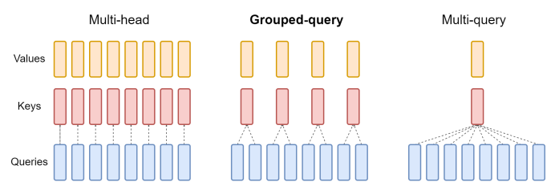

# Appendix C. Grouped Query Attention (GQA)

## Từ Multi-Query Attention Đến Kiến Trúc Attention Của LLM Hiện Đại

> Phụ lục cho README:
>
> **One Write-Head Is All You Need**
>
> Tham khảo:
>
> Ainslie et al. (2023)
>
> *GQA: Training Generalized Multi-Query Transformer Models from Multi-Head Checkpoints*

<p align="center"> 
  
</p> 

<p align="center"> 
 <em> Overview of grouped-query method. Multi-head attention has H query, key, and value heads. Multi-query attention shares single key and value heads across all query heads. Grouped-query attention instead shares single key and value heads for each group of query heads, interpolating between multi-head and multi-query attention.
</em> 
</p>

---

# 1. Mục tiêu của nghiên cứu

Transformer hiện đại phải giải quyết đồng thời ba mục tiêu:

```text
1. Chất lượng mô hình cao

2. Tốc độ suy luận nhanh

3. Chi phí bộ nhớ thấp
```

---

Multi-Head Attention (MHA):

```text
Quality      : Excellent
Memory       : Expensive
Inference    : Slow
```

---

Multi-Query Attention (MQA):

```text
Quality      : Lower
Memory       : Excellent
Inference    : Fast
```

---

Câu hỏi đặt ra:

> Có tồn tại một kiến trúc nằm giữa MHA và MQA hay không?

Đó chính là động lực dẫn đến **Grouped Query Attention (GQA)**.

---

# 2. Ôn tập Multi-Head Attention

Trong Transformer chuẩn:

$$
Q_i=XW_i^Q
$$

$$
K_i=XW_i^K
$$

$$
V_i=XW_i^V
$$

với:

$$
i=1,\dots,H
$$

---

Mỗi head có:

```text
Query riêng
Key riêng
Value riêng
```

---

Minh họa:

```text
Head1 -> K1,V1

Head2 -> K2,V2

Head3 -> K3,V3

...

HeadH -> KH,VH
```

---

KV Cache:

$$
O(HN)
$$

---

# 3. Multi-Query Attention

MQA giữ nguyên:

```text
Nhiều Query Heads
```

nhưng chia sẻ:

```text
Một Key Head
Một Value Head
```

---

Minh họa:

```text
Q1
Q2
Q3
...
QH
 \
  \
 Shared K,V
```

---

Khi đó:

$$
K=XW^K
$$

$$
V=XW^V
$$

chỉ được tính một lần.

---

KV Cache:

$$
O(N)
$$

---

# 4. Hạn chế của MQA

MQA đạt hiệu quả bộ nhớ rất cao.

Tuy nhiên:

```text
Tất cả Query Heads
dùng chung
Key và Value
```

---

Điều này làm giảm:

```text
Representation Diversity
```

---

Về mặt trực giác:

```text
32 Query Heads
      ↓
chỉ nhìn vào
1 bộ K,V
```

---

Khả năng mô hình hóa các loại quan hệ khác nhau bị hạn chế.

---

# 5. Ý tưởng của GQA

GQA tổng quát hóa MQA.

---

Thay vì:

```text
32 Query Heads
1 KV Head
```

sử dụng:

```text
32 Query Heads
8 KV Heads
```

---

Mỗi KV Head phục vụ:

$$
\frac{32}{8}= 4
$$

Query Heads.

---

# 6. Minh họa trực quan

## Multi-Head Attention

```text
Q1 -> KV1

Q2 -> KV2

Q3 -> KV3

Q4 -> KV4
```

---

## Multi-Query Attention

```text
Q1 \
Q2  \
Q3   > KV1
Q4  /
```

---

## Grouped Query Attention

```text
Q1
Q2
Q3
Q4
  \
   KV1

Q5
Q6
Q7
Q8
  \
   KV2
```

---

GQA nằm chính giữa:

```text
MHA <------ GQA ------> MQA
```

---

# 7. Công thức toán học

Giả sử:

$$
H_q
$$

là số Query Heads.

---

Và:

$$
H_{kv}
$$

là số KV Heads.

---

Kích thước nhóm:

$$
g= \frac{H_q}{H_{kv}}
$$

---

Ví dụ:

$$
H_q=32
$$

$$
H_{kv}=8
$$

---

Suy ra:

$$
g=4
$$

---

Mỗi nhóm gồm:

```text
4 Query Heads
1 KV Head
```

---

Attention:

$$
A_i= \text{softmax} \left( \frac{ Q_iK_{group(i)}^T } {\sqrt{d_h}} \right)
$$

---

Output:

$$
O_i=A_iV_{group(i)}
$$

---

# 8. KV Cache Analysis

## Multi-Head Attention

Cache:

$$
O(HN)
$$

---

## Multi-Query Attention

Cache:

$$
O(N)
$$

---

## GQA

Cache:

$$
O(H_{kv}N)
$$

---

Do:

$$
H_{kv} \ll H
$$

nên:

$$
O(H_{kv}N) \ll O(HN)
$$

---

# 9. Chuyển đổi từ MHA sang GQA

Một đóng góp quan trọng của paper.

---

Thông thường:

```text
Huấn luyện lại từ đầu
```

rất tốn kém.

---

Paper đề xuất:

```text
MHA Checkpoint
      ↓
Convert
      ↓
GQA Model
      ↓
Uptraining
```

---

# 10. Uptraining

Khái niệm mới trong paper.

---

Thay vì:

```text
Train từ đầu
```

---

Sử dụng:

```text
Pretrained MHA
      ↓
Chuyển đổi
      ↓
Huấn luyện thêm vài %
```

---

Điều này gọi là:

```text
Uptraining
```

---

# 11. Cách tạo KV Group

Giả sử:

```text
32 KV Heads
```

của MHA.

---

Muốn chuyển thành:

```text
8 KV Heads
```

---

Nhóm:

```text
(K1,K2,K3,K4)
      ↓
Average
      ↓
KV1
```

---

Tương tự:

```text
(K5,K6,K7,K8)
      ↓
KV2
```

---

...

---

Sau đó tiếp tục huấn luyện.

---

# 12. Kết quả quan trọng

Paper chỉ ra:

```text
GQA gần bằng MHA
```

về chất lượng.

---

Nhưng:

```text
GQA gần bằng MQA
```

về tốc độ.

---

Tóm tắt:

| Metric  | MHA   | GQA   | MQA   |
| ------- | ----- | ----- | ----- |
| Quality | ★★★★★ | ★★★★☆ | ★★★☆☆ |
| Memory  | ★★☆☆☆ | ★★★★☆ | ★★★★★ |
| Speed   | ★★☆☆☆ | ★★★★☆ | ★★★★★ |

---

# 13. Vai trò trong LLaMA-2

Sau nghiên cứu này:

```text
GQA trở thành tiêu chuẩn mới
```

---

Các mô hình sử dụng GQA:

```text
LLaMA-2

Gemma

Mistral

Mixtral

Gemini
```

---

Trong thực tế:

```text
GQA gần như thay thế MQA
```

ở các LLM mới.

---

# 14. Liên hệ với x-transformers

MQA:

```python
Decoder(
    heads = 8,
    attn_one_kv_head = True
)
```

---

Tương đương:

$$
H_{kv}=1
$$

---

GQA:

```python
Decoder(
    heads = 8,
    attn_kv_heads = 2
)
```

---

Tương đương:

$$
H_q=8
$$

$$
H_{kv}=2
$$

---

Mỗi KV Head phục vụ:

$$
4
$$

Query Heads.

---

# 15. Dòng tiến hóa Attention

```text
Attention Is All You Need
            (2017)
                 |
                 v
      Multi-Head Attention
                 |
                 v
   One Write-Head Is All You Need
              (MQA)
                 |
                 v
        AlphaCode / PaLM
                 |
                 v
   Grouped Query Attention
              (GQA)
                 |
                 v
   LLaMA-2 / Gemma / Gemini
         Mistral / Mixtral
```

---

# 16. Kết luận

GQA có thể được xem là:

> Sự tổng quát hóa của Multi-Query Attention.

Thay vì cực đoan như:

```text
1 KV Head
```

GQA cho phép:

```text
Nhiều KV Heads
nhưng ít hơn Query Heads
```

Từ đó đạt được sự cân bằng giữa:

* khả năng biểu diễn của MHA,
* hiệu quả bộ nhớ của MQA,
* tốc độ suy luận của các LLM hiện đại.

Đây là lý do GQA trở thành kiến trúc attention mặc định trong thế hệ Large Language Models sau PaLM.

---

# References

```bibtex
@article{ainslie2023gqa,
  title={GQA: Training Generalized Multi-Query Transformer Models from Multi-Head Checkpoints},
  author={Ainslie, Joshua and Lee-Thorp, James and de Jong, Michiel and Zemlyanskiy, Yury and Lebron, Federico and Sanghai, Sumit},
  journal={arXiv preprint arXiv:2305.13245},
  year={2023}
}

@article{shazeer2019fast,
  title={Fast Transformer Decoding: One Write-Head is All You Need},
  author={Shazeer, Noam},
  journal={arXiv preprint arXiv:1911.02150},
  year={2019}
}
```
