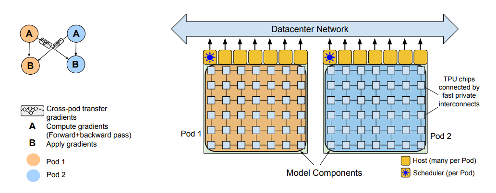

# Appendix B. PaLM và Vai Trò Của Multi-Query Attention Trong Large Language Models

> Phụ lục cho README:
>
> **One Write-Head Is All You Need**
>
> Tham khảo:
>
> PaLM: Scaling Language Modeling with Pathways (2022)

---

<p align="center"> 
  
</p> 

<p align="center"> 
 <em>The Pathways system (Barham et al., 2022) scales training across two TPU v4 pods using two-way data parallelism at the pod level.</em> 
</p>

# 1. Mục tiêu của phụ lục

Paper:

> PaLM: Scaling Language Modeling with Pathways

không đề xuất Multi-Query Attention (MQA).

MQA được giới thiệu trước đó bởi:

> Fast Transformer Decoding: One Write-Head is All You Need (Shazeer, 2019)

Tuy nhiên PaLM là một trong những hệ thống ngôn ngữ lớn đầu tiên chứng minh rằng:

> Multi-Query Attention có thể hoạt động hiệu quả ở quy mô hàng trăm tỷ tham số.

Nếu AlphaCode là bằng chứng thực nghiệm trong sinh mã nguồn thì PaLM là bằng chứng ở quy mô Large Language Model tổng quát.

---

# 2. Bối cảnh của PaLM

PaLM là một trong những mô hình ngôn ngữ lớn nhất của Google thời điểm công bố.

Các phiên bản:

| Model     |  Parameters |
| --------- | ----------: |
| PaLM-8B   |   8 Billion |
| PaLM-62B  |  62 Billion |
| PaLM-540B | 540 Billion |

---

Mục tiêu:

```text
Scale Model
      +
Scale Data
      +
Scale Compute
      ↓
Emergent Abilities
```

---

Kích thước mô hình tăng lên hàng trăm tỷ tham số dẫn tới nhiều vấn đề hệ thống mà Transformer gốc chưa từng gặp.

---

# 3. Nút thắt mới của LLM

Khi số tham số tăng:

```text
Attention FLOPs ↑
Memory Usage ↑
Communication Cost ↑
```

Nhưng trong quá trình suy luận:

```text
Bottleneck ≠ FLOPs
```

---

Thực tế:

```text
Bottleneck = Memory Bandwidth
```

---

Nguyên nhân là KV Cache.

---

# 4. KV Cache là gì?

Trong autoregressive decoding:

```text
Token1
Token2
Token3
...
TokenN
```

mỗi token mới cần truy cập toàn bộ lịch sử trước đó.

Transformer phải lưu:

$$
K_t
$$

và

$$
V_t
$$

cho mọi token.

---

Minh họa:

```text
t=1  -> K1,V1

t=2  -> K1,V1
         K2,V2

t=3  -> K1,V1
         K2,V2
         K3,V3

...
```

---

Đây chính là:

```text
KV Cache
```

---

# 5. Multi-Head Attention ở quy mô PaLM

Transformer chuẩn:

```text
Head1 -> K1,V1
Head2 -> K2,V2
Head3 -> K3,V3
...
HeadH -> KH,VH
```

---

Mỗi head có:

$$
K_i
$$

và

$$
V_i
$$

riêng biệt.

---

Bộ nhớ:

$$
O(HN)
$$

---

Trong mô hình hàng trăm tỷ tham số:

```text
H lớn
N lớn
```

KV Cache tăng rất nhanh.

---

# 6. Tại sao điều này nguy hiểm?

Giả sử:

$$
H=64
$$

và

$$
N=32768
$$

---

Khi sinh mỗi token mới:

```text
Read KV Cache
Compute Attention
Generate Token
```

---

Chi phí lớn nhất không còn là:

```text
Matrix Multiplication
```

mà là:

```text
Memory Read
```

---

GPU phải liên tục đọc:

```text
64 bộ Key
64 bộ Value
```

cho mỗi bước.

---

# 7. Giải pháp của PaLM

PaLM sử dụng:

```text
Multi-Query Attention (MQA)
```

---

Ý tưởng:

```text
Nhiều Query Heads

Nhưng

Một Shared Key Head
Một Shared Value Head
```

---

# 8. Kiến trúc MQA trong PaLM

## Multi-Head Attention

```text
           Input
              |
   -----------------------
   |    |    |    |    |
  H1   H2   H3  ...   HH
   |    |    |         |
 K1V1 K2V2 K3V3      KHVH
```

---

## Multi-Query Attention

```text
                   Input
                      |
     ---------------------------------
     |      |      |      |      |
     Q1     Q2     Q3    ...     QH
      \      |      |      /
              Shared
               K,V
```

---

Queries vẫn độc lập:

$$
Q_i=XW_i^Q
$$

---

Nhưng:

$$
K=XW^K
$$

$$
V=XW^V
$$

được chia sẻ.

---

# 9. Tác động lên KV Cache

## Multi-Head

$$
\text{Cache}= O(HN)
$$

---

## MQA

$$
\text{Cache}= O(N)
$$

---

Tỷ lệ giảm:

$$
\frac{1}{H}
$$

---

Nếu:

$$
H=64
$$

thì:

$$
64\times
$$

ít bộ nhớ hơn.

---

# 10. Tác động lên Throughput

Trong LLM:

```text
Latency = Compute + Memory Access
```

---

Khi Memory Access chiếm ưu thế:

```text
Memory Access >> Compute
```

---

MQA làm giảm:

```text
KV Reads
```

nên:

```text
Inference Faster
```

---

Đây là lý do PaLM có thể phục vụ mô hình cực lớn với chi phí hợp lý hơn.

---

# 11. Điều PaLM xác nhận

Một trong những kết quả quan trọng nhất:

> Chia sẻ Key/Value gần như không làm giảm đáng kể chất lượng mô hình.

---

Nói cách khác:

```text
MHA
≈
MQA
```

trên nhiều benchmark.

---

Điều này cho thấy:

```text
Query Diversity
```

quan trọng hơn:

```text
KV Diversity
```

---

Đây chính là giả thuyết ban đầu của Shazeer.

---

# 12. Ý nghĩa khoa học

Trước PaLM:

```text
MQA
↓
Ý tưởng thú vị
```

---

Sau PaLM:

```text
MQA
↓
Được xác nhận ở quy mô công nghiệp
```

---

MQA chuyển từ:

```text
Research Idea
```

thành:

```text
Production Architecture
```

---

# 13. Từ PaLM đến GQA

Mặc dù thành công, MQA vẫn có hạn chế.

Toàn bộ Query Heads phải dùng chung:

```text
1 Key Head
1 Value Head
```

---

Điều này làm giảm:

```text
Representation Capacity
```

---

Các nghiên cứu tiếp theo đề xuất:

```text
Grouped Query Attention
```

---

Thay vì:

```text
32 Query Heads
1 KV Head
```

sử dụng:

```text
32 Query Heads
8 KV Heads
```

---

Minh họa:

```text
Q1
Q2
Q3
Q4
  \
   KV1

Q5
Q6
Q7
Q8
  \
   KV2

...
```

---

GQA trở thành sự cân bằng giữa:

```text
Memory
Quality
Speed
```

---

# 14. Dòng tiến hóa Attention

```text
Attention Is All You Need (2017)
                |
                v
      Multi-Head Attention
                |
                v
One Write-Head Is All You Need
          (MQA, 2019)
                |
                v
         AlphaCode (2022)
                |
                v
            PaLM (2022)
                |
                v
             GQA (2023)
                |
                v
      LLaMA-2 / Gemma
      Mistral / Gemini
```

---

# 15. Liên hệ với README chính

Trong README chính:

```text
Multi-Head Attention
        ↓
Multi-Query Attention
        ↓
Grouped Query Attention
```

PaLM là bằng chứng thực nghiệm mạnh mẽ nhất cho thấy:

> Một mô hình ngôn ngữ hàng trăm tỷ tham số vẫn có thể hoạt động hiệu quả khi chỉ sử dụng một cặp Key/Value được chia sẻ giữa nhiều Query Heads.

Do đó PaLM là một cột mốc quan trọng trong quá trình chuyển đổi từ:

```text
MHA
```

sang:

```text
MQA
```

và cuối cùng là:

```text
GQA
```

trong các Large Language Models hiện đại.

---

# References

```bibtex
@article{chowdhery2022palm,
  title={PaLM: Scaling Language Modeling with Pathways},
  author={Chowdhery, Aakanksha et al.},
  journal={arXiv preprint arXiv:2204.02311},
  year={2022}
}

@article{shazeer2019fast,
  title={Fast Transformer Decoding: One Write-Head is All You Need},
  author={Shazeer, Noam},
  journal={arXiv preprint arXiv:1911.02150},
  year={2019}
}
```
