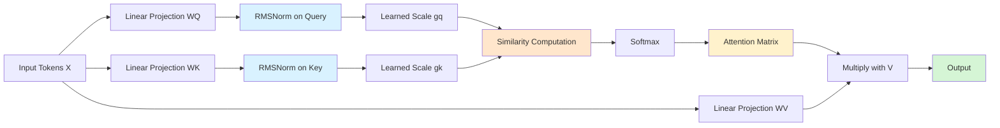
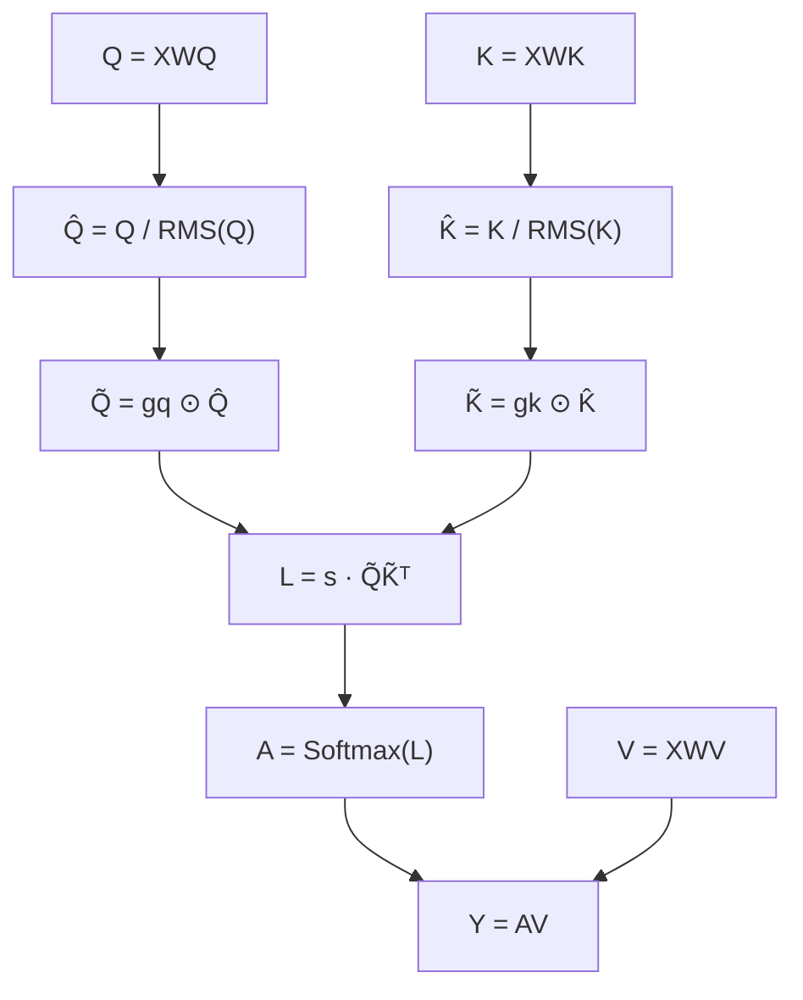
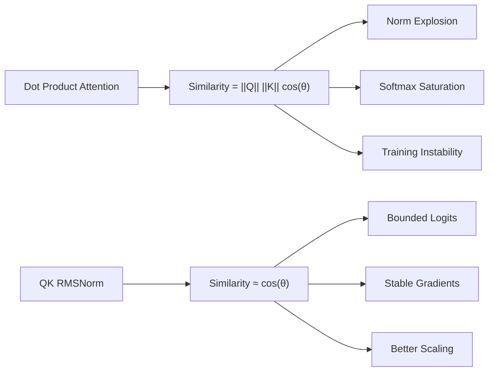
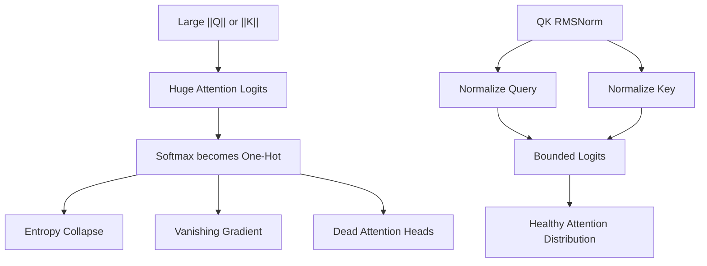
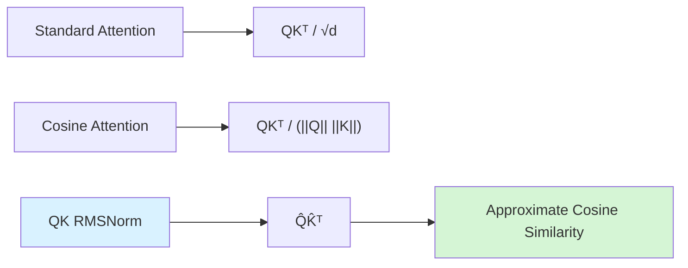
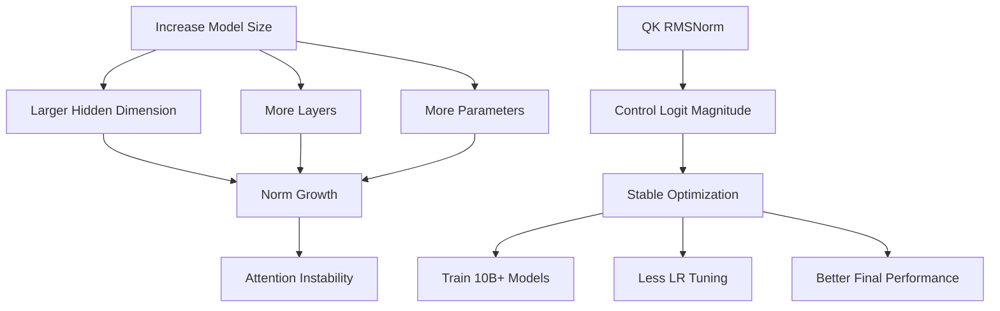
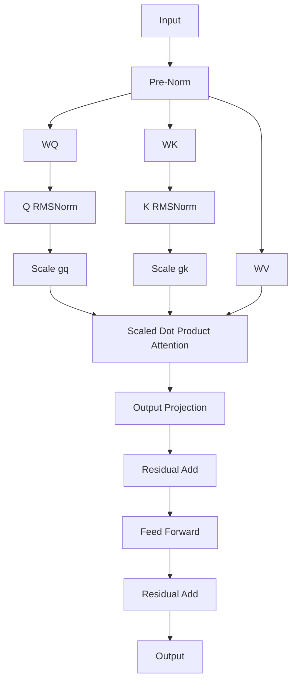
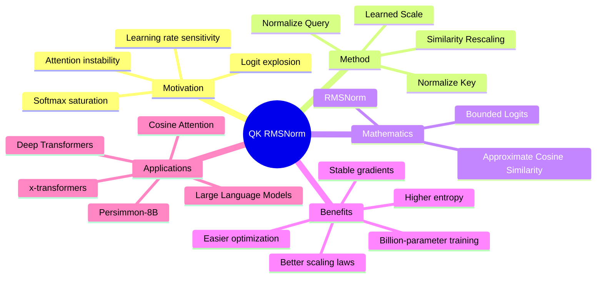

# QK RMSNorm – Big Picture



# Mathematical Pipeline



# Geometric Interpretation
QK RMSNorm chuyển Attention từ phụ thuộc vào độ lớn vector sang phụ thuộc vào hướng của vector.



# Attention Logits Stabilization


# Relationship with Cosine Attention


# Scaling Law Perspective


# Complete Transformer Block with QK RMSNorm


# Core Formula
```math
\hat Q = g_q \odot \frac {Q} {\sqrt{ \frac {1} {d} \sum_i Q_i^2 + \epsilon}}
```

```math
\hat K = g_k \odot \frac {K} {\sqrt{ \frac {1} {d} \sum_i K_i^2 + \epsilon}}
```

```math
\text{Attention} (Q, K, V) = \text{Softmax} \left( s \cdot \hat Q \hat K^T \right)V
```

# One-Page Overview


