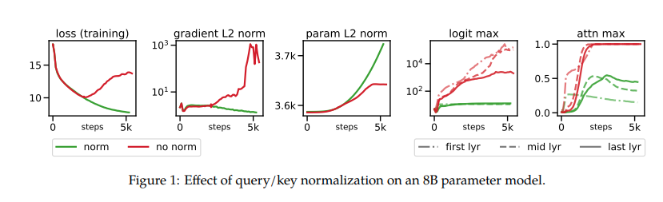
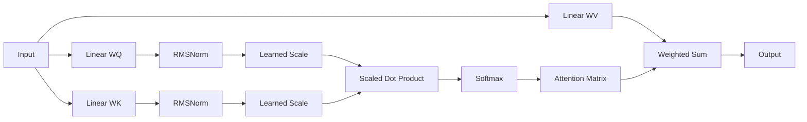

# QK RMSNorm in Transformers

> Query-Key RMS Normalization (QK RMSNorm) là một kỹ thuật chuẩn hóa trực tiếp lên vector Query và Key trước khi tính Attention nhằm kiểm soát sự bùng nổ của attention logits, cải thiện tính ổn định khi mở rộng quy mô mô hình và giảm sự phụ thuộc vào việc tinh chỉnh learning rate.

<p align="center"> 
  
</p> 

---

# 1. Motivation

Trong Scaled Dot-Product Attention:

```math
\text{Attention}(Q,K,V) = \text{Softmax} \left( \frac{QK^T}{\sqrt d} \right)V
```

attention logits:

```math
L = \frac{QK^T}{\sqrt d}
```

có phương sai tăng theo:

```math
\mathrm{Var}(L) \propto d
```

Khi:

- số chiều embedding tăng,
- số layer tăng,
- số tham số tăng,

thì norm của Query và Key có xu hướng phát triển không kiểm soát, dẫn tới:

- attention entropy sụp đổ;
- softmax bị bão hòa;
- gradient explosion;
- learning rate phải giảm mạnh khi scale model.

Các nghiên cứu gần đây cho thấy đây là một trong những nguồn gây bất ổn lớn nhất trong huấn luyện LLM.

---

# 2. Ý tưởng cốt lõi

Thay vì sử dụng trực tiếp:

```math
Q,\;K
```

ta chuẩn hóa RMS:

```math
\hat Q = \frac{Q} {\mathrm{RMS}(Q)}
```

```math
\hat K = \frac{K} {\mathrm{RMS}(K)}
```

với

```math
\mathrm{RMS}(x) = \sqrt{ \frac1d \sum_{i=1}^{d} x_i^2 +\epsilon}
```

Attention trở thành:

```math
\text{Attention} = \text{Softmax} \left( s \cdot \hat Q \hat K^T \right)V
```

trong đó:

```math
s
```

là hệ số scale học được.

---

# 3. Learned Scale

Các nghiên cứu của Google Brain cho thấy việc bổ sung learned scale giúp duy trì năng lực biểu diễn của mô hình.

Thay vì:

```math
\hat Q = \frac{Q} {\mathrm{RMS}(Q)}
```

sử dụng:

```math
\hat Q = g_q \odot \frac{Q} {\mathrm{RMS}(Q)}
```

```math
\hat K = g_k \odot \frac{K} {\mathrm{RMS}(K)}
```

với:

```math
g_q,g_k \in \mathbb R^d
```

là các vector tham số học được.

Trong x-transformers:

```python
attn_qk_norm_dim_scale = True
```

---

# 4. Tại sao RMSNorm ổn định hơn?

## 4.1 Giới hạn độ lớn của logits

Trước chuẩn hóa:

```math
QK^T = \|Q\| \|K\| \cos \theta
```

Biến thiên của:

```math
\|Q\|\|K\|
```

là nguyên nhân chính gây bất ổn.

Sau chuẩn hóa:

```math
QK^T \approx \cos\theta
```

Attention phụ thuộc chủ yếu vào:

- hướng của vector,
- quan hệ ngữ nghĩa,
- không phụ thuộc vào độ lớn.

---

## 4.2 Ngăn Softmax Saturation

Nếu logits quá lớn:

```math
\text{Softmax}(x) \rightarrow \text{One-Hot}
```

Gradient:

```math
\nabla \text{Softmax} \rightarrow 0
```

QK RMSNorm giữ:

```math
|L_{ij}|
```

trong một miền hữu hạn, tránh hiện tượng:

- entropy collapse;
- dead heads;
- gradient vanishing.

---

## 4.3 Cải thiện khả năng mở rộng

Google Brain cho thấy:

- mô hình 22B tham số ổn định hơn;
- learning rate ít cần điều chỉnh;
- scaling law mượt hơn;
- giảm failure khi tăng số layer.

---

# 5. Quan hệ với Cosine Attention

Cosine Attention:

```math
\text{sim}(q,k) = \frac {q^Tk} {\|q\|\|k\|}
```

QK RMSNorm gần tương đương:

```math
\hat q^T \hat k
```

nên có thể xem như một dạng:

> Approximate Cosine Attention.

Khác biệt:

- không chuẩn hóa L2 hoàn toàn;
- sử dụng RMS;
- ít chi phí tính toán hơn.

---

# 6. Thuật toán

## Forward

### Bước 1

Linear projection:

```math
Q=XW_Q
```

```math
K=XW_K
```

```math
V=XW_V
```

### Bước 2

RMS normalization:

```math
Q \leftarrow \frac{Q}{\mathrm{RMS}(Q)}
```

```math
K \leftarrow \frac{K}{\mathrm{RMS}(K)}
```

### Bước 3

Learned scaling:

```math
Q \leftarrow g_q \odot Q
```

```math
K \leftarrow g_k \odot K
```

### Bước 4

Attention logits:

```math
L = sQK^T
```

### Bước 5

Attention:

```math
A = \text{Softmax}(L)
```

### Bước 6

Output:

```math
Y = AV
```

---

# 7. Complexity

QK RMSNorm chỉ thêm:

```math
O(BLHd)
```

chi phí chuẩn hóa.

Tổng độ phức tạp:

```math
O(BHL^2d)
```

không thay đổi so với Transformer gốc.

---

# 8. Kiến trúc tổng quát



---

# 9. So sánh với Attention chuẩn

| Thuộc tính | Standard Attention | QK RMSNorm |
|------------|-------------------|-------------|
| Logit magnitude | Không giới hạn | Được kiểm soát |
| Gradient stability | Trung bình | Cao |
| Learning rate sensitivity | Cao | Thấp |
| Scaling lên hàng chục tỷ tham số | Khó | Tốt |
| Entropy collapse | Có thể xảy ra | Giảm đáng kể |
| Extra FLOPs | Không | Rất nhỏ |

---

# 10. Vai trò trong x-Transformers

Trong x-transformers:

```python
Decoder(
    dim = 512,
    depth = 12,
    heads = 8,
    attn_qk_norm = True,
    attn_qk_norm_dim_scale = True
)
```

QK RMSNorm thường được kết hợp với:

- Cosine Attention
- NormFormer
- DeepNorm
- ResiDual
- Rotary Embeddings
- Memory Tokens

để xây dựng các Transformer cực sâu và cực lớn.

---

# 11. Tổng kết

QK RMSNorm có thể được xem là:

> Một cơ chế chuẩn hóa trực tiếp trên không gian attention nhằm loại bỏ sự phụ thuộc của attention logits vào độ lớn của vector Query và Key.

Các lợi ích chính:

1. Attention ổn định hơn.
2. Giảm softmax saturation.
3. Giảm sensitivity với learning rate.
4. Cải thiện scaling law.
5. Hỗ trợ huấn luyện LLM hàng chục tỷ tham số.
6. Chi phí tính toán gần như bằng không.
7. Gần tương đương Cosine Attention nhưng dễ tích hợp hơn.

---

# References

1. Henry et al., 2020, Query-Key Normalization for Transformers.
2. Sun et al., 2023, A Length-Extrapolatable Transformer.
3. Google Brain, 2023, analysis on QK normalization in large language models.
4. Persimmon-8B Technical Report, Adept AI.
5. Dettmers, T., discussions on attention outliers and normalization.
6. x-transformers implementation by Phil Wang.
7. Meta AI, Vision Transformers Need Registers.
8. Transformer variants and scaling studies (2023).

Link:

https://arxiv.org/pdf/2302.05442

https://x.com/Tim_Dettmers/status/1625531080513306627

https://arxiv.org/abs/2305.19268

https://arxiv.org/abs/2306.12929

https://www.adept.ai/blog/persimmon-8b/

https://arxiv.org/abs/2309.16588