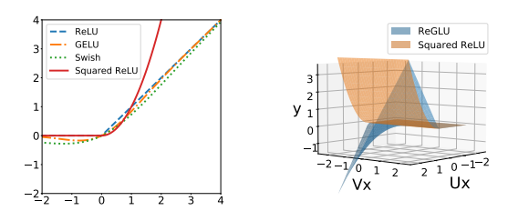

# ReLU² (ReLU Squared) trong Transformer

> *A Simpler and Faster Activation Function for Transformer Feed-Forward Networks*

---

# 1. Giới thiệu

ReLU² (Rectified Linear Unit Squared) là một hàm kích hoạt được đề xuất trong nghiên cứu:

> **Primer: Searching for Efficient Transformers for Language Modeling**
> So et al., Google Research, 2021

Bài báo sử dụng Neural Architecture Search (NAS) để khảo sát hàng nghìn biến thể Transformer và phát hiện rằng việc thay thế GELU bằng:

$$
\text{ReLU}^2(x)= \left( \max(0,x) \right)^2
$$

có thể cải thiện hiệu năng mô hình ngôn ngữ tự hồi quy (autoregressive language models) đồng thời giảm độ phức tạp tính toán.

Nghiên cứu này sau đó được tích hợp vào thư viện x-transformers dưới tùy chọn:

```python
ff_relu_squared = True
```

cho tầng Feed Forward Network (FFN).

---

# 2. Bối cảnh lịch sử

Các Transformer ban đầu sử dụng:

$$
\text{ReLU}(x)
$$

Sau đó các mô hình BERT, GPT và T5 chuyển sang:

$$
\text{GELU}(x)
$$

do GELU cung cấp cơ chế gating mềm hơn.

Tuy nhiên GELU yêu cầu các phép tính:

$$
\tanh(\cdot)
$$

hoặc

$$
erf (\cdot)
$$

gây tốn chi phí tính toán hơn.

Mục tiêu của Primer là tìm kiếm kiến trúc có:

* độ chính xác cao hơn
* tốc độ huấn luyện nhanh hơn
* hiệu suất phần cứng tốt hơn

mà không làm tăng số tham số.

Kết quả NAS cho thấy:

> ReLU² là một trong những cải tiến hiệu quả nhất trong toàn bộ không gian tìm kiếm.

---

# 3. Định nghĩa toán học

## 3.1 ReLU

$$
\text{ReLU}(x)= \max(0,x)
$$

---

## 3.2 ReLU²

$$
\text{ReLU}^2(x)= (\max(0,x))^2
$$

Hay:

$$
\text{ReLU}^2(x)= \begin{cases} 0 & x < 0\\ x^2 & x \ge 0 \end{cases}
$$

---

# 4. Hình học của ReLU²

```text
ReLU

y
^
|
|        /
|       /
|      /
|     /
|____/________> x
     0
```

---

```text
ReLU²

y
^
|
|           .
|        .´
|      .´
|    .´
|__.´_________> x
    0
```

<p align="center"> 
  
</p> 

Khác biệt chính:

* ReLU tăng tuyến tính
* ReLU² tăng bậc hai

Do đó ReLU² khuếch đại mạnh hơn các activation lớn.

---

# 5. Vai trò trong Feed Forward Network

Trong Transformer:

$$
FFN(x)= W_2 \phi(W_1x)
$$

trong đó:

$$
\phi = \text{Activation}
$$

Thông thường:

$$
\phi = GELU
$$

Primer thay bằng:

$$
\phi = ReLU^2
$$

---

Kiến trúc:

```text
Input
  │
  ▼
Linear Expansion
  │
  ▼
ReLU²
  │
  ▼
Linear Projection
  │
  ▼
Output
```

---

# 6. Trực giác khoa học

## 6.1 Khuếch đại tín hiệu mạnh

Nếu:

$$
x = 2
$$

thì:

ReLU:

$$
2
$$

ReLU²:

$$
4
$$

---

Nếu:

$$
x = 5
$$

thì:

ReLU:

$$
5
$$

ReLU²:

$$
25
$$

Activation lớn được nhấn mạnh mạnh hơn.

Điều này làm tăng khả năng biểu diễn của FFN mà không cần tăng tham số.

---

## 6.2 Tăng độ phi tuyến

ReLU chỉ tạo một đoạn tuyến tính.

ReLU² tạo độ cong:

$$
\frac{d^2}{dx^2} \neq 0
$$

ở miền dương.

Điều này giúp FFN học các ánh xạ phức tạp hơn.

---

## 6.3 Không cần hàm siêu việt

GELU sử dụng:

$$
\tanh
$$

hoặc

$$
erf
$$

ReLU² chỉ cần:

```text
max
multiply
```

nên rất phù hợp với GPU/TPU.

---

# 7. Gradient của ReLU²

Ta có:

$$
f(x)=x^2
$$

với:

$$
x>0
$$

Gradient:

$$
f'(x)=2x
$$

Suy ra:

$$
\frac{d}{dx} \text{ReLU}^2(x) = \begin{cases} 0 & x<0\\ 2x & x>0 \end{cases}
$$

---

Đặc điểm:

```text
ReLU Gradient

0 -----> 1
```

```text
ReLU² Gradient

0 -----> 2x
```

Activation càng lớn:

* gradient càng lớn
* learning signal càng mạnh

---


# 8. So sánh ReLU, GELU và ReLU²

| Thuộc tính        | ReLU  | GELU       | ReLU²        |
| ----------------- | ----- | ---------- | ------------ |
| Độ phức tạp       | Thấp  | Cao        | Rất thấp     |
| Phi tuyến         | Thấp  | Trung bình | Cao          |
| GPU Efficiency    | Cao   | Trung bình | Cao          |
| Autoregressive LM | Tốt   | Rất tốt    | Tốt hơn GELU |
| NAS Discovery     | Không | Không      | Có           |

---

# 9. Tương tác với GLU

Theo thực nghiệm của tác giả x-transformers:

```text
FFN chuẩn
```

ReLU² thường tốt hơn GELU.

Tuy nhiên:

```text
GEGLU
SwiGLU
ReGLU
```

vẫn thường hoạt động tốt nhất khi sử dụng GELU hoặc SiLU làm activation bên trong cơ chế gating.

Do đó:

```python
ff_relu_squared = True
```

thường được áp dụng cho FFN chuẩn, không phải các biến thể GLU.

---

# 10. Vị trí của ReLU² trong tiến hóa Transformer

```text
ReLU
  │
  ▼
GELU
  │
  ▼
ReLU²
  │
  ▼
GLU Family
(ReGLU, GEGLU, SwiGLU)
  │
  ▼
Modern x-transformers
```

ReLU² là một bước chuyển tiếp quan trọng:

* đơn giản hóa activation
* cải thiện hiệu năng
* mở đường cho các nghiên cứu FFN hiện đại

---

# 11. Triển khai trong x-transformers

```python
from x_transformers import TransformerWrapper
from x_transformers import Decoder

model = TransformerWrapper(
    num_tokens = 20000,
    max_seq_len = 1024,
    attn_layers = Decoder(
        dim = 512,
        depth = 6,
        heads = 8,
        ff_relu_squared = True
    )
)
```

Khi bật:

```python
ff_relu_squared = True
```

Feed Forward Network sẽ thay GELU bằng ReLU².

---

# 12. Kết luận

ReLU² là một trong những kết quả nổi bật nhất từ quá trình Neural Architecture Search cho Transformer. Hàm kích hoạt này thay thế GELU bằng một phép biến đổi đơn giản:

$$
\text{ReLU}^2(x)= (\max(0,x))^2
$$

nhưng mang lại:

* khả năng biểu diễn mạnh hơn
* tín hiệu gradient mạnh hơn
* hiệu suất phần cứng tốt hơn
* chất lượng mô hình ngôn ngữ cao hơn trong nhiều thiết lập autoregressive

Trong hệ sinh thái x-transformers, ReLU² đại diện cho một hướng tiếp cận quan trọng: tối ưu hóa Transformer thông qua những thay đổi cực nhỏ nhưng có tác động lớn tới động lực học huấn luyện và quy luật scaling của mô hình.

---

# Tài liệu tham khảo

```bibtex
@article{so2021primer,
  title={Primer: Searching for Efficient Transformers for Language Modeling},
  author={So, David R. and Ma, Chen and Liang, Chen and others},
  journal={NeurIPS},
  year={2021}
}
```

```bibtex
@misc{xtransformers,
  author = {Phil Wang},
  title = {x-transformers},
  year = {2024},
  url = {https://github.com/lucidrains/x-transformers}
}
```

```bibtex
@article{hendrycks2016gelu,
  title={Gaussian Error Linear Units (GELUs)},
  author={Hendrycks, Dan and Gimpel, Kevin},
  year={2016}
}
```
