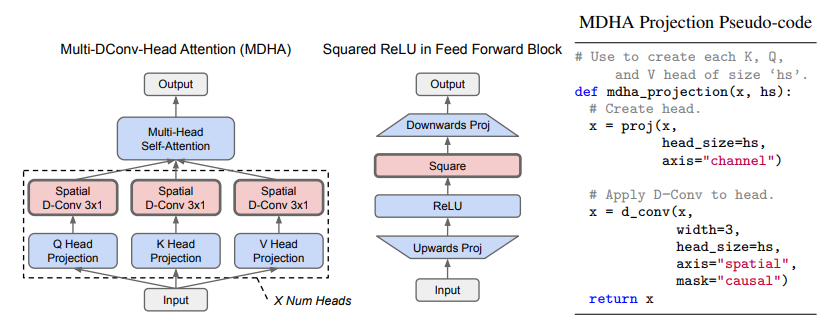

# Phụ lục C — Multi-DConv-Head Attention (MDHA) và Squared ReLU

<p align="center"> 
  
</p> 

## C.1 Vai trò của Hình 4 trong Primer

Hình 4 trình bày hai cải tiến quan trọng nhất được phát hiện bởi hệ thống DNA Search:

```text
Primer Transformer
│
├── Multi-DConv-Head Attention (MDHA)
│
└── Squared ReLU Feed Forward
```

Hai thành phần này tác động lên hai khối cốt lõi của Transformer:

```text
Transformer Layer

├── Attention Block
└── Feed Forward Block
```

cụ thể:

```text
Attention
     ↓
MDHA

Feed Forward
     ↓
Squared ReLU
```

Do đó Primer không thay đổi kiến trúc tổng thể của Transformer mà thay đổi các phép biến đổi bên trong hai khối quan trọng nhất.

---

# C.2 Transformer chuẩn

Một Transformer Decoder Layer tiêu chuẩn có dạng:

```text
Input
  │
  ▼
Multi-Head Attention
  │
  ▼
Residual
  │
  ▼
Feed Forward
  │
  ▼
Residual
  │
  ▼
Output
```

Trong GPT và Transformer gốc:

$$
FFN(x)= W_2 \phi(W_1x)
$$

với:

$$
\phi = GELU
$$

và Attention sử dụng:

$$
Q,K,V
$$

được tạo bằng phép chiếu tuyến tính đơn thuần.

Primer sửa đổi cả hai thành phần này.

---

# C.3 Multi-DConv-Head Attention (MDHA)

## Ý tưởng cốt lõi

Trong Transformer chuẩn:

```text
Input
 │
 ├── Linear → Q
 ├── Linear → K
 └── Linear → V
```

Primer bổ sung một phép tích chập chiều sâu (Depthwise Convolution) sau khi tạo các head.

```text
Input
 │
 ├── Linear → Q → DConv
 ├── Linear → K → DConv
 └── Linear → V → DConv
```

---

# C.4 Kiến trúc MDHA

Theo hình:

```text
Input
 │
 ▼
Q Projection
 │
 ▼
Spatial DConv 3×1
```

và tương tự cho:

```text
K Projection
V Projection
```

sau đó mới thực hiện:

```text
Multi-Head Self Attention
```

---

Biểu diễn tổng quát:

```text
Input
 │
 ├────────────┐
 │            │
 ▼            ▼
Q_proj      K_proj
 │            │
 ▼            ▼
DConv       DConv
 │            │
 └────┐  ┌────┘
      ▼  ▼
      Attention
```

---

# C.5 Tại sao cần DConv?

## Vấn đề của Self-Attention

Attention có khả năng học:

$$
\text{global dependency}
$$

rất tốt.

Tuy nhiên:

* không có inductive bias địa phương
* không ưu tiên token lân cận

trong khi ngôn ngữ tự nhiên có:

```text
Local Patterns
```

rất mạnh.

Ví dụ:

```text
word
phrase
n-gram
```

đều mang tính cục bộ.

---

## Vai trò của DConv

Depthwise Convolution tạo ra:

$$
\text{local context mixing}
$$

trước khi attention diễn ra.

```text
Token i

← 1 →
← 2 →
← 3 →
```

Các token lân cận được tổng hợp trước.

---

# C.6 Depthwise Convolution

Khác với convolution chuẩn:

$$
Conv(X)
$$

Depthwise Convolution hoạt động độc lập trên từng channel.

---

Transformer Head:

$$
X \in \mathbb{R}^{T \times d_h}
$$

---

Depthwise Conv:

$$
Y_t= \sum_k W_k X_{t+k}
$$

với:

```text
Kernel = 3
```

trong bài báo.

---

Do đó:

```text
Attention
```

nhận đầu vào đã chứa thông tin cục bộ.

---

# C.7 Pseudo-code MDHA

Trong hình:

```python
def mdha_projection(x, hs):

    x = proj(
        x,
        head_size = hs,
        axis = "channel"
    )

    x = d_conv(
        x,
        width = 3,
        head_size = hs,
        axis = "spatial",
        mask = "causal"
    )

    return x
```

---

Ý nghĩa:

## Bước 1

Projection:

$$
X \rightarrow Q,K,V
$$

---

## Bước 2

Depthwise Convolution:

$$
Q \rightarrow DConv(Q)
$$

$$
K \rightarrow DConv(K)
$$

$$
V \rightarrow DConv(V)
$$

---

## Bước 3

Attention:

$$
Attention(Q',K',V')
$$

---

# C.8 Tại sao gọi là MDHA?

Tên đầy đủ:

$$
\textbf{Multi-DConv-Head Attention}
$$

không phải:

$$
Multi\text{-}Head\ Attention
$$

mà là:

$$
Multi\text{-}(DConv\ Head)\ Attention
$$

nghĩa là:

```text
Mỗi Head
      ↓
DConv
      ↓
Attention
```

---

# C.9 Squared ReLU Feed Forward

Khối thứ hai trong Hình 4.

Transformer chuẩn:

```text
Input
 │
 ▼
Linear Up
 │
 ▼
GELU
 │
 ▼
Linear Down
 │
 ▼
Output
```

Primer thay GELU bằng:

```text
Input
 │
 ▼
Linear Up
 │
 ▼
ReLU
 │
 ▼
Square
 │
 ▼
Linear Down
 │
 ▼
Output
```

---

# C.10 Định nghĩa toán học

ReLU:

$$
ReLU(x)= \max(0,x)
$$

Squared ReLU:

$$
ReLU^2(x)= (\max(0,x))^2
$$

---

Hay:

$$
ReLU^2(x)= \begin{cases} 0 & x<0 \\ x^2 & x\ge0 \end{cases}
$$

---

# C.11 Cơ chế hoạt động

Khối Feed Forward:

$$
FFN(x)= W_2 \phi (W_1x)
$$

Primer sử dụng:

$$
\phi= ReLU^2
$$

---

Biến đổi:

```text
Projection Up
        ↓
ReLU
        ↓
Square
        ↓
Projection Down
```

---

# C.12 Tại sao Square lại hữu ích?

Nếu:

$$
x = 2
$$

thì:

```text
ReLU  = 2
ReLU² = 4
```

---

Nếu:

$$
x = 4
$$

thì:

```text
ReLU  = 4
ReLU² = 16
```

---

Điều này tạo ra:

```text
Activation Amplification
```

đối với các tín hiệu mạnh.

---

# C.13 Gradient của ReLU²

Với:

$$
f(x)=x^2
$$

ta có:

$$
f'(x)=2x
$$

suy ra:

$$
\frac{d}{dx} ReLU^2(x)= \begin{cases} 0 & x<0 \\ 2x & x>0 \end{cases}
$$

---

Khi activation tăng:

```text
Gradient tăng
```

nên tín hiệu học mạnh hơn.

---

# C.14 Hai cải tiến bổ sung cho nhau

MDHA giải quyết:

```text
Attention Representation
```

---

Squared ReLU giải quyết:

```text
Feed Forward Representation
```

---

Toàn bộ lớp Primer:

```text
Input
 │
 ▼
MDHA
 │
 ▼
Residual
 │
 ▼
Squared ReLU FFN
 │
 ▼
Residual
 │
 ▼
Output
```

---

# C.15 Ý nghĩa đối với Scaling Laws

Một kết quả quan trọng của bài báo là:

Các cải tiến này tiếp tục hiệu quả khi:

```text
Model Size ↑
Training Tokens ↑
Compute ↑
```

Điều đó cho thấy chúng không phải là các tối ưu cục bộ cho mô hình nhỏ mà phù hợp với quy luật mở rộng của Transformer.

---

# C.16 Tác động tới x-Transformers

Hai cải tiến này đều được tích hợp vào thư viện x-transformers:

## Squared ReLU

```python
ff_relu_squared = True
```

---

## MDHA

được hỗ trợ thông qua các biến thể attention có tích hợp convolution cục bộ.

---

# Tóm tắt

```text
Transformer
│
├── Multi-Head Attention
│         │
│         ▼
│      MDHA
│
└── FFN + GELU
          │
          ▼
      FFN + ReLU²
```

Primer chứng minh rằng chỉ cần hai thay đổi rất nhỏ:

1. Thêm Depthwise Convolution vào từng Attention Head.
2. Thay GELU bằng ReLU².

có thể tạo ra cải thiện đáng kể về hiệu quả huấn luyện và chất lượng mô hình ngôn ngữ. Đây là hai thành phần cốt lõi nhất được Neural Architecture Search phát hiện và là nền tảng cho nhiều triển khai Transformer hiện đại, bao gồm x-transformers.
