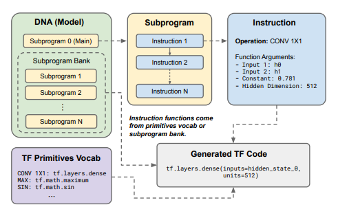

# Phụ lục A — Kiến trúc DNA (Discovering Neural Architectures)

<p align="center"> 
  
</p> 

## A.1 Giới thiệu

Một trong những đóng góp quan trọng của bài báo **Primer: Searching for Efficient Transformers for Language Modeling** không chỉ nằm ở việc phát hiện ra các cải tiến như **Squared ReLU** hay **Multi-DConv Head Attention**, mà còn ở phương pháp tìm kiếm kiến trúc được gọi là:

$$
\textbf{DNA}= \text{Discovering Neural Architectures}
$$

DNA là một hệ thống biểu diễn kiến trúc mạng thần kinh dưới dạng một **chương trình có cấu trúc (structured program)** thay vì một đồ thị mạng cố định.

Mục tiêu là biến quá trình thiết kế kiến trúc từ:

```text
Con người thiết kế
        ↓
Huấn luyện
        ↓
Đánh giá
```

thành:

```text
Không gian chương trình
        ↓
Tìm kiếm tự động
        ↓
Sinh kiến trúc mới
        ↓
Đánh giá
```

---

# A.2 Tổng quan kiến trúc

Hình trong bài báo mô tả DNA dưới dạng bốn thành phần chính:

```text
+---------------------+
|    DNA (Model)      |
+---------------------+
           │
           ▼
+---------------------+
|     Subprogram      |
+---------------------+
           │
           ▼
+---------------------+
|     Instruction     |
+---------------------+
           │
           ▼
+---------------------+
| Generated TF Code   |
+---------------------+
```

DNA xem toàn bộ kiến trúc mạng thần kinh như một chương trình được tạo thành từ nhiều tiểu chương trình (subprograms).

---

# A.3 DNA Model

## A.3.1 Khái niệm

DNA là biểu diễn cấp cao nhất.

Một DNA bao gồm:

```text
DNA
│
├── Main Program
│
└── Subprogram Bank
      ├── Subprogram 1
      ├── Subprogram 2
      ├── ...
      └── Subprogram N
```

Thay vì lưu:

```text
Layer 1
Layer 2
Layer 3
...
```

DNA lưu:

```text
Các chương trình tạo layer
```

Điều này tương tự việc mô tả:

> "Cách xây dựng mạng"

thay vì:

> "Mạng đã được xây dựng."

---

## A.3.2 Vai trò

DNA đóng vai trò:

$$
\text{Architecture Genome}
$$

hay bộ gen của kiến trúc.

Mỗi DNA có thể tạo ra một Transformer khác nhau.

Do đó quá trình NAS thực chất là:

$$
DNA \rightarrow Model \rightarrow Evaluation
$$

---

# A.4 Subprogram Bank

## A.4.1 Định nghĩa

Subprogram Bank là thư viện các chương trình con.

```text
Subprogram Bank

├── Subprogram 1
├── Subprogram 2
├── Subprogram 3
└── ...
```

Mỗi subprogram biểu diễn một thao tác kiến trúc.

Ví dụ:

```text
Attention Block
Feed Forward Block
Residual Block
Normalization Block
```

---

## A.4.2 Mục tiêu

Cho phép:

### Tái sử dụng

Một module có thể được gọi nhiều lần.

```text
Main Program
     │
     ├─ Call Subprogram A
     ├─ Call Subprogram A
     └─ Call Subprogram A
```

---

### Phân cấp

Cho phép NAS tìm kiếm trên cấu trúc lớn hơn.

```text
Instruction
      ↓
Subprogram
      ↓
Model
```

---

# A.5 Instruction

## A.5.1 Đơn vị nhỏ nhất

Instruction là đơn vị biểu diễn thấp nhất.

Ví dụ trong hình:

```text
Operation : CONV1X1

Arguments:
Input_1
Input_2
Constant
Hidden Dimension
```

Một instruction tương đương một lệnh trong ngôn ngữ lập trình.

---

## A.5.2 Thành phần

Một instruction gồm:

### Operation

Loại phép toán.

Ví dụ:

```text
CONV1X1
MAX
SIN
ADD
MUL
DENSE
```

---

### Arguments

Các tham số đầu vào.

$$
y = f(x_1,x_2,...)
$$

Ví dụ:

```text
Input Tensor
Hidden State
Constant
Dimension
```

---

# A.6 Primitive Vocabulary

DNA không tìm kiếm trên toàn bộ không gian toán học.

Nó chỉ được phép sử dụng các primitive đã định nghĩa.

---

## A.6.1 Primitive

Primitive là tập phép toán nguyên tử.

```text
Vocabulary

CONV1X1
MAX
MIN
SIN
COS
ADD
SUB
MUL
DENSE
```

---

## A.6.2 Ý nghĩa

Primitive đóng vai trò giống như:

```text
Từ vựng
```

đối với ngôn ngữ tự nhiên.

Instruction được tạo bằng cách ghép các primitive.

---

```text
Primitive
    ↓
Instruction
    ↓
Subprogram
    ↓
DNA
```

---

# A.7 Sinh mã TensorFlow

Sau khi DNA được tạo ra:

```text
DNA
 ↓
Subprograms
 ↓
Instructions
 ↓
TensorFlow Code
```

Hệ thống sẽ biên dịch thành mã TensorFlow.

Ví dụ trong hình:

```python
tf.layers.dense(
    inputs=hidden_state_0,
    units=512
)
```

Điều này biến một biểu diễn trừu tượng thành mô hình có thể huấn luyện được.

---

# A.8 Cây phân cấp biểu diễn

DNA sử dụng biểu diễn phân cấp nhiều tầng:

```text
DNA
│
├── Subprogram
│      │
│      ├── Instruction
│      │      │
│      │      └── Primitive
│
└── Generated Model
```

Mỗi tầng có mức độ trừu tượng khác nhau.

---

# A.9 Tại sao DNA hiệu quả cho NAS?

## Không gian tìm kiếm nhỏ hơn

Thay vì:

```text
Mọi đồ thị mạng có thể tồn tại
```

DNA giới hạn vào:

```text
Các chương trình hợp lệ
```

làm giảm đáng kể độ phức tạp.

---

## Tái sử dụng cấu trúc

Các module tốt có thể được sử dụng lại.

```text
Attention Block
      ↓
Reuse
      ↓
Nhiều kiến trúc
```

---

## Tìm được quy luật

NAS không chỉ tìm:

```text
Layer tốt
```

mà còn tìm:

```text
Pattern tốt
```

được biểu diễn dưới dạng subprogram.

---

# A.10 Vai trò của DNA trong Primer

Primer sử dụng DNA để khảo sát hàng nghìn biến thể Transformer.

Thông qua quá trình tiến hóa kiến trúc này, hệ thống phát hiện:

```text
Squared ReLU
```

và

```text
Multi-DConv Head Attention
```

là hai cải tiến có tác động lớn nhất tới chất lượng mô hình ngôn ngữ.

Điều quan trọng là:

> Hai cải tiến này không được thiết kế thủ công bởi nhà nghiên cứu, mà được phát hiện từ không gian tìm kiếm DNA.

Đây là bằng chứng cho thấy nhiều thành phần của Transformer chuẩn vẫn có thể được tối ưu hóa thông qua Neural Architecture Search.

---

# A.11 Từ DNA đến x-Transformers

Chuỗi tiến hóa có thể được mô tả như sau:

```text
Transformer
      │
      ▼
Neural Architecture Search
      │
      ▼
DNA Representation
      │
      ▼
Primer
      │
      ├── Squared ReLU
      │
      └── MDHA
      │
      ▼
x-Transformers
```

Do đó DNA không phải là một kiến trúc Transformer mới.

DNA là:

$$
\boxed{ \text{Một ngôn ngữ biểu diễn và tìm kiếm kiến trúc} }
$$

được sử dụng để khám phá các cải tiến sau này được tích hợp vào các Transformer hiện đại.

---

# Tóm tắt

DNA biểu diễn kiến trúc mạng thần kinh như một chương trình phân cấp gồm:

```text
Primitive
   ↓
Instruction
   ↓
Subprogram
   ↓
DNA
   ↓
Generated Neural Network
```

Cách tiếp cận này cho phép Neural Architecture Search khám phá các mẫu kiến trúc mới một cách có hệ thống và chính là cơ chế đã dẫn tới việc phát hiện **Squared ReLU** và **Multi-DConv Head Attention** trong Primer, hai thành phần hiện diện trong nhiều triển khai Transformer hiện đại như x-transformers.
