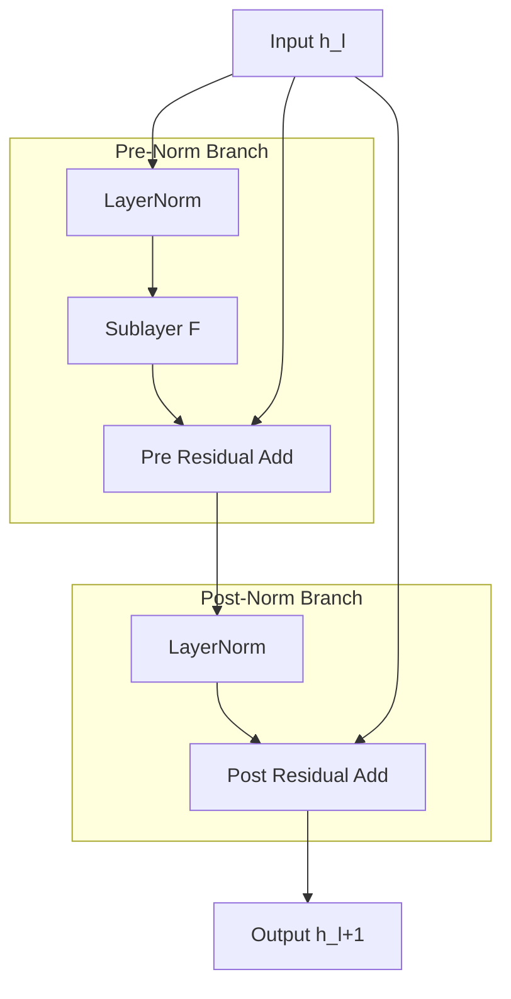
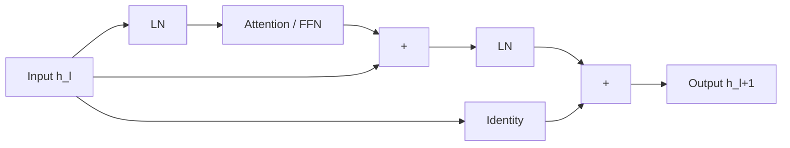
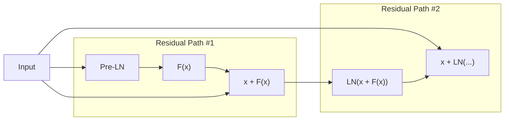
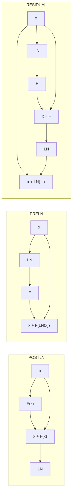
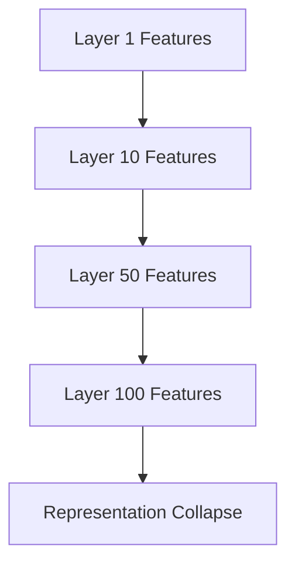
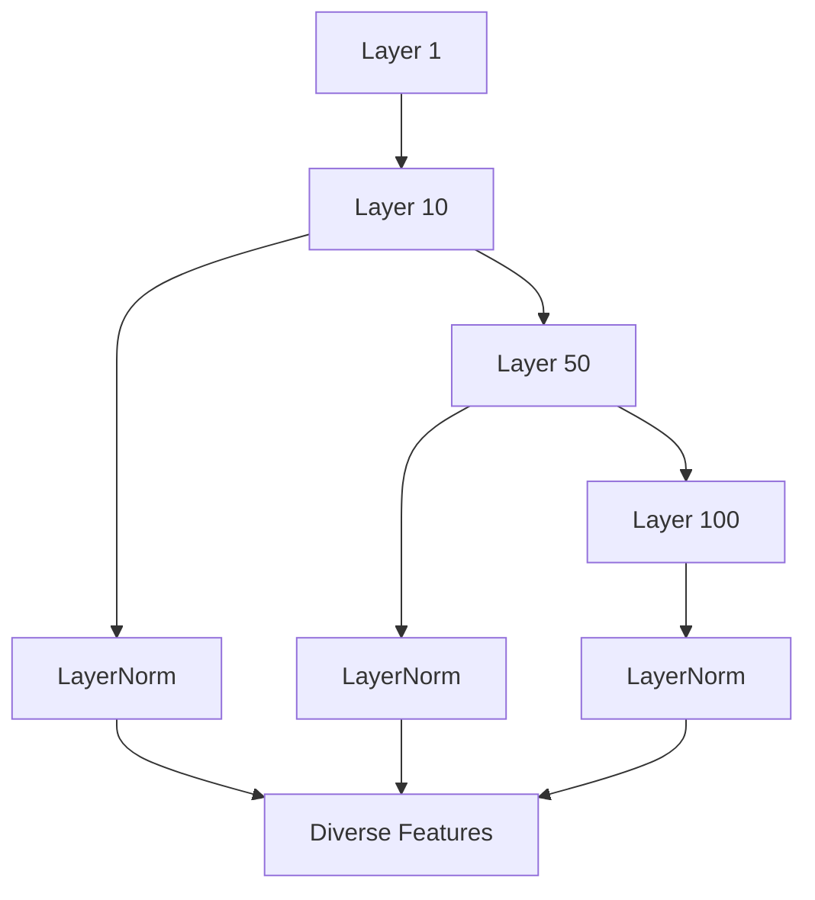
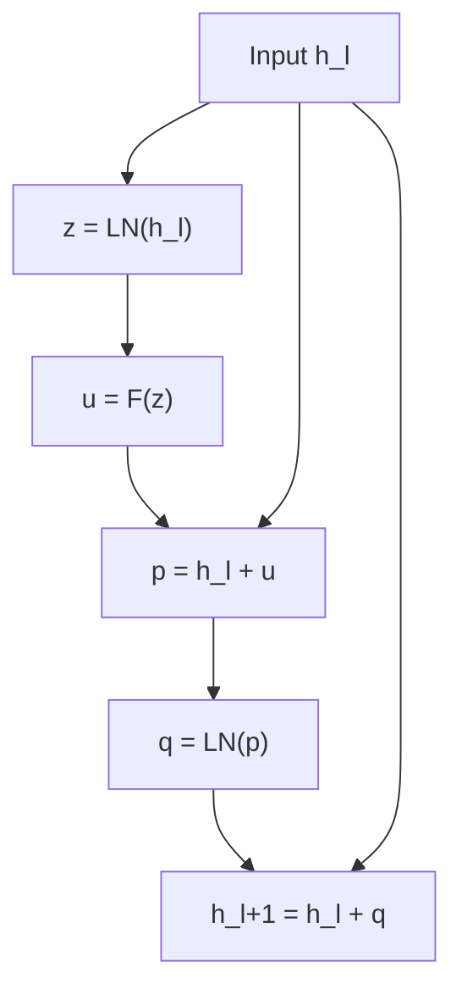
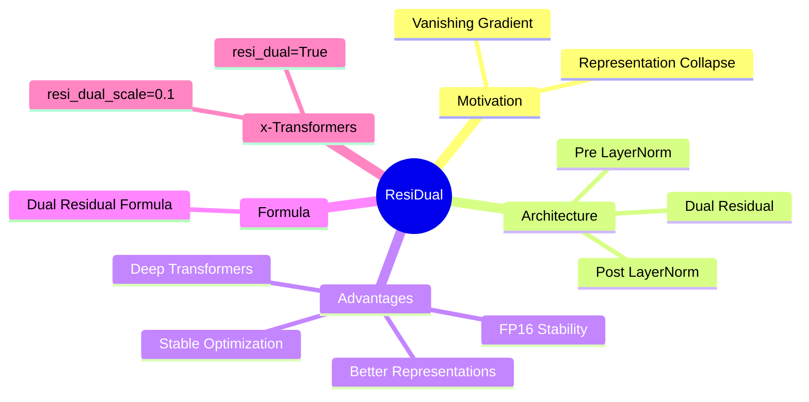
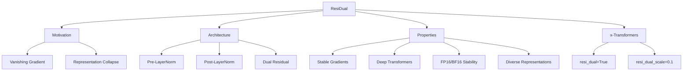

# ResiDual - Overview

> **Ý tưởng cốt lõi:** Kết hợp đồng thời **Pre-LayerNorm** và **Post-LayerNorm** để đạt được:

* Gradient ổn định của Pre-LN.
* Khả năng chống Representation Collapse của Post-LN.
* Huấn luyện Transformer rất sâu.
* Ổn định số học trong FP16/BF16.

---

# 1. Bức tranh tổng thể



---

# 2. Công thức tổng quát

```math
\boxed{ h_{l+1} = h_l + LN \left( h_l + F \left( LN(h_l) \right) \right)}
```

---

# 3. Luồng thông tin của ResiDual



---

# 4. Hai đường Residual



---

# 5. So sánh với Pre-LN và Post-LN



---

# 6. Phân tích Gradient

## Post-LN

```math
\frac{\partial h_{l+1}} {\partial h_l} = \frac{\partial LN}{\partial h} \left( I+\frac{\partial F}{\partial h_l} \right)
```

Gradient:

```math
\rightarrow 0
```

---

## Pre-LN

```math
\frac{\partial h_{l+1}} {\partial h_l} = I+ \frac{\partial F} {\partial h_l}
```

Gradient:

```math
\not\rightarrow 0
```

---

## ResiDual

```math
\frac{\partial h_{l+1}} {\partial h_l} = I + \frac{\partial LN} {\partial p_l} \left( I+ \frac{\partial F} {\partial h_l} \right)
```

Gradient:

```math
\not\rightarrow 0
```

và vẫn duy trì tính đa dạng của biểu diễn.

---

# 7. Representation Collapse



---

# 8. ResiDual chống Collapse



---

# 9. Residual Scaling

Paper đề xuất:

```math
p_l = \alpha \left( h_l + F(LN(h_l)) \right)
```

với:

```math
\alpha = 0.1
```

nhằm:

* tránh overflow trong FP16;
* giữ nguyên hiệu quả mô hình vì:

```math
LN(cx)=LN(x)
```

---

# 10. Thuật toán Forward



---

# 11. Tổng kết





$$
h_{l+1} ​ =h_l ​+ LN(h_l​+F(LN(h_l​)))​
$$
---

# Key Takeaways

```text
Post-LN
 └── tốt về biểu diễn
 └── gradient không ổn định

Pre-LN
 └── gradient ổn định
 └── representation collapse

ResiDual
 └── kết hợp ưu điểm của cả hai
 └── phù hợp cho Transformer rất sâu
 └── được tích hợp trong x-transformers
```
