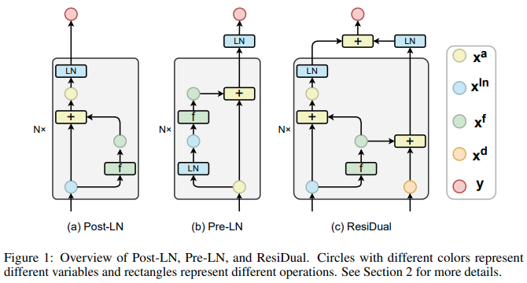
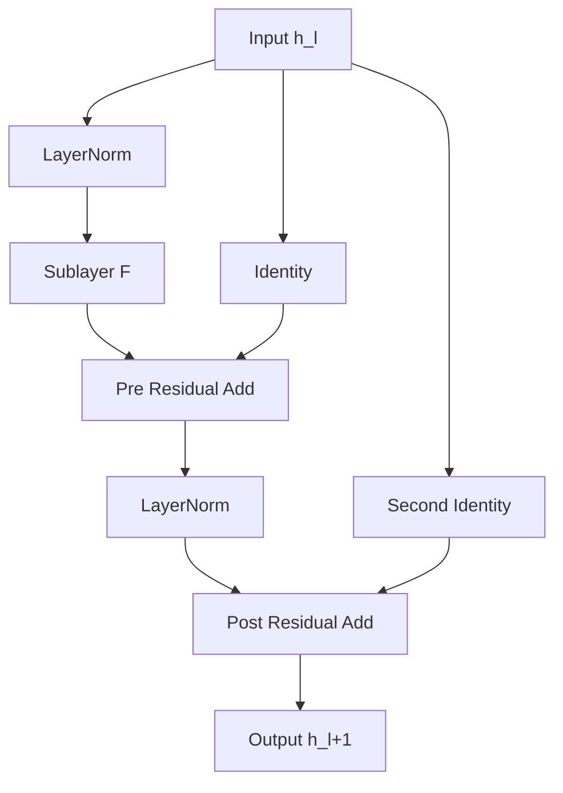
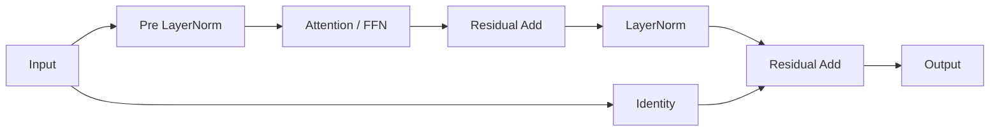

# ResiDual: Dual Residual Connections for Deep Transformers

> **ResiDual** là một kiến trúc chuẩn hóa (normalization architecture) kết hợp đồng thời **Pre-LayerNorm** và **Post-LayerNorm** nhằm duy trì tính ổn định của gradient trong quá trình huấn luyện các Transformer rất sâu, đồng thời giảm hiện tượng **Representation Collapse** thường gặp ở Pre-LayerNorm.

<p align="center"> 
  
</p> 

---

# Mục lục

1. Giới thiệu
2. Động cơ nghiên cứu
3. Kiến trúc ResiDual
4. Nguyên lý toán học
5. Phân tích Gradient
6. Representation Collapse
7. Thuật toán
8. Residual Scaling
9. So sánh với các kiến trúc khác
10. Ứng dụng trong x-Transformers
11. Tài liệu tham khảo

---

# 1. Giới thiệu

Transformer hiện đại chủ yếu sử dụng hai cấu hình Layer Normalization:

## Post-LayerNorm

```math
\mathbf{h}_{l+1} = LN\left( \mathbf{h}_l + F(\mathbf{h}_l) \right)
```

## Pre-LayerNorm

```math
\mathbf{h}_{l+1} = \mathbf{h}_l + F\left( LN(\mathbf{h}_l) \right)
```

Trong đó:

* $\mathbf{h}_l$ là biểu diễn tại tầng thứ $l$;
* $F(\cdot)$ là Attention hoặc Feed Forward Network;
* $LN(\cdot)$ là Layer Normalization.

Mỗi cấu hình đều tồn tại nhược điểm:

| Kiến trúc | Ưu điểm            | Nhược điểm              |
| --------- | ------------------ | ----------------------- |
| Post-LN   | Biểu diễn mạnh     | Gradient biến mất       |
| Pre-LN    | Huấn luyện ổn định | Representation Collapse |

ResiDual được đề xuất để giải quyết đồng thời cả hai vấn đề.

---

# 2. Động cơ nghiên cứu

## 2.1 Vấn đề của Post-LN

Forward:

```math
\mathbf{h}_{l+1} = LN \left( \mathbf{h}_l + F(\mathbf{h}_l) \right)
```

Gradient:

```math
\frac{\partial \mathbf{h}_{l+1}} {\partial \mathbf{h}_l} = \frac{\partial LN} {\partial(\mathbf{h}_l+F)} \left( I+ \frac{\partial F} {\partial \mathbf{h}_l} \right)
```

Khi số tầng tăng:

```math
\prod_{l=1}^{L} \frac{\partial \mathbf{h}_{l+1}} {\partial \mathbf{h}_l} \rightarrow 0
```

dẫn tới:

* vanishing gradient;
* khó tối ưu hóa Transformer sâu.

---

## 2.2 Vấn đề của Pre-LN

Forward:

```math
\mathbf{h}_{l+1} = \mathbf{h}_l + F \left( LN(\mathbf{h}_l) \right)
```

Gradient:

```math
\frac{\partial \mathbf{h}_{l+1}} {\partial \mathbf{h}_l} = I + \frac{\partial F} {\partial \mathbf{h}_l}
```

Nhờ tồn tại:

```math
I
```

nên gradient luôn ổn định.

Tuy nhiên:

```math
\mathbf{h}_{l+1} = \mathbf{h}_0 + \sum_{i=1}^{l} F_i
```

khi:

```math
l \rightarrow \infty
```

thì:

```math
\mathbf{h}_{l+1} \approx \mathbf{h}_l
```

làm cho các tầng trở nên tương tự nhau.

Hiện tượng này được gọi là:

> **Representation Collapse**

---

# 3. Kiến trúc ResiDual

Ý tưởng của ResiDual là sử dụng đồng thời:

1. Pre-Norm Residual Path;
2. Post-Norm Residual Path.

## Kiến trúc tổng quát



---

# 4. Nguyên lý toán học

Đặt:

```math
\mathbf{z}_l = LN(\mathbf{h}_l)
```

Sublayer:

```math
\mathbf{u}_l = F(\mathbf{z}_l)
```

Residual thứ nhất:

```math
\mathbf{p}_l = \mathbf{h}_l + \mathbf{u}_l
```

Chuẩn hóa:

```math
\mathbf{q}_l = LN(\mathbf{p}_l)
```

Residual thứ hai:

```math
\mathbf{h}_{l+1} = \mathbf{h}_l + \mathbf{q}_l
```

Có thể viết gọn:

```math
\boxed{ \mathbf{h}_{l+1} = \mathbf{h}_l + LN \left( \mathbf{h}_l + F \left( LN(\mathbf{h}_l) \right)\right)}
```

---

# 5. Phân tích Gradient

Đạo hàm:

```math
\frac{\partial \mathbf{h}_{l+1}} {\partial \mathbf{h}_l} = I + \frac{\partial LN} {\partial \mathbf{p}_l} \left( I + \frac{\partial F} {\partial \mathbf{h}_l} \right)
```

Luôn tồn tại:

```math
I
```

nên:

```math
\left\| \frac{\partial \mathbf{h}_{l+1}} {\partial \mathbf{h}_l} \right\| \not\rightarrow 0
```

Do đó:

* tránh vanishing gradient;
* hỗ trợ huấn luyện Transformer rất sâu.

---

# 6. Giảm Representation Collapse

Pre-LN:

```math
\mathbf{h}_l = \mathbf{h}_0 + \sum_{i=1}^{l} F_i
```

Các tầng trở nên:

```math
\mathbf{h}_{l+1} \approx \mathbf{h}_l
```

Trong ResiDual:

```math
\mathbf{h}_{l+1} = \mathbf{h}_l + LN \left( \mathbf{h}_l + F_i \right)
```

LayerNorm tạo ra:

```math
\mathbb{E}[\mathbf{h}] = 0
```

và

```math
Var(\mathbf{h}) = 1
```

ở mỗi tầng, giúp:

* duy trì sự đa dạng biểu diễn;
* giảm tương quan giữa các tầng;
* giảm Representation Collapse.

---

# 7. Thuật toán

## Forward Pass

```text
Input: h_l

z = LN(h_l)

u = F(z)

p = h_l + u

q = LN(p)

h_l+1 = h_l + q

Return h_l+1
```

---

## Pseudocode

```python
def residual_block(x):

    z = layer_norm(x)

    u = sublayer(z)

    p = x + u

    q = layer_norm(p)

    y = x + q

    return y
```

---

# 8. Residual Scaling

Trong huấn luyện FP16:

```math
\|\mathbf{p}_l\| \gg 1
```

có thể gây:

* overflow;
* mất ổn định số học.

Do:

```math
LN(c\mathbf{x}) = LN(\mathbf{x})
```

nên có thể sử dụng:

```math
\mathbf{p}_l = \alpha \left( \mathbf{h}_l+\mathbf{u}_l \right)
```

với:

```math
\alpha = 0.1
```

Mà gần như không làm thay đổi kết quả.

Trong `x-transformers`:

```python
Decoder(
    dim=512,
    depth=6,
    heads=8,
    resi_dual=True,
    resi_dual_scale=0.1
)
```

---

# 9. So sánh với các kiến trúc khác

| Thuộc tính          | Post-LN | Pre-LN | ResiDual |
| ------------------- | ------- | ------ | -------- |
| Gradient ổn định    | ❌       | ✅      | ✅        |
| Transformer rất sâu | ❌       | ✅      | ✅        |
| Đa dạng biểu diễn   | ✅       | ❌      | ✅        |
| Chống collapse      | ✅       | ❌      | ✅        |
| Ổn định FP16        | ⚠️      | ✅      | ✅        |

---

# 10. Vai trò trong x-Transformers

ResiDual là một trong các kỹ thuật được tích hợp trong:

* Deep Transformers;
* x-Transformers;
* Large Language Models.

Nó có thể kết hợp với:

* RMSNorm;
* Sandwich Norm;
* Rotary Embedding;
* ALiBi;
* DeepNorm;
* Residual Attention;
* Enhanced Recurrence.

---

# 11. Minh họa tổng quan



---

# 12. Kết luận

ResiDual là một kiến trúc lai:

```math
\text{ResiDual} = \text{Pre-LN} + \text{Post-LN}
```

nhằm:

1. duy trì luồng gradient của Pre-LN;
2. giảm Representation Collapse;
3. cải thiện khả năng huấn luyện Transformer cực sâu.

Nó là một trong những hướng tiếp cận quan trọng cho các kiến trúc Transformer thế hệ mới và được tích hợp trực tiếp trong thư viện `x-transformers`.

---

# Tài liệu tham khảo

```bibtex
@article{xiao2023residual,
  title={ResiDual: Transformer with Dual Residual Connections},
  author={Xiao, Biao and others},
  journal={arXiv preprint arXiv:2304.14802},
  year={2023}
}
```

```bibtex
@misc{wang2023xtransformers,
  title={x-transformers},
  author={Phil Wang},
  year={2023},
  howpublished={GitHub repository},
  url={https://github.com/lucidrains/x-transformers}
}
```

## Liên kết

* https://arxiv.org/abs/2304.14802
* https://github.com/lucidrains/x-transformers
