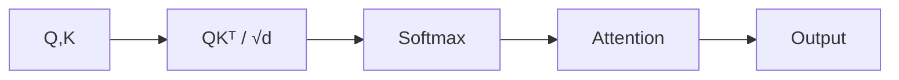
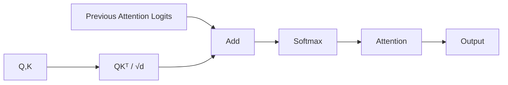
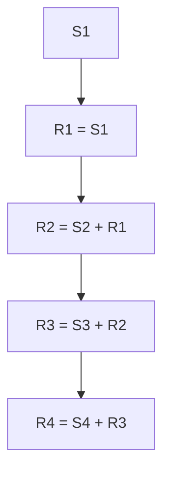
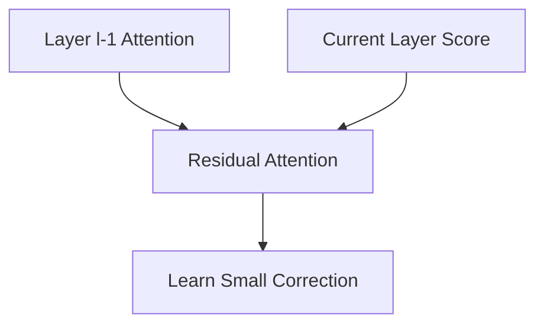
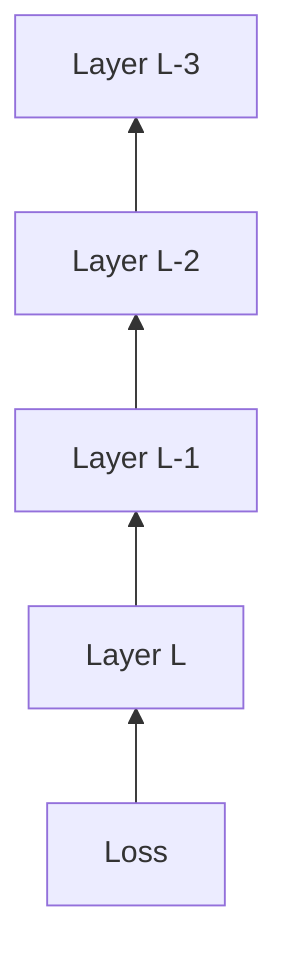
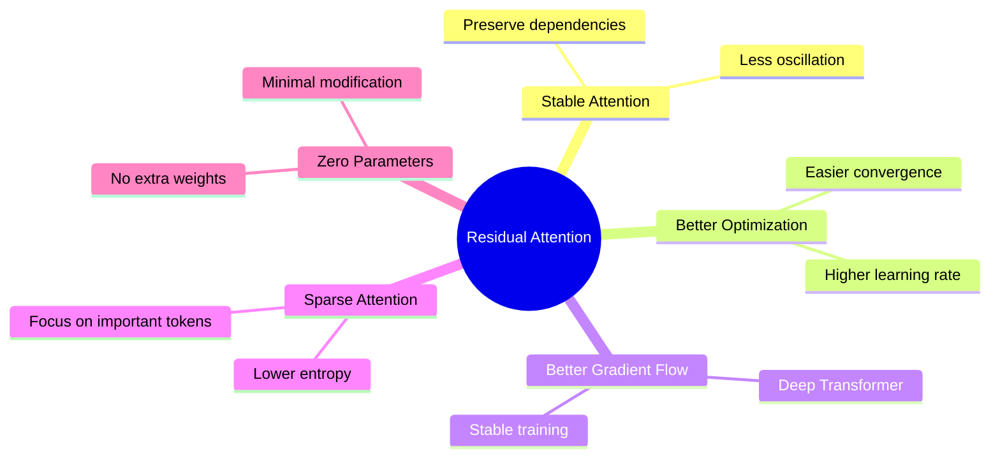
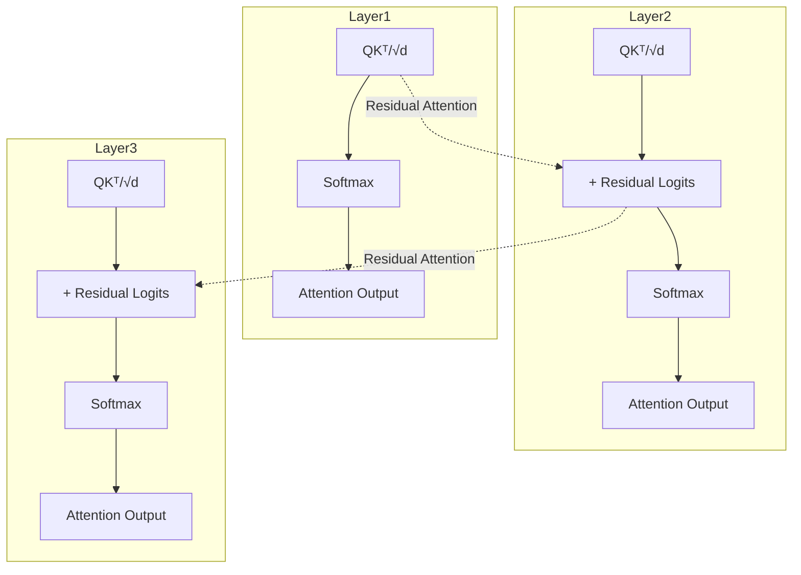

# Residual Attention (RealFormer) Overview

## 1. Ý tưởng cốt lõi

Transformer chuẩn:

```math
S_l=\frac{Q_lK_l^T}{\sqrt{d}}
```

RealFormer:

```math
R_l=S_l+R_{l-1}
```

```math
P_l= Softmax (R_l)
```

Trong đó:

* $S_l$: attention logits hiện tại.
* $R_l$: residual attention logits.
* $P_l$: attention probability.

---

# 2. Tổng quan kiến trúc

```mermaid
flowchart TD

A[Input X] --> B[Linear Projection]
B --> C[Q]
B --> D[K]
B --> E[V]

C --> F[QKᵀ / √d]
D --> F

G[Residual Attention<br>R(l-1)] --> H[Add]

F --> H

H --> I[Residual Logits<br>R(l)]

I --> J[Softmax]
J --> K[Attention Matrix]
K --> L[Multiply V]
E --> L
L --> M[Attention Output]
```

---

# 3. So sánh với Transformer chuẩn

## Vanilla Transformer



---

## Residual Attention (RealFormer)



---

# 4. Attention được tích lũy qua các tầng



Hay:

```math
R_l=\sum_{i=1}^{l}S_i
```

---

# 5. Minh họa trực quan nhiều tầng

```text
Layer 1

QKᵀ/√d
    │
    ▼
   S1
    │
    ▼
 softmax
    │
    ▼
 Output1


Layer 2

QKᵀ/√d
    │
    ▼
   S2
    │
    ▼
 + R1
    │
    ▼
   R2
    │
    ▼
 softmax
    │
    ▼
 Output2


Layer 3

QKᵀ/√d
    │
    ▼
   S3
    │
    ▼
 + R2
    │
    ▼
   R3
    │
    ▼
 softmax
    │
    ▼
 Output3
```

---

# 6. Góc nhìn Residual Learning



Tương tự ResNet:

```math
x_{l+1}=x_l+F(x_l)
```

RealFormer:

```math
R_l=R_{l-1}+S_l
```

Mỗi layer chỉ cần học:

```math
\Delta Attention
```

thay vì học lại toàn bộ attention map.

---

# 7. Gradient Flow



Residual Attention tạo thêm đường truyền gradient:

```text
Loss
 ↓
R(L)
 ↓
R(L-1)
 ↓
R(L-2)
 ↓
R(L-3)
```

Giúp:

* giảm vanishing gradient;
* tăng tính ổn định khi huấn luyện Transformer sâu;
* tăng tốc hội tụ.

---

# 8. Tại sao RealFormer hoạt động?



---

# 9. Tổng quan toàn bộ kiến trúc



---

# 10. Độ phức tạp

| Thành phần    | Vanilla  | RealFormer |
| ------------- | -------- | ---------- |
| Parameters    | $P$      | $P$        |
| FLOPs         | $O(n^2)$ | $O(n^2)$   |
| Memory        | $O(n^2)$ | $O(n^2)$   |
| Extra Weights | 0        | 0          |

---

# 11. Tóm tắt

```text
Transformer
      │
      ▼
Attention Scores
      │
      ▼
Residualize Attention Logits
      │
      ▼
Stable Attention Distribution
      │
      ▼
Better Gradient Flow
      │
      ▼
Deep Transformer Training
      │
      ▼
Better Performance
```

---

# Key Equation

```math
S_l=\frac{Q_lK_l^T}{\sqrt{d}}
```

```math
R_l=S_l+R_{l-1}
```

```math
P_l= Softmax (R_l)
```

```math
O_l=P_lV_l
```

---

# References

```bibtex
@article{he2021realformer,
  title={RealFormer: Transformer Likes Residual Attention},
  author={He, Ruining and Ravula, Anirudh and Kanagal, Bhargav and Ainslie, Joshua},
  journal={arXiv preprint arXiv:2012.11747},
  year={2021}
}
```
