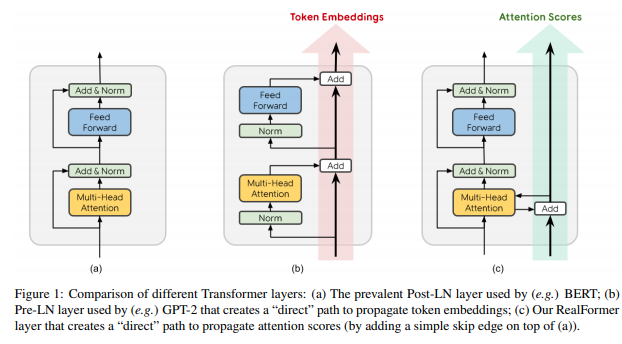

# Residual Attention (RealFormer)

> **Paper:** RealFormer: Transformer Likes Residual Attention (Google Research, 2021)

<p align="center">
  
</p>

---

## 1. Giới thiệu

Trong Transformer truyền thống, cơ chế residual chỉ được áp dụng lên hidden representation:

```math
x_{l+1}=x_l+F(x_l)
```

Residual connection giúp:

* cải thiện gradient flow;
* giảm hiện tượng vanishing gradient;
* tăng khả năng tối ưu của mạng sâu.

Tuy nhiên, attention score tại mỗi tầng lại được tính độc lập:

```math
S_l=\frac{Q_lK_l^T}{\sqrt{d_k}}
```

Do đó, mỗi layer phải học lại toàn bộ attention pattern, dẫn đến:

* dư thừa trong quá trình tối ưu;
* attention distribution không ổn định;
* khó huấn luyện Transformer rất sâu.

RealFormer đề xuất mở rộng tư tưởng residual connection trực tiếp lên **attention logits**, thay vì chỉ áp dụng trên hidden states.

---

# 2. Ý tưởng cốt lõi

Cho attention score tại layer thứ (l):

```math
S_l=\frac{Q_lK_l^T}{\sqrt{d_k}}
```

Residual Attention định nghĩa:

```math
R_l=S_l+R_{l-1}
```

với:

```math
R_1=S_1
```

Sau đó:

```math
P_l= Softmax (R_l)
```

và:

```math
O_l=P_lV_l
```

Trong đó:

* $R_l$: residual attention logits;
* $P_l$: attention probabilities;
* $O_l$: attention output.

---

# 3. Kiến trúc tổng quát

```text
Layer l-1
────────────────────

QKᵀ/√d
   │
   ▼
Residual Logits R(l-1)
   │
   └──────────────────────┐
                          │
                          ▼

Layer l
────────────────────

QKᵀ/√d
   │
   ▼
Current Score S(l)
   │
   ▼
S(l) + R(l-1)
   │
   ▼
Residual Logits R(l)
   │
   ▼
Softmax
   │
   ▼
Attention Output
```

---

# 4. Công thức đầy đủ

## Transformer chuẩn

### Attention score

```math
S_l=\frac{Q_lK_l^T}{\sqrt{d_k}}
```

### Attention probability

```math
P_l= Softmax (S_l)
```

### Attention output

```math
O_l=P_lV_l
```

---

## RealFormer

### Residual logits

```math
R_l=S_l+R_{l-1}
```

### Attention probability

```math
P_l= Softmax (R_l)
```

### Attention output

```math
O_l=P_lV_l
```

---

# 5. Diễn giải nhiều tầng

Ta có:

```math
R_1=S_1
```

```math
R_2=S_2+S_1
```

```math
R_3=S_3+S_2+S_1
```

Tổng quát:

```math
R_l=\sum_{i=1}^{l}S_i
```

Do đó, attention của các tầng trước được bảo toàn và tích lũy theo chiều sâu của mạng.

---

# 6. Thuật toán

```python
residual_attn = None

for layer in transformer_layers:

    scores = Q @ K.transpose(-1, -2)
    scores = scores / sqrt(d)

    if residual_attn is not None:
        scores = scores + residual_attn

    residual_attn = scores

    attention = softmax(scores)

    output = attention @ V
```

---

# 7. Minh họa quá trình tích lũy Attention

```text
Layer 1

S1
 │
 ▼
softmax
 │
 ▼
Output1


Layer 2

S2 + S1
 │
 ▼
softmax
 │
 ▼
Output2


Layer 3

S3 + S2 + S1
 │
 ▼
softmax
 │
 ▼
Output3
```

---

# 8. Phân tích cơ chế hoạt động

## 8.1 Attention trở nên ổn định hơn

Transformer chuẩn:

```text
Layer1 → Dependency A
Layer2 → Dependency B
Layer3 → Dependency C
```

RealFormer:

```text
Layer1 → Dependency A
Layer2 → A + B
Layer3 → A + B + C
```

Mỗi tầng chỉ cần học thêm một hiệu chỉnh nhỏ lên attention map đã có.

---

## 8.2 Cải thiện Gradient Flow

Residual Attention tạo thêm một đường truyền gradient:

```text
Loss
 ↓
R(L)
 ↓
R(L-1)
 ↓
R(L-2)
```

Giúp:

* huấn luyện mạng sâu ổn định hơn;
* giảm gradient vanishing;
* tăng tốc hội tụ.

---

## 8.3 Học Delta Attention

Transformer chuẩn:

```math
P_l= Softmax (S_l)
```

RealFormer:

```math
P_l= Softmax (R_{l-1}+\Delta S_l)
```

trong đó:

```math
\Delta S_l=S_l
```

Do đó, layer thứ (l) chỉ cần học:

```math
\Delta \text{Attention}
```

thay vì học lại toàn bộ attention distribution.

---

# 9. Quan hệ với Residual Network

Residual Network:

```math
x_{l+1}=x_l+F(x_l)
```

RealFormer:

```math
R_l=R_{l-1}+S_l
```

Tư tưởng chung:

> Mỗi tầng chỉ học phần hiệu chỉnh (residual correction) thay vì học lại toàn bộ biểu diễn.

---

# 10. Độ phức tạp tính toán

## Số lượng tham số

```math
\Delta \text{Parameters}=0
```

## Độ phức tạp thời gian

```math
O(n^2)
```

không thay đổi so với Self-Attention chuẩn.

## Bộ nhớ bổ sung

```math
O(n^2)
```

để lưu attention logits của layer trước.

---

# 11. Residual Cross Attention

Ý tưởng tương tự có thể áp dụng cho Encoder-Decoder Attention:

```math
R_l^{cross}
=
S_l^{cross}
+
R_{l-1}^{cross}
```

Điều này giúp:

* alignment giữa encoder và decoder ổn định hơn;
* tăng tốc hội tụ của mô hình seq2seq.

---

# 12. Triển khai trong x-transformers

## Residual Self-Attention

```python
from x_transformers import TransformerWrapper, Encoder

model = TransformerWrapper(
    num_tokens=20000,
    max_seq_len=1024,
    attn_layers=Encoder(
        dim=512,
        depth=6,
        heads=8,
        pre_norm=False,
        residual_attn=True
    )
)
```

---

## Residual Cross-Attention

```python
from x_transformers import XTransformer

model = XTransformer(
    dim=512,
    enc_num_tokens=256,
    enc_depth=6,
    enc_heads=8,
    enc_max_seq_len=1024,
    dec_num_tokens=256,
    dec_depth=6,
    dec_heads=8,
    dec_max_seq_len=1024,
    dec_cross_residual_attn=True
)
```

---

# 13. Ưu điểm

* Không tăng số lượng tham số.
* Không tăng FLOPs.
* Cải thiện gradient flow.
* Attention distribution ổn định hơn.
* Huấn luyện Transformer sâu dễ dàng hơn.
* Attention trở nên sparse hơn.
* Hội tụ nhanh hơn.
* Có thể sử dụng learning rate lớn hơn.

---

# 14. Hạn chế

* Hoạt động tốt nhất với Post-LayerNorm.
* Thường yêu cầu learning-rate warmup.
* Bộ nhớ tăng thêm do phải lưu attention logits.

---

# 15. Kết luận

Residual Attention (RealFormer) mở rộng khái niệm residual connection từ hidden representation sang attention logits:

```math
R_l=R_{l-1}+S_l
```

Đây là một thay đổi rất nhỏ trong kiến trúc nhưng mang lại:

1. tối ưu hóa ổn định hơn;
2. attention sparse hơn;
3. khả năng huấn luyện mạng sâu tốt hơn;
4. cải thiện hiệu năng mà không cần thêm tham số.

Vì vậy, Residual Attention đã trở thành một trong những cải tiến quan trọng được tích hợp trong thư viện `x-transformers` và là nền tảng cho nhiều biến thể Transformer hiện đại.

---

# Tài liệu tham khảo

```bibtex
@article{he2021realformer,
  title={RealFormer: Transformer Likes Residual Attention},
  author={He, Ruining and Ravula, Anirudh and Kanagal, Bhargav and Ainslie, Joshua},
  journal={arXiv preprint arXiv:2012.11747},
  year={2021}
}
```

```bibtex
@inproceedings{vaswani2017attention,
  title={Attention Is All You Need},
  author={Vaswani, Ashish and others},
  booktitle={NeurIPS},
  year={2017}
}
```

**Paper:** https://arxiv.org/abs/2012.11747

**Implementation:** https://github.com/lucidrains/x-transformers
