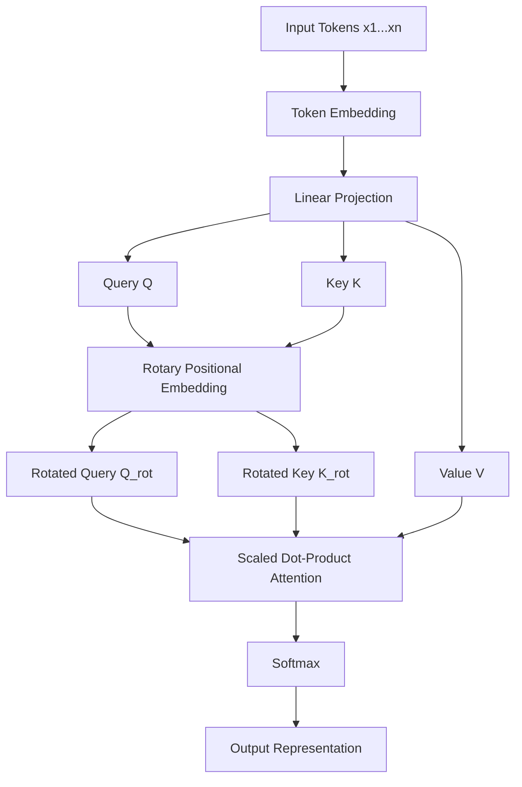
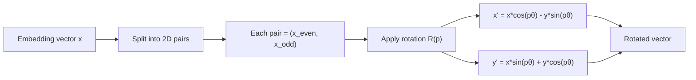
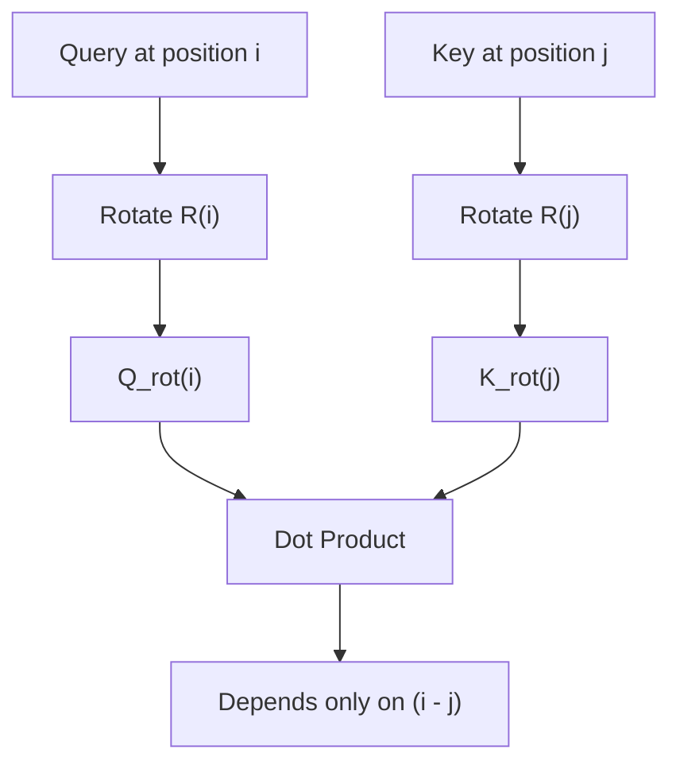
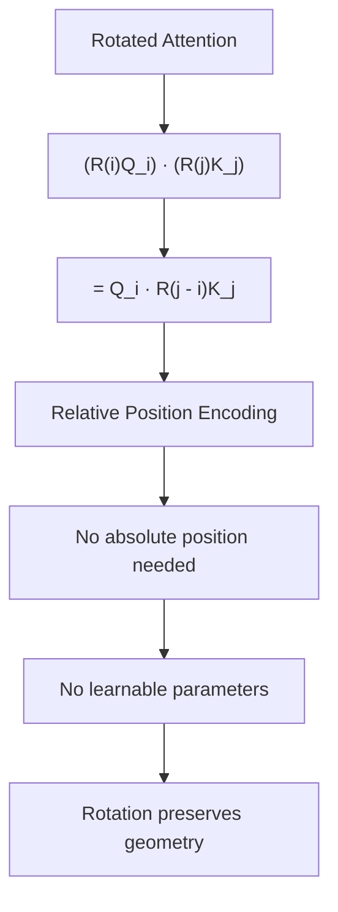
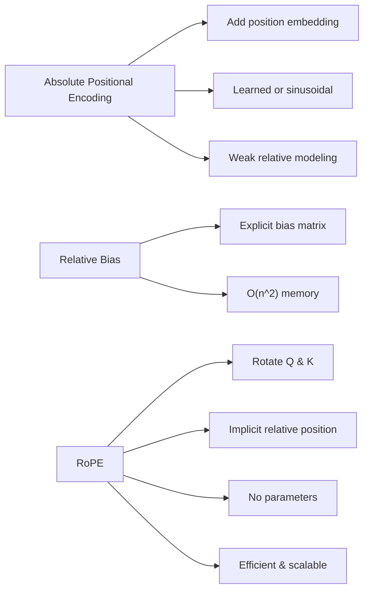
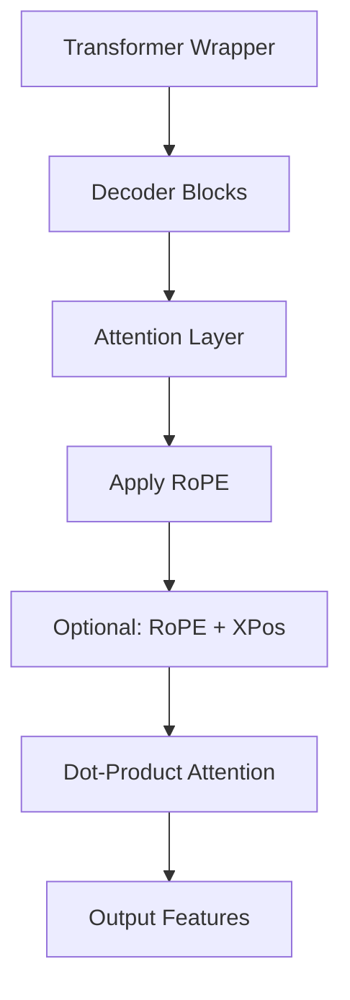
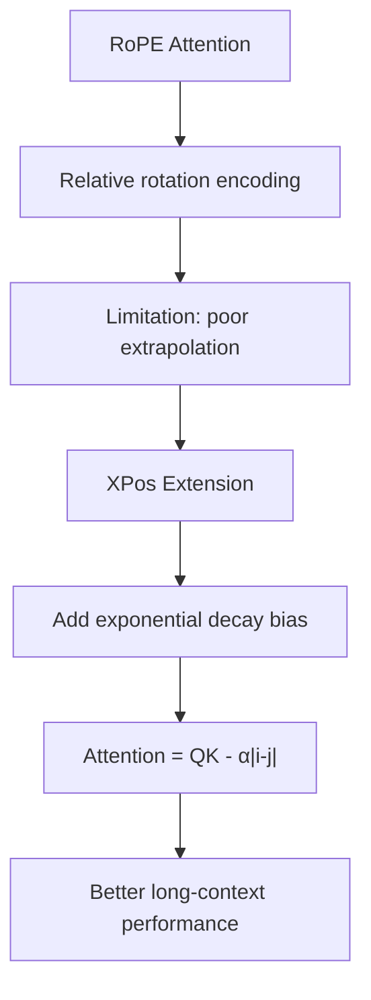
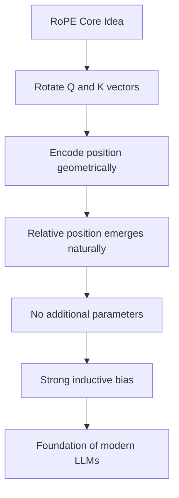

# Minh họa tổng quát Rotary Positional Embeddings (RoPE)

## 1. Kiến trúc tổng thể trong Transformer

---

## 2. Cơ chế Rotary Positional Embedding (Rotation View)

---

## 3. Ý tưởng cốt lõi: Relative Position thông qua Rotation

---

## 4. Tính chất toán học quan trọng

---

## 5. So sánh vị trí encoding (Overview)

---

## 6. RoPE trong X-Transformers (thực tế triển khai)

---

## 7. Mở rộng: RoPE + XPos (Long Context Fix)

---

## 8. Tổng kết trực quan

