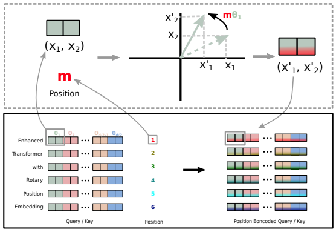

# Rotary Positional Embeddings (RoPE)

## Hướng tiếp cận hình học cho mã hóa vị trí trong Transformer và nền tảng cho X-Transformers

<p align="center">
  
</p>

## Tóm tắt

Rotary Positional Embeddings (RoPE) là một phương pháp mã hóa vị trí **không tham số (non-parametric)**, trong đó thông tin vị trí được đưa vào Transformer thông qua phép **quay hình học (rotation)** trên không gian của Query và Key.

Thay vì cộng embedding vị trí vào token embedding như các phương pháp truyền thống, RoPE **biến đổi trực tiếp Q và K trước phép attention**, giúp mô hình tự nhiên học được quan hệ **vị trí tương đối (relative position)**.

---

## 1. Bài toán vị trí trong Transformer

Với attention chuẩn:

$$
\text{Attention}(Q, K, V) = \text{softmax}\left(\frac{QK^\top}{\sqrt{d}}\right)V
$$

Transformer gốc không có cơ chế nội tại để hiểu thứ tự chuỗi. Do đó cần positional encoding.

Các hướng truyền thống:

- Absolute positional encoding (learned / sinusoidal)
- Relative bias (Shaw et al.)

Hạn chế:
- Thiếu tính hình học rõ ràng
- Không tối ưu cho relative dependency dài

---

## 2. Ý tưởng cốt lõi của RoPE

RoPE mã hóa vị trí bằng cách:

> Áp dụng một phép quay (rotation) lên vector Query và Key theo vị trí token.

Ký hiệu:

$$
Q_p = R(p)Q,\quad K_p = R(p)K
$$

Trong đó:
- $R(p)$: ma trận quay phụ thuộc vị trí $p$

Attention trở thành:

$$
(Q_i R(p_i)) \cdot (K_j R(p_j))
$$

---

## 3. Thuộc tính quan trọng

Điểm quan trọng nhất:

$$
(R(p_i)Q_i)^\top (R(p_j)K_j) = Q_i^\top R(p_j - p_i)K_j
$$

👉 Attention chỉ phụ thuộc vào **khoảng cách tương đối $i - j$**

---

## 4. Biểu diễn toán học của RoPE

### 4.1 Chia embedding thành các cặp

Với vector có chiều $d$:

$$
(x_0, x_1), (x_2, x_3), ..., (x_{d-2}, x_{d-1})
$$

Mỗi cặp được xem như một vector 2D.

---

### 4.2 Tần số quay

$$
\theta_k = 10000^{-2k/d}
$$

---

### 4.3 Phép quay 2D

Tại vị trí $p$:

$$
\begin{aligned}
x'_{2k} &= x_{2k}\cos(p\theta_k) - x_{2k+1}\sin(p\theta_k) \\
x'_{2k+1} &= x_{2k}\sin(p\theta_k) + x_{2k+1}\cos(p\theta_k)
\end{aligned}
$$

---

## 5. Tích hợp vào Transformer

Pipeline:

```

Input tokens
↓
Token Embedding
↓
Linear projection → Q, K, V
↓
Áp dụng RoPE lên Q, K
↓
Attention (Q_rot · K_rot^T)
↓
Softmax
↓
Output

```

---

## 6. Minh họa kiến trúc

```
            ┌────────────────────┐
            │ Token Embedding    │
            └─────────┬──────────┘
                      ↓
            ┌────────────────────┐
            │ Linear Projection  │
            │ Q, K, V           │
            └──────┬───────┬─────┘
                   │       │
                   ↓       ↓
        ┌────────────────────────┐
        │ Rotary Positional      │
        │ Embedding (RoPE)       │
        │ Q ← R(p)Q             │
        │ K ← R(p)K             │
        └─────────┬──────────────┘
                  ↓
     ┌───────────────────────────┐
     │ Attention Dot-Product     │
     │ Q_rot · K_rot^T          │
     └─────────┬─────────────────┘
               ↓
          ┌──────────┐
          │ Softmax  │
          └────┬─────┘
               ↓
          ┌──────────┐
          │ Output   │
          └──────────┘
```


---

## 7. Tính chất khoa học

### 7.1 Relative Position tự nhiên
- Không cần embedding vị trí riêng
- Attention phụ thuộc $i - j$

---

### 7.2 Không có tham số học
- Không tăng số lượng parameter
- Không cần positional embedding table

---

### 7.3 Bảo toàn cấu trúc hình học
- Rotation giữ nguyên độ dài vector:

$$
\|R(p)x\| = \|x\|
$$

→ ổn định training

---

## 8. Hạn chế

RoPE có một số giới hạn:

- Không extrapolate tốt khi sequence dài hơn training
- Tần số quay cố định
- Nhạy với scale position

---

## 9. Mở rộng: Rotary XPos (RoPE + decay)

Để khắc phục vấn đề dài chuỗi, X-Transformers sử dụng:

> Kết hợp RoPE + bias suy giảm khoảng cách kiểu ALiBi

$$
\text{Attention}_{ij} = (Q_i R(p_i))^\top (K_j R(p_j)) - \alpha |i - j|
$$

---

## 10. Cài đặt trong X-Transformers

```python
from x_transformers import TransformerWrapper, Decoder

model = TransformerWrapper(
    num_tokens = 20000,
    max_seq_len = 1024,
    attn_layers = Decoder(
        dim = 512,
        depth = 6,
        heads = 8,
        rotary_pos_emb = True
    )
)
```

---

## 11. Phiên bản Rotary XPos

```python
model = TransformerWrapper(
    num_tokens = 20000,
    max_seq_len = 1024,
    attn_layers = Decoder(
        dim = 512,
        depth = 6,
        heads = 8,
        rotary_xpos = True,
        rotary_xpos_scale_base = 512
    )
)
```

---

## 12. So sánh các phương pháp positional encoding

| Phương pháp      | Tham số học | Relative | Extrapolation | Chi phí |
| ---------------- | ----------- | -------- | ------------- | ------- |
| Learned absolute | Có          | Không    | Yếu           | Cao     |
| Sinusoidal       | Không       | Một phần | Trung bình    | Thấp    |
| RoPE             | Không       | Có       | Trung bình    | Thấp    |
| RoPE + XPos      | Không       | Có       | Tốt hơn       | Thấp    |

---

## 13. Ý nghĩa trong X-Transformers

RoPE là một thành phần quan trọng giúp:

* Cải thiện inductive bias của attention
* Tăng khả năng học cấu trúc chuỗi
* Hỗ trợ scaling context dài hơn
* Là nền tảng cho các biến thể attention hiện đại

---

## 14. Kết luận

Rotary Positional Embeddings là một bước tiến quan trọng trong thiết kế Transformer hiện đại.

Điểm mạnh chính:

* Mã hóa vị trí bằng hình học (rotation)
* Không cần tham số học
* Tự nhiên biểu diễn quan hệ tương đối
* Tích hợp trực tiếp vào attention

Hạn chế chính:

* Giới hạn extrapolation khi sequence quá dài

Do đó, các biến thể như **Rotary XPos** được phát triển để cải thiện khả năng xử lý chuỗi dài trong thực tế.

---

## Tài liệu tham khảo

* Su et al. (2021), *RoFormer: Enhanced Transformer with Rotary Position Embedding*
  [https://arxiv.org/abs/2104.09864](https://arxiv.org/abs/2104.09864)

* Vaswani et al. (2017), *Attention Is All You Need*
  [https://arxiv.org/abs/1706.03762](https://arxiv.org/abs/1706.03762)

* Press et al. (2021), *ALiBi: Attention with Linear Biases*
  [https://arxiv.org/abs/2108.12409](https://arxiv.org/abs/2108.12409)

* X-Transformers Repository
  [https://github.com/lucidrains/x-transformers](https://github.com/lucidrains/x-transformers)

---
