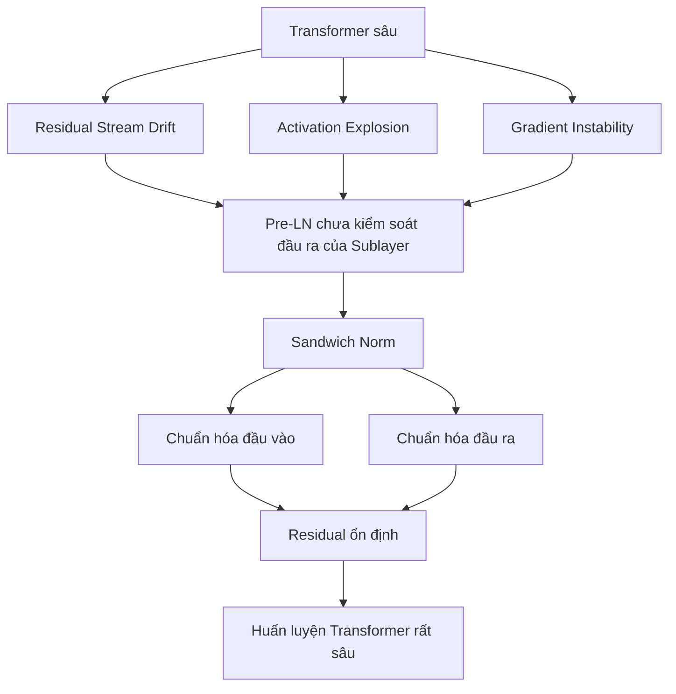
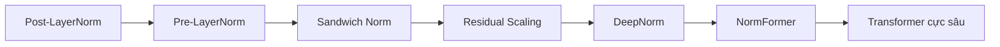
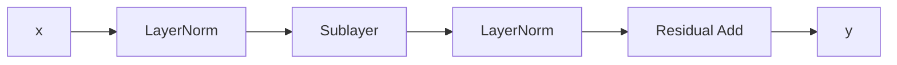
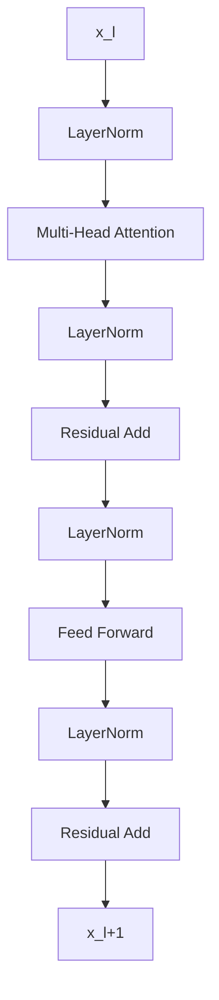
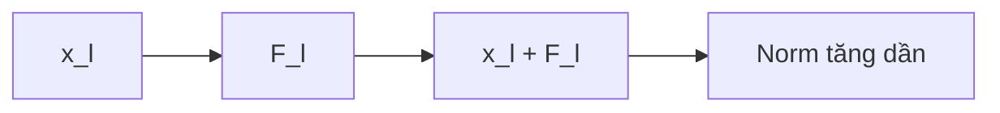
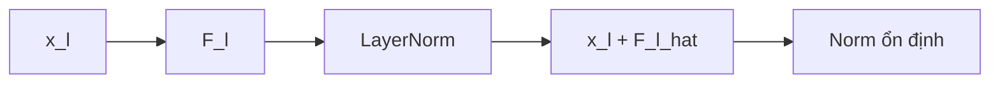
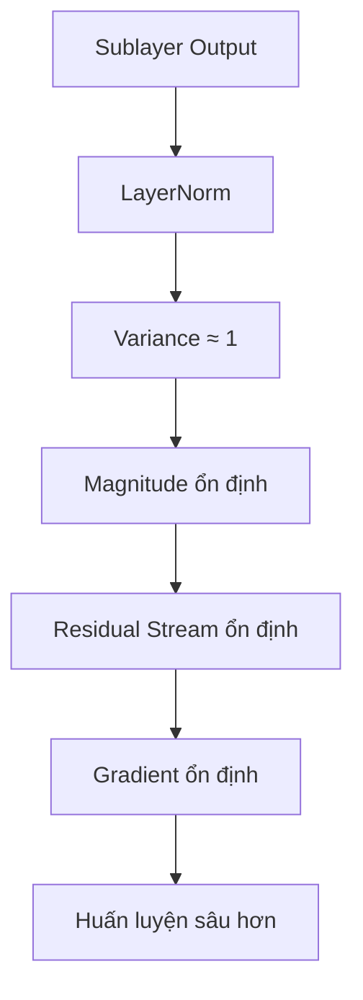
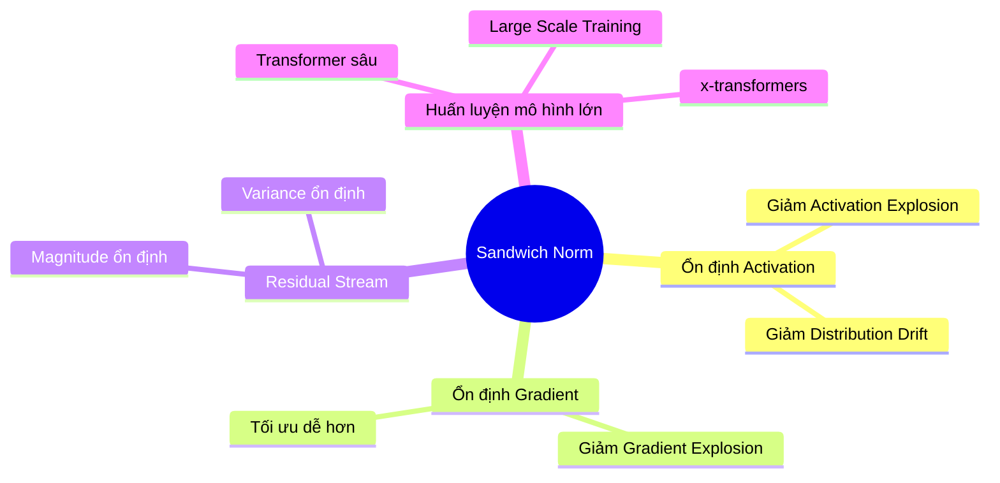
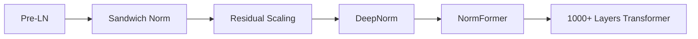
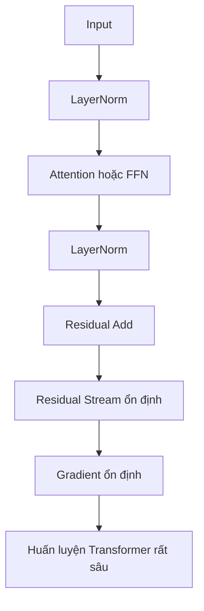

# Sandwich Norm - Overview Diagram

> Minh họa tổng quát về động cơ, kiến trúc, công thức toán học, luồng tín hiệu và vai trò của **Sandwich Norm** trong các Transformer hiện đại.

---

# 1. Big Picture



---

# 2. Sự tiến hóa của Normalization trong Transformer



---

# 3. So sánh kiến trúc

## Post-LayerNorm

```text
x
│
├── Sublayer
│
└── Add
      │
      LN
      │
      y
```

---

## Pre-LayerNorm

```text
x
│
├── LN
│
├── Sublayer
│
└── Add
      │
      y
```

---

## Sandwich Norm

```text
x
│
├── LN
│
├── Sublayer
│
├── LN
│
└── Add
      │
      y
```

---

# 4. Ý tưởng cốt lõi



Sandwich Norm đặt:

```text
LayerNorm
      ↓
   Sublayer
      ↓
LayerNorm
```

tạo thành một "chiếc bánh sandwich" bao quanh sublayer.

---

# 5. Công thức toán học

## Pre-LayerNorm

```math
y=x+F(\mathrm{LN}(x))
```

---

## Sandwich Norm

```math
y=
x+
\mathrm{LN}
\left(
F(\mathrm{LN}(x))
\right)
```

---

# 6. Kiến trúc của một Transformer Block



---

# 7. Phương trình đầy đủ

## Attention

```math
z_l= x_l+ \mathrm{LN} \left( \mathrm{Attention} ( \mathrm{LN}(x_l)) \right)
```

---

## Feed Forward

```math
x_{l+1} = z_l+ \mathrm{LN} \left( \mathrm{FFN} ( \mathrm{LN}(z_l) ) \right)
```

---

# 8. Luồng lan truyền tín hiệu

## Pre-LN



---

## Sandwich Norm



---

# 9. Phân tích độ lớn của Residual Stream

## Không dùng Sandwich Norm

```text
Layer 1 : ||x|| = 10
Layer 2 : ||x|| = 16
Layer 3 : ||x|| = 24
Layer 4 : ||x|| = 38
Layer 5 : ||x|| = 61
```

---

## Có Sandwich Norm

```text
Layer 1 : ||x|| = 10
Layer 2 : ||x|| = 11
Layer 3 : ||x|| = 11.6
Layer 4 : ||x|| = 12
Layer 5 : ||x|| = 12.4
```

---

# 10. Cơ chế hoạt động



---

# 11. Góc nhìn Gradient

```math
\frac{\partial L} {\partial x_l} = \frac{\partial L} {\partial x_{l+1}} \left( I+ \frac{\partial \hat F_l} {\partial x_l} \right)
```

với

```math
\hat F_l= \mathrm{LN} \left( F(\mathrm{LN}(x_l)) \right)
```

LayerNorm thứ hai giúp:

```math
\left\| \frac{\partial \hat F_l} {\partial x_l} \right\|
```

được kiểm soát tốt hơn.

---

# 12. Lợi ích đạt được



---

# 13. Vị trí của Sandwich Norm trong x-transformers



---

# 14. Kết luận trực quan



---

# Tóm tắt một dòng

```text
Pre-LN:
x + F(LN(x))

Sandwich Norm:
x + LN(F(LN(x)))
```

> Một LayerNorm bổ sung sau mỗi residual branch giúp kiểm soát độ lớn activation, ổn định gradient và cải thiện khả năng mở rộng của Transformer sâu.
