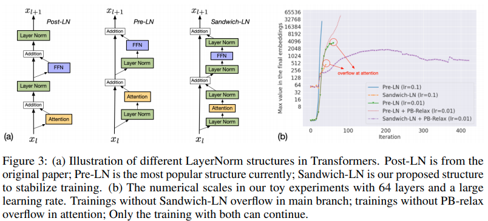
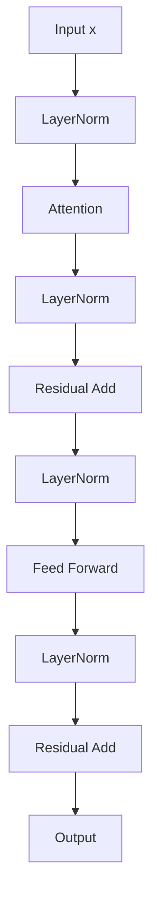
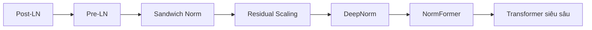

# Sandwich Norm trong Transformer

> Một chiến lược chuẩn hóa đơn giản nhưng hiệu quả nhằm cải thiện tính ổn định khi huấn luyện các Transformer sâu dựa trên kiến trúc Pre-LayerNorm.

<p align="center"> 
  
</p> 

---

# 1. Giới thiệu

Sự thành công của Transformer hiện đại phụ thuộc rất lớn vào cơ chế:

* Kết nối tắt (Residual Connection)
* Chuẩn hóa (Normalization)
* Lan truyền tín hiệu ổn định qua nhiều tầng.

Mặc dù kiến trúc **Pre-LayerNorm (Pre-LN)** cải thiện đáng kể khả năng tối ưu hóa so với **Post-LayerNorm (Post-LN)**, các Transformer rất sâu vẫn gặp phải một số vấn đề:

* Độ lớn activation tăng dần theo chiều sâu.
* Residual stream bị trôi phân phối (distribution drift).
* Gradient trở nên mất ổn định.
* Quá trình huấn luyện nhạy cảm với learning rate.

Trong bài báo **CogView**, tác giả đề xuất một kỹ thuật cực kỳ đơn giản mang tên **Sandwich Norm**, trong đó một lớp Layer Normalization được bổ sung ngay sau đầu ra của mỗi nhánh residual.

Ý tưởng cốt lõi:

> Chuẩn hóa cả đầu vào và đầu ra của mỗi sublayer.

---

# 2. Động cơ nghiên cứu

Một khối Transformer theo kiến trúc Pre-LN có dạng:

```math
y = x + F(\mathrm{LN}(x))
```

trong đó:

* $x$: residual stream;
* $F(\cdot)$: Attention hoặc Feed Forward Network.

Mặc dù:

```math
\mathrm{LN}(x)
```

luôn có phương sai được chuẩn hóa, nhưng:

```math
F(\mathrm{LN}(x))
```

không bị ràng buộc về độ lớn.

Khi số tầng tăng lên:

```math
\|F(\mathrm{LN}(x))\| \uparrow
```

dẫn tới:

```math
\|x_l\| \uparrow
```

và gây ra:

* Activation explosion;
* Gradient instability;
* Huấn luyện không hội tụ.

---

# 3. Ý tưởng của Sandwich Norm

Sandwich Norm sửa đổi residual branch thành:

```math
y = x + \mathrm{LN} \left( F(\mathrm{LN}(x)) \right)
```

Tên gọi **Sandwich Norm** xuất phát từ việc:

```text
LayerNorm
     ↓
   Sublayer
     ↓
LayerNorm
```

Sublayer được "kẹp" giữa hai phép chuẩn hóa.

---

# 4. Công thức toán học

## Khối Attention

Đầu tiên:

```math
h_l = \mathrm{Attention} \left( \mathrm{LN}(x_l) \right)
```

Chuẩn hóa đầu ra:

```math
\hat h_l = \mathrm{LN}(h_l)
```

Cập nhật residual:

```math
z_l = x_l + \hat h_l
```

---

## Khối Feed Forward

```math
f_l = \mathrm{FFN} \left( \mathrm{LN}(z_l) \right)
```

Chuẩn hóa:

```math
\hat f_l = \mathrm{LN}(f_l)
```

Cập nhật:

```math
x_{l+1} = z_l + \hat f_l
```

---

# 5. Phương trình đầy đủ của Transformer Layer

```math
z_l = x_l + \mathrm{LN} \left( \mathrm{Attention} \left( \mathrm{LN}(x_l) \right) \right)
```

```math
x_{l+1} = z_l + \mathrm{LN} \left( \mathrm{FFN} \left( \mathrm{LN}(z_l) \right) \right)
```

---

# 6. Phân tích lan truyền tín hiệu

## Pre-LN

Residual update:

```math
x_{l+1} = x_l + F_l
```

Nếu:

```math
\|F_l\|
```

không được kiểm soát thì:

```math
\|x_l\|
```

sẽ tăng dần theo chiều sâu.

---

## Sandwich Norm

Sau khi chuẩn hóa:

```math
\hat F_l = \mathrm{LN}(F_l)
```

ta có:

```math
\mathrm{Var}(\hat F_l) \approx 1
```

Do đó:

```math
x_{l+1} = x_l + O(1)
```

thay vì:

```math
x_{l+1} = x_l + O(l)
```

Độ lớn của residual stream được giữ ổn định hơn.

---

# 7. Phân tích Gradient

Gradient của tầng thứ (l):

```math
\frac{\partial L} {\partial x_l} = \frac{\partial L} {\partial x_{l+1}} \left( I + \frac{\partial \hat F_l} {\partial x_l} \right)
```

với:

```math
\hat F_l = \mathrm{LN} \left( F(\mathrm{LN}(x_l)) \right)
```

LayerNorm thứ hai giúp:

```math
\left\| \frac{\partial \hat F_l} {\partial x_l} \right\|
```

được kiểm soát tốt hơn, từ đó:

* giảm gradient explosion;
* giảm gradient variance;
* cải thiện điều kiện tối ưu.

---

# 8. Minh họa kiến trúc



---

# 9. So sánh với các phương pháp chuẩn hóa khác

| Thuộc tính                   | Post-LN    | Pre-LN     | Sandwich Norm |
| ---------------------------- | ---------- | ---------- | ------------- |
| Gradient ổn định             | Kém        | Tốt        | Rất tốt       |
| Huấn luyện Transformer sâu   | Kém        | Tốt        | Rất tốt       |
| Kiểm soát residual magnitude | Kém        | Trung bình | Tốt           |
| Ổn định activation           | Trung bình | Tốt        | Rất tốt       |
| Mở rộng mô hình lớn          | Trung bình | Tốt        | Rất tốt       |

---

# 10. Độ phức tạp tính toán

LayerNorm bổ sung cần:

```math
O(nd)
```

trong khi Self-Attention có độ phức tạp:

```math
O(n^2 d)
```

Do đó chi phí tăng thêm của Sandwich Norm là không đáng kể.

---

# 11. Cài đặt trong x-transformers

```python
from x_transformers import TransformerWrapper, Decoder

model = TransformerWrapper(
    num_tokens=20000,
    max_seq_len=1024,
    attn_layers=Decoder(
        dim=512,
        depth=6,
        heads=8,
        sandwich_norm=True
    )
)
```

Bên trong mỗi block:

```text
Input
  ↓
LayerNorm
  ↓
Attention
  ↓
LayerNorm
  ↓
Residual Add
  ↓
LayerNorm
  ↓
Feed Forward
  ↓
LayerNorm
  ↓
Residual Add
```

---

# 12. Vai trò trong quá trình phát triển Transformer hiện đại



Sandwich Norm là một bước trung gian quan trọng trong quá trình phát triển các kiến trúc Transformer cực sâu, cung cấp:

1. Kiểm soát độ lớn activation.
2. Ổn định residual stream.
3. Giảm hiện tượng gradient explosion.
4. Hỗ trợ huấn luyện hàng trăm đến hàng nghìn tầng Transformer.
5. Tạo tiền đề cho các kỹ thuật như DeepNorm và NormFormer.

---

# 13. Kết luận

Sandwich Norm là một mở rộng tự nhiên của Pre-LayerNorm:

```math
x + F(\mathrm{LN}(x))
```

thành:

```math
x + \mathrm{LN} \left( F(\mathrm{LN}(x)) \right)
```

Việc bổ sung một LayerNorm ở đầu ra của residual branch:

* ổn định phân phối activation;
* cải thiện điều kiện tối ưu;
* giảm sự tăng trưởng của residual magnitude;
* tăng khả năng mở rộng độ sâu của Transformer.

Mặc dù rất đơn giản, Sandwich Norm đã chứng minh hiệu quả thực tiễn trong nhiều mô hình Transformer quy mô lớn.

---

# Tài liệu tham khảo

```bibtex
@article{ding2021cogview,
  title={CogView: Mastering Text-to-Image Generation via Transformers},
  author={Ding, Ming and Yang, Zhuoyi and Hong, Wenyi and Zheng, Wendi and Zhou, Chang and Yin, Da and Lin, Junyang and Zou, Xu and Shao, Zhou and Yang, Hongxia and others},
  journal={arXiv preprint arXiv:2105.13290},
  year={2021}
}
```

```bibtex
@misc{xtransformers,
  author = {Phil Wang},
  title = {x-transformers},
  year = {2024},
  url = {https://github.com/lucidrains/x-transformers}
}
```

```bibtex
@inproceedings{vaswani2017attention,
  title={Attention Is All You Need},
  author={Vaswani, Ashish and Shazeer, Noam and Parmar, Niki and others},
  booktitle={Advances in Neural Information Processing Systems},
  year={2017}
}
```

```bibtex
@article{xiong2020layernorm,
  title={On Layer Normalization in the Transformer Architecture},
  author={Xiong, Ruibin and Yang, Yunchang and He, Di and others},
  journal={International Conference on Machine Learning},
  year={2020}
}
```

```bibtex
@article{wang2022deepnet,
  title={DeepNet: Scaling Transformers to 1000 Layers},
  author={Wang, Hongyu and Ma, Shuming and Dong, Li and others},
  journal={arXiv preprint arXiv:2203.00555},
  year={2022}
}
```
