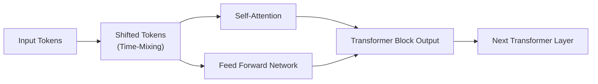
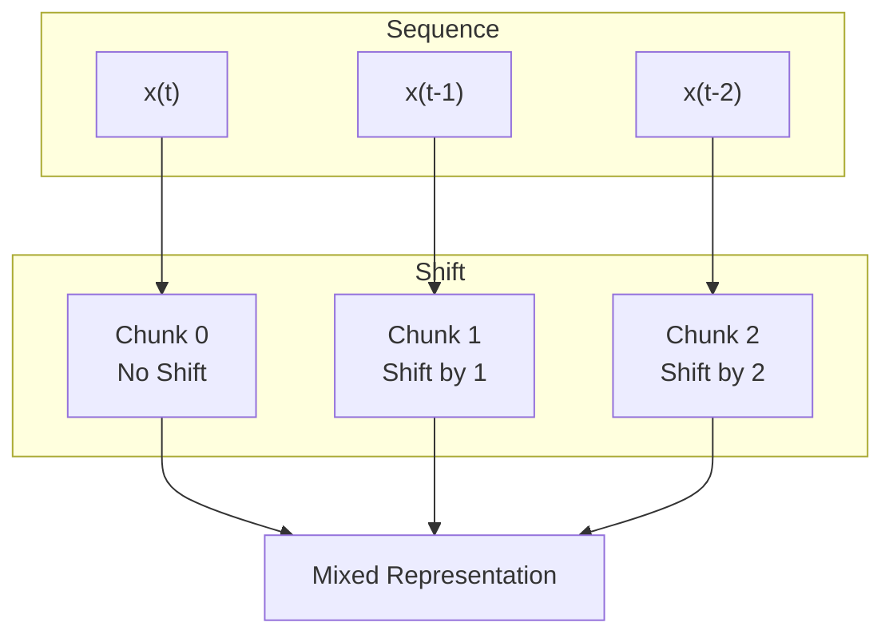
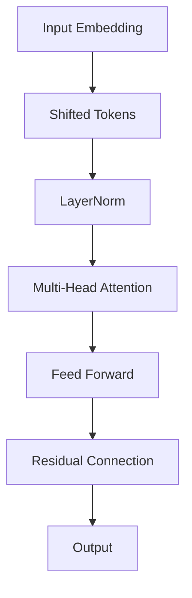
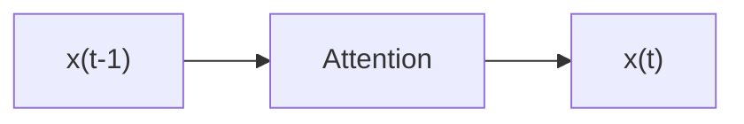
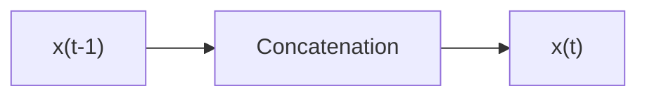
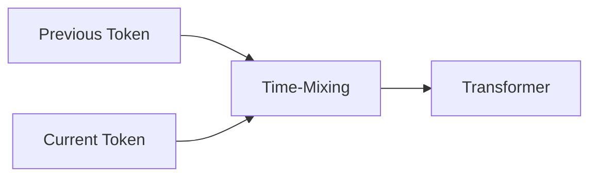
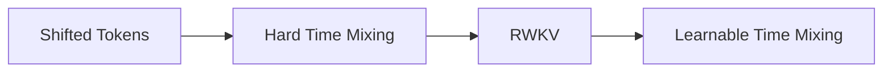
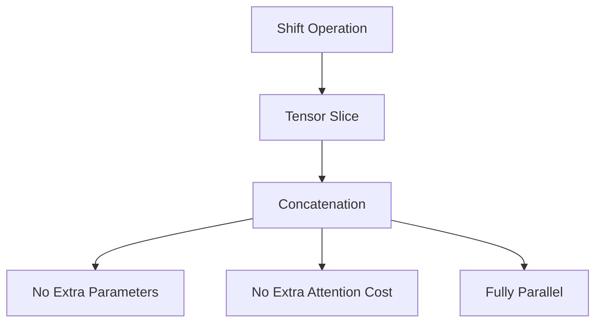
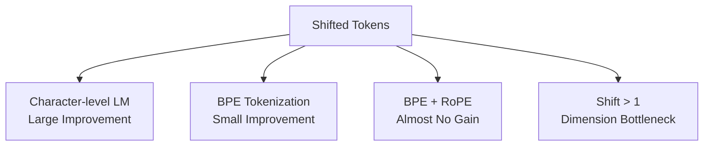
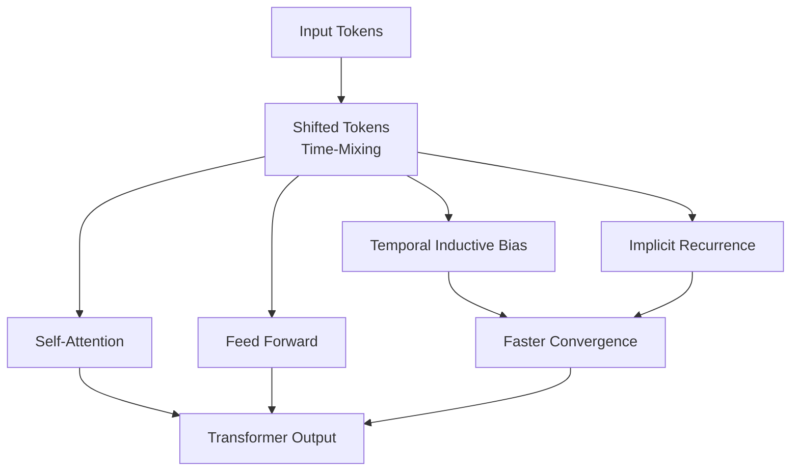

# Shifted Tokens (Time-Mixing) — Overview Diagram

---

# 1. Big Picture



---

# 2. Core Idea

Thay vì sử dụng hoàn toàn token hiện tại:

$$
x_t
$$

Shifted Tokens xây dựng:

$$
\tilde{x}*t= [x_t^{(0)}, x*{t-1}^{(1)}, x_{t-2}^{(2)}, \dots]
$$

để đưa thông tin quá khứ trực tiếp vào biểu diễn hiện tại.

---

# 3. Token Shift Mechanism



---

# 4. Feature Mixing

```text
Original

x(t)
┌────────────────────────┐
│ d0 d1 d2 d3 d4 d5 d6 d7 │
└────────────────────────┘


Shift = 1

x(t)
┌────────────────────────┐
│ current │ previous      │
└────────────────────────┘


Shift = 2

x(t)
┌────────────────────────┐
│ current │ t-1 │ t-2     │
└────────────────────────┘
```

---

# 5. Mathematical Formulation

Given:

$$
X \in \mathbb{R}^{L \times d}
$$

Split feature dimension into:

$$
X= [X^{(0)},X^{(1)},...,X^{(s)}]
$$

Apply temporal shifts:

$$
\tilde{X}^{(i)}= \text{Shift}(X^{(i)},i)
$$

Concatenate:

$$
\tilde{X}= [\tilde{X}^{(0)}, \tilde{X}^{(1)}, \dots, \tilde{X}^{(s)}]
$$

---

# 6. Data Flow inside Transformer



---

# 7. Gradient Path Comparison

## Standard Transformer



---

## Shifted Tokens



Gradient path:

```text
shorter
↓
easier optimization
↓
faster convergence
```

---

# 8. Connection to Recurrence



Approximation:

$$
h_t= f(x_t,h_{t-1})
$$

without introducing recurrent computation.

---

# 9. Relationship with RWKV



RWKV:

$$
x_k= x_t \odot \mu + x_{t-1}\odot(1-\mu)
$$

Shifted Tokens:

$$
\mu \in {0,1}
$$

---

# 10. Computational Cost



---

# 11. Empirical Findings



---

# 12. Complete Overview



---

# Key Takeaways

```text
Shifted Tokens
        │
        ├── No additional parameters
        ├── No additional FLOPs
        ├── Fully parallel
        ├── Injects temporal bias
        ├── Approximates recurrence
        ├── Improves convergence
        └── Foundation of modern Time-Mixing architectures
```
