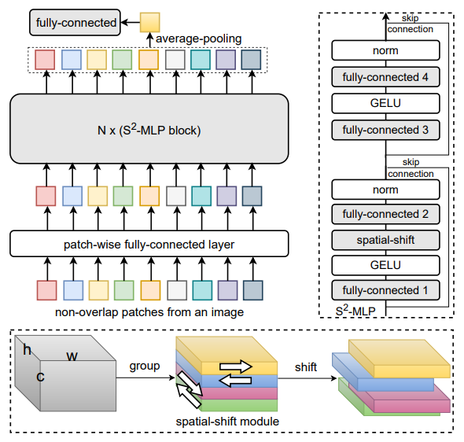
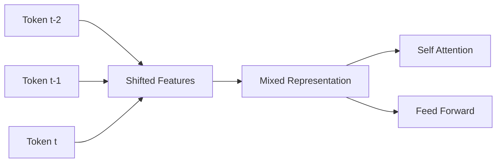
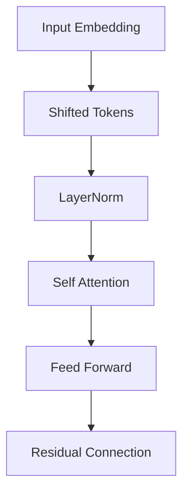

# Shifted Tokens (Time-Mixing)

> **A Lightweight Temporal Mixing Mechanism for Transformer Architectures**

<p align="center"> 
  
</p> 

---

## 1. Introduction

**Shifted Tokens**, hay còn gọi là **Time-Mixing**, là một kỹ thuật tăng cường khả năng mô hình hóa thông tin tuần tự của Transformer bằng cách dịch chuyển một phần đặc trưng của token theo chiều thời gian trước khi đưa vào Attention hoặc Feed Forward Network (FFN).

Ý tưởng cốt lõi là đưa thông tin của token trước đó trực tiếp vào biểu diễn của token hiện tại:

$$
\tilde{x}*t = \left[ x_t^{(0)}, x*{t-1}^{(1)}, x_{t-2}^{(2)}, \dots, x_{t-s}^{(s)} \right].
$$

Phương pháp này cung cấp một **temporal inductive bias** mà không làm thay đổi độ phức tạp tính toán của Self-Attention.

---

## 2. Motivation

Trong Transformer chuẩn:

$$
Q_t = W_Q x_t,
$$

$$
K_t = W_K x_t,
$$

$$
V_t = W_V x_t.
$$

Toàn bộ phép biến đổi bắt đầu từ chính token hiện tại (x_t). Do đó, mô hình phải tự học quan hệ giữa:

$$
x_t \quad \text{và} \quad x_{t-1}
$$

chỉ thông qua cơ chế Attention.

Điều này dẫn đến:

* tối ưu khó hơn;
* hội tụ chậm hơn;
* phụ thuộc mạnh vào dữ liệu huấn luyện.

Shifted Tokens bổ sung trực tiếp thông tin lịch sử vào embedding đầu vào, giúp mô hình học phụ thuộc cục bộ hiệu quả hơn.

---

## 3. Mathematical Formulation

Cho ma trận đầu vào:

$$
X \in \mathbb{R}^{L \times d},
$$

trong đó:

* $L$: độ dài chuỗi,
* $d$: số chiều đặc trưng.

Chia chiều đặc trưng thành:

$$
n=s+1
$$

khối:

$$
X= \left[ X^{(0)}, X^{(1)},\dots, X^{(s)} \right].
$$

Mỗi khối được dịch chuyển theo chiều chuỗi:

$$
\tilde{X}^{(i)}= \text{Shift} \left( X^{(i)}, i \right).
$$

Đầu ra cuối cùng:

$$
\tilde{X}= \left[ \tilde{X}^{(0)}, \tilde{X}^{(1)}, \dots, \tilde{X}^{(s)} \right].
$$

---

## 4. Time-Mixing Representation

Đối với token thứ (t):

$$
\tilde{x}*t= \left[ x_t^{(0)}, x*{t-1}^{(1)}, x_{t-2}^{(2)}, \dots, x_{t-s}^{(s)} \right].
$$

Sau đó:

$$
Q_t = W_Q \tilde{x}_t,
$$

$$
K_t = W_K \tilde{x}_t,
$$

$$
V_t = W_V \tilde{x}_t.
$$

Cơ chế Attention không thay đổi:

$$
\mathrm{Attention}(Q,K,V)= \mathrm{softmax} \left( \frac{QK^{\top}} {\sqrt{d}} \right)V.
$$

---

## 5. Shift Operation

### Shift = 1

```text
Token t-1 : [a a a a | b b b b]
Token t   : [c c c c | d d d d]

↓

Token t :
[c c c c | b b b b]
```

Một phần của biểu diễn token hiện tại được thay thế bằng thông tin từ token trước đó.

---

### Shift = 2

```text
chunk 0 → token t
chunk 1 → token t-1
chunk 2 → token t-2
```

---

## 6. Architecture Overview



---

## 7. Algorithm

### Pseudocode

```python
def shift_tokens(x, shifts=1):
    chunks = split(x, shifts + 1)

    outputs = []

    for i, c in enumerate(chunks):
        outputs.append(shift(c, i))

    return concat(outputs)
```

---

## 8. Computational Complexity

Shifted Tokens chỉ thực hiện:

* indexing;
* tensor slicing;
* memory copy.

Do đó:

$$
\text{Time Complexity}= O(Ld),
$$

$$
\text{Memory Complexity}= O(1).
$$

Không làm thay đổi độ phức tạp của Self-Attention:

$$
O(L^2d).
$$

---

## 9. Why Does It Improve Convergence?

### 9.1 Temporal Inductive Bias

Shifted Tokens giả định rằng:

$$
x_{t-1} \rightarrow x_t
$$

là mối quan hệ quan trọng trong dữ liệu tuần tự.

Điều này làm giảm không gian tìm kiếm của quá trình tối ưu.

---

### 9.2 Shorter Gradient Path

Transformer chuẩn:

```text
x(t-1)
   ↓
Attention
   ↓
x(t)
```

Shifted Tokens:

```text
x(t-1)
   ↓
Concatenation
   ↓
x(t)
```

Gradient có đường truyền ngắn hơn, giúp:

* tăng tốc hội tụ;
* học phụ thuộc cục bộ hiệu quả hơn.

---

### 9.3 Approximation of Recurrence

Shifted Tokens gần giống một RNN:

$$
h_t= f(x_t,h_{t-1}),
$$

nhưng:

* không có hidden state;
* không cần tính toán tuần tự;
* vẫn hoàn toàn song song.

---

## 10. Relationship with RWKV

RWKV sử dụng:

$$
x_k= x_t \odot \mu + x_{t-1}\odot(1-\mu).
$$

Shifted Tokens có thể xem như trường hợp rời rạc:

$$
\mu \in {0,1}.
$$

Do đó, Shifted Tokens là một dạng **hard time-mixing**, trong khi RWKV sử dụng **learnable time-mixing**.

---

## 11. Relationship with Positional Encoding

Shifted Tokens không thay thế:

* Relative Position Bias;
* RoPE;
* ALiBi.

Nó chỉ bổ sung thêm thông tin quá khứ trực tiếp vào embedding trước khi Attention diễn ra.

---

## 12. Empirical Observations

Theo các thực nghiệm trong `x-transformers`:

### Character-level Language Modeling

* cải thiện hội tụ đáng kể;
* giảm perplexity.

### BPE Tokenization

* lợi ích giảm đáng kể.

### BPE + RoPE

* gần như không có cải thiện.

### Shift > 1

Khi:

$$
d_i= \frac{d}{s+1}
$$

quá nhỏ, khả năng biểu diễn bị suy giảm.

Do đó, khuyến nghị:

```python
shift_tokens = 1
```

đối với phần lớn các bài toán NLP.

---

## 13. Overall Architecture



---

## 14. Summary

| Property                 | Shifted Tokens  |
| ------------------------ | --------------- |
| Additional Parameters    | 0               |
| Additional FLOPs         | Negligible      |
| Parallelizable           | Yes             |
| Temporal Bias            | Yes             |
| Recurrence Approximation | Yes             |
| Character-level LM       | Effective       |
| BPE + RoPE               | Limited Benefit |
| Time Complexity          | (O(Ld))         |

---

# References

```bibtex
@misc{wang2024xtransformers,
  author = {Phil Wang},
  title = {x-transformers},
  year = {2024},
  howpublished = {\url{https://github.com/lucidrains/x-transformers}}
}
```

```bibtex
@misc{blinkdl2023rwkv,
  author = {BlinkDL},
  title = {RWKV-LM},
  year = {2023},
  howpublished = {\url{https://github.com/BlinkDL/RWKV-LM}}
}
```

```bibtex
@article{elnouby2021tokenshift,
  title={Token Shift Transformer for Vision},
  author={El-Nouby, Alaaeldin and Touvron, Hugo and Caron, Mathilde and others},
  journal={arXiv preprint arXiv:2106.07477},
  year={2021}
}
```

```bibtex
@article{peng2023rwkv,
  title={RWKV: Reinventing RNNs for the Transformer Era},
  author={Peng, Bo and others},
  journal={Findings of EMNLP},
  year={2023}
}
```
