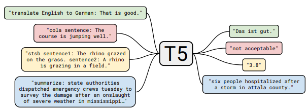

# T5's Simplified Relative Positional Encoding

> Relative Position Bias introduced in **Exploring the Limits of Transfer Learning with a Unified Text-to-Text Transformer (T5)**.

**Paper:** https://arxiv.org/pdf/1910.10683
**Implementation:** https://github.com/lucidrains/x-transformers


<p align="center">
  
</p>

---

# 1. Motivation

Transformer ban đầu sử dụng **Absolute Positional Encoding**:

$$
x_i = e_i + p_i
$$

trong đó:

* $e_i$ là token embedding.
* $p_i$ là positional embedding.

Phương pháp này có một số hạn chế:

1. Không biểu diễn trực tiếp khoảng cách tương đối giữa hai token.
2. Khả năng ngoại suy đối với chuỗi dài kém.
3. Thông tin vị trí chỉ được thêm một lần tại tầng đầu tiên.
4. Quan hệ ngữ nghĩa trong ngôn ngữ thường phụ thuộc vào:

$$
j-i
$$

thay vì vị trí tuyệt đối:

$$
(i,j)
$$

T5 đề xuất một cơ chế đơn giản hơn:

> Đưa thông tin vị trí trực tiếp vào ma trận attention thông qua một **learnable bias**.

---

# 2. Từ Self-Attention đến Relative Position Bias

Self-Attention chuẩn:

$$
Q=XW_Q,\qquad K=XW_K,\qquad V=XW_V
$$

Attention logits:

$$
A_{ij}= \frac{Q_iK_j^\top} {\sqrt{d_k}}
$$

Attention:

$$
\text{Attention}(Q,K,V)= \text{softmax}(A)V
$$

---

## Ý tưởng của T5

T5 không thay đổi:

* Query
* Key
* Value

mà chỉ cộng thêm một bias:

$$
B_{ij}
$$

vào attention logits:

$$
A_{ij}= \frac{Q_iK_j^\top} {\sqrt{d_k}} + B_{ij}
$$

sau đó:

$$
\text{Attention}= \text{softmax}(A)V
$$

---

# 3. Relative Position Bias

Bias phụ thuộc vào khoảng cách tương đối:

$$
r=j-i
$$

và:

$$
B_{ij}=b(r)
$$

trong đó:

$$
b:\mathbb Z\rightarrow \mathbb R
$$

là hàm được học.

---

# Minh họa

```text
Tokens

x1 ---- x2 ---- x3 ---- x4 ---- x5

Relative distance matrix

      1   2   3   4   5
1     0   1   2   3   4
2    -1   0   1   2   3
3    -2  -1   0   1   2
4    -3  -2  -1   0   1
5    -4  -3  -2  -1   0

distance
    ↓
bucket()
    ↓
lookup bias
    ↓
add to attention logits
```

---

# 4. Relative Position Bucket

Nếu học riêng cho mọi khoảng cách:

$$
r\in[-L,L]
$$

thì số tham số là:

$$
2L-1
$$

Điều này không hiệu quả với chuỗi dài.

T5 sử dụng:

## Relative Position Bucketing

```text
distance:

0
±1
±2
±3
±4
±5~6
±7~10
±11~15
±16~31
±32~63
...
```

Khoảng cách gần:

* độ phân giải cao.

Khoảng cách xa:

* logarithmic resolution.

---

Ta định nghĩa:

$$
r \rightarrow bucket(r)
$$

và:

$$
B_{ij}= E_{bucket(r)}
$$

với:

$$
E\in\mathbb R^{N_{bucket}}
$$

là bảng tham số học được.

---

# 5. Attention Equation của T5

Attention logits:

$$
A_{ij}= \frac{Q_iK_j^\top} {\sqrt{d_k}} + E_{bucket(j-i)}
$$

Attention output:

$$
Y = \text{softmax}(A)V
$$

---

# Kiến trúc tổng quát

```text
QKᵀ
 │
 ▼
Scale by √dk
 │
 ▼
+ Relative Position Bias
 │
 ▼
Softmax
 │
 ▼
Multiply V
 │
 ▼
Output
```

---

# 6. Multi-Head Relative Bias

Trong T5, mỗi attention head có bias riêng.

Giả sử:

$$
H
$$

attention heads.

Ta có:

$$
B \in \mathbb R^{H\times N_{bucket}}
$$

Head thứ $h$:

$$
A_{ij}^{(h)}= \frac{Q_i^{(h)}K_j^{(h)\top}} {\sqrt{d_k}} + B_h(bucket(j-i))
$$

---

```text
Head 1 → Bias Table 1
Head 2 → Bias Table 2
Head 3 → Bias Table 3
...
Head H → Bias Table H
```

Mỗi head có thể học:

* local dependency;
* long-range dependency;
* syntactic dependency;
* semantic dependency.

---

# 7. Shared Across Layers

Khác với nhiều phương pháp positional encoding khác, T5 chia sẻ cùng một bias table cho toàn bộ mạng.

```text
Layer 1
    │
    ├── Shared Relative Bias Table
Layer 2
    │
    ├── Shared Relative Bias Table
Layer 3
    │
    ├── Shared Relative Bias Table
...
Layer N
```

---

## Lợi ích

### Giảm số tham số

Nếu transformer có:

* depth = $D$

thì không cần:

$$
D\times N_{bucket}
$$

tham số.

### Tính nhất quán

Mọi tầng attention học cùng một khái niệm:

* gần;
* xa;
* bên trái;
* bên phải.

---

# 8. Độ phức tạp tính toán

Self-Attention:

$$
O(n^2d)
$$

Relative Position Bias:

$$
O(n^2)
$$

chỉ bao gồm:

* lookup;
* addition.

Không phát sinh:

* projection;
* matrix multiplication.

Chi phí tăng thêm gần như không đáng kể.

---

# 9. So sánh với Absolute Positional Encoding

| Property               | Absolute PE | T5 Relative Bias |
| ---------------------- | ----------- | ---------------- |
| Relative information   | ❌           | ✅                |
| Extrapolation          | Kém         | Tốt hơn          |
| Translation invariant  | ❌           | ✅                |
| Added to every layer   | ❌           | ✅                |
| Computational overhead | Thấp        | Rất thấp         |
| Long-context modeling  | Trung bình  | Tốt              |

---

# 10. So sánh với Shaw et al. (2018)

Shaw Relative Attention:

$$
Q_i(K_j+a_{ij})^\top
$$

hoặc:

$$
(Q_i+b_{ij})K_j^\top
$$

đòi hỏi:

* additional tensors;
* additional matrix multiplications.

T5:

$$
Q_iK_j^\top + B_{ij}
$$

đơn giản hơn đáng kể.

---

# 11. Ý nghĩa khoa học

Nhiều hiện tượng ngôn ngữ có tính **translation invariant**:

$$
f(i,j) \approx f(j-i)
$$

Ví dụ:

* subject–verb dependency;
* local syntactic structure;
* phrase boundary.

Do đó, mô hình hóa:

$$
j-i
$$

hiệu quả hơn việc học:

$$
(i,j)
$$

riêng rẽ.

---

# 12. Tích hợp trong x-transformers

```python
from x_transformers import TransformerWrapper, Decoder

model = TransformerWrapper(
    num_tokens = 20000,
    max_seq_len = 1024,
    attn_layers = Decoder(
        dim = 512,
        depth = 6,
        heads = 8,
        rel_pos_bias = True
    )
)
```

Khi:

```python
rel_pos_bias = True
```

mỗi attention layer thực hiện:

```text
QKᵀ
 ↓
Scale
 ↓
+ T5 Relative Position Bias
 ↓
Softmax
 ↓
Attention
```

---

# 13. Vai trò trong sự phát triển của x-transformers

T5 Relative Position Bias trở thành nền tảng cho:

* ALiBi;
* RoPE;
* XPos;
* Dynamic Position Bias;
* Continuous Relative Position Encoding.

Nó chứng minh rằng:

> Positional information không nhất thiết phải cộng trực tiếp vào embedding, mà có thể được đưa vào attention logits với chi phí gần như bằng không.

---

# Tổng quan tiến hóa

```text
Absolute Position Encoding
            │
            ▼
Shaw Relative Attention
            │
            ▼
T5 Relative Position Bias
            │
            ├── ALiBi
            ├── RoPE
            ├── XPos
            └── Dynamic Position Bias
```

---

# Tóm tắt công thức

Relative distance:

$$
r=j-i
$$

Bucket mapping:

$$
b = bucket(r)
$$

Bias lookup:

$$
B_{ij}=E_b
$$

Attention logits:

$$
A_{ij}= \frac{Q_iK_j^\top} {\sqrt{d_k}} + B_{ij}
$$

Final attention:

$$
Y= \text{softmax}(A)V
$$

---

# References

```bibtex
@article{raffel2020exploring,
  title={Exploring the Limits of Transfer Learning with a Unified Text-to-Text Transformer},
  author={Raffel, Colin and Shazeer, Noam and Roberts, Adam and Lee, Katherine and Narang, Sharan and Matena, Michael and Zhou, Yanqi and Li, Wei and Liu, Peter J.},
  journal={Journal of Machine Learning Research},
  volume={21},
  number={140},
  pages={1--67},
  year={2020}
}

@inproceedings{shaw2018self,
  title={Self-Attention with Relative Position Representations},
  author={Shaw, Peter and Uszkoreit, Jakob and Vaswani, Ashish},
  booktitle={NAACL},
  year={2018}
}

@misc{xtransformers,
  author = {Phil Wang},
  title = {x-transformers},
  howpublished = {\url{https://github.com/lucidrains/x-transformers}},
  year = {2024}
}
```
