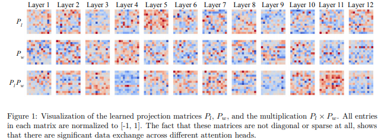

# Talking-Heads Attention

> *Talking-Heads Attention: Enhanced Information Exchange Across Attention Heads*

<p align="center">
  
</p>

## Mục lục

* Tổng quan
* Động cơ nghiên cứu
* Giới hạn của Multi-Head Attention
* Kiến trúc Talking-Heads Attention
* Cơ chế Pre-Softmax Head Mixing
* Cơ chế Post-Softmax Head Mixing
* Phân tích toán học
* Thuật toán
* Diễn giải dưới góc nhìn tuyến tính
* Độ phức tạp tính toán
* Vai trò trong X-Transformers
* Ưu điểm
* Hạn chế
* Kết luận
* Tài liệu tham khảo

---

# 1. Tổng quan

Talking-Heads Attention được đề xuất bởi Noam Shazeer trong công trình:

> **Talking-Heads Attention** (2020)

Mục tiêu của kiến trúc là mở rộng khả năng biểu diễn của Multi-Head Attention bằng cách cho phép các attention heads trao đổi thông tin trực tiếp với nhau trong quá trình tính attention.

Trong Transformer chuẩn, mỗi head được xây dựng như một không gian attention riêng biệt:

$$
\text{Head}_i= \text{Attention}(Q_i,K_i,V_i)
$$

các head chỉ được kết hợp ở cuối tầng attention thông qua phép nối (concatenation):

$$
\text{Concat}(H_1,H_2,\dots,H_n)
$$

Talking-Heads thay đổi giả định này bằng cách đưa vào các phép biến đổi tuyến tính trên chiều head trước và sau hàm Softmax.

---

# 2. Động cơ nghiên cứu

## 2.1 Giả định độc lập giữa các head

Transformer giả định rằng:

$$
H_i \perp H_j
$$

với:

$$
i \neq j
$$

nghĩa là mỗi head học một dạng quan hệ riêng.

Tuy nhiên trên thực tế:

* Nhiều head học các mẫu tương tự nhau.
* Xuất hiện hiện tượng dư thừa biểu diễn.
* Một số head gần như không đóng góp vào kết quả cuối cùng.
* Các head không thể phối hợp trực tiếp trong quá trình hình thành attention distribution.

Điều này dẫn đến lãng phí năng lực biểu diễn của mô hình.

---

# 3. Giới hạn của Multi-Head Attention

Kiến trúc attention chuẩn:

```text
Head 1 ─────┐
Head 2 ─────┤
Head 3 ─────┤
Head 4 ─────┤
            ▼
         Concat
            ▼
        Output
```

Trong quá trình attention:

```text
Head 1  (Independent)
Head 2  (Independent)
Head 3  (Independent)
Head 4  (Independent)
```

Mỗi head chỉ quan sát:

$$
Q_i,K_i,V_i
$$

của riêng nó.

Không tồn tại cơ chế:

$$
Head_i \rightarrow Head_j
$$

trong khi attention đang được tính toán.

---

# 4. Kiến trúc Talking-Heads Attention

Talking-Heads bổ sung hai phép biến đổi tuyến tính:

1. Pre-Softmax Head Mixing
2. Post-Softmax Head Mixing

```text
          Attention Logits
                  │
                  ▼
      ┌─────────────────────┐
      │ Pre-Softmax Mixing  │
      └─────────────────────┘
                  │
                  ▼
              Softmax
                  │
                  ▼
      ┌─────────────────────┐
      │ Post-Softmax Mixing │
      └─────────────────────┘
                  │
                  ▼
           Attention Output
```

Tư tưởng cốt lõi:

$$
\text{Head Communication}
$$

thay cho

$$
\text{Head Isolation}
$$

---

# 5. Attention chuẩn

Cho:

$$
Q,K,V \in \mathbb{R}^{L\times d}
$$

với:

* $L$: độ dài chuỗi
* $d$: embedding dimension

Attention logits:

$$
A_h= Q_hK_h^T
$$

cho mọi head:

$$
A \in \mathbb{R}^{H\times L\times L}
$$

Attention distribution:

$$
P_h= \text{Softmax}(A_h)
$$

Output:

$$
O_h= P_hV_h
$$

---

# 6. Pre-Softmax Head Mixing

## 6.1 Ý tưởng

Thay vì đưa logits trực tiếp vào Softmax:

$$
A_h \rightarrow \text{Softmax}
$$

Talking-Heads thực hiện trộn thông tin giữa các head.

---

## 6.2 Ma trận trộn

Học một ma trận:

$$
W_{\text{pre}} \in \mathbb{R}^{H\times H}
$$

Trong đó:

$$
H = \text{số lượng heads}
$$

---

## 6.3 Công thức

Với mỗi cặp token:

$$
(i,j)
$$

thực hiện:

$$
\widetilde A_{hij}= \sum_{g=1}^{H} W_{\text{pre}}(h,g) A_{gij}
$$

hay dạng tensor:

$$
\widetilde A= W_{\text{pre}}A
$$

---

## 6.4 Trực quan

```text
Before

Head1 ───── Logits1
Head2 ───── Logits2
Head3 ───── Logits3
Head4 ───── Logits4


After

Logits1 = a11 H1 + a12 H2 + a13 H3 + a14 H4
Logits2 = a21 H1 + a22 H2 + a23 H3 + a24 H4
Logits3 = a31 H1 + a32 H2 + a33 H3 + a34 H4
Logits4 = a41 H1 + a42 H2 + a43 H3 + a44 H4
```

Mỗi head mới trở thành tổ hợp tuyến tính của toàn bộ tập head.

---

# 7. Softmax

Sau khi trộn:

$$
\widetilde A
$$

attention distribution được tính:

$$
P_{hij}= \frac{ \exp(\widetilde A_{hij}) }{ \sum_k \exp(\widetilde A_{hik}) }
$$

Bước này chuyển attention logits thành xác suất.

---

# 8. Post-Softmax Head Mixing

## 8.1 Động cơ

Sau Softmax:

$$
P_h
$$

đã chứa attention pattern hoàn chỉnh.

Talking-Heads tiếp tục cho phép các head trao đổi thông tin.

---

## 8.2 Ma trận

Học:

$$
W_{\text{post}} \in \mathbb{R}^{H\times H}
$$

---

## 8.3 Công thức

$$
\widetilde P_{hij}= \sum_g W_{\text{post}}(h,g) P_{gij}
$$

hay:

$$
\widetilde P= W_{\text{post}}P
$$

---

## 8.4 Trực quan

```text
Attention Maps

Head1 ───── P1
Head2 ───── P2
Head3 ───── P3
Head4 ───── P4


Linear Mixing


Head1' = b11P1+b12P2+b13P3+b14P4
Head2' = b21P1+b22P2+b23P3+b24P4
Head3' = b31P1+b32P2+b33P3+b34P4
Head4' = b41P1+b42P2+b43P3+b44P4
```

Các attention maps trở thành các tổ hợp tuyến tính của nhau.

---

# 9. Value Aggregation

Sau bước Post-Softmax:

$$
\widetilde P
$$

output được tính:

$$
O_h= \widetilde P_hV_h
$$

sau đó:

$$
O= \text{Concat}(O_1,\dots,O_H) W_O
$$

---

# 10. Luồng dữ liệu hoàn chỉnh

```text
Q,K,V
  │
  ▼

QKᵀ
  │
  ▼

Attention Logits
  │
  ▼

Pre-Softmax Head Mixing
  │
  ▼

Softmax
  │
  ▼

Post-Softmax Head Mixing
  │
  ▼

Attention × V
  │
  ▼

Concat Heads
  │
  ▼

Output Projection
  │
  ▼

Layer Output
```

---

# 11. Diễn giải tuyến tính

Talking-Heads thực chất tạo thêm hai phép chiếu trong không gian head.

Transformer chuẩn:

$$
\mathbb{R}^{H} \rightarrow \mathbb{R}^{H}
$$

là phép đồng nhất.

Talking-Heads:

$$
\mathbb{R}^{H} \xrightarrow{W_{pre}} \mathbb{R}^{H} \xrightarrow{\text{Softmax}} \mathbb{R}^{H} \xrightarrow{W_{post}} \mathbb{R}^{H}
$$

Điều này làm tăng đáng kể khả năng biểu diễn của attention.

---

# 12. Thuật toán

```text
Input:
    Q,K,V

1. Compute logits

       A = QKᵀ

2. Pre-softmax head mixing

       A = Wpre(A)

3. Softmax

       P = Softmax(A)

4. Post-softmax head mixing

       P = Wpost(P)

5. Aggregate values

       O = PV

6. Concatenate heads

7. Output projection

Return O
```

---

# 13. Độ phức tạp tính toán

Với:

$$
H = \text{number of heads}
$$

Talking-Heads bổ sung:

$$
W_{\text{pre}} \in \mathbb{R}^{H\times H}
$$

và

$$
W_{\text{post}} \in \mathbb{R}^{H\times H}
$$

Tổng tham số bổ sung:

$$
2H^2
$$

Ví dụ:

$$
H=16
$$

thì:

$$
2\times16^2 = 512
$$

tham số.

Chi phí tham số rất nhỏ so với attention projection matrices.

---

# 14. Vai trò trong X-Transformers

Trong x-transformers:

```python
Decoder(
    dim = 512,
    depth = 6,
    heads = 8,

    attn_pre_talking_heads = True,  
    attn_post_talking_heads = True  
)
```

### Pre-Talking Heads

```python
attn_pre_talking_heads = True
```

kích hoạt:

$$
W_{\text{pre}}
$$

### Post-Talking Heads

```python
attn_post_talking_heads = True
```

kích hoạt:

$$
W_{\text{post}}
$$

Thông thường hai cơ chế được sử dụng đồng thời.

---

# 15. Ưu điểm

## Tăng tương tác giữa các head

Cho phép trao đổi thông tin ngay trong quá trình attention.

## Giảm dư thừa

Các head có thể học bổ trợ thay vì lặp lại.

## Tăng năng lực biểu diễn

Attention distribution được hình thành từ thông tin tập thể.

## Tương thích với Transformer

Không yêu cầu thay đổi cấu trúc tổng thể.

---

# 16. Hạn chế

## Tăng FLOPs

Phát sinh các phép biến đổi:

$$
H\times H
$$

trên attention tensor.

## Tăng bộ nhớ

Cần lưu attention maps phục vụ head mixing.

## Hiệu quả phụ thuộc quy mô

Lợi ích thường rõ hơn khi:

* số head lớn
* mô hình lớn
* dữ liệu huấn luyện lớn

---

# 17. Kết luận

Talking-Heads Attention mở rộng Multi-Head Attention bằng cách đưa vào hai phép biến đổi tuyến tính trên chiều head trước và sau Softmax. Kiến trúc này phá vỡ giả định độc lập giữa các attention heads, cho phép hình thành cơ chế cộng tác nội tại giữa các head trong quá trình xây dựng attention distribution.

Về mặt lý thuyết, Talking-Heads chuyển Transformer từ mô hình **Independent Heads** sang **Collaborative Heads**, tạo nền tảng cho nhiều hướng nghiên cứu hiện đại trong hệ sinh thái X-Transformers như Dynamic Head Routing, Adaptive Attention, Mixture-of-Heads và Explicit Sparse Attention.

---

# Tài liệu tham khảo

```bibtex
@article{shazeer2020talkingheads,
  title={Talking-Heads Attention},
  author={Shazeer, Noam},
  journal={arXiv preprint arXiv:2003.02436},
  year={2020}
}
```

```bibtex
@inproceedings{vaswani2017attention,
  title={Attention Is All You Need},
  author={Vaswani, Ashish and Shazeer, Noam and Parmar, Niki and
          Uszkoreit, Jakob and Jones, Llion and Gomez, Aidan and
          Kaiser, Lukasz and Polosukhin, Illia},
  booktitle={NeurIPS},
  year={2017}
}
```

* Shazeer, N. (2020). *Talking-Heads Attention*. arXiv:2003.02436.
* Vaswani et al. (2017). *Attention Is All You Need*.
* lucidrains. *x-transformers repository*.

# Thư viện tham khảo
```Python
import torch
from x_transformers import TransformerWrapper, Decoder

model = TransformerWrapper(
    num_tokens = 20000,
    max_seq_len = 1024,
    attn_layers = Decoder(
        dim = 512,
        depth = 6,
        heads = 8,
        attn_pre_talking_heads = True,  # linear combination across pre-softmax attn logits across heads
        attn_post_talking_heads = True  # linear combination across post-softmax attn across heads
    )
)
```