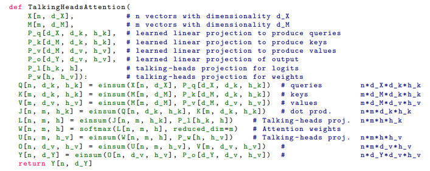

# Phụ lục A. Giải thích chi tiết thuật toán Talking-Heads Attention

<p align="center">
  
</p>

---

# Mục tiêu của phụ lục

Trong bài báo *Talking-Heads Attention* (2020), tác giả sử dụng dạng pseudo-code dựa trên phép toán:

```python
einsum(...)
```

thay vì biểu diễn bằng công thức ma trận truyền thống.

Điều này giúp mô tả các phép toán attention một cách tổng quát nhưng gây khó khăn cho người đọc khi lần đầu tiếp cận.

Phụ lục này giải thích:

* Ý nghĩa của từng tensor
* Ý nghĩa của từng chiều (dimension)
* Cơ chế hoạt động của `einsum`
* Quan hệ giữa Dot-Product Attention, Multi-Head Attention và Talking-Heads Attention
* Phân tích độ phức tạp tính toán

---

# 1. Giải thích các ký hiệu

## 1.1 Kích thước dữ liệu

| Ký hiệu | Ý nghĩa                |
| ------- | ---------------------- |
| $n$     | số lượng query tokens  |
| $m$     | số lượng memory tokens |
| $d_X$   | chiều vector đầu vào   |
| $d_M$   | chiều vector bộ nhớ    |
| $d_k$   | chiều key/query        |
| $d_v$   | chiều value            |
| $d_Y$   | chiều output           |
| $h$     | số attention heads     |
| $h_k$   | số heads của query/key |
| $h_v$   | số heads của value     |

---

## 1.2 Tensor ký hiệu

### Input

$$
X \in \mathbb R^{n\times d_X}
$$

Tập các query vectors.

```text
X

Token1 ─────────────► vector dX
Token2 ─────────────► vector dX
...
Tokenn ─────────────► vector dX
```

---

### Memory

$$
M \in \mathbb R^{m\times d_M}
$$

Tập các vectors được truy vấn.

```text
M

Memory1 ───────────► vector dM
Memory2 ───────────► vector dM
...
Memorym ───────────► vector dM
```

Trong Self-Attention:

$$
X=M
$$

Trong Cross-Attention:

$$
X \neq M
$$

---

# 2. Hiểu chính xác phép einsum

## 2.1 Einsum là gì?

`einsum` là viết tắt của:

> Einstein Summation Convention

Một ký hiệu toán học cho phép mô tả phép nhân tensor và phép cộng thu gọn chỉ bằng tên các chiều.

Ví dụ:

```python
einsum(
    X[n,d],
    M[m,d]
)
```

có nghĩa:

$$
L_{ij}= \sum_{k} X_{ik} M_{jk}
$$

Đây chính là:

$$
L = XM^T
$$

---

## 2.2 Ví dụ trực quan

```text
Query

q = [1,2,3]

Memory

m1 = [2,1,0]
m2 = [1,3,1]
```

Dot-product:

$$
q\cdot m_1= 1\times2+2\times1+3\times0 = 4
$$

$$
q\cdot m_2 = 1\times1+2\times3+3\times1 = 10
$$

Logits:

$$
[4,10]
$$

---

# 3. Dot-Product Attention

---

## 3.1 Bước 1: Tính logits

Pseudo-code:

```python
L[n,m] = einsum(
    X[n,d],
    M[m,d]
)
```

Tương đương:

$$
L=XM^T
$$

Kết quả:

$$
L \in \mathbb R^{n\times m}
$$

---

### Trực quan

```text
           Memory Tokens

           m1   m2   m3

Query q1   4    7    2
Query q2   8    1    5
Query q3   6    3    4
```

Mỗi phần tử:

$$
L_{ij}
$$

đại diện cho độ tương đồng giữa:

* Query $i$
* Memory $j$

---

## 3.2 Bước 2: Softmax

```python
W = softmax(L)
```

Theo chiều:

```text
m
```

tức:

$$
W_{ij}= \frac{ e^{L_{ij}} } { \sum_j e^{L_{ij}} }
$$

---

### Trực quan

```text
Logits

[2,5,1]

Softmax

[0.046
 0.936
 0.017]
```

Tổng luôn bằng:

$$
1
$$

---

## 3.3 Bước 3: Weighted Sum

```python
Y = einsum(W,M)
```

Tương đương:

$$
Y_i= \sum_j W_{ij} M_j
$$

---

### Ý nghĩa

Attention thực chất là:

> Trung bình có trọng số của các memory vectors.

---

# 4. Dot-Product Attention With Projections

Đây là phiên bản được sử dụng trong Transformer.

---

## 4.1 Query Projection

```python
Q = XP_q
```

$$
Q = XP_q
$$

---

## 4.2 Key Projection

```python
K = MP_k
```

$$
K = MP_k
$$

---

## 4.3 Value Projection

```python
V = MP_v
```

$$
V = MP_v
$$

---

## Vì sao cần projection?

Nếu:

$$
d_X=4096
$$

thì attention cost rất lớn.

Transformer giảm xuống:

$$
d_k=64
$$

hoặc

$$
128
$$

để giảm:

$$
QK^T
$$

cost.

---

# 5. Multi-Head Attention

---

## Ý tưởng

Thay vì một attention:

```text
Attention
```

ta chạy nhiều attention song song:

```text
Head1
Head2
Head3
Head4
...
```

---

## Kiến trúc

```text
                  Input

                     │

     ┌───────────────┼───────────────┐

     ▼               ▼               ▼

   Head1           Head2           Head3

     ▼               ▼               ▼

     └───────────────┼───────────────┘

                     ▼

                 Output
```

---

## Tensor

Thêm chiều:

$$
h
$$

Ví dụ:

$$
Q \in \mathbb R^{n\times d_k\times h}
$$

---

### Ý nghĩa

Head thứ nhất:

$$
Q[:,:,1]
$$

Head thứ hai:

$$
Q[:,:,2]
$$

...

Mỗi head học một attention space riêng.

---

# 6. Hạn chế của Multi-Head Attention

Trong toàn bộ thuật toán:

```text
Head1
Head2
Head3
Head4
```

không trao đổi thông tin.

```text
Head1 ────────┐
Head2 ────────┤
Head3 ────────┤
Head4 ────────┘
```

Chỉ tới cuối cùng mới được cộng lại.

Điều này chính là vấn đề mà Talking-Heads muốn giải quyết.

---

# 7. Talking-Heads Attention

---

## Ý tưởng trung tâm

Cho phép:

```text
Head_i
      ↕
Head_j
```

trao đổi thông tin trước và sau Softmax.

---

# 8. Talking-Heads Projection P_l

---

## Vị trí

```text
QKᵀ

  │

  ▼

P_l

  │

  ▼

Softmax
```

---

## Công thức

Ban đầu:

$$
J \in \mathbb R^{n\times m\times h_k}
$$

Sau projection:

$$
L = JP_l
$$

với:

$$
P_l \in \mathbb R^{h_k\times h}
$$

---

### Trực quan

```text
Before

Head1 logits
Head2 logits
Head3 logits
Head4 logits
```

```text
After

NewHead1 = a11 H1 + a12 H2 + a13 H3 + a14 H4

NewHead2 = a21 H1 + a22 H2 + a23 H3 + a24 H4
```

---

## Ý nghĩa

Các attention logits đã bắt đầu "nói chuyện" với nhau.

Đây là:

> Pre-Softmax Talking

---

# 9. Talking-Heads Projection P_w

---

## Vị trí

```text
Softmax

  │

  ▼

P_w

  │

  ▼

Attention × Value
```

---

## Công thức

$$
U=WP_w
$$

với:

$$
P_w \in \mathbb R^{h\times h_v}
$$

---

### Ý nghĩa

Không chỉ logits trao đổi thông tin.

Ngay cả attention distributions cũng được trộn giữa các heads.

---

# 10. Ba không gian head khác nhau

Talking-Heads sử dụng:

```text
h_k
h
h_v
```

thay vì một:

```text
h
```

duy nhất.

---

## h_k

Dùng cho:

```text
Queries
Keys
```

---

## h

Dùng cho:

```text
Logits
Weights
```

---

## h_v

Dùng cho:

```text
Values
Outputs
```

---

### Trực quan

```text
Queries / Keys

     h_k
      │

      ▼

Talking Heads

      h
      │

      ▼

Values

     h_v
```

Đây là tổng quát hóa mà Multi-Head Attention không có.

---

# 11. Phân tích độ phức tạp

## Multi-Head Attention

Bài báo cho:

$$
h(d_k+d_v) (n d_X + m d_M + n m)
$$

---

### Thành phần

Projection:

$$
n d_X
$$

Keys:

$$
m d_M
$$

Attention Matrix:

$$
n m
$$

Nhân với:

$$
h(d_k+d_v)
$$

cho tất cả heads.

---

# 12. Talking-Heads Complexity

Bài báo cho:

$$
(d_k h_k+d_v h_v)
(n d_X+m d_M+n m)
+
n m h(h_k+h_v)
$$

---

## Thành phần mới

```text
n m h h_k
```

đến từ:

$$
P_l
$$

---

và

```text
n m h h_v
```

đến từ:

$$
P_w
$$

---

## Ý nghĩa

Talking-Heads thêm chi phí:

```text
Head ↔ Head Communication
```

nhưng đổi lại:

* attention mạnh hơn
* biểu diễn phong phú hơn
* giảm hiện tượng head redundancy

---

# 13. Tại sao Talking-Heads hoạt động?

Multi-Head Attention:

```text
Head1
Head2
Head3
Head4

Independent
```

Talking-Heads:

```text
Head1 ←→ Head2
 ↑         ↓
 ↓         ↑
Head3 ←→ Head4
```

Thay vì:

$$
H_i \rightarrow O_i
$$

một cách độc lập,

Talking-Heads học:

$$
O_i= f(H_1,H_2,\dots,H_n)
$$

cho mọi head.

Đây chính là nguồn gốc tên gọi:

> **Talking-Heads Attention**
>
> Các attention heads có khả năng "trò chuyện" với nhau trong quá trình hình thành attention.
