# Transformer-XL Recurrence Overview

> Tổng quan kiến trúc **Transformer-XL Recurrence Mechanism** bằng Mermaid để đưa trực tiếp vào `README.md` trên GitHub.


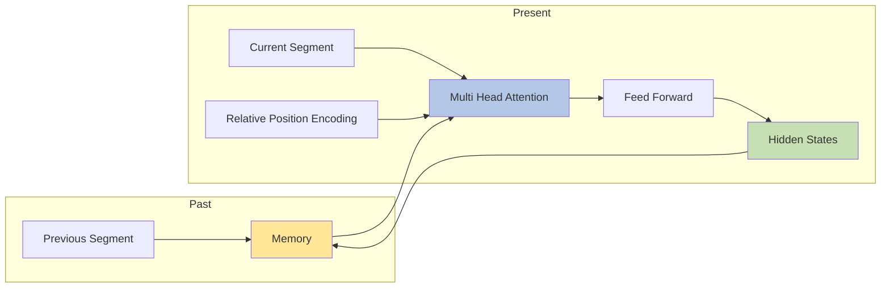

---

# 1. Từ Transformer chuẩn đến Transformer-XL

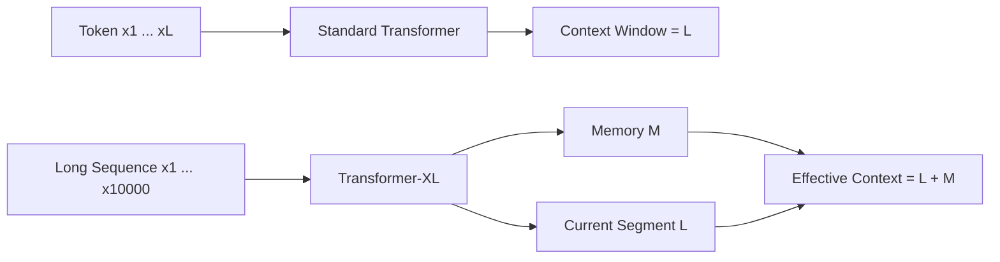

---

# 2. Segment-Level Recurrence

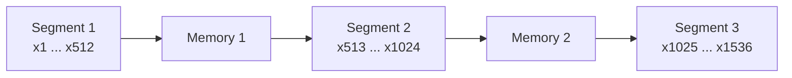

---

# 3. Memory Recurrence Mechanism

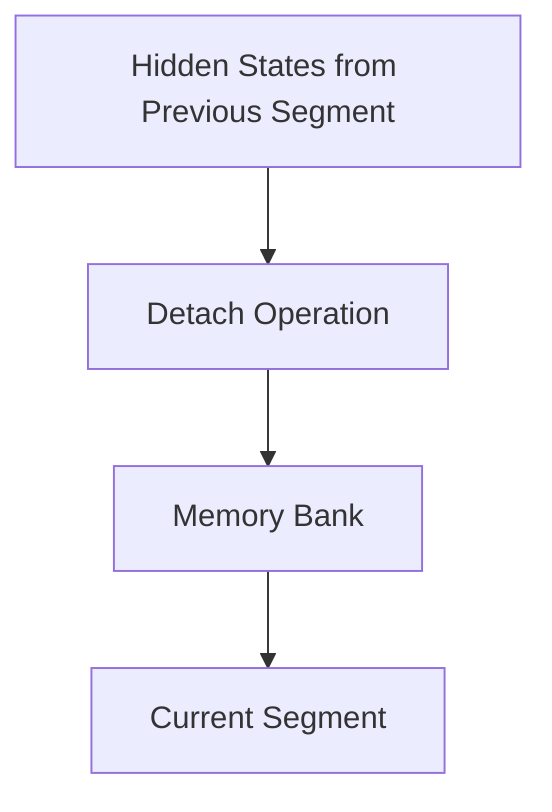

---

# 4. Attention Architecture

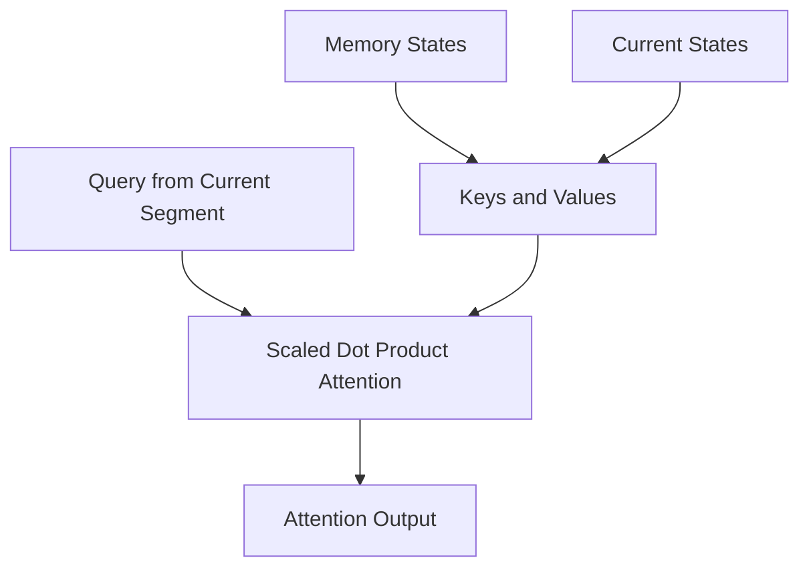

---

# 5. Effective Context Expansion

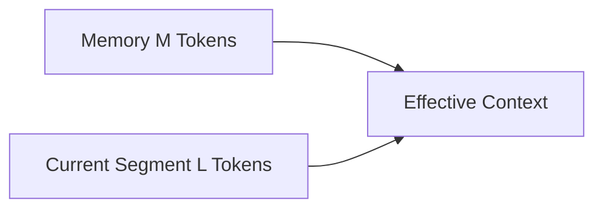

---

# 6. Information Flow Across Segments

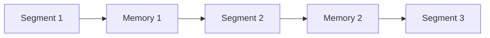

---

# 7. Forward vs Backward Propagation

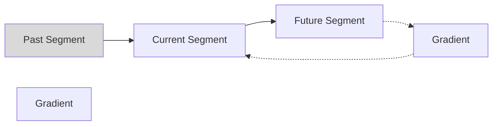

**Lưu ý**

Memory được:

```python
memory = memory.detach()
```

nên gradient không đi xuyên qua các segment cũ.

---

# 8. Relative Positional Encoding

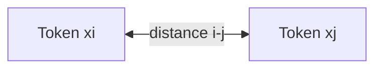

Attention score:

$$
A_{i,j}= q_i^Tk_j + q_i^Tr_{i-j} + u^Tk_j + v^Tr_{i-j}
$$

---

# 9. Training Pipeline

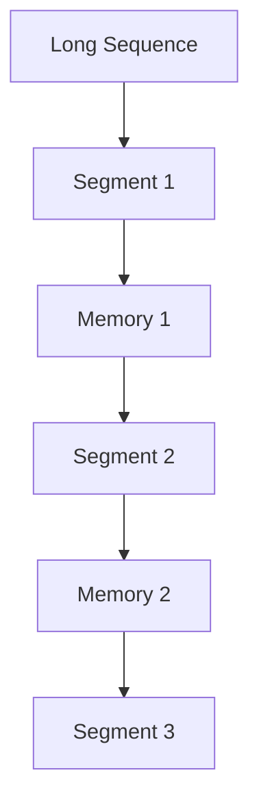

---

# 10. Inference Pipeline

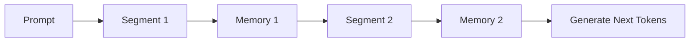

---

# 11. x-transformers Implementation

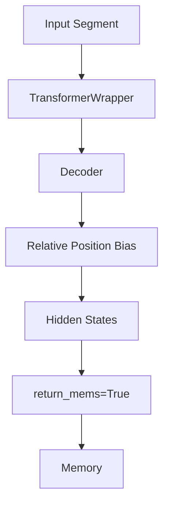

---

# 12. Internal Transformer-XL Block

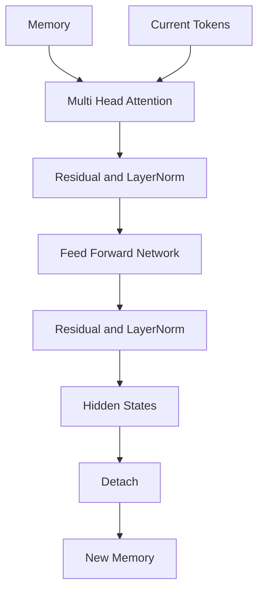

---

# 13. Complete Architecture Overview

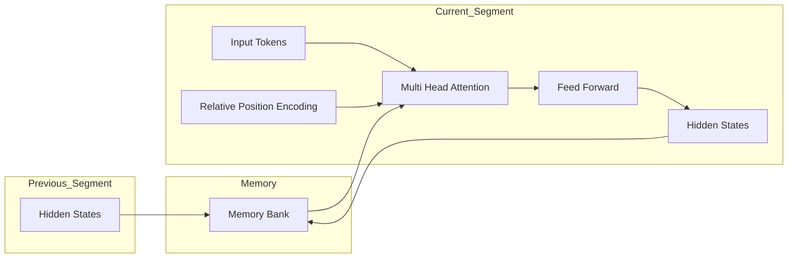

---

# 14. Big Picture

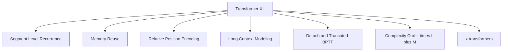

---

# Key Takeaways

```text
Transformer
┌────────────────────┐
│ Context = L        │
└────────────────────┘

Transformer-XL
┌────────────────────┐
│ Memory = M         │
├────────────────────┤
│ Current = L        │
└────────────────────┘

Effective Context = L + M

✓ Segment-Level Recurrence
✓ Memory Reuse
✓ Relative Position Encoding
✓ Long-Range Dependency Modeling
✓ Foundation of Modern Long-Context Transformers
```
