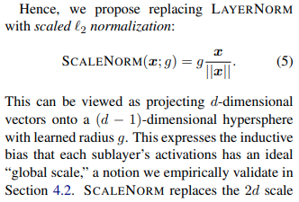

# Transformers Without Tears

> Stable Transformer Training through ScaleNorm, FixNorm and Controlled Initialization

---

<p align="center">
  
</p>

<p align="center">
  <em>Transformers Without Tears proposes that controlling vector norms can replace much of the complexity of Layer Normalization while preserving training stability.</em>
</p>

---

# Mục lục

1. Giới thiệu
2. Động cơ nghiên cứu
3. Hạn chế của Layer Normalization
4. ScaleNorm
5. FixNorm
6. Small Initialization
7. Post-Embedding Normalization
8. Phân tích toán học
9. So sánh các phương pháp chuẩn hóa
10. Ảnh hưởng đến các LLM hiện đại
11. Tích hợp trong x-transformers
12. Pipeline huấn luyện
13. Kết luận
14. Tài liệu tham khảo

---

# 1. Giới thiệu

Transformer nguyên bản sử dụng Layer Normalization như một thành phần bắt buộc nhằm ổn định quá trình huấn luyện.

Trong mỗi Transformer block:

$$
x_{l+1}= LayerNorm \left( x_l + F(x_l) \right)
$$

với

$$
F(x_l)= Attention(x_l) \quad \text{hoặc} \quad FFN (x_l)
$$

LayerNorm giúp:

* Giảm hiện tượng exploding activations
* Ổn định gradient
* Tăng tốc hội tụ

Tuy nhiên nó làm tăng đáng kể chi phí tính toán và độ phức tạp của mô hình.

Bài báo **Transformers Without Tears** đặt câu hỏi:

> Liệu việc ổn định Transformer có thực sự cần tới thống kê mean và variance hay chỉ cần kiểm soát norm của vector?

---

# 2. Động cơ nghiên cứu

LayerNorm thực hiện hai nhiệm vụ:

1. Kiểm soát độ lớn của vector
2. Ổn định gradient

Tác giả nhận thấy rằng:

> Phần quan trọng nhất thực chất là kiểm soát độ lớn của vector.

Do đó thay vì:

$$
\frac{x-\mu}{\sigma}
$$

ta có thể chỉ cần:

$$
\frac{x}{||x||}
$$

để đạt được hiệu quả tương tự.

---

# 3. Hạn chế của Layer Normalization

## Công thức

Cho vector:

$$
x=(x_1,x_2,\ldots,x_d)
$$

LayerNorm tính:

$$
\mu = \frac1d \sum_{i=1}^{d} x_i
$$

$$
\sigma= \sqrt{ \frac1d \sum_{i=1}^{d} (x_i-\mu)^2 }
$$

Sau đó:

$$
LN(x)= \gamma \frac{x-\mu}{\sigma} + \beta
$$

---

## Những hạn chế

### Phụ thuộc toàn bộ vector

Mỗi chiều phải biết:

* Mean
* Variance

của toàn bộ vector.

---

### Tăng chi phí tính toán

Mỗi bước cần:

* Một lần tính mean
* Một lần tính variance
* Một lần chuẩn hóa

---

### Gradient phức tạp

Gradient của từng chiều phụ thuộc vào toàn bộ vector đầu vào.

Điều này làm cho việc phân tích hội tụ trở nên khó khăn.

---

# 4. ScaleNorm

## Ý tưởng

Thay vì chuẩn hóa theo mean và variance, chỉ chuẩn hóa theo độ dài vector.

---

## Công thức

$$
ScaleNorm(x)= g \frac{x}{||x||}
$$

trong đó:

$$
||x||= \sqrt{ \sum_{i=1}^{d} x_i^2 }
$$

và

$$
g
$$

là một scalar học được.

---

## Pipeline

```text
Input Vector x
      │
      ▼

 Compute L2 Norm

      │
      ▼

   x / ||x||

      │
      ▼

 Multiply by g

      │
      ▼

     Output
```

---

## Đặc điểm

ScaleNorm:

* Không dùng mean
* Không dùng variance
* Không cần bias
* Chỉ học một tham số scale

Do đó đơn giản hơn LayerNorm đáng kể.

---

# 5. FixNorm

## Vấn đề

Embedding có độ dài rất khác nhau.

Ví dụ:

```text
Token A  ||e|| = 4

Token B  ||e|| = 11

Token C  ||e|| = 8
```

Điều này làm attention score dao động mạnh.

---

## Giải pháp

Ép mọi embedding có cùng độ dài.

---

## Công thức

$$
\hat e_i= c \frac{e_i} {||e_i||}
$$

với

$$
c
$$

là hằng số cố định.

---

## Minh họa

```text
Before FixNorm

Token A ---- norm = 4
Token B ---- norm = 11
Token C ---- norm = 8

─────────────────────────────

After FixNorm

Token A ---- norm = c
Token B ---- norm = c
Token C ---- norm = c
```

---

## Ý nghĩa

Toàn bộ embedding được đưa lên cùng một hypersphere:

$$
||e_i|| = c
$$

giúp attention ổn định hơn.

---

# 6. Small Initialization

Một phát hiện quan trọng của bài báo là:

> Norm của embedding và norm của trọng số phải được kiểm soát ngay từ đầu.

---

## Vấn đề

Nếu:

$$
W_Q, W_K, W_V
$$

được khởi tạo quá lớn.

Khi đó:

$$
QK^T
$$

sẽ có giá trị rất lớn.

---

## Hệ quả

Softmax bão hòa:

$$
softmax ([20,2,1]) \approx [1,0,0]
$$

Gradient gần như bằng 0.

---

## Giải pháp

Khởi tạo trọng số nhỏ hơn:

$$
W \sim \mathcal N(0,\sigma^2)
$$

với

$$
\sigma \ll 0.02
$$

---

## Liên hệ với RWKV

BlinkDL quan sát rằng:

> Small initialization + L2-normalized embeddings giúp mô hình hội tụ nhanh hơn đáng kể.

---

# 7. Post-Embedding Normalization

Sau này nhiều mô hình cực lớn áp dụng thêm một bước chuẩn hóa ngay sau embedding.

---

## Pipeline

```text
Token IDs
    │
    ▼

Token Embedding
    │
    ▼

Position Embedding
    │
    ▼

Summation
    │
    ▼

LayerNorm
(Post Embedding Norm)
    │
    ▼

Transformer Layers
```

---

## Mục tiêu

Giữ cho phân phối đầu vào của Transformer ổn định ngay từ lớp đầu tiên.

---

# 8. Phân tích toán học

ScaleNorm:

$$
y=g \frac{x} {||x||}
$$

Gradient:

$$
\frac{\partial y} {\partial x} = \frac{g} {||x||} \left( I - \frac{xx^T} {||x||^2} \right)
$$

---

## Nhận xét

Gradient chỉ phụ thuộc:

$$
||x||
$$

thay vì:

* Mean
* Variance

Điều này làm cho quá trình tối ưu hóa dễ phân tích hơn.

---

# 9. So sánh LayerNorm và ScaleNorm

| Thuộc tính      | LayerNorm | ScaleNorm |
| --------------- | --------- | --------- |
| Mean            | ✓         | ✗         |
| Variance        | ✓         | ✗         |
| Bias            | ✓         | ✗         |
| Learnable Scale | ✓         | ✓         |
| FLOPs           | Cao       | Thấp      |
| Complexity      | Cao       | Thấp      |
| Gradient        | Phức tạp  | Đơn giản  |
| Stability       | Cao       | Cao       |

---

# 10. Ảnh hưởng đến các LLM hiện đại

## x-transformers

Triển khai:

* ScaleNorm
* FixNorm
* Post Embedding Norm

như các tùy chọn chính thức.

---

## BLOOM

Sử dụng:

```text
Embedding
    │
    ▼
LayerNorm
    │
    ▼
Transformer
```

để ổn định huấn luyện ở quy mô hàng trăm tỷ tham số.

---

## YaLM-100B

Xác nhận rằng:

> Post-Embedding Normalization giúp cải thiện độ ổn định khi huấn luyện Transformer cực lớn.

---

## RWKV

BlinkDL sử dụng:

* Small initialization
* L2-normalized embeddings

để cải thiện tốc độ hội tụ.

---

# 11. Tích hợp trong x-transformers

## ScaleNorm

```python
TransformerWrapper(
    num_tokens = 20000,
    max_seq_len = 1024,
    attn_layers = Decoder(
        dim = 512,
        depth = 6,
        heads = 8,
        use_scalenorm = True
    )
)
```

---

## FixNorm

```python
TransformerWrapper(
    num_tokens = 20000,
    max_seq_len = 1024,
    l2norm_embed = True,
    attn_layers = Decoder(
        dim = 512,
        depth = 6,
        heads = 8
    )
)
```

---

## Post Embedding Norm

```python
TransformerWrapper(
    num_tokens = 20000,
    max_seq_len = 1024,
    post_emb_norm = True,
    attn_layers = Decoder(
        dim = 512,
        depth = 6,
        heads = 8
    )
)
```

---

# 12. Pipeline huấn luyện

## Transformer cổ điển

```text
Token
 │
 ▼

Embedding
 │
 ▼

LayerNorm
 │
 ▼

Attention
 │
 ▼

LayerNorm
 │
 ▼

FFN
 │
 ▼

LayerNorm
 │
 ▼

Output
```

---

## Transformers Without Tears

```text
Token
 │
 ▼

FixNorm
 │
 ▼

Small Initialization
 │
 ▼

ScaleNorm
 │
 ▼

Attention
 │
 ▼

ScaleNorm
 │
 ▼

FFN
 │
 ▼

ScaleNorm
 │
 ▼

Output
```

---

## Phiên bản hiện đại trong x-transformers

```text
Token IDs
    │
    ▼

Embedding
    │
    ▼

L2Norm Embedding
(optional)
    │
    ▼

Post Embedding Norm
(optional)
    │
    ▼

───────────────────────────────
 Transformer Block
───────────────────────────────

Residual
    │
    ▼

ScaleNorm
    │
    ▼

Multi-Head Attention
    │
    ▼

Residual
    │
    ▼

ScaleNorm
    │
    ▼

Feed Forward Network
```

---

# 13. Kết luận

Transformers Without Tears cho thấy rằng:

> Sự ổn định của Transformer chủ yếu đến từ việc kiểm soát norm của vector thay vì chuẩn hóa thống kê bằng mean và variance.

Ba đóng góp chính gồm:

1. ScaleNorm
2. FixNorm
3. Small Initialization

Các ý tưởng này đã ảnh hưởng trực tiếp đến:

* x-transformers
* BLOOM
* YaLM
* RWKV
* nhiều hệ LLM hiện đại

và mở ra hướng nghiên cứu:

> Norm-Controlled Deep Transformer Training.

---

# 14. Tài liệu tham khảo

## Papers

```bibtex
@article{nguyen2019transformers,
  title={Transformers without Tears: Improving the Normalization of Self-Attention},
  author={Nguyen, Toan Q and Salazar, Julian},
  journal={IWSLT},
  year={2019}
}
```

```bibtex
@article{vaswani2017attention,
  title={Attention Is All You Need},
  author={Vaswani et al.},
  journal={NeurIPS},
  year={2017}
}
```

```bibtex
@article{scao2022bloom,
  title={BLOOM: A 176B-Parameter Open-Access Multilingual Language Model},
  author={BigScience Workshop},
  year={2022}
}
```

---

## Repositories

* https://github.com/lucidrains/x-transformers
* https://github.com/BlinkDL/RWKV-LM
* https://github.com/yandex/YaLM-100B

---

## Reading List

1. Attention Is All You Need (2017)
2. Transformers Without Tears (2019)
3. Scaling Laws for Neural Language Models (2020)
4. BLOOM Technical Report (2022)
5. RWKV Technical Notes
6. x-transformers Documentation
