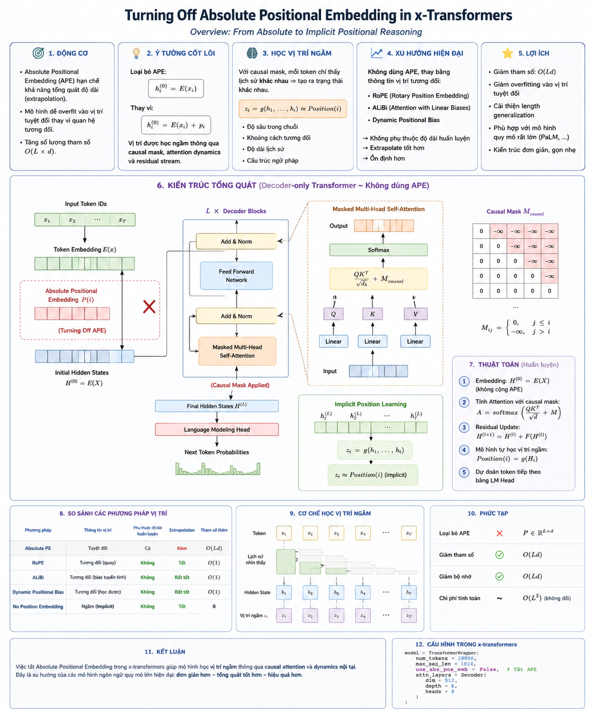
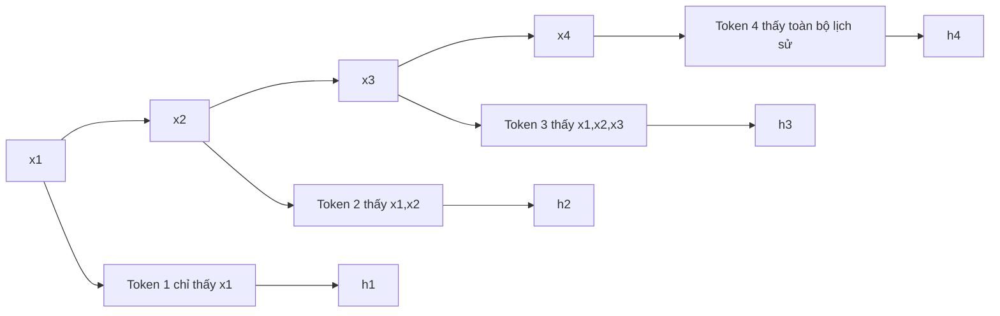
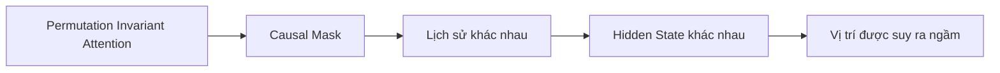
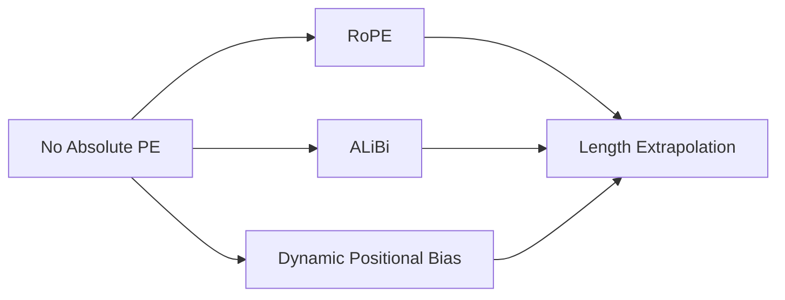
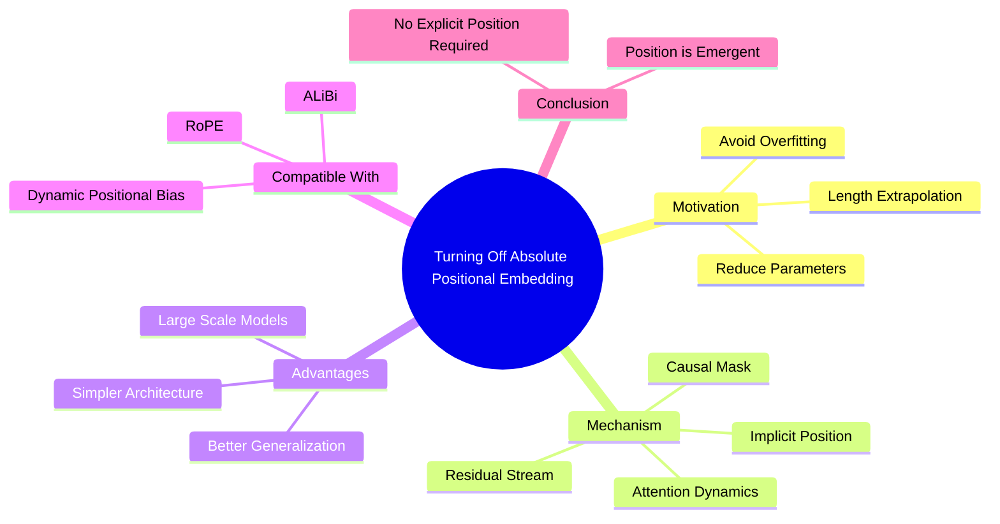

# Turning Off Absolute Positional Embedding - Overview

> **Core Idea:** Đối với Decoder-only Transformer hiện đại, thông tin vị trí không nhất thiết phải được mã hóa bằng embedding vị trí tuyệt đối. Mô hình có thể học biểu diễn vị trí ngầm (Implicit Position Representation) thông qua causal mask, self-attention và residual stream.

<p align="center">
  
</p>

---

# 1. Tổng quan kiến trúc

```mermaid
flowchart LR

A[Input Tokens]
B[Token Embedding E(x)]
C[Không sử dụng Absolute Position Embedding]
D[Causal Mask]
E[Masked Self-Attention]
F[Residual Stream]
G[Implicit Position Learning]
H[LM Head]
I[Next Token Prediction]

A --> B
B --> C
C --> E
D --> E
E --> F
F --> G
G --> H
H --> I
```

---

# 2. So sánh với Transformer truyền thống

```mermaid
flowchart TB

subgraph Traditional Transformer
A1[Token Embedding]
A2[Absolute Position Embedding]
A3[h0 = E(x) + p]
A4[Decoder]

A1 --> A3
A2 --> A3
A3 --> A4
end

subgraph No Absolute Position Embedding
B1[Token Embedding]
B2[h0 = E(x)]
B3[Causal Decoder]
B4[Implicit Position Representation]

B1 --> B2
B2 --> B3
B3 --> B4
end
```

---

# 3. Nguyên lý học vị trí ngầm



Mỗi token có:

* receptive field khác nhau;
* lịch sử khác nhau;
* attention pattern khác nhau.

Do đó:

```math
h_i \neq h_j
```

ngay cả khi:

```math
x_i = x_j
```

---

# 4. Cơ chế sinh vị trí ngầm

```mermaid
flowchart TB

A[Token History]
B[Causal Mask]
C[Attention Dynamics]
D[Residual Stream]
E[Implicit Position Function]
F[z_i ≈ Position(i)]

A --> E
B --> E
C --> E
D --> E
E --> F
```

với:

```math
z_i = g(h_1,h_2,\dots,h_i)
```

---

# 5. Attention khi không có Positional Embedding

```math
A = softmax \left( \frac{QK^T}{\sqrt d} + M \right)
```

với causal mask:

```math
M_{ij} = \begin{cases}
0,& j \le i\\
-\infty,& j > i
\end{cases}
```

---

# 6. Kiến trúc Decoder tổng quát

```mermaid
flowchart TB

IN[Input Embedding]

subgraph Decoder Block × L
ATTN[Masked Multi-Head Attention]
ADD1[Add & Norm]
FFN[Feed Forward]
ADD2[Add & Norm]
end

OUT[Final Hidden States]
HEAD[LM Head]

IN --> ATTN
ATTN --> ADD1
ADD1 --> FFN
FFN --> ADD2
ADD2 --> OUT
OUT --> HEAD
```

---

# 7. Vì sao Decoder vẫn biết vị trí?



Hay:

```math
Position(i) = g(H_i)
```

thay vì:

```math
Position(i)=p_i
```

---

# 8. Kết hợp với Relative Position Encoding



---

# 9. So sánh các phương pháp vị trí

| Phương pháp           | Vị trí    | Extrapolation | Tham số thêm |
| --------------------- | --------- | ------------- | ------------ |
| Absolute PE           | Tuyệt đối | Kém           | O(Ld)        |
| RoPE                  | Tương đối | Tốt           | O(1)         |
| ALiBi                 | Tương đối | Rất tốt       | O(1)         |
| Dynamic Bias          | Tương đối | Rất tốt       | O(1)         |
| No Position Embedding | Ngầm      | Tốt           | 0            |

---

# 10. Độ phức tạp

```mermaid
flowchart TB

A[Loại bỏ P ∈ R^(L×d)]

A --> B[Giảm tham số O(Ld)]
A --> C[Giảm bộ nhớ O(Ld)]
A --> D[Chi phí Attention không đổi O(L²)]
```

---

# 11. Thuật toán huấn luyện

```mermaid
flowchart LR

A[Input Tokens]
B[Embedding H0 = E(X)]
C[Masked Attention]
D[Residual Update]
E[Implicit Position Learning]
F[Next Token Prediction]

A --> B
B --> C
C --> D
D --> E
E --> F
```

---

# 12. Tóm tắt



---

# Kết luận

```math
Position \neq Explicit\ Embedding
```

mà:

```math
Position = Emergent\ Property \left( Causal\ Mask, Attention, Residual\ Stream \right)
```

Đây là xu hướng thiết kế của các Decoder Transformer hiện đại như PaLM, LLaMA và nhiều biến thể trong x-transformers.
