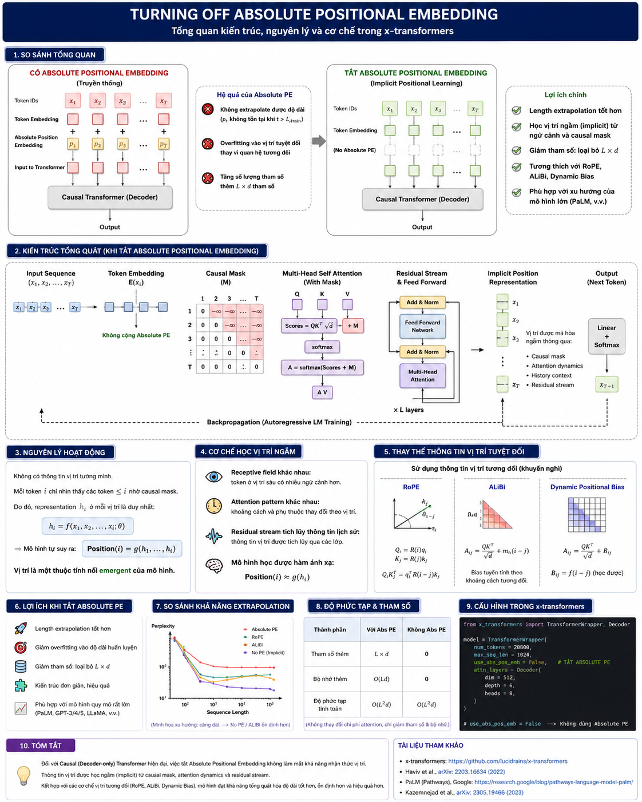
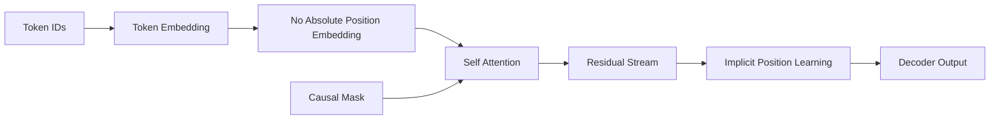

# Turning Off Absolute Positional Embedding in x-Transformers

> **Removing explicit absolute position embeddings to enable implicit positional reasoning and improve extrapolation in autoregressive Transformers.**

<p align="center">
  
</p>

---

# 1. Giới thiệu

Trong các kiến trúc Transformer ban đầu, mỗi token được cộng thêm một vector vị trí tuyệt đối:

```math
h_i^{(0)} = E(x_i) + p_i
```

trong đó:

* (E(x_i)): embedding của token.
* (p_i): embedding của vị trí thứ (i).

Mục tiêu của thành phần này là cung cấp thông tin về thứ tự chuỗi vì self-attention nguyên thủy là bất biến đối với phép hoán vị (permutation invariant).

Tuy nhiên, nhiều nghiên cứu gần đây chỉ ra rằng đối với **Causal Transformer (Decoder-only Transformer)**, việc bổ sung absolute positional embedding có thể không còn cần thiết.

Các mô hình quy mô lớn như **PaLM** đã loại bỏ hoàn toàn absolute positional embedding và thay vào đó sử dụng các cơ chế positional tương đối như:

* RoPE (Rotary Position Embedding)
* ALiBi (Attention with Linear Biases)
* Dynamic Positional Bias

Thậm chí, các nghiên cứu gần đây còn chỉ ra rằng decoder có khả năng tự học biểu diễn vị trí ngầm (implicit positional representation) mà không cần bất kỳ positional encoding được thiết kế thủ công nào.

---

# 2. Động cơ khoa học

## 2.1 Hạn chế của Absolute Positional Embedding

Absolute positional embedding tạo ra hàm ánh xạ:

```math
f(i) \rightarrow p_i
```

với:

```math
i \in [1,L]
```

Điều này dẫn tới:

### 1. Không extrapolate được độ dài

Mô hình học:

```math
P(x_t|x_{\lt t},p_t)
```

thay vì:

```math
P(x_t|x_{\lt t})
```

Khi:

```math
t \gt L_{train}
```

thì:

```math
p_t
```

không tồn tại hoặc chưa được huấn luyện.

---

### 2. Gây overfitting vào vị trí tuyệt đối

Mô hình học:

```math
Token A xuất hiện ở vị trí 512
```

thay vì:

```math
Token A xuất hiện sau Token B.
```

Điều này làm giảm khả năng:

* length generalization;
* extrapolation;
* reasoning trên chuỗi dài.

---

### 3. Tăng số lượng tham số

Embedding vị trí:

```math
P \in \mathbb{R}^{L \times d}
```

sinh thêm:

```math
L \times d
```

tham số.

Đối với các mô hình hàng trăm tỷ tham số, việc loại bỏ thành phần này giúp đơn giản hóa kiến trúc.

---

# 3. Ý tưởng cốt lõi

Thay vì:

```math
h_i^{(0)} = E(x_i) + p_i
```

ta sử dụng:

```math
h_i^{(0)} = E(x_i)
```

toàn bộ positional information sẽ được học thông qua:

* causal masking;
* attention dynamics;
* residual stream;
* statistics của dữ liệu ngôn ngữ.

---

# 4. Cơ chế học vị trí ngầm (Implicit Position Learning)

Đối với decoder:

```math
x_1,x_2,\dots,x_t
```

token thứ (t) chỉ nhìn thấy:

```math
x_1,\dots,x_t
```

nhờ causal mask:

```math
M_{ij} = \begin{cases}
0,& j \le i \\
-\infty,& j \gt i
\end{cases}
```

Attention:

```math
A = softmax \left( \frac{QK^T}{\sqrt d} + M \right)
```

Mỗi token có:

* receptive field khác nhau;
* history khác nhau;
* context khác nhau.

Do đó:

```math
h_i \neq h_j
```

ngay cả khi:

```math
x_i=x_j
```

Mô hình có thể suy ra:

```math
position = f(context)
```

thay vì:

```math
position = lookup(i)
```

---

# 5. Biểu diễn vị trí ngầm

Các nghiên cứu gần đây chỉ ra rằng decoder tự xây dựng:

```math
z_i = g(h_1,\dots,h_i)
```

trong đó:

```math
z_i
```

mang thông tin:

* độ sâu trong chuỗi;
* khoảng cách tương đối;
* số lượng token trước đó;
* cấu trúc ngữ pháp.

Nói cách khác:

```math
z_i \approx Position(i)
```

mặc dù không có positional embedding.

---

# 6. Tại sao Decoder có thể làm được điều này?

Điều kiện quan trọng:

```math
Attention + Causal Mask + Residual Stream
```

đã phá vỡ tính permutation invariance của self-attention.

Nếu:

```math
M = 0
```

Transformer hoàn toàn không biết thứ tự.

Nhưng:

```math
M \neq 0
```

thì:

```math
token_i
```

và

```math
token_j
```

quan sát lịch sử khác nhau.

Điều này đủ để mô hình suy ra vị trí.

---

# 7. Kết hợp với Relative Positional Encoding

Xu hướng hiện nay:

Không sử dụng:

```math
Absolute Position Embedding
```

mà sử dụng:

```math
Relative Position Information
```

Ví dụ:

## RoPE

```math
Q_i = R(i)q_i
```

```math
K_j = R(j)k_j
```

Attention:

```math
Q_iK_j^T = q_i^TR(i-j)k_j
```

---

## ALiBi

```math
A_{ij} = \frac{QK^T}{\sqrt d} + m_h(i-j)
```

---

## Dynamic Positional Bias

```math
B_{ij} = f(i-j)
```

Các phương pháp này:

* không phụ thuộc độ dài huấn luyện;
* extrapolate tốt;
* ổn định hơn absolute embedding.

---

# 8. Thuật toán

## Huấn luyện

### Bước 1

Embedding:

```math
H^{(0)} = E(X)
```

---

### Bước 2

Tính attention:

```math
A = softmax \left( \frac{QK^T}{\sqrt d} + M \right)
```

---

### Bước 3

Residual update:

```math
H^{(l+1)} = H^{(l)} + F(H^{(l)})
```

---

### Bước 4

Mô hình tự học:

```math
Position(i) = g(H_i)
```

---

# 9. Độ phức tạp

Loại bỏ:

```math
P \in \mathbb{R}^{L \times d}
```

giảm:

## Bộ nhớ

```math
O(Ld)
```

## Tham số

```math
O(Ld)
```

## Chi phí tính toán

không thay đổi:

```math
O(L^2)
```

---

# 10. Minh họa tổng quát



---

# 11. So sánh

| Phương pháp           | Thông tin vị trí | Extrapolation |
| --------------------- | ---------------- | ------------- |
| Absolute PE           | Tuyệt đối        | Kém           |
| RoPE                  | Tương đối        | Tốt           |
| ALiBi                 | Tương đối        | Rất tốt       |
| Dynamic Bias          | Tương đối        | Rất tốt       |
| No Position Embedding | Ngầm (Implicit)  | Tốt           |

---

# 12. Cấu hình trong x-transformers

```python
from x_transformers import TransformerWrapper, Decoder

model = TransformerWrapper(
    num_tokens = 20000,
    max_seq_len = 1024,
    use_abs_pos_emb = False,
    attn_layers = Decoder(
        dim = 512,
        depth = 6,
        heads = 8
    )
)
```

---

# 13. Kết luận

Đối với Decoder Transformer hiện đại:

```math
Position \neq Explicit\ Embedding
```

mà:

```math
Position = Emergent\ Property
```

Việc tắt absolute positional embedding:

* giảm tham số;
* tránh overfitting vào độ dài huấn luyện;
* cải thiện length extrapolation;
* tương thích với RoPE, ALiBi và Dynamic Positional Bias;
* phù hợp với xu hướng của các mô hình ngôn ngữ quy mô lớn hiện đại.

---

# Tài liệu tham khảo

1. x-transformers Repository
   https://github.com/lucidrains/x-transformers

2. Haviv et al., *Transformer Language Models without Positional Encodings Still Learn Positional Information*, 2022.
   https://arxiv.org/pdf/2203.16634

3. Chowdhery et al., *PaLM: Scaling Language Modeling with Pathways*, 2022.
   https://research.google/blog/pathways-language-model-palm-scaling-to-540-billion-parameters-for-breakthrough-performance/

4. Kazemnejad et al., *The Impact of Positional Encoding on Length Generalization in Transformers*, 2023.
   https://arxiv.org/pdf/2305.19466
