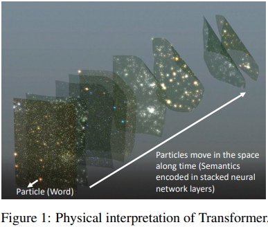
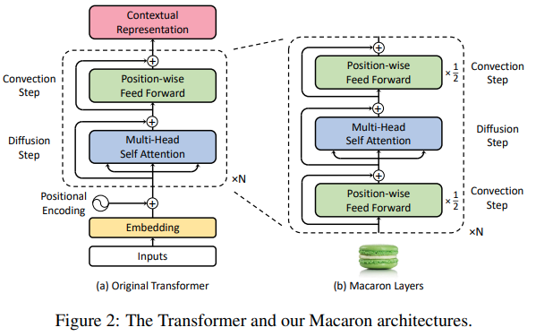

# Understanding and Improving Transformer From a Multi-Particle Dynamic System Point of View (Macaron Transformer)

> Paper:
>
> * Understanding and Improving Transformer From a Multi-Particle Dynamic System Point of View (ICML 2020)
> * https://arxiv.org/abs/1906.02762
>
> Related:
>
> * x-transformers implementation
> * Conformer (Speech Recognition)

<p align="center">
  
</p>

<p align="center">
  
</p>

---

# 1. Introduction

Transformer nguyên bản được xây dựng theo cấu trúc:

$$
x_{l+1} = x_l + \text{Attention}(x_l) + \text{FFN}(x_l)
$$

trong đó mỗi layer gồm:

```text
Input
  │
Attention
  │
FFN
  │
Output
```

Mặc dù hoạt động rất hiệu quả, kiến trúc này được thiết kế chủ yếu từ trực giác thực nghiệm.

Bài báo đưa ra một góc nhìn hoàn toàn khác:

> Transformer có thể được xem như một hệ động lực học nhiều hạt (Multi-Particle Dynamic System).

Từ đó tác giả phân tích:

* Attention = tương tác lực giữa các hạt
* FFN = động học nội tại của từng hạt
* Residual = bước tích phân thời gian

và chứng minh rằng Transformer nguyên bản thực chất là một phép xấp xỉ Euler bậc thấp của hệ vi phân.

Sau đó tác giả đề xuất kiến trúc:

# Macaron Transformer

để mô phỏng hệ động lực chính xác hơn.

---

# 2. Transformer như một hệ nhiều hạt

Giả sử:

$$
X= [x_1,x_2,\ldots,x_n]
$$

với:

$$
x_i\in \mathbb R^d
$$

mỗi token được xem là một hạt (particle).

---

## 2.1 Trạng thái hệ

Toàn bộ chuỗi:

$$
X(t)
$$

là trạng thái của hệ tại thời gian t.

Layer Transformer:

$$
l
$$

được xem như:

$$
t=l\Delta t
$$

---

## 2.2 Động lực học

Một hệ động lực tổng quát:

$$
\frac{dX}{dt}= F(X)
$$

Trong Transformer:

$$
F(X)= F_{att}(X) + F_{ffn}(X)
$$

gồm:

### Thành phần tương tác

$$
F_{att}
$$

do attention sinh ra.

### Thành phần nội tại

$$
F_{ffn}
$$

do feedforward sinh ra.

---

# 3. Self-Attention như lực tương tác

Attention:

$$
A= \text{Softmax} \left( \frac{QK^T}{\sqrt d} \right)
$$

Output:

$$
Y=AV
$$

---

## Góc nhìn vật lý

Mỗi token:

$$
x_i
$$

tương tác với:

$$
x_j
$$

thông qua trọng số:

$$
a_{ij}
$$

tương tự:

```text
Particle i
      ↑
      │
      │ force
      │
Particle j
```

Attention chính là cơ chế truyền lực toàn cục.

---

## Hệ nhiều hạt

Transformer trở thành:

$$
\frac{dx_i}{dt}= \sum_j a_{ij} g(x_j)
$$

rất giống:

* N-body systems
* Molecular dynamics
* Fluid dynamics

---

# 4. Vai trò của Feed Forward Network

Trong phần lớn các giải thích về Transformer:

Attention được xem là thành phần chính.

Tuy nhiên bài báo chỉ ra:

FFN mới là phần mô hình hóa động lực nội tại của từng hạt.

---

## FFN tương đương Potential Function

FFN:

$$
f(x)= W_2\sigma(W_1x)
$$

đóng vai trò:

$$
-\nabla U(x)
$$

trong cơ học.

---

Khi đó:

$$
\frac{dx}{dt}= F_{att}(x) \nabla U(x)
$$

Attention:

* tương tác giữa các hạt

FFN:

* lực tự thân của mỗi hạt

---

# 5. Transformer gốc là Euler Method

Transformer layer:

$$
x_{l+1}= x_l + F(x_l)
$$

chính là:

$$
x(t+\Delta t)= x(t) + \Delta t F(x(t))
$$

---

Đây là:

# Explicit Euler

---

## Hạn chế

Euler:

* sai số bậc một

$$
O(\Delta t)
$$

* khó ổn định khi hệ sâu

* tích lũy lỗi theo chiều sâu

---

Khi depth tăng:

```text
Layer 1
Layer 2
Layer 3
...
Layer N
```

lỗi xấp xỉ ngày càng lớn.

---

# 6. Ý tưởng cải tiến

Trong Numerical ODE:

Euler không phải phương pháp tối ưu.

Một phương pháp chính xác hơn là:

# Strang Splitting

hoặc

# Symmetric Operator Splitting

---

Giả sử:

$$
F=A+B
$$

ta không thực hiện:

$$
e^{\Delta t(A+B)}
$$

mà dùng:

$$
e^{\frac12\Delta t A} e^{\Delta t B} e^{\frac12\Delta t A}
$$

---

Sai số giảm đáng kể:

$$
O(\Delta t^2)
$$

---

# 7. Macaron Transformer

Từ lý thuyết trên:

Attention và FFN được xem là hai toán tử:

$$
A = FFN
$$

$$
B = Attention
$$

Thay vì:

```text
Attention
↓
FFN
```

tác giả đề xuất:

```text
FFN
↓
Attention
↓
FFN
```

---

# Kiến trúc Macaron

```text
Input
   │
   ▼
Half FFN
   │
   ▼
Self Attention
   │
   ▼
Half FFN
   │
   ▼
Output
```

---

Công thức:

$$
x' = x + \frac12 FFN(x)
$$

$$
x'' = x' + Attention(x')
$$

$$
x_{l+1}= x'' + \frac12 FFN(x'')
$$

---

# 8. Vì sao FFN bị chia đôi?

Nếu dùng:

$$
FFN
$$

ở cả hai bên:

$$
FFN + Attention + FFN
$$

thì động lực FFN bị nhân đôi.

---

Do đó:

$$
\frac12 FFN
$$

được đặt ở hai đầu:

$$
\frac12+\frac12=1
$$

giữ nguyên tổng năng lượng cập nhật.

---

```text
Standard Transformer

Attention
   +
FFN

-----------------

Macaron

0.5 FFN
   +
Attention
   +
0.5 FFN
```

---

# 9. Liên hệ với Strang Splitting

Macaron chính là:

$$
e^{\frac12 A} e^{B} e^{\frac12 A}
$$

trong đó:

$$
A=FFN
$$

$$
B=Attention
$$

---

```text
FFN/2
  ↓
Attention
  ↓
FFN/2
```

---

Đây là kết quả trực tiếp từ lý thuyết giải ODE.

Không phải heuristic.

---

# 10. Phân tích phổ (Spectral Analysis)

Bài báo cho thấy:

Transformer chuẩn có xu hướng:

* mất thông tin tần số cao
* hội tụ chậm
* gradient kém ổn định

---

Macaron:

* bảo toàn phổ tốt hơn
* giảm numerical dissipation
* truyền tín hiệu xa hơn

---

```text
Transformer

Signal
 ───────╲
         ╲
          ╲

Macaron

Signal
 ──────────────
```

---

# 11. Liên hệ với Neural ODE

Transformer:

$$
x_{l+1}= x_l + F(x_l)
$$

là rời rạc hóa:

$$
\frac{dx}{dt}= F(x)
$$

---

Macaron:

xấp xỉ tốt hơn nghiệm ODE.

Do đó:

* ổn định hơn
* sâu hơn
* gradient tốt hơn

---

# 12. Conformer sử dụng Macaron

Conformer block nổi tiếng:

```text
FFN/2
   │
MHSA
   │
Conv
   │
FFN/2
```

---

```text
         ┌────────────┐
Input ──►│  FFN / 2   │
         └─────┬──────┘
               │
               ▼
         ┌────────────┐
         │ Self-Attn  │
         └─────┬──────┘
               │
               ▼
         ┌────────────┐
         │ Convolution│
         └─────┬──────┘
               │
               ▼
         ┌────────────┐
         │  FFN / 2   │
         └─────┬──────┘
               │
             Output
```

Conformer kế thừa trực tiếp ý tưởng Macaron.

---

# 13. Thuật toán

```text
Input X

for layer l:

    X = X + 0.5 * FFN(X)

    X = X + Attention(X)

    X = X + 0.5 * FFN(X)

return X
```

---

# 14. Độ phức tạp

Attention:

$$
O(n^2 d)
$$

FFN:

$$
O(nd^2)
$$

---

Macaron:

thêm một FFN nữa.

$$
2\times O(nd^2)
$$

Chi phí tăng nhẹ nhưng:

* ổn định hơn
* hiệu quả hơn
* hội tụ tốt hơn

---

# 15. Cài đặt trong x-transformers

```python
from x_transformers import TransformerWrapper
from x_transformers import Encoder

model = TransformerWrapper(
    num_tokens = 20000,
    max_seq_len = 1024,
    attn_layers = Encoder(
        dim = 512,
        depth = 6,
        heads = 8,

        macaron = True
    )
)
```

---

# 16. Tổng kết

Macaron Transformer không phải là một cải tiến heuristic.

Nó xuất phát từ việc xem Transformer như một hệ động lực nhiều hạt:

$$
\frac{dX}{dt}= F_{att}(X) + F_{ffn}(X)
$$

Transformer chuẩn tương đương:

$$
\text{Euler Method}
$$

trong khi Macaron tương đương:

$$
\text{Strang Splitting}
$$

$$
FFN/2 \rightarrow Attention \rightarrow FFN/2
$$

Nhờ đó:

* mô phỏng động lực chính xác hơn
* giảm sai số tích lũy theo chiều sâu
* cải thiện ổn định huấn luyện
* bảo toàn phổ tín hiệu tốt hơn
* trở thành nền tảng cho Conformer và nhiều biến thể Transformer hiện đại.

---

# References

```bibtex
@article{lu2020understanding,
  title={Understanding and Improving Transformer From a Multi-Particle Dynamic System Point of View},
  author={Lu, Yiping and Li, Zhuohan and He, Di and others},
  journal={ICML},
  year={2020}
}

@article{gulati2020conformer,
  title={Conformer: Convolution-augmented Transformer for Speech Recognition},
  author={Gulati et al.},
  year={2020}
}

@misc{xtransformers,
  author = {Phil Wang},
  title = {x-transformers},
  url = {https://github.com/lucidrains/x-transformers}
}
```
