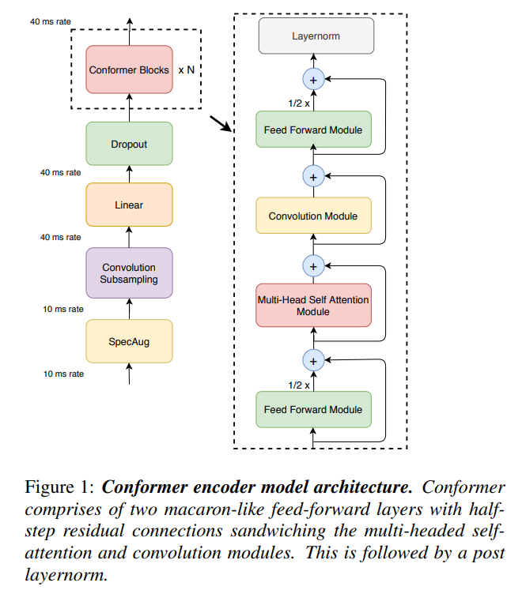
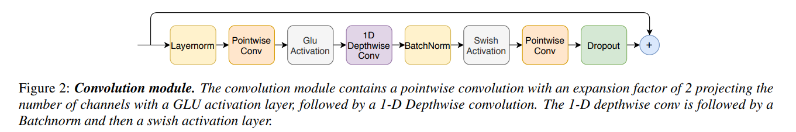
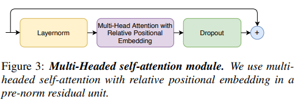
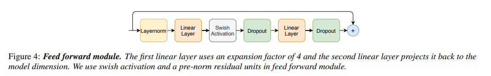

# Appendix A. Understanding Conformer Internals

> Paper: Conformer: Convolution-augmented Transformer for Speech Recognition
>
> https://arxiv.org/pdf/2005.08100

---

# A.1 Từ Transformer đến Conformer

Transformer rất mạnh trong việc mô hình hóa quan hệ dài hạn:

$$
\text{Global Context}
$$

nhờ Self-Attention.

Tuy nhiên trong Automatic Speech Recognition (ASR) tồn tại một vấn đề:

```text
Speech Signal

│ waveform │
     ↓
 phoneme
     ↓
 syllable
     ↓
 word
     ↓
 sentence
```

Thông tin ngôn ngữ tồn tại ở nhiều thang đo:

* Local scale (phoneme)
* Mid scale (syllable)
* Global scale (sentence)

---

Self-Attention rất giỏi ở:

$$
\text{Long-range dependency}
$$

nhưng không khai thác hiệu quả:

$$
\text{Local patterns}
$$

mà CNN làm rất tốt.

---

Ý tưởng chính của Conformer:

```text
Transformer
      +
Convolution
      +
Macaron FFN
```

để đồng thời học:

```text
Local Features
      +
Global Features
```

---

# A.2 Figure 1 — Conformer Encoder Block

<p align="center">
  
</p>

## Kiến trúc tổng thể

```text
Input
  │
  ▼
FFN (1/2)
  │
  ▼
Multi-Head Self Attention
  │
  ▼
Convolution Module
  │
  ▼
FFN (1/2)
  │
  ▼
LayerNorm
  │
  ▼
Output
```

---

Trong bài báo:

```text
┌──────────────┐
│   FFN / 2    │
└──────┬───────┘
       │
       ▼
┌──────────────┐
│    MHSA      │
└──────┬───────┘
       │
       ▼
┌──────────────┐
│ Convolution  │
└──────┬───────┘
       │
       ▼
┌──────────────┐
│   FFN / 2    │
└──────┬───────┘
       │
       ▼
   LayerNorm
```

---

## Vì sao FFN nằm hai bên?

Conformer kế thừa trực tiếp Macaron Transformer:

$$
FFN/2 \rightarrow Attention \rightarrow FFN/2
$$

từ bài báo:

> Understanding and Improving Transformer From a Multi-Particle Dynamic System Point of View

---

Theo lý thuyết ODE:

Transformer:

$$
x_{l+1}= x_l+F(x_l)
$$

tương đương Euler Method.

---

Macaron:

$$
FFN/2 \rightarrow Attention \rightarrow FFN/2
$$

tương đương:

$$
e^{A/2} e^B e^{A/2}
$$

(Strang Splitting)

giúp mô phỏng động lực chính xác hơn.

---

## Vai trò của từng khối

### FFN đầu

Học biểu diễn cục bộ của từng token.

---

### MHSA

Thu thập ngữ cảnh toàn cục.

---

### Convolution

Thu thập cấu trúc cục bộ của tín hiệu.

---

### FFN cuối

Tinh chỉnh biểu diễn sau khi đã kết hợp:

```text
Global Context
      +
Local Context
```

---

# A.3 Figure 2 — Convolution Module

<p align="center">
  
</p>

---

## Kiến trúc

```text
Input
  │
LayerNorm
  │
Pointwise Conv
  │
GLU
  │
Depthwise Conv
  │
BatchNorm
  │
Swish
  │
Pointwise Conv
  │
Residual Add
  │
Output
```

---

## Tổng quan

Convolution module được thiết kế để:

$$
\text{Capture Local Dependency}
$$

mà Self-Attention thiếu.

---

# A.3.1 Pointwise Convolution

Đầu tiên:

$$
1\times1
$$

Convolution.

---

Input:

$$
d_{model}
$$

Output:

$$
2d_{model}
$$

---

```text
d
│
│ expand
▼

2d
```

---

Mục tiêu:

* tăng năng lực biểu diễn
* chuẩn bị cho GLU

---

# A.3.2 GLU

Gated Linear Unit.

Đầu ra được chia thành:

$$
A,B
$$

---

Sau đó:

$$
GLU(A,B)= A\otimes \sigma(B)
$$

---

```text
        Input

           │

    ┌──────┴──────┐

    ▼             ▼

    A             B

    │             │

    │         Sigmoid

    │             │

    └─────⊗───────┘

          Output
```

---

Ý nghĩa:

Gate quyết định:

```text
Thông tin nào nên truyền
Thông tin nào nên chặn
```

---

# A.3.3 Depthwise Convolution

Sau GLU:

```text
Depthwise Conv
```

---

Khác Conv chuẩn:

Standard Conv:

$$
O(C^2)
$$

---

Depthwise Conv:

$$
O(C)
$$

---

```text
Channel 1 ─ Conv

Channel 2 ─ Conv

Channel 3 ─ Conv

...
```

---

Ưu điểm:

* nhẹ hơn
* giữ thông tin kênh
* học local pattern tốt

---

Trong Speech:

```text
phoneme
phoneme
phoneme
```

thường xuất hiện liên tiếp.

Depthwise Conv học rất tốt cấu trúc này.

---

# A.3.4 BatchNorm

Sau convolution:

$$
BN(x)
$$

---

Giúp:

* ổn định thống kê
* giảm internal covariate shift

---

CNN thường phù hợp với:

```text
BatchNorm
```

hơn LayerNorm.

---

# A.3.5 Swish

Activation:

$$
Swish(x)= x\sigma(x)
$$

---

```text
ReLU

      /
     /
    /
___/


Swish

    /
   /
 _/
/
```

---

Ưu điểm:

* trơn
* gradient ổn định
* hiệu quả hơn ReLU

---

# A.4 Figure 3 — Multi-Head Self Attention

<p align="center">
  
</p>

---

## Kiến trúc

```text
Input
  │
LayerNorm
  │
Relative MHSA
  │
Residual Add
  │
Output
```

---

Conformer sử dụng:

# Relative Positional Encoding

thay vì:

```text
Absolute Position Encoding
```

của Transformer gốc.

---

## Vì sao?

Trong âm thanh:

```text
phoneme A
      ↓
phoneme B
```

khoảng cách tương đối quan trọng hơn vị trí tuyệt đối.

---

Ví dụ:

```text
"th"
```

xuất hiện ở đầu hay cuối câu vẫn mang cùng cấu trúc phát âm.

---

Do đó:

$$
Position(i-j)
$$

quan trọng hơn:

$$
Position(i)
$$

---

# Relative Attention

Transformer:

$$
QK^T
$$

---

Conformer:

$$
QK^T + QR^T
$$

---

với:

$$
R
$$

là embedding vị trí tương đối.

---

Nhờ đó mô hình tổng quát hóa tốt hơn trên chuỗi dài.

---

# A.5 Figure 4 — Feed Forward Module

<p align="center">
  
</p>

---

## Kiến trúc

```text
Input
  │
LayerNorm
  │
Linear
  │
Swish
  │
Dropout
  │
Linear
  │
Dropout
  │
Residual Add
  │
Output
```

---

# Expansion Factor = 4

---

Đầu tiên:

$$
d \rightarrow 4d
$$

---

Sau đó:

$$
4d \rightarrow d
$$

---

```text
d

│

▼

4d

│

▼

d
```

---

Tương tự Transformer gốc.

---

## Tại sao mở rộng 4 lần?

Attention chủ yếu thực hiện:

```text
Information Routing
```

---

FFN thực hiện:

```text
Feature Transformation
```

---

Không gian:

$$
4d
$$

cho phép:

* học phi tuyến mạnh hơn
* tăng expressiveness

---

# Pre-Norm Residual

Conformer dùng:

```text
LayerNorm
     ↓
Module
     ↓
Residual
```

---

thay vì:

```text
Module
     ↓
Residual
     ↓
LayerNorm
```

---

Lý do:

Gradient ổn định hơn khi mô hình rất sâu.

---

# A.6 Tại sao Conformer hoạt động tốt?

Conformer kết hợp ưu điểm của ba thế giới:

---

## Self-Attention

```text
Global Dependency
```

---

## Convolution

```text
Local Pattern
```

---

## Macaron FFN

```text
Better Dynamical System Approximation
```

---

```text
                Conformer

                     │

     ┌───────────────┼───────────────┐

     ▼               ▼               ▼

Attention      Convolution      Macaron

Global         Local            Stable

Context        Context          Optimization
```

---

# A.7 Một cách nhìn thống nhất

```text
Speech Signal

       │

       ▼

FFN/2
(Local Feature Transform)

       │

       ▼

MHSA
(Global Context Modeling)

       │

       ▼

Convolution
(Local Pattern Extraction)

       │

       ▼

FFN/2
(Feature Refinement)

       │

       ▼

Output Representation
```

---

# Kết luận

Conformer không phải là:

```text
Transformer + CNN
```

một cách đơn giản.

Nó là sự kết hợp có cơ sở toán học của:

1. Macaron Transformer

$$
FFN/2 \rightarrow MHSA \rightarrow FFN/2
$$

2. Relative Positional Self-Attention

$$
QK^T + QR^T
$$

3. Depthwise Separable Convolution

$$
O(C)
$$

4. GLU Gating

$$
A \otimes \sigma(B)
$$

để đồng thời mô hình hóa:

$$
\boxed{ \text{Local Structure} + \text{Global Context} + \text{Stable Dynamics} }
$$

đây chính là lý do Conformer trở thành một trong những kiến trúc encoder thành công nhất trong Automatic Speech Recognition.
