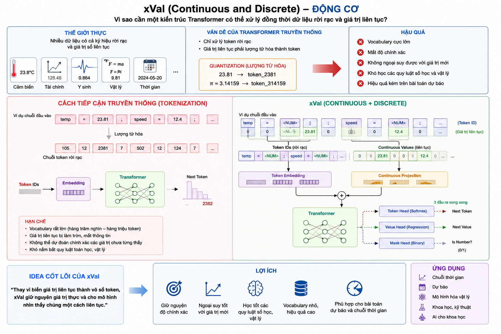
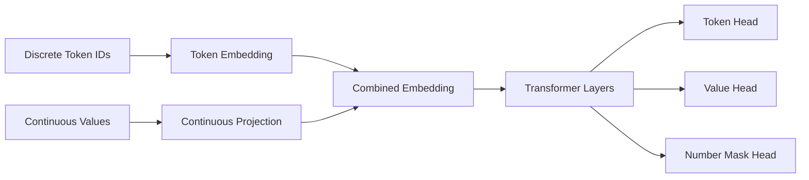
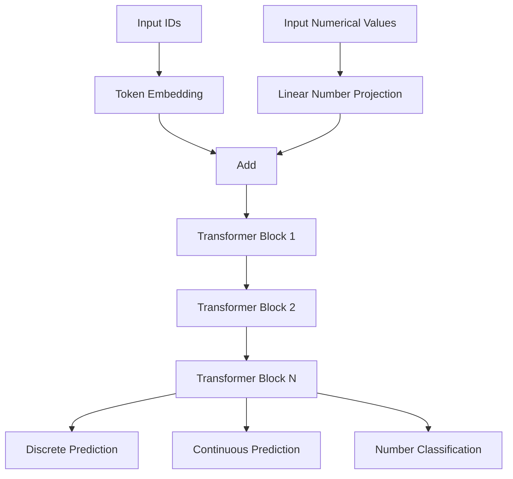
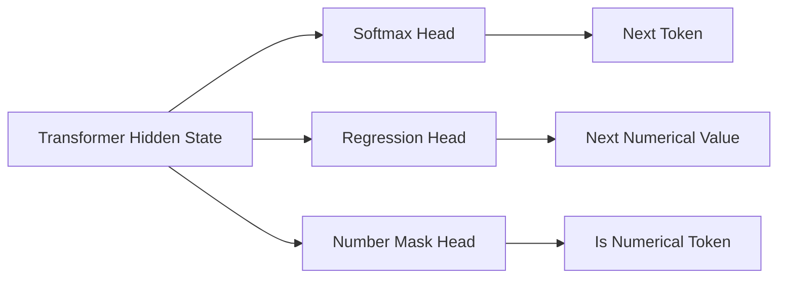
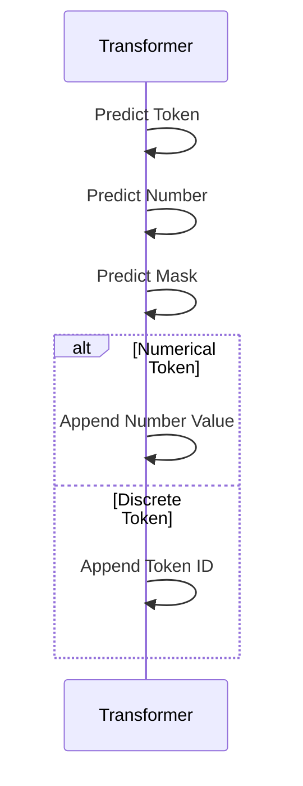
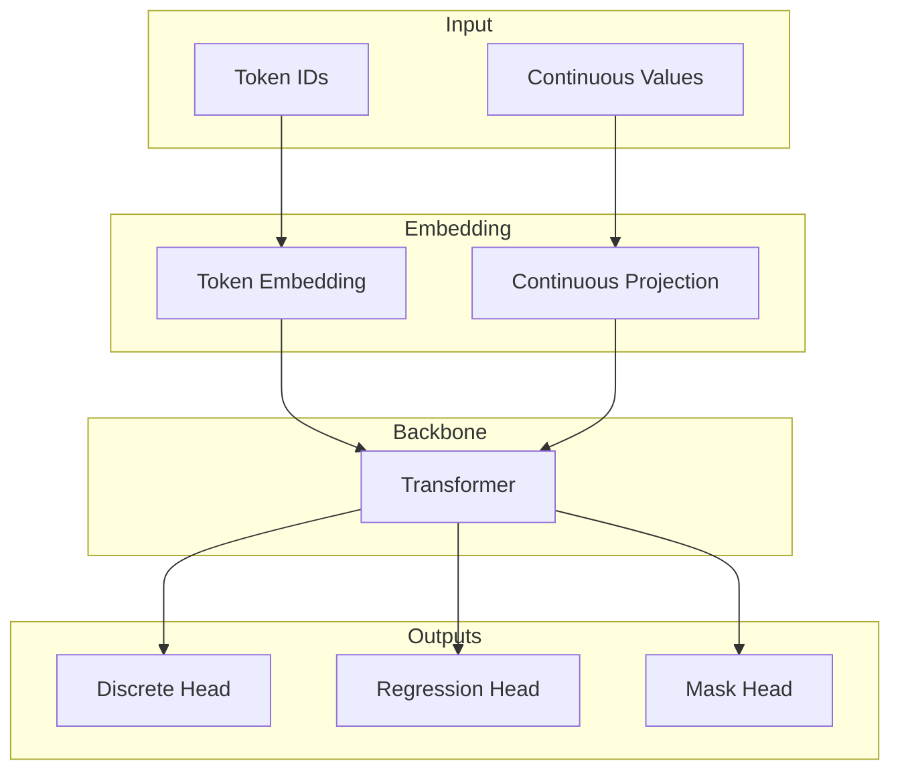
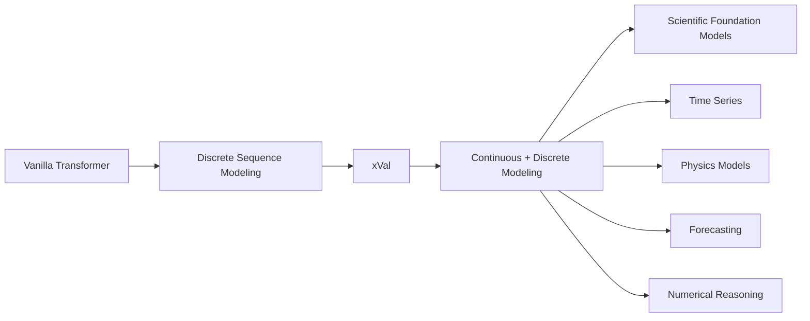

# xVal (Continuous and Discrete) - Overview

> Kiến trúc mở rộng Transformer cho phép mô hình xử lý **đồng thời token rời rạc (Discrete Tokens)** và **giá trị liên tục (Continuous Values)** trong cùng một chuỗi dữ liệu.

<p align="center">
  
</p>


---

# 1. Động cơ của xVal

Transformer truyền thống giả định mọi đầu vào đều là token rời rạc:

```text
Token → Embedding → Transformer
```

Điều này không phù hợp với:

* dữ liệu khoa học;
* chuỗi thời gian;
* dữ liệu cảm biến;
* bài toán dự báo;
* biểu thức toán học;
* dữ liệu vật lý.

Nếu lượng tử hóa (quantize) giá trị liên tục:

```text
23.81 → token_2381
```

sẽ gây:

* Vocabulary cực lớn.
* Mất độ chính xác.
* Không ngoại suy được.
* Khó học quy luật số học.

---

# 2. Ý tưởng cốt lõi

Thay vì:

```text
3.14159 → token_pi
```

xVal biểu diễn:

```text
(Token ID, Numerical Value)
```

Ví dụ:

```text
(NUMBER, 3.14159)
```

Mỗi phần tử trong chuỗi:

$$
x_i=(t_i,n_i)
$$

trong đó:

* $t_i$: token id
* $n_i$: giá trị liên tục.

---

# 3. Tổng quan kiến trúc



---

# 4. Continuous Number Embedding

Đối với token số:

$$
h_i= E(t_{num}) + g(n_i)
$$

với:

$$
g(n_i)=Wn_i+b
$$

Trong đó:

* $W\in \mathbb{R}^{d\times1}$
* $b\in \mathbb{R}^{d}$

Embedding cuối:

$$
h_i= E(t_i) + Wn_i+b
$$

---

# 5. Pipeline của xVal



---

# 6. Cơ chế hoạt động

## Bước 1

Nhận:

```text
(ids, nums)
```

---

## Bước 2

Sinh embedding:

```text
Embedding
=
TokenEmbedding
+
ContinuousProjection
```

---

## Bước 3

Transformer học quan hệ:

```text
Discrete ↔ Continuous
```

---

## Bước 4

Dự đoán:

* token tiếp theo;
* giá trị số tiếp theo;
* token tiếp theo có phải là số hay không.

---

# 7. Kiến trúc đầu ra



---

# 8. Ba đầu ra của xVal

## 1. Token Prediction

$$
P(t_{i+1})
$$

---

## 2. Numerical Prediction

$$
\hat n_{i+1}
$$

---

## 3. Numerical Mask

$$
m_{i+1} \in {0,1}
$$

---

# 9. Hàm mất mát

## Token Loss

$$
\mathcal L_{token}= CE(t,\hat t)
$$

---

## Numerical Loss

$$
\mathcal L_{num}= MSE(n,\hat n)
$$

---

## Mask Loss

$$
\mathcal L_{mask}= CE(m,\hat m)
$$

---

## Total Loss

$$
\mathcal L= \lambda_1\mathcal L_{token} + \lambda_2\mathcal L_{num} + \lambda_3\mathcal L_{mask}
$$

---

# 10. Quá trình sinh dữ liệu



---

# 11. Thuật toán huấn luyện

```text
Input:
    ids
    nums

↓

Embedding(ids, nums)

↓

Transformer

↓

Predict:
    token
    value
    mask

↓

Compute Loss

↓

Backpropagation
```

---

# 12. Thuật toán sinh chuỗi

```text
Given:
    start_ids
    start_nums

repeat

    predict token
    predict value
    predict mask

    if mask == 1:
        append numerical token
        append value
    else:
        append discrete token

until max length
```

---

# 13. Sơ đồ tổng quát của xVal



---

# 14. Tại sao xVal hiệu quả?

## Không cần lượng tử hóa

```text
Real Value → Continuous Representation
```

---

## Giữ nguyên độ chính xác

```text
23.8173 ≠ token_23817
```

---

## Ngoại suy tốt hơn

```text
Train:
1 2 3 4

Inference:
1000
5000
10000
```

---

## Học quy luật số học

* Arithmetic reasoning
* Forecasting
* Physical laws
* Scientific modeling

---

# 15. So sánh với Transformer thông thường

| Đặc tính            | Transformer | xVal |
| ------------------- | ----------- | ---- |
| Discrete Tokens     | ✅           | ✅    |
| Continuous Values   | ❌           | ✅    |
| Numerical Precision | ❌           | ✅    |
| Extrapolation       | ❌           | ✅    |
| Scientific Modeling | ❌           | ✅    |
| Forecasting         | ❌           | ✅    |

---

# 16. Vị trí của xVal trong x-transformers



---

# 17. Tổng kết

```text
(Token ID, Numerical Value)
                │
                ▼
      Continuous Embedding
                │
                ▼
          Transformer
                │
      ┌─────────┼─────────┐
      ▼         ▼         ▼
  Token ID   Number    Number Mask
 Prediction Prediction Prediction
```

xVal mở rộng Transformer từ:

```text
Discrete Sequence Modeling
```

thành:

```text
Mixed Continuous + Discrete Sequence Modeling
```

đây là một trong những hướng quan trọng để xây dựng:

* Scientific Foundation Models
* Time-Series Transformers
* Numerical Reasoning Models
* Physics-informed Transformers
* General Sequence Models có khả năng xử lý dữ liệu số thực.
