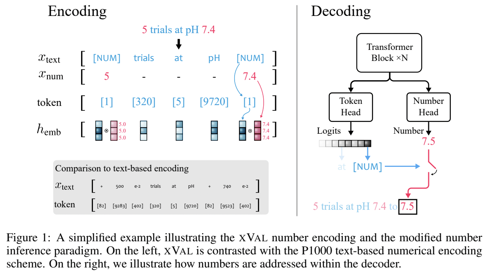
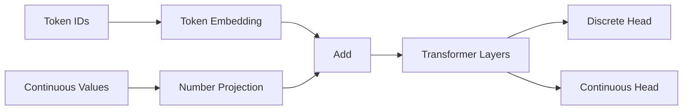
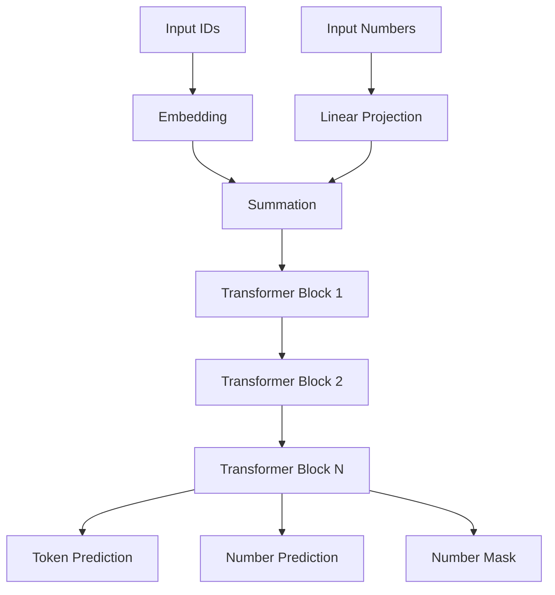
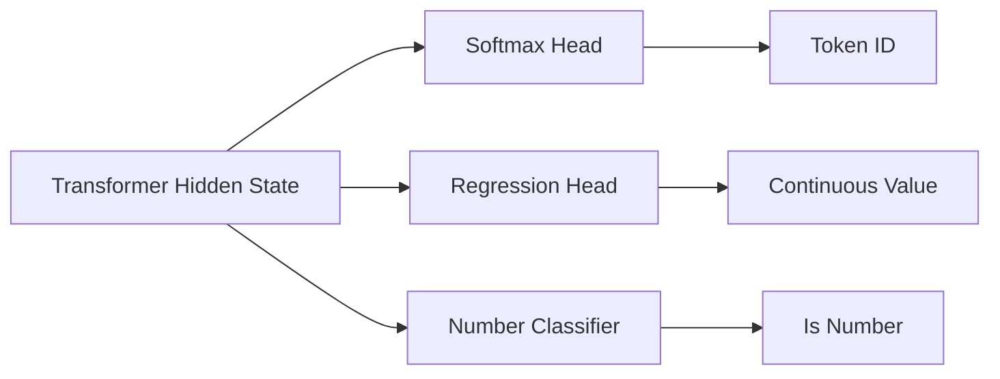
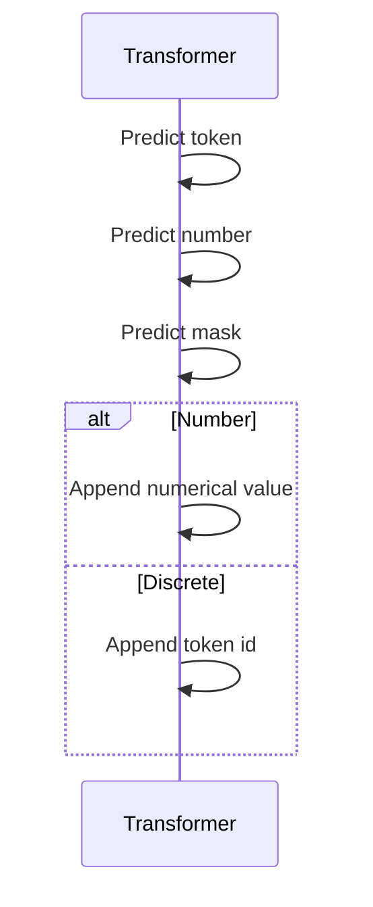

# xVal: Continuous and Discrete Tokens in Transformers

> Kiến trúc mở rộng Transformer để xử lý **đồng thời dữ liệu rời rạc (discrete tokens)** và **giá trị liên tục (continuous values)** trong cùng một chuỗi đầu vào.

<p align="center">
  
</p>


---

# 1. Giới thiệu

Các mô hình Transformer truyền thống được xây dựng cho dữ liệu rời rạc:

* Ngôn ngữ tự nhiên
* DNA sequence
* Source code
* Ký hiệu toán học

Mỗi phần tử đầu vào được biểu diễn bởi một token ID:

$$
x_i \in {1,2,\dots,V}
$$

và được ánh xạ thành embedding:

$$
e_i = E(x_i)
$$

Tuy nhiên, trong nhiều bài toán khoa học và kỹ thuật, dữ liệu chứa đồng thời:

* ký hiệu rời rạc;
* giá trị số liên tục.

Ví dụ:

| Thành phần        | Kiểu       |
| ----------------- | ---------- |
| tên biến          | discrete   |
| nhiệt độ          | continuous |
| vận tốc           | continuous |
| giá trị cảm biến  | continuous |
| dữ liệu tài chính | continuous |
| chuỗi thời gian   | continuous |

Nếu lượng tử hóa (quantization) các giá trị liên tục thành token:

```
23.81 → token_2381
```

sẽ xuất hiện các vấn đề:

* vocabulary rất lớn;
* mất thông tin độ chính xác;
* không thể ngoại suy (extrapolation);
* học kém trên các giá trị chưa từng xuất hiện.

Để giải quyết vấn đề này, nhóm **Polymathic AI** đề xuất **xVal (Continuous + Discrete Transformer)**.

---

# 2. Ý tưởng cốt lõi

Thay vì biểu diễn:

```
3.14159
```

bằng:

```
token_pi_314159
```

xVal biểu diễn:

```
token = NUMBER
value = 3.14159
```

Transformer nhận đồng thời:

```python
ids
nums
```

trong đó:

```python
ids : discrete token ids
nums : continuous values
```

---

# 3. Biểu diễn đầu vào

Mỗi vị trí:

$$
(x_i,n_i)
$$

trong đó:

* $x_i$: token id
* $n_i$: numerical value.

---

## Token thông thường

Nếu token không phải số:

$$
n_i = 0
$$

embedding:

$$
h_i = E(x_i)
$$

---

## Numerical token

Nếu token là số:

$$
x_i = t_{num}
$$

embedding:

$$
h_i= E(t_{num}) + g(n_i)
$$

trong đó:

$$
g:\mathbb R\rightarrow \mathbb R^d
$$

là numerical projection.

---

# 4. Continuous Number Embedding

Thông thường:

$$
g(n) = Wn+b
$$

với:

$$
W\in\mathbb R^{d\times1}
$$

suy ra:

$$
g(n)= nW+b
$$

Embedding cuối cùng:

$$
h_i= E(x_i) + n_iW+b
$$

---

# 5. Kiến trúc tổng quát



---

# 6. Kiến trúc xVal



---

# 7. Dual Prediction Heads

Khác với Transformer thông thường:

$$
P(x_{t+1}|x_{\le t})
$$

xVal dự đoán:

---

## Discrete output

$$
P(x_{t+1})
$$

---

## Continuous output

$$
\hat n_{t+1}
$$

---

## Numerical mask

$$
m_{t+1} \in{0,1}
$$

Nếu:

$$
m_{t+1}=1
$$

token tiếp theo là số.

Nếu:

$$
m_{t+1}=0
$$

token tiếp theo là token thông thường.

---

# 8. Kiến trúc đầu ra



---

# 9. Hàm mất mát

xVal tối ưu đồng thời ba mục tiêu.

---

## Token loss

$$
\mathcal L_{token}= CE(x,\hat x)
$$

---

## Number loss

$$
\mathcal L_{num}= MSE(n,\hat n)
$$

hoặc

$$
\mathcal L_{num}= L_1(n,\hat n)
$$

---

## Number mask loss

$$
\mathcal L_{mask}= CE(m,\hat m)
$$

---

## Tổng loss

$$
\mathcal L= \lambda_1\mathcal L_{token} + \lambda_2\mathcal L_{num} + \lambda_3\mathcal L_{mask}
$$

---

# 10. Thuật toán huấn luyện

```text
for batch:

    ids
    nums

    embedding(ids, nums)

    transformer forward

    predict:
        token
        number
        mask

    compute losses

    backpropagation
```

---

# 11. Thuật toán sinh (Generation)

```text
Given:
    start_ids
    start_nums

repeat:

    predict token
    predict value
    predict mask

    if mask == 1:
        append numerical token
        append predicted value

    else:
        append discrete token
        append 0
```

---

# 12. Minh họa sinh chuỗi



---

# 13. Tại sao xVal hoạt động tốt?

## 1. Không cần lượng tử hóa

Không tạo vocabulary khổng lồ.

---

## 2. Bảo toàn độ chính xác

Giá trị số được giữ nguyên.

---

## 3. Ngoại suy tốt hơn

Mô hình có thể dự đoán:

$$
1000.1
$$

mặc dù chỉ học:

$$
1,;2,;3,;4
$$

---

## 4. Học quy luật số học

Transformer học:

* cộng;
* nhân;
* tích phân;
* chuỗi thời gian;
* quan hệ vật lý.

---

# 14. So sánh với Tokenization thông thường

| Đặc điểm            | Tokenization | xVal |
| ------------------- | ------------ | ---- |
| Continuous values   | ❌            | ✅    |
| Extrapolation       | ❌            | ✅    |
| Vocabulary size     | rất lớn      | nhỏ  |
| Numerical precision | thấp         | cao  |
| Scientific data     | kém          | tốt  |
| Forecasting         | kém          | tốt  |

---

# 15. Vai trò của xVal trong x-transformers

xVal mở rộng Transformer từ:

```text
Discrete Sequence Modeling
```

sang:

```text
Mixed Discrete + Continuous Modeling
```

và đặc biệt hữu ích cho:

* scientific foundation models;
* time-series transformers;
* symbolic regression;
* physics transformers;
* multimodal reasoning;
* numerical language modeling.

---

# 16. Pseudocode theo x-transformers

```python
model = XValTransformerWrapper(
    num_tokens=4,
    numerical_token_id=3,
    max_seq_len=1024,
    attn_layers=Decoder(
        dim=512,
        depth=12,
        heads=8
    )
)

model = XValAutoregressiveWrapper(model)
```

Generation:

```python
ids_out, num_out, is_number_mask = \
    model.generate(
        start_ids,
        start_nums,
        17
    )
```

---

# 17. Tổng kết

xVal là một mở rộng quan trọng của Transformer:

$$
(Token,\ Value) \rightarrow Transformer \rightarrow (Token,\ Value,\ Mask)
$$

cho phép mô hình:

* xử lý dữ liệu số liên tục;
* tổng quát hóa ngoài miền huấn luyện;
* mô hình hóa hệ thống khoa học;
* học các quy luật số học và chuỗi thời gian hiệu quả hơn so với tokenization truyền thống.

---

# Tài liệu tham khảo

1. Polymathic AI – Continuous and Discrete Transformer Models.
2. x-transformers Repository:
   https://github.com/lucidrains/x-transformers
3. FT-Transformer:
   https://github.com/lucidrains/tab-transformer-pytorch#ft-transformer
4. Gorishniy et al., Revisiting Deep Learning Models for Tabular Data, NeurIPS 2021.
5. Vaswani et al., Attention Is All You Need, 2017.
