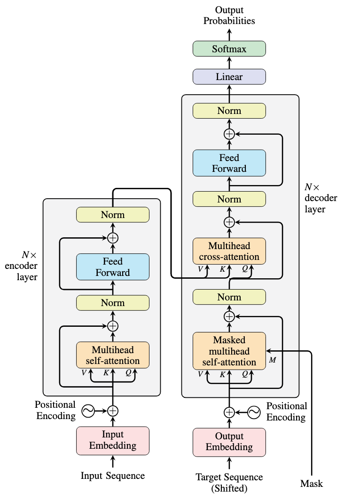

# Full Encoder-Decoder Transformer

> Kiến trúc Transformer nguyên bản của Vaswani et al. (2017), nền tảng của các mô hình Seq2Seq hiện đại như T5, UL2, PaLI, Speech Transformer, Pix2Seq, Flamingo và nhiều hệ thống Multimodal Transformer.



---

# 1. Giới thiệu

Trong họ Transformer hiện đại tồn tại ba kiến trúc nền tảng:

| Kiến trúc       | Thành phần                      |
| --------------- | ------------------------------- |
| Encoder-Only    | BERT                            |
| Decoder-Only    | GPT                             |
| Encoder-Decoder | Transformer nguyên bản, T5, UL2 |

Mục tiêu của kiến trúc Encoder-Decoder là học ánh xạ:

$$
X=(x_1,x_2,\dots,x_n) \rightarrow Y=(y_1,y_2,\dots,y_m)
$$

với:

$$
P(Y|X)= \prod_{t=1}^{m} P(y_t|y_{\lt t},X)
$$

Khác với GPT:

$$
P(X)= \prod_t P(x_t|x_{\lt t})
$$

GPT mô hình hóa một chuỗi.

Encoder-Decoder mô hình hóa quan hệ giữa hai chuỗi.

---

# 2. Kiến trúc tổng thể

```text
Input Tokens
      │
      ▼
 ┌──────────┐
 │ Encoder  │
 └──────────┘
      │
      ▼
Encoder Memory
      │
      │ Cross Attention
      ▼
 ┌──────────┐
 │ Decoder  │
 └──────────┘
      │
      ▼
Output Tokens
```

Toàn bộ mô hình gồm:

* Encoder Stack
* Decoder Stack
* Cross Attention

---

# 3. Encoder

## Mục tiêu

Encoder xây dựng biểu diễn ngữ cảnh toàn cục của chuỗi đầu vào.

Cho embedding:

$$
E \in \mathbb{R}^{n\times d}
$$

Encoder gồm:

$$
L
$$

tầng Transformer.

Khởi tạo:

$$
H^0=E
$$

Lặp:

$$
H^l=

EncoderLayer(H^{l-1})
$$

Kết quả:

$$
M
=

H^L
$$

với:

$$
M \in \mathbb{R}^{n\times d}
$$

được gọi là:

* Memory
* Context Representation
* Encoder States

---

# 4. Encoder Layer

Một tầng Encoder gồm:

```text
Input
  │
Self Attention
  │
Add & Norm
  │
Feed Forward
  │
Add & Norm
  │
Output
```

---

## Self Attention

Từ đầu vào:

$$
X
$$

tạo:

$$
Q=XW_Q
$$

$$
K=XW_K
$$

$$
V=XW_V
$$

Attention:

$$
Attention(Q,K,V)= softmax \left( \frac{QK^T}{\sqrt d} \right)V
$$

Mọi token đều nhìn thấy nhau.

---

# 5. Vai trò của Encoder

Encoder thực hiện:

$$
X \rightarrow M
$$

Trong đó:

$$
M_i= f(x_1,x_2,\dots,x_n)
$$

Mỗi vector chứa:

* thông tin ngữ nghĩa
* thông tin cú pháp
* ngữ cảnh toàn chuỗi
* quan hệ dài hạn

Encoder không sinh token.

Encoder chỉ xây dựng bộ nhớ ngữ cảnh.

---

# 6. Decoder

Decoder thực hiện sinh chuỗi đầu ra tự hồi quy.

Mục tiêu:

$$
P(Y|X)= \prod_{t=1}^{m} P(y_t|y_{\lt t},X)
$$

Tại bước:

$$
t
$$

Decoder sử dụng:

$$
y_{\lt t}
$$

và

$$
M
$$

để dự đoán:

$$
y_t
$$

---

# 7. Decoder Layer

Một tầng Decoder gồm:

```text
Input
 │
Masked Self Attention
 │
Add & Norm
 │
Cross Attention
 │
Add & Norm
 │
Feed Forward
 │
Add & Norm
 │
Output
```

Khác biệt duy nhất với Encoder là:

* Masked Self Attention
* Cross Attention

---

# 8. Masked Self Attention

Decoder phải sinh token tuần tự.

Do đó cần causal mask:

$$
Mask_{ij}= -\infty \quad j>i
$$

Attention:

$$
A=softmax \left( \frac{QK^T+Mask} {\sqrt d} \right)V
$$

Token thứ:

$$
t
$$

chỉ được nhìn thấy:

$$
1,\dots,t
$$

---

# 9. Cross Attention

Đây là thành phần quan trọng nhất của kiến trúc Encoder-Decoder.

---

## Query

Từ Decoder:

$$
Q=HW_Q
$$

---

## Key

Từ Encoder:

$$
K=MW_K
$$

---

## Value

Từ Encoder:

$$
V=MW_V
$$

---

Attention:

$$
CrossAttention= softmax \left( \frac{QK^T} {\sqrt d} \right)V
$$

---

# 10. Ý nghĩa của Cross Attention

Self Attention:

```text
Decoder ↔ Decoder
```

Cross Attention:

```text
Decoder ↔ Encoder
```

Decoder liên tục truy xuất thông tin từ Encoder Memory.

```text
Input
   │
Encoder
   │
Memory
   │
Cross Attention
   │
Decoder
   │
Output
```

Cross Attention chính là cầu nối giữa hai miền dữ liệu.

---

# 11. Thuật toán suy luận

## Bước 1

Mã hóa đầu vào:

$$
M = Encoder(X)
$$

---

## Bước 2

Khởi tạo:

```text
<BOS>
```

---

## Bước 3

Decoder dự đoán:

$$
P(y_1|X)
$$

---

## Bước 4

Sinh:

$$
y_1
$$

---

## Bước 5

Đưa lại vào Decoder:

$$
(BOS,y_1)
$$

---

## Bước 6

Sinh:

$$
y_2
$$

---

Tiếp tục:

$$
P(y_t|y_{\lt t},X)
$$

cho đến EOS.

---

# 12. Độ phức tạp tính toán

Cho:

* Input length = n
* Output length = m

Encoder:

$$
O(n^2)
$$

Decoder Self Attention:

$$
O(m^2)
$$

Cross Attention:

$$
O(mn)
$$

Tổng:

$$
O(n^2+m^2+mn)
$$

---

# 13. Tại sao GPT loại bỏ Encoder?

GPT chuyển mọi thứ thành một chuỗi duy nhất:

```text
Prompt + Response
```

Do đó:

```text
Encoder
Cross Attention
```

không còn cần thiết.

Lợi ích:

* ít tham số hơn
* latency thấp hơn
* dễ mở rộng quy mô

Vì vậy đa số LLM hiện đại là Decoder-Only.

---

# 14. Khi nào Encoder-Decoder tốt hơn?

Encoder-Decoder đặc biệt hiệu quả khi:

```text
Input Domain
        ↓
     Encoder
        ↓
      Memory
        ↓
 Cross Attention
        ↓
     Decoder
        ↓
Output Domain
```

Input và Output thuộc hai không gian khác nhau.

Ví dụ tổng quát:

* Text → Text
* Speech → Text
* Image → Text
* Video → Text
* Multimodal → Text

---

# 15. Các mô hình hiện đại sử dụng Encoder-Decoder

## T5

```text
Encoder
   +
Decoder
```

Toàn bộ NLP được biểu diễn thành:

```text
Text → Text
```

---

## UL2

```text
T5
+
Mixture of Denoisers
```

---

## PaLI

```text
Vision Encoder
      +
Language Decoder
```

---

## Speech Transformer

```text
Audio Encoder
      +
Text Decoder
```

---

## Pix2Seq

```text
Vision Encoder
      +
Autoregressive Decoder
```

---

## Flamingo

```text
Vision Encoder
      +
Language Decoder
```

---

## Kosmos

```text
Multimodal Encoder
       +
Language Decoder
```

---

# 16. Encoder-Decoder trong x-transformers

Trong thư viện x-transformers:

```python
XTransformer(
    ...
)
```

được xây dựng từ:

```text
Encoder
    +
Decoder
```

với:

```python
Encoder(...)
```

và:

```python
Decoder(
    cross_attend = True
)
```

Cross Attention là cơ chế trao đổi thông tin giữa Encoder và Decoder.

---

# 17. Công thức tổng quát

Encoder:

$$
M
= Encoder(X)
$$

Decoder:

$$
H_t= Decoder(y_{\lt t},M)
$$

Logits:

$$
z_t= W_oH_t+b
$$

Xác suất:

$$
P(y_t|y_{\lt t},X)= softmax(z_t)
$$

Toàn bộ mô hình:

$$
P(Y|X)= \prod_{t=1}^{m} P(y_t|y_{\lt t},X)
$$

---

# 18. Các khái niệm cần học trước

```text
Embedding
    ↓
Positional Encoding
    ↓
Self Attention
    ↓
Multi-Head Attention
    ↓
Feed Forward Network
    ↓
Transformer Encoder
    ↓
Transformer Decoder
    ↓
Cross Attention
    ↓
Encoder-Decoder Transformer
    ↓
T5
    ↓
UL2
    ↓
Multimodal Transformer
    ↓
x-transformers
```

---

# Kết luận

Encoder-Decoder Transformer là kiến trúc Seq2Seq tổng quát nhất trong họ Transformer.

Bản chất của mô hình là:

```text
Input
   ↓
Encoder
   ↓
Memory
   ↓
Cross Attention
   ↓
Autoregressive Decoder
   ↓
Output
```

Cả kiến trúc có thể được mô tả bởi:

$$
P(Y|X)= \prod_{t=1}^{m} P(y_t|y_{\lt t},X)
$$

Trong hệ sinh thái Transformer hiện đại:

* BERT giữ lại Encoder
* GPT giữ lại Decoder
* T5 giữ nguyên Encoder-Decoder
* UL2 mở rộng T5
* PaLI, Flamingo, Kosmos sử dụng Encoder-Decoder cho Multimodal Learning

Do đó, Full Encoder-Decoder Transformer là nền tảng lý thuyết quan trọng nhất cần nắm vững trước khi nghiên cứu các kiến trúc nâng cao trong x-transformers.


**Thư viện tham khảo**

```Python
import torch
from x_transformers import XTransformer

model = XTransformer(
    dim = 512,
    enc_num_tokens = 256,
    enc_depth = 6,
    enc_heads = 8,
    enc_max_seq_len = 1024,
    dec_num_tokens = 256,
    dec_depth = 6,
    dec_heads = 8,
    dec_max_seq_len = 1024,
    tie_token_emb = True      # tie embeddings of encoder and decoder
)

src = torch.randint(0, 256, (1, 1024))
src_mask = torch.ones_like(src).bool()
tgt = torch.randint(0, 256, (1, 1024))

loss = model(src, tgt, mask = src_mask) # (1, 1024, 512)
loss.backward()
```