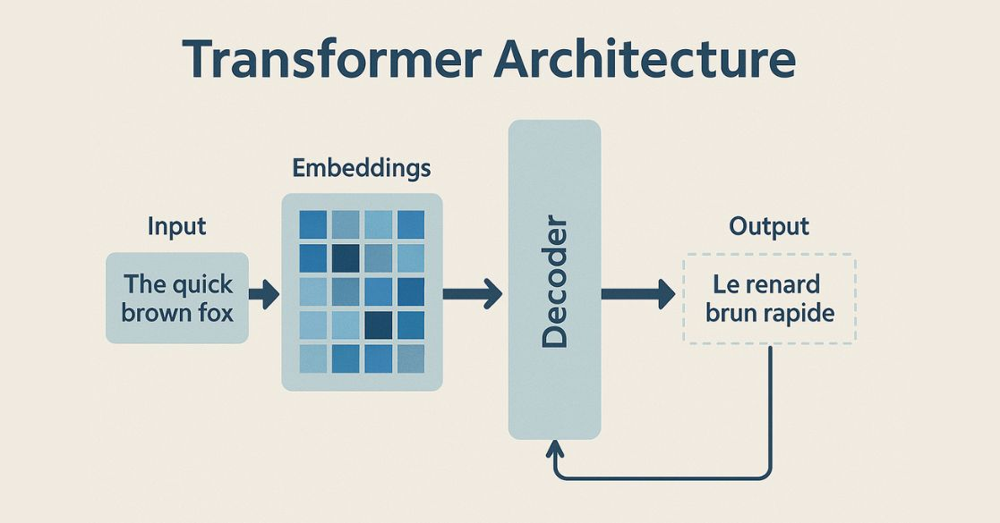

# X-Transformers

> A Research-Oriented Transformer Framework

---

# 1. X-Transformers Là Gì?

X-Transformers là thư viện nghiên cứu Transformer được phát triển bởi [lucidrains/x-transformers](https://github.com/lucidrains/x-transformers?utm_source=chatgpt.com).

Khác với các thư viện Transformer truyền thống, mục tiêu chính của X-Transformers không phải là cung cấp một mô hình cụ thể như:

* BERT
* GPT
* T5
* LLaMA

mà là xây dựng một **framework tổng quát** cho phép kết hợp và thử nghiệm hàng trăm biến thể Transformer khác nhau.

Có thể xem X-Transformers như:

$$
\text{Transformer Research Laboratory}
$$

thay vì:

$$
\text{Single Transformer Model}
$$

---

# 2. Mục Tiêu Của X-Transformers

Trong lịch sử Transformer, mỗi năm xuất hiện hàng trăm cải tiến:

* RoPE
* ALiBi
* Flash Attention
* RMSNorm
* SwiGLU
* Transformer-XL
* Multi Query Attention
* Grouped Query Attention
* Memory Tokens
* Dynamic Positional Bias

Mỗi kỹ thuật thường chỉ thay đổi một thành phần nhỏ trong kiến trúc Transformer.

X-Transformers cố gắng gom toàn bộ các ý tưởng đó vào một framework thống nhất.

Mục tiêu:

$$
Transformer = \text{Composable Components}
$$

---

# 3. Những Kiến Thức Phải Học Trước

Không nên đọc X-Transformers nếu chưa hiểu:

---

## 3.1 Linear Algebra

Cần thành thạo:

### Matrix Multiplication

$$
C=AB
$$

### Dot Product

$$
a \cdot b = \sum_i a_i b_i
$$

### Tensor

$$
X \in \mathbb{R}^{B \times N \times D}
$$

Trong đó:

* $B$: Batch
* $N$: Sequence Length
* $D$: Hidden Dimension

---

## 3.2 Probability

### Softmax

$$
Softmax(z_i) = \frac{e^{z_i}} {\sum_j e^{z_j}}
$$

### Cross Entropy

$$
L=-\sum_i y_i \log \hat y_i
$$

---

## 3.3 Neural Networks

Phải hiểu:

### Feed Forward Network

$$
FFN(x) = W_2 \sigma(W_1x)
$$

### Residual

$$
y=x+f(x)
$$

### LayerNorm

$$
LN(x) = \frac{x-\mu}{\sigma}
$$

---

## 3.4 Attention Mechanism

Đây là điều kiện bắt buộc.

Phải hiểu:

$$
Attention(Q,K,V) = Softmax \left( \frac{QK^T} {\sqrt{d_k}} \right) V
$$

Nếu chưa hiểu Attention thì không thể hiểu X-Transformers.

---

## 3.5 Encoder và Decoder

Phải hiểu:

### Encoder

$$
X \rightarrow H
$$

### Decoder

$$
(H,Y_{\lt t}) \rightarrow Y
$$

vì toàn bộ framework được xây dựng từ:

* Encoder
* Decoder
* Encoder-Decoder

---

# 4. Tư Tưởng Cốt Lõi Của X-Transformers

Transformer gốc:

$$
Input \rightarrow Attention \rightarrow FFN \rightarrow Output
$$

X-Transformers xem mỗi thành phần như một module độc lập.

Ví dụ:

$$
Attention \rightarrow RoPE \rightarrow FlashAttention \rightarrow MQA \rightarrow GQA
$$

hoặc

$$
FFN \rightarrow GEGLU \rightarrow SwiGLU \rightarrow MixtureOfExperts
$$

hoặc

$$
LayerNorm \rightarrow RMSNorm \rightarrow ScaleNorm
$$

Tư tưởng chính:

$$
Transformer = \text{Plug-and-Play Components}
$$

---

# 5. Kiến Trúc Nền Tảng Của Framework

Mọi biến thể đều bắt đầu từ:

<p align="center">
 
</p>


$$
Input \rightarrow Embedding \rightarrow Transformer Layers \rightarrow Output
$$

Trong đó:

$$
TransformerLayer = Attention+FeedForward+Residual+Normalization
$$

---

# 6. Các Họ Kiến Trúc Trong X-Transformers

Repository hỗ trợ ba loại kiến trúc chính.

---

## 6.1 Encoder-Only

$$
X \rightarrow Encoder \rightarrow H
$$

Kiểu BERT.

Đặc điểm:

* Bidirectional Attention
* Hiểu ngữ cảnh

---

## 6.2 Decoder-Only

$$
x_1 \rightarrow x_2 \rightarrow x_3 \rightarrow ...
$$

Kiểu GPT.

Đặc điểm:

* Causal Attention
* Sinh token

---

## 6.3 Encoder-Decoder

$$
Input \rightarrow Encoder \rightarrow Context \rightarrow Decoder \rightarrow Output
$$

Kiểu T5.

Đặc điểm:

* Cross Attention
* Seq2Seq

---

# 7. Những Thành Phần Quan Trọng Cần Học

Đây là các module xuất hiện liên tục trong repository.

---

# 8. Attention Variants

Transformer gốc:

$$
O= Softmax \left( \frac{QK^T} {\sqrt d} \right)V
$$

Nhưng X-Transformers hỗ trợ nhiều biến thể.

---

## Multi Head Attention

$$
head_i = Attention(Q_i,K_i,V_i)
$$

$$
MHA = Concat(head_1,\ldots,head_h)
$$

---

## Cross Attention

$$
Q \leftarrow Decoder
$$

$$
K,V \leftarrow Encoder
$$

---

## Memory Attention

Bổ sung token bộ nhớ:

$$
M= [m_1,m_2,\ldots,m_k]
$$

Cho phép lưu trữ thông tin dài hạn.

---

## Flash Attention

Mục tiêu:

Giảm chi phí bộ nhớ.

Attention chuẩn:

$$
O(n^2)
$$

Flash Attention tính toán theo block thay vì lưu toàn bộ ma trận attention.

---

# 9. Positional Encoding Variants

Transformer không biết thứ tự token.

Cần:

$$
X+P
$$

---

## Sinusoidal Position

$$
PE(pos,2i) = sin \left( \frac{pos}{10000^{2i/d}} \right)
$$

---

## Rotary Position Embedding (RoPE)

Thực hiện phép quay trong không gian vector.

Cho:

$$
q \rightarrow R(\theta)q
$$

$$
k \rightarrow R(\theta)k
$$

Được sử dụng trong:

* GPT-NeoX
* LLaMA
* Qwen

---

## ALiBi

Thay vì embedding vị trí:

$$
Score = QK^T+b
$$

với:

$$
b = m \times distance
$$

---

## Dynamic Positional Bias

Một hàm học:

$$
f(i-j)
$$

để biểu diễn khoảng cách tương đối.

---

# 10. Normalization Variants

Transformer gốc:

$$
LayerNorm
$$

---

## RMSNorm

Không sử dụng mean.

$$
RMS(x) = \sqrt{ \frac1d \sum_i x_i^2 }
$$

$$
RMSNorm(x) = \frac{x}{RMS(x)}
$$

Được dùng rộng rãi trong:

* LLaMA
* Mistral

---

# 11. Feed Forward Variants

Transformer gốc:

$$
FFN(x) = W_2 \sigma(W_1x)
$$

---

## GEGLU

$$
GEGLU(x) = (Wx) \otimes GELU(Vx)
$$

---

## SwiGLU

$$
SwiGLU(x) = (Wx) \otimes Swish(Vx)
$$

Được dùng trong:

* PaLM
* LLaMA

---

# 12. Long Context Mechanisms

Một chủ đề lớn của repository.

Mục tiêu:

$$
n \rightarrow 100k+
$$

token.

---

## Transformer-XL

Lưu trạng thái cũ:

$$
M_t = [H_{t-1},H_t]
$$

Cho phép ghi nhớ dài hạn.

---

## Memory Tokens

Thêm các token:

$$
m_1,\ldots,m_k
$$

vào chuỗi.

Attention có thể đọc và ghi lên các token này.

---

# 13. Hướng Học Repository

Không nên đọc code theo thứ tự file.

Nên học theo kiến thức.

---

## Giai Đoạn 1

Hiểu:

* Attention
* Multi Head Attention
* Encoder
* Decoder

---

## Giai Đoạn 2

Hiểu:

* RoPE
* RMSNorm
* SwiGLU

Đây là nền tảng của LLM hiện đại.

---

## Giai Đoạn 3

Hiểu:

* Flash Attention
* Memory Tokens
* Transformer-XL

Đây là các kỹ thuật mở rộng context.

---

## Giai Đoạn 4

Hiểu:

* MQA
* GQA
* Dynamic Position Bias

Đây là các tối ưu hóa hiệu năng.

---

# 14. X-Transformers Và LLM Hiện Đại

Hầu hết LLM hiện nay có thể được mô tả như:

$$
LLM = Transformer + RoPE + RMSNorm + SwiGLU + GQA + FlashAttention
$$

Điều đặc biệt là X-Transformers chứa gần như toàn bộ các thành phần này trong cùng một framework.

---

# 15. Kết Luận

X-Transformers không phải là một mô hình mới.

Nó là một tập hợp các ý tưởng Transformer hiện đại được chuẩn hóa trong một framework nghiên cứu thống nhất.

Tư duy cốt lõi khi học repository:

$$
Transformer = Attention + Position + Normalization + FeedForward + Residual
$$

Mọi kiến trúc mới xuất hiện trong GPT, LLaMA, T5, PaLM, Gemma, Qwen hay Mistral đều chỉ là sự thay đổi hoặc mở rộng một trong năm thành phần nền tảng này.


## Citations

```bibtex
@misc{vaswani2017attention,
    title   = {Attention Is All You Need},
    author  = {Ashish Vaswani and Noam Shazeer and Niki Parmar and Jakob Uszkoreit and Llion Jones and Aidan N. Gomez and Lukasz Kaiser and Illia Polosukhin},
    year    = {2017},
    eprint  = {1706.03762},
    archivePrefix = {arXiv},
    primaryClass = {cs.CL}
}
```

```bibtex
@article{DBLP:journals/corr/abs-1907-01470,
    author    = {Sainbayar Sukhbaatar and Edouard Grave and Guillaume Lample and Herv{\'{e}} J{\'{e}}gou and Armand Joulin},
    title     = {Augmenting Self-attention with Persistent Memory},
    journal   = {CoRR},
    volume    = {abs/1907.01470},
    year      = {2019},
    url       = {http://arxiv.org/abs/1907.01470}
}
```

```bibtex
@article{1910.05895,
    author  = {Toan Q. Nguyen and Julian Salazar},
    title   = {Transformers without Tears: Improving the Normalization of Self-Attention},
    year    = {2019},
    eprint  = {arXiv:1910.05895},
    doi     = {10.5281/zenodo.3525484},
}
```

```bibtex
@misc{shazeer2020glu,
    title   = {GLU Variants Improve Transformer},
    author  = {Noam Shazeer},
    year    = {2020},
    url     = {https://arxiv.org/abs/2002.05202}
}
```

```bibtex
@inproceedings{Zoph2022STMoEDS,
    title   = {ST-MoE: Designing Stable and Transferable Sparse Expert Models},
    author  = {Barret Zoph and Irwan Bello and Sameer Kumar and Nan Du and Yanping Huang and Jeff Dean and Noam M. Shazeer and William Fedus},
    year    = {2022}
}
```

```bibtex
@misc{bhojanapalli2020lowrank,
    title   = {Low-Rank Bottleneck in Multi-head Attention Models},
    author  = {Srinadh Bhojanapalli and Chulhee Yun and Ankit Singh Rawat and Sashank J. Reddi and Sanjiv Kumar},
    year    = {2020},
    eprint  = {2002.07028}
}
```

```bibtex
@misc{burtsev2020memory,
    title   = {Memory Transformer},
    author  = {Mikhail S. Burtsev and Grigory V. Sapunov},
    year    = {2020},
    eprint  = {2006.11527},
    archivePrefix = {arXiv},
    primaryClass = {cs.CL}
}
```

```bibtex
@misc{zhao2019explicit,
    title   = {Explicit Sparse Transformer: Concentrated Attention Through Explicit Selection},
    author  = {Guangxiang Zhao and Junyang Lin and Zhiyuan Zhang and Xuancheng Ren and Qi Su and Xu Sun},
    year    = {2019},
    eprint  = {1912.11637},
    archivePrefix = {arXiv},
    primaryClass = {cs.CL}
}
```

```bibtex
@misc{correia2019adaptively,
    title   = {Adaptively Sparse Transformers},
    author  = {Gonçalo M. Correia and Vlad Niculae and André F. T. Martins},
    year    = {2019},
    eprint  = {1909.00015},
    archivePrefix = {arXiv},
    primaryClass = {cs.CL}
}
```

```bibtex
@misc{shazeer2020talkingheads,
    title   = {Talking-Heads Attention},
    author  = {Noam Shazeer and Zhenzhong Lan and Youlong Cheng and Nan Ding and Le Hou},
    year    = {2020},
    eprint  = {2003.02436},
    archivePrefix = {arXiv},
    primaryClass = {cs.LG}
}
```

```bibtex
@misc{press2020improving,
    title   = {Improving Transformer Models by Reordering their Sublayers},
    author  = {Ofir Press and Noah A. Smith and Omer Levy},
    year    = {2020},
    eprint  = {1911.03864},
    archivePrefix = {arXiv},
    primaryClass = {cs.CL}
}
```

```bibtex
@misc{lu2019understanding,
    title   = {Understanding and Improving Transformer From a Multi-Particle Dynamic System Point of View},
    author  = {Yiping Lu and Zhuohan Li and Di He and Zhiqing Sun and Bin Dong and Tao Qin and Liwei Wang and Tie-Yan Liu},
    year    = {2019},
    eprint  = {1906.02762},
    archivePrefix = {arXiv},
    primaryClass = {cs.LG}
}
```

```bibtex
@misc{ke2020rethinking,
    title     = {Rethinking Positional Encoding in Language Pre-training},
    author    = {Guolin Ke and Di He and Tie-Yan Liu},
    year      = {2020},
    eprint    = {2006.15595},
    archivePrefix = {arXiv},
    primaryClass = {cs.CL}
}
```

```bibtex
@misc{dosovitskiy2020image,
    title   = {An Image is Worth 16x16 Words: Transformers for Image Recognition at Scale},
    author  = {Alexey Dosovitskiy and Lucas Beyer and Alexander Kolesnikov and Dirk Weissenborn and Xiaohua Zhai and Thomas Unterthiner and Mostafa Dehghani and Matthias Minderer and Georg Heigold and Sylvain Gelly and Jakob Uszkoreit and Neil Houlsby},
    year    = {2020},
    eprint  = {2010.11929},
    archivePrefix = {arXiv},
    primaryClass = {cs.CV}
}
```

```bibtex
@misc{huang2019attention,
    title   = {Attention on Attention for Image Captioning},
    author  = {Lun Huang and Wenmin Wang and Jie Chen and Xiao-Yong Wei},
    year    = {2019},
    eprint  = {1908.06954},
    archivePrefix = {arXiv},
    primaryClass = {cs.CV}
}
```

```bibtex
@misc{raffel2020exploring,
    title   = {Exploring the Limits of Transfer Learning with a Unified Text-to-Text Transformer},
    author  = {Colin Raffel and Noam Shazeer and Adam Roberts and Katherine Lee and Sharan Narang and Michael Matena and Yanqi Zhou and Wei Li and Peter J. Liu},
    year    = {2020},
    eprint  = {1910.10683},
    archivePrefix = {arXiv},
    primaryClass = {cs.LG}
}
```

```bibtex
@inproceedings{martins-etal-2020-sparse,
    title   = "Sparse Text Generation",
    author  = "Martins, Pedro Henrique  and
        Marinho, Zita  and
        Martins, Andr{\'e} F. T.",
    booktitle = "Proceedings of the 2020 Conference on Empirical Methods in Natural Language Processing (EMNLP)",
    month   = nov,
    year    = "2020",
    address = "Online",
    publisher = "Association for Computational Linguistics",
    url     = "https://www.aclweb.org/anthology/2020.emnlp-main.348"
}
```

```bibtex
@misc{he2020realformer,
    title   = {RealFormer: Transformer Likes Residual Attention},
    author  = {Ruining He and Anirudh Ravula and Bhargav Kanagal and Joshua Ainslie},
    year    = {2020},
    eprint  = {2012.11747},
    archivePrefix = {arXiv},
    primaryClass = {cs.LG}
}
```

```bibtex
@misc{carion2020endtoend,
    title   = {End-to-End Object Detection with Transformers},
    author  = {Nicolas Carion and Francisco Massa and Gabriel Synnaeve and Nicolas Usunier and Alexander Kirillov and Sergey Zagoruyko},
    year    = {2020},
    eprint  = {2005.12872},
    archivePrefix = {arXiv},
    primaryClass = {cs.CV}
}
```

```bibtex
@misc{press2021ALiBi,
    title   = {Train Short, Test Long: Attention with Linear Biases Enable Input Length Extrapolation},
    author  = {Ofir Press and Noah A. Smith and Mike Lewis},
    year    = {2021},
    url     = {https://ofir.io/train_short_test_long.pdf}
}
```

```bibtex
@misc{parisotto2019stabilizing,
    title     = {Stabilizing Transformers for Reinforcement Learning},
    author    = {Emilio Parisotto and H. Francis Song and Jack W. Rae and Razvan Pascanu and Caglar Gulcehre and Siddhant M. Jayakumar and Max Jaderberg and Raphael Lopez Kaufman and Aidan Clark and Seb Noury and Matthew M. Botvinick and Nicolas Heess and Raia Hadsell},
    year      = {2019},
    eprint    = {1910.06764},
    archivePrefix = {arXiv},
    primaryClass = {cs.LG}
}
```

```bibtex
@misc{narang2021transformer,
    title       = {Do Transformer Modifications Transfer Across Implementations and Applications?},
    author      = {Sharan Narang and Hyung Won Chung and Yi Tay and William Fedus and Thibault Fevry and Michael Matena and Karishma Malkan and Noah Fiedel and Noam Shazeer and Zhenzhong Lan and Yanqi Zhou and Wei Li and Nan Ding and Jake Marcus and Adam Roberts and Colin Raffel},
    year        = {2021},
    eprint      = {2102.11972},
    archivePrefix = {arXiv},
    primaryClass = {cs.LG}
}
```

```bibtex
@misc{zhang2019root,
    title   = {Root Mean Square Layer Normalization},
    author  = {Biao Zhang and Rico Sennrich},
    year    = {2019},
    eprint  = {1910.07467},
    archivePrefix = {arXiv},
    primaryClass = {cs.LG}
}
```

```bibtex
@inproceedings{Qin2023ScalingTT,
    title   = {Scaling TransNormer to 175 Billion Parameters},
    author  = {Zhen Qin and Dong Li and Weigao Sun and Weixuan Sun and Xuyang Shen and Xiaodong Han and Yunshen Wei and Baohong Lv and Fei Yuan and Xiao Luo and Y. Qiao and Yiran Zhong},
    year    = {2023},
    url     = {https://api.semanticscholar.org/CorpusID:260203124}
}
```

```bibtex
@misc{su2021roformer,
    title   = {RoFormer: Enhanced Transformer with Rotary Position Embedding},
    author  = {Jianlin Su and Yu Lu and Shengfeng Pan and Bo Wen and Yunfeng Liu},
    year    = {2021},
    eprint  = {2104.09864},
    archivePrefix = {arXiv},
    primaryClass = {cs.CL}
}
```

```bibtex
@inproceedings{Yang2025RopeTN,
    title   = {Rope to Nope and Back Again: A New Hybrid Attention Strategy},
    author  = {Bowen Yang and Bharat Venkitesh and Dwarak Talupuru and Hangyu Lin and David Cairuz and Phil Blunsom and Acyr F. Locatelli},
    year    = {2025},
    url     = {https://api.semanticscholar.org/CorpusID:276079501}
}
```

```bibtex
@inproceedings{Chen2023ExtendingCW,
    title   = {Extending Context Window of Large Language Models via Positional Interpolation},
    author  = {Shouyuan Chen and Sherman Wong and Liangjian Chen and Yuandong Tian},
    year    = {2023}
}
```

```bibtex
@inproceedings{Sun2022ALT,
  title     = {A Length-Extrapolatable Transformer},
  author    = {Yutao Sun and Li Dong and Barun Patra and Shuming Ma and Shaohan Huang and Alon Benhaim and Vishrav Chaudhary and Xia Song and Furu Wei},
  year      = {2022}
}
```

```bibtex
@Article{AlphaFold2021,
    author  = {Jumper, John and Evans, Richard and Pritzel, Alexander and Green, Tim and Figurnov, Michael and Ronneberger, Olaf and Tunyasuvunakool, Kathryn and Bates, Russ and {\v{Z}}{\'\i}dek, Augustin and Potapenko, Anna and Bridgland, Alex and Meyer, Clemens and Kohl, Simon A A and Ballard, Andrew J and Cowie, Andrew and Romera-Paredes, Bernardino and Nikolov, Stanislav and Jain, Rishub and Adler, Jonas and Back, Trevor and Petersen, Stig and Reiman, David and Clancy, Ellen and Zielinski, Michal and Steinegger, Martin and Pacholska, Michalina and Berghammer, Tamas and Bodenstein, Sebastian and Silver, David and Vinyals, Oriol and Senior, Andrew W and Kavukcuoglu, Koray and Kohli, Pushmeet and Hassabis, Demis},
    journal = {Nature},
    title   = {Highly accurate protein structure prediction with {AlphaFold}},
    year    = {2021},
    doi     = {10.1038/s41586-021-03819-2},
    note    = {(Accelerated article preview)},
}
```

```bibtex
@software{peng_bo_2021_5196578,
    author       = {PENG Bo},
    title        = {BlinkDL/RWKV-LM: 0.01},
    month        = {aug},
    year         = {2021},
    publisher    = {Zenodo},
    version      = {0.01},
    doi          = {10.5281/zenodo.5196578},
    url          = {https://doi.org/10.5281/zenodo.5196578}
}
```

```bibtex
@misc{csordás2021devil,
    title   = {The Devil is in the Detail: Simple Tricks Improve Systematic Generalization of Transformers},
    author  = {Róbert Csordás and Kazuki Irie and Jürgen Schmidhuber},
    year    = {2021},
    eprint  = {2108.12284},
    archivePrefix = {arXiv},
    primaryClass = {cs.LG}
}
```

```bibtex
@inproceedings{Locatello2020SlotAttention,
    title     = {Object-Centric Learning with Slot Attention},
    author    = {Francesco Locatello and Dirk Weissenborn and Thomas Unterthiner and Aravindh Mahendran and Georg Heigold and Jakob Uszkoreit and Alexey Dosovitskiy and Thomas Kipf},
    booktitle = {Advances in Neural Information Processing Systems},
    year      = {2020}
}
```

```bibtex
@inproceedings{wu2023invertedattention,
    title   = {Inverted-Attention Transformers can Learn Object Representations: Insights from Slot Attention},
    author  = {Yi-Fu Wu and Klaus Greff and Gamaleldin Fathy Elsayed and Michael Curtis Mozer and Thomas Kipf and Sjoerd van Steenkiste},
    booktitle = {UniReps:  the First Workshop on Unifying Representations in Neural Models},
    year    = {2023},
    url     = {https://openreview.net/forum?id=WgQZNoQ5AB}
}
```

```bibtex
@misc{so2021primer,
    title   = {Primer: Searching for Efficient Transformers for Language Modeling},
    author  = {David R. So and Wojciech Mańke and Hanxiao Liu and Zihang Dai and Noam Shazeer and Quoc V. Le},
    year    = {2021},
    eprint  = {2109.08668},
    archivePrefix = {arXiv},
    primaryClass = {cs.LG}
}
```

```bibtex
@misc{ding2021erniedoc,
    title   = {ERNIE-Doc: A Retrospective Long-Document Modeling Transformer},
    author  = {Siyu Ding and Junyuan Shang and Shuohuan Wang and Yu Sun and Hao Tian and Hua Wu and Haifeng Wang},
    year    = {2021},
    eprint  = {2012.15688},
    archivePrefix = {arXiv},
    primaryClass = {cs.CL}
}
```

```bibtex
@misc{ding2021cogview,
    title   = {CogView: Mastering Text-to-Image Generation via Transformers},
    author  = {Ming Ding and Zhuoyi Yang and Wenyi Hong and Wendi Zheng and Chang Zhou and Da Yin and Junyang Lin and Xu Zou and Zhou Shao and Hongxia Yang and Jie Tang},
    year    = {2021},
    eprint  = {2105.13290},
    archivePrefix = {arXiv},
    primaryClass = {cs.CV}
}
```

```bibtex
@inproceedings{anonymous2022normformer,
    title   = {NormFormer: Improved Transformer Pretraining with Extra Normalization},
    author  = {Anonymous},
    booktitle = {Submitted to The Tenth International Conference on Learning Representations },
    year    = {2022},
    url     = {https://openreview.net/forum?id=GMYWzWztDx5},
    note    = {under review}
}
```

```bibtex
@misc{henry2020querykey,
    title   = {Query-Key Normalization for Transformers},
    author  = {Alex Henry and Prudhvi Raj Dachapally and Shubham Pawar and Yuxuan Chen},
    year    = {2020},
    eprint  = {2010.04245},
    archivePrefix = {arXiv},
    primaryClass = {cs.CL}
}
```

```bibtex
@misc{liu2021swin,
    title   = {Swin Transformer V2: Scaling Up Capacity and Resolution},
    author  = {Ze Liu and Han Hu and Yutong Lin and Zhuliang Yao and Zhenda Xie and Yixuan Wei and Jia Ning and Yue Cao and Zheng Zhang and Li Dong and Furu Wei and Baining Guo},
    year    = {2021},
    eprint  = {2111.09883},
    archivePrefix = {arXiv},
    primaryClass = {cs.CV}
}
```

```bibtex
@article{Haviv2022TransformerLM,
    title   = {Transformer Language Models without Positional Encodings Still Learn Positional Information},
    author  = {Adi Haviv and Ori Ram and Ofir Press and Peter Izsak and Omer Levy},
    journal = {ArXiv},
    year    = {2022},
    volume  = {abs/2203.16634}
}
```

```bibtex
@article{chowdhery2022PaLM,
    title   = {PaLM: Scaling Language Modeling with Pathways},
    author  = {Chowdhery, Aakanksha et al},
    year    = {2022}
}
```

```bibtex
@article{Shazeer2019FastTD,
    title   = {Fast Transformer Decoding: One Write-Head is All You Need},
    author  = {Noam M. Shazeer},
    journal = {ArXiv},
    year    = {2019},
    volume  = {abs/1911.02150}
}
```

```bibtex
@article{Ainslie2023GQATG,
    title   = {GQA: Training Generalized Multi-Query Transformer Models from Multi-Head Checkpoints},
    author  = {Joshua Ainslie and James Lee-Thorp and Michiel de Jong and Yury Zemlyanskiy and Federico Lebr'on and Sumit K. Sanghai},
    journal = {ArXiv},
    year    = {2023},
    volume  = {abs/2305.13245},
    url     = {https://api.semanticscholar.org/CorpusID:258833177}
}
```

```bibtex
@article{Liu2022FCMFC,
    title   = {FCM: Forgetful Causal Masking Makes Causal Language Models Better Zero-Shot Learners},
    author  = {Hao Liu and Xinyang Geng and Lisa Lee and Igor Mordatch and Sergey Levine and Sharan Narang and P. Abbeel},
    journal = {ArXiv},
    year    = {2022},
    volume  = {abs/2210.13432}
}
```

```bibtex
@inproceedings{Huang2016DeepNW,
    title   = {Deep Networks with Stochastic Depth},
    author  = {Gao Huang and Yu Sun and Zhuang Liu and Daniel Sedra and Kilian Q. Weinberger},
    booktitle = {European Conference on Computer Vision},
    year    = {2016}
}
```

```bibtex
@inproceedings{Hua2022TransformerQI,
    title   = {Transformer Quality in Linear Time},
    author  = {Weizhe Hua and Zihang Dai and Hanxiao Liu and Quoc V. Le},
    booktitle = {International Conference on Machine Learning},
    year    = {2022}
}
```

```bibtex
@article{Chang2022MaskGITMG,
    title   = {MaskGIT: Masked Generative Image Transformer},
    author  = {Huiwen Chang and Han Zhang and Lu Jiang and Ce Liu and William T. Freeman},
    journal = {2022 IEEE/CVF Conference on Computer Vision and Pattern Recognition (CVPR)},
    year    = {2022},
    pages   = {11305-11315}
}
```

```bibtex
@article{Lezama2022ImprovedMI,
    title   = {Improved Masked Image Generation with Token-Critic},
    author  = {Jos{\'e} Lezama and Huiwen Chang and Lu Jiang and Irfan Essa},
    journal = {ArXiv},
    year    = {2022},
    volume  = {abs/2209.04439}
}
```

```bibtex
@misc{https://doi.org/10.48550/arxiv.2302.01327,
    doi     = {10.48550/ARXIV.2302.01327},
    url     = {https://arxiv.org/abs/2302.01327},
    author  = {Kumar, Manoj and Dehghani, Mostafa and Houlsby, Neil},
    title   = {Dual PatchNorm},
    publisher = {arXiv},
    year    = {2023},
    copyright = {Creative Commons Attribution 4.0 International}
}
```

```bibtex
@inproceedings{dao2022flashattention,
    title   = {Flash{A}ttention: Fast and Memory-Efficient Exact Attention with {IO}-Awareness},
    author  = {Dao, Tri and Fu, Daniel Y. and Ermon, Stefano and Rudra, Atri and R{\'e}, Christopher},
    booktitle = {Advances in Neural Information Processing Systems},
    year    = {2022}
}
```

```bibtex
@inproceedings{Dehghani2023ScalingVT,
    title   = {Scaling Vision Transformers to 22 Billion Parameters},
    author  = {Mostafa Dehghani and Josip Djolonga and Basil Mustafa and Piotr Padlewski and Jonathan Heek and Justin Gilmer and Andreas Steiner and Mathilde Caron and Robert Geirhos and Ibrahim M. Alabdulmohsin and Rodolphe Jenatton and Lucas Beyer and Michael Tschannen and Anurag Arnab and Xiao Wang and Carlos Riquelme and Matthias Minderer and Joan Puigcerver and Utku Evci and Manoj Kumar and Sjoerd van Steenkiste and Gamaleldin F. Elsayed and Aravindh Mahendran and Fisher Yu and Avital Oliver and Fantine Huot and Jasmijn Bastings and Mark Collier and Alexey A. Gritsenko and Vighnesh Birodkar and Cristina Nader Vasconcelos and Yi Tay and Thomas Mensink and Alexander Kolesnikov and Filip Paveti'c and Dustin Tran and Thomas Kipf and Mario Luvci'c and Xiaohua Zhai and Daniel Keysers and Jeremiah Harmsen and Neil Houlsby},
    year    = {2023}
}
```

```bibtex
@article{Beyer2022BetterPV,
    title   = {Better plain ViT baselines for ImageNet-1k},
    author  = {Lucas Beyer and Xiaohua Zhai and Alexander Kolesnikov},
    journal = {ArXiv},
    year    = {2022},
    volume  = {abs/2205.01580}
}
```

```bibtex
@article{Kazemnejad2023TheIO,
    title   = {The Impact of Positional Encoding on Length Generalization in Transformers},
    author  = {Amirhossein Kazemnejad and Inkit Padhi and Karthikeyan Natesan Ramamurthy and Payel Das and Siva Reddy},
    journal = {ArXiv},
    year    = {2023},
    volume  = {abs/2305.19466}
}
```

```bibtex
@misc{bloc97-2023
    title   = {NTK-Aware Scaled RoPE allows LLaMA models to have extended (8k+) context size without any fine-tuning and minimal perplexity degradation.},
    author  = {/u/bloc97},
    url     = {https://www.reddit.com/r/LocalLLaMA/comments/14lz7j5/ntkaware_scaled_rope_allows_llama_models_to_have/}
}
```

```bibtex
@inproceedings{Zoph2022STMoEDS,
    title   = {ST-MoE: Designing Stable and Transferable Sparse Expert Models},
    author  = {Barret Zoph and Irwan Bello and Sameer Kumar and Nan Du and Yanping Huang and Jeff Dean and Noam M. Shazeer and William Fedus},
    year    = {2022}
}
```

```bibtex
@article{Lan2019ALBERTAL,
    title   = {ALBERT: A Lite BERT for Self-supervised Learning of Language Representations},
    author  = {Zhenzhong Lan and Mingda Chen and Sebastian Goodman and Kevin Gimpel and Piyush Sharma and Radu Soricut},
    journal = {ArXiv},
    year    = {2019},
    volume  = {abs/1909.11942},
    url     = {https://api.semanticscholar.org/CorpusID:202888986}
}
```

```bibtex
@inproceedings{Li2022ContrastiveDO,
    title   = {Contrastive Decoding: Open-ended Text Generation as Optimization},
    author  = {Xiang Lisa Li and Ari Holtzman and Daniel Fried and Percy Liang and Jason Eisner and Tatsunori Hashimoto and Luke Zettlemoyer and Mike Lewis},
    booktitle = {Annual Meeting of the Association for Computational Linguistics},
    year    = {2022},
    url     = {https://api.semanticscholar.org/CorpusID:253157949}
}
```

```bibtex
@inproceedings{OBrien2023ContrastiveDI,
    title   = {Contrastive Decoding Improves Reasoning in Large Language Models},
    author  = {Sean O'Brien and Mike Lewis},
    year    = {2023},
    url     = {https://api.semanticscholar.org/CorpusID:261884427}
}
```

```bibtex
@inproceedings{Darcet2023VisionTN,
    title   = {Vision Transformers Need Registers},
    author  = {Timoth'ee Darcet and Maxime Oquab and Julien Mairal and Piotr Bojanowski},
    year    = {2023},
    url     = {https://api.semanticscholar.org/CorpusID:263134283}
}
```

```bibtex
@article{Bondarenko2023QuantizableTR,
    title   = {Quantizable Transformers: Removing Outliers by Helping Attention Heads Do Nothing},
    author  = {Yelysei Bondarenko and Markus Nagel and Tijmen Blankevoort},
    journal = {ArXiv},
    year    = {2023},
    volume  = {abs/2306.12929},
    url     = {https://api.semanticscholar.org/CorpusID:259224568}
}
```

```bibtex
@inproceedings{Golkar2023xValAC,
    title   = {xVal: A Continuous Number Encoding for Large Language Models},
    author  = {Siavash Golkar and Mariel Pettee and Michael Eickenberg and Alberto Bietti and M. Cranmer and G{\'e}raud Krawezik and Francois Lanusse and Michael McCabe and Ruben Ohana and Liam Parker and Bruno R{\'e}galdo-Saint Blancard and Tiberiu Teşileanu and Kyunghyun Cho and Shirley Ho},
    year    = {2023},
    url     = {https://api.semanticscholar.org/CorpusID:263622222}
}
```

```bibtex
@article{Wang2022DeepNetST,
    title   = {DeepNet: Scaling Transformers to 1, 000 Layers},
    author  = {Hongyu Wang and Shuming Ma and Li Dong and Shaohan Huang and Dongdong Zhang and Furu Wei},
    journal = {ArXiv},
    year    = {2022},
    volume  = {abs/2203.00555},
    url     = {https://api.semanticscholar.org/CorpusID:247187905}
}
```

```bibtex
@article{Rafailov2023DirectPO,
    title   = {Direct Preference Optimization: Your Language Model is Secretly a Reward Model},
    author  = {Rafael Rafailov and Archit Sharma and Eric Mitchell and Stefano Ermon and Christopher D. Manning and Chelsea Finn},
    journal = {ArXiv},
    year    = {2023},
    volume  = {abs/2305.18290},
    url     = {https://api.semanticscholar.org/CorpusID:258959321}
}
```

```bibtex
@misc{xAI2024Grok,
    author = {xAI},
    title  = {Grok},
    year   = {2024},
    publisher = {GitHub},
    journal = {GitHub repository},
    howpublished = {\url{https://github.com/xai-org/grok-1}},
}
```

```bibtex
@inproceedings{Golovneva2024ContextualPE,
    title   = {Contextual Position Encoding: Learning to Count What's Important},
    author  = {Olga Golovneva and Tianlu Wang and Jason Weston and Sainbayar Sukhbaatar},
    year    = {2024},
    url     = {https://api.semanticscholar.org/CorpusID:270094992}
}
```

```bibtex
@article{Peebles2022ScalableDM,
    title   = {Scalable Diffusion Models with Transformers},
    author  = {William S. Peebles and Saining Xie},
    journal = {2023 IEEE/CVF International Conference on Computer Vision (ICCV)},
    year    = {2022},
    pages   = {4172-4182},
    url     = {https://api.semanticscholar.org/CorpusID:254854389}
}
```

```bibtex
@misc{Rubin2024,
    author  = {Ohad Rubin},
    url     = {https://medium.com/@ohadrubin/exploring-weight-decay-in-layer-normalization-challenges-and-a-reparameterization-solution-ad4d12c24950}
}
```

```bibtex
@article{Mesnard2024GemmaOM,
    title   = {Gemma: Open Models Based on Gemini Research and Technology},
    author  = {Gemma Team Thomas Mesnard and Cassidy Hardin and Robert Dadashi and Surya Bhupatiraju and Shreya Pathak and L. Sifre and Morgane Riviere and Mihir Kale and J Christopher Love and Pouya Dehghani Tafti and L'eonard Hussenot and Aakanksha Chowdhery and Adam Roberts and Aditya Barua and Alex Botev and Alex Castro-Ros and Ambrose Slone and Am'elie H'eliou and Andrea Tacchetti and Anna Bulanova and Antonia Paterson and Beth Tsai and Bobak Shahriari and Charline Le Lan and Christopher A. Choquette-Choo and Cl'ement Crepy and Daniel Cer and Daphne Ippolito and David Reid and Elena Buchatskaya and Eric Ni and Eric Noland and Geng Yan and George Tucker and George-Christian Muraru and Grigory Rozhdestvenskiy and Henryk Michalewski and Ian Tenney and Ivan Grishchenko and Jacob Austin and James Keeling and Jane Labanowski and Jean-Baptiste Lespiau and Jeff Stanway and Jenny Brennan and Jeremy Chen and Johan Ferret and Justin Chiu and Justin Mao-Jones and Katherine Lee and Kathy Yu and Katie Millican and Lars Lowe Sjoesund and Lisa Lee and Lucas Dixon and Machel Reid and Maciej Mikula and Mateo Wirth and Michael Sharman and Nikolai Chinaev and Nithum Thain and Olivier Bachem and Oscar Chang and Oscar Wahltinez and Paige Bailey and Paul Michel and Petko Yotov and Pier Giuseppe Sessa and Rahma Chaabouni and Ramona Comanescu and Reena Jana and Rohan Anil and Ross McIlroy and Ruibo Liu and Ryan Mullins and Samuel L Smith and Sebastian Borgeaud and Sertan Girgin and Sholto Douglas and Shree Pandya and Siamak Shakeri and Soham De and Ted Klimenko and Tom Hennigan and Vladimir Feinberg and Wojciech Stokowiec and Yu-hui Chen and Zafarali Ahmed and Zhitao Gong and Tris Brian Warkentin and Ludovic Peran and Minh Giang and Cl'ement Farabet and Oriol Vinyals and Jeffrey Dean and Koray Kavukcuoglu and Demis Hassabis and Zoubin Ghahramani and Douglas Eck and Joelle Barral and Fernando Pereira and Eli Collins and Armand Joulin and Noah Fiedel and Evan Senter and Alek Andreev and Kathleen Kenealy},
    journal = {ArXiv},
    year    = {2024},
    volume  = {abs/2403.08295},
    url     = {https://api.semanticscholar.org/CorpusID:268379206}
}
```

```bibtex
@article{Nguyen2024MinPS,
    title   = {Min P Sampling: Balancing Creativity and Coherence at High Temperature},
    author  = {Minh Nguyen and Andrew Baker and Andreas Kirsch and Clement Neo},
    journal = {ArXiv},
    year    = {2024},
    volume  = {abs/2407.01082},
    url     = {https://api.semanticscholar.org/CorpusID:270870613}
}
```

```bibtex
@article{Bao2022AllAW,
    title   = {All are Worth Words: A ViT Backbone for Diffusion Models},
    author  = {Fan Bao and Shen Nie and Kaiwen Xue and Yue Cao and Chongxuan Li and Hang Su and Jun Zhu},
    journal = {2023 IEEE/CVF Conference on Computer Vision and Pattern Recognition (CVPR)},
    year    = {2022},
    pages   = {22669-22679},
    url     = {https://api.semanticscholar.org/CorpusID:253581703}
}
```

```bibtex
@article{Jumper2021HighlyAP,
    title   = {Highly accurate protein structure prediction with AlphaFold},
    author  = {John M. Jumper and Richard Evans and Alexander Pritzel and Tim Green and Michael Figurnov and Olaf Ronneberger and Kathryn Tunyasuvunakool and Russ Bates and Augustin Ž{\'i}dek and Anna Potapenko and Alex Bridgland and Clemens Meyer and Simon A A Kohl and Andy Ballard and Andrew Cowie and Bernardino Romera-Paredes and Stanislav Nikolov and Rishub Jain and Jonas Adler and Trevor Back and Stig Petersen and David Reiman and Ellen Clancy and Michal Zielinski and Martin Steinegger and Michalina Pacholska and Tamas Berghammer and Sebastian Bodenstein and David Silver and Oriol Vinyals and Andrew W. Senior and Koray Kavukcuoglu and Pushmeet Kohli and Demis Hassabis},
    journal = {Nature},
    year    = {2021},
    volume  = {596},
    pages   = {583 - 589},
    url     = {https://api.semanticscholar.org/CorpusID:235959867}
}
```

```bibtex
@article{Yang2017BreakingTS,
    title     = {Breaking the Softmax Bottleneck: A High-Rank RNN Language Model},
    author    = {Zhilin Yang and Zihang Dai and Ruslan Salakhutdinov and William W. Cohen},
    journal   = {ArXiv},
    year      = {2017},
    volume    = {abs/1711.03953},
    url       = {https://api.semanticscholar.org/CorpusID:26238954}
}
```

```bibtex
@inproceedings{Kanai2018SigsoftmaxRO,
    title   = {Sigsoftmax: Reanalysis of the Softmax Bottleneck},
    author  = {Sekitoshi Kanai and Yasuhiro Fujiwara and Yuki Yamanaka and Shuichi Adachi},
    booktitle = {Neural Information Processing Systems},
    year    = {2018},
    url     = {https://api.semanticscholar.org/CorpusID:44064935}
```

```bibtex
@article{Kim2020TheLC,
    title   = {The Lipschitz Constant of Self-Attention},
    author  = {Hyunjik Kim and George Papamakarios and Andriy Mnih},
    journal = {ArXiv},
    year    = {2020},
    volume  = {abs/2006.04710},
    url     = {https://api.semanticscholar.org/CorpusID:219530837}
}
```

```bibtex
@inproceedings{Ramapuram2024TheoryAA,
    title   = {Theory, Analysis, and Best Practices for Sigmoid Self-Attention},
    author  = {Jason Ramapuram and Federico Danieli and Eeshan Gunesh Dhekane and Floris Weers and Dan Busbridge and Pierre Ablin and Tatiana Likhomanenko and Jagrit Digani and Zijin Gu and Amitis Shidani and Russ Webb},
    year    = {2024},
    url     = {https://api.semanticscholar.org/CorpusID:272463580}
}
```

```bibtex
@inproceedings{Leviathan2024SelectiveAI,
    title   = {Selective Attention Improves Transformer},
    author  = {Yaniv Leviathan and Matan Kalman and Yossi Matias},
    year    = {2024},
    url     = {https://api.semanticscholar.org/CorpusID:273098114}
}
```

```bibtex
@article{Bai2019DeepEM,
    title   = {Deep Equilibrium Models},
    author  = {Shaojie Bai and J. Zico Kolter and Vladlen Koltun},
    journal = {ArXiv},
    year    = {2019},
    volume  = {abs/1909.01377},
    url     = {https://api.semanticscholar.org/CorpusID:202539738}
}
```

```bibtex
@article{Wu2021MuseMorphoseFA,
    title   = {MuseMorphose: Full-Song and Fine-Grained Piano Music Style Transfer With One Transformer VAE},
    author  = {Shih-Lun Wu and Yi-Hsuan Yang},
    journal = {IEEE/ACM Transactions on Audio, Speech, and Language Processing},
    year    = {2021},
    volume  = {31},
    pages   = {1953-1967},
    url     = {https://api.semanticscholar.org/CorpusID:234338162}
}
```

```bibtex
@inproceedings{Zhou2024ValueRL,
    title   = {Value Residual Learning For Alleviating Attention Concentration In Transformers},
    author  = {Zhanchao Zhou and Tianyi Wu and Zhiyun Jiang and Zhenzhong Lan},
    year    = {2024},
    url     = {https://api.semanticscholar.org/CorpusID:273532030}
}
```

```bibtex
@inproceedings{anonymous2024forgetting,
    title   = {Forgetting Transformer: Softmax Attention with a Forget Gate},
    author  = {Anonymous},
    booktitle = {Submitted to The Thirteenth International Conference on Learning Representations},
    year    = {2024},
    url     = {https://openreview.net/forum?id=q2Lnyegkr8},
    note    = {under review}
}
```

```bibtex
@inproceedings{anonymous2024from,
    title   = {From {MLP} to Neo{MLP}: Leveraging Self-Attention for Neural Fields},
    author  = {Anonymous},
    booktitle = {Submitted to The Thirteenth International Conference on Learning Representations},
    year    = {2024},
    url     = {https://openreview.net/forum?id=A8Vuf2e8y6},
    note    = {under review}
}
```

```bibtex
@inproceedings{Duvvuri2024LASERAW,
    title   = {LASER: Attention with Exponential Transformation},
    author  = {Sai Surya Duvvuri and Inderjit S. Dhillon},
    year    = {2024},
    url     = {https://api.semanticscholar.org/CorpusID:273849947}
}
```

```bibtex
@article{Zhu2024HyperConnections,
    title   = {Hyper-Connections},
    author  = {Defa Zhu and Hongzhi Huang and Zihao Huang and Yutao Zeng and Yunyao Mao and Banggu Wu and Qiyang Min and Xun Zhou},
    journal = {ArXiv},
    year    = {2024},
    volume  = {abs/2409.19606},
    url     = {https://api.semanticscholar.org/CorpusID:272987528}
}
```

```bibtex
@inproceedings{anonymous2024hymba,
    title   = {Hymba: A Hybrid-head Architecture for Small Language Models},
    author  = {Anonymous},
    booktitle = {Submitted to The Thirteenth International Conference on Learning Representations},
    year    = {2024},
    url     = {https://openreview.net/forum?id=A1ztozypga},
    note    = {under review}
}
```

```bibtex
@article{Shao2024DeepSeekV2AS,
    title   = {DeepSeek-V2: A Strong, Economical, and Efficient Mixture-of-Experts Language Model},
    author  = {Zhihong Shao and Damai Dai and Daya Guo and Bo Liu (Benjamin Liu) and Zihan Wang and Huajian Xin},
    journal = {ArXiv},
    year    = {2024},
    volume  = {abs/2405.04434},
    url     = {https://api.semanticscholar.org/CorpusID:269613809}
}
```

```bibtex
@inproceedings{Gerasimov2025YouDN,
    title   = {You Do Not Fully Utilize Transformer's Representation Capacity},
    author  = {Gleb Gerasimov and Yaroslav Aksenov and Nikita Balagansky and Viacheslav Sinii and Daniil Gavrilov},
    year    = {2025},
    url     = {https://api.semanticscholar.org/CorpusID:276317819}
}
```

```bibtex
@inproceedings{Hu2024TheBS,
    title   = {The Belief State Transformer},
    author  = {Edward S. Hu and Kwangjun Ahn and Qinghua Liu and Haoran Xu and Manan Tomar and Ada Langford and Dinesh Jayaraman and Alex Lamb and John Langford},
    year    = {2024},
    url     = {https://api.semanticscholar.org/CorpusID:273707334}
}
```

```bibtex
@article{Charpentier2024GPTOB,
    title   = {GPT or BERT: why not both?},
    author  = {Lucas Georges Gabriel Charpentier and David Samuel},
    journal = {ArXiv},
    year    = {2024},
    volume  = {abs/2410.24159},
    url     = {https://api.semanticscholar.org/CorpusID:273707069}
}
```

```bibtex
@inproceedings{Zhu2025TransformersWN,
    title   = {Transformers without Normalization},
    author  = {Jiachen Zhu and Xinlei Chen and Kaiming He and Yann LeCun and Zhuang Liu},
    year    = {2025},
    url     = {https://api.semanticscholar.org/CorpusID:276961218}
}
```

```bibtex
@article{Pagnoni2024ByteLT,
    title   = {Byte Latent Transformer: Patches Scale Better Than Tokens},
    author  = {Artidoro Pagnoni and Ram Pasunuru and Pedro Rodriguez and John Nguyen and Benjamin Muller and Margaret Li and Chunting Zhou and Lili Yu and Jason Weston and Luke S. Zettlemoyer and Gargi Ghosh and Mike Lewis and Ari Holtzman and Srinivasan Iyer},
    journal = {ArXiv},
    year    = {2024},
    volume  = {abs/2412.09871},
    url     = {https://api.semanticscholar.org/CorpusID:274762821}
}
```

```bibtex
@misc{Jordan2024,
    author       = {Keller Jordan and Braden Koszarsky},
    title        = {modded-nanogpt (value embeddings from nanogpt speedrun)},
    year         = {2024},
    publisher    = {GitHub},
    journal      = {GitHub repository},
    howpublished = {https://github.com/KellerJordan/modded-nanogpt},
}
```

```bibtex
@inproceedings{Assran2025VJEPA2S,
    title   = {V-JEPA 2: Self-Supervised Video Models Enable Understanding, Prediction and Planning},
    author  = {Mahmoud Assran and Adrien Bardes and David Fan and Quentin Garrido and Russell Howes and Mojtaba Komeili and Matthew Muckley and Ammar Rizvi and Claire Roberts and Koustuv Sinha and Artem Zholus and Sergio Arnaud and Abha Gejji and Ada Martin and Francois Robert Hogan and Daniel Dugas and Piotr Bojanowski and Vasil Khalidov and Patrick Labatut and Francisco Massa and Marc Szafraniec and Kapil Krishnakumar and Yong Li and Xiaodong Ma and Sarath Chandar and Franziska Meier and Yann LeCun and Michael Rabbat and Nicolas Ballas and Fair at Meta and Mila - Qu{\'e}bec and AI Institute and Polytechnique Montr{\'e}al},
    year    = {2025},
    url     = {https://api.semanticscholar.org/CorpusID:279306055}
}
```

```bibtex
@misc{bloem2025universalpretrainingiteratedrandom,
    title   = {Universal pre-training by iterated random computation},
    author  = {Peter Bloem},
    year    = {2025},
    eprint  = {2506.20057},
    archivePrefix = {arXiv},
    primaryClass = {cs.LG},
    url     = {https://arxiv.org/abs/2506.20057},
}
```

```bibtex
@misc{openai_gpt_oss,
    author       = {OpenAI},
    title        = {Introducing gpt-oss},
    howpublished = {https://openai.com/index/introducing-gpt-oss},
    month        = {August},
    year         = {2025}
}
```

```bibtex
@article{Sahoo2024SimpleAE,
    title   = {Simple and Effective Masked Diffusion Language Models},
    author  = {Subham Sekhar Sahoo and Marianne Arriola and Yair Schiff and Aaron Gokaslan and Edgar Marroquin and Justin T Chiu and Alexander Rush and Volodymyr Kuleshov},
    journal = {ArXiv},
    year    = {2024},
    volume  = {abs/2406.07524},
    url     = {https://api.semanticscholar.org/CorpusID:270380319}
}
```

```bibtex
@misc{kimiteam2025kimik2openagentic,
    title   = {Kimi K2: Open Agentic Intelligence},
    author  = {Kimi Team and Yifan Bai and Yiping Bao and Guanduo Chen and Jiahao Chen and Ningxin Chen and Ruijue Chen and Yanru Chen and Yuankun Chen and Yutian Chen and Zhuofu Chen and Jialei Cui and Hao Ding and Mengnan Dong and Angang Du and Chenzhuang Du and Dikang Du and Yulun Du and Yu Fan and Yichen Feng and Kelin Fu and Bofei Gao and Hongcheng Gao and Peizhong Gao and Tong Gao and Xinran Gu and Longyu Guan and Haiqing Guo and Jianhang Guo and Hao Hu and Xiaoru Hao and Tianhong He and Weiran He and Wenyang He and Chao Hong and Yangyang Hu and Zhenxing Hu and Weixiao Huang and Zhiqi Huang and Zihao Huang and Tao Jiang and Zhejun Jiang and Xinyi Jin and Yongsheng Kang and Guokun Lai and Cheng Li and Fang Li and Haoyang Li and Ming Li and Wentao Li and Yanhao Li and Yiwei Li and Zhaowei Li and Zheming Li and Hongzhan Lin and Xiaohan Lin and Zongyu Lin and Chengyin Liu and Chenyu Liu and Hongzhang Liu and Jingyuan Liu and Junqi Liu and Liang Liu and Shaowei Liu and T. Y. Liu and Tianwei Liu and Weizhou Liu and Yangyang Liu and Yibo Liu and Yiping Liu and Yue Liu and Zhengying Liu and Enzhe Lu and Lijun Lu and Shengling Ma and Xinyu Ma and Yingwei Ma and Shaoguang Mao and Jie Mei and Xin Men and Yibo Miao and Siyuan Pan and Yebo Peng and Ruoyu Qin and Bowen Qu and Zeyu Shang and Lidong Shi and Shengyuan Shi and Feifan Song and Jianlin Su and Zhengyuan Su and Xinjie Sun and Flood Sung and Heyi Tang and Jiawen Tao and Qifeng Teng and Chensi Wang and Dinglu Wang and Feng Wang and Haiming Wang and Jianzhou Wang and Jiaxing Wang and Jinhong Wang and Shengjie Wang and Shuyi Wang and Yao Wang and Yejie Wang and Yiqin Wang and Yuxin Wang and Yuzhi Wang and Zhaoji Wang and Zhengtao Wang and Zhexu Wang and Chu Wei and Qianqian Wei and Wenhao Wu and Xingzhe Wu and Yuxin Wu and Chenjun Xiao and Xiaotong Xie and Weimin Xiong and Boyu Xu and Jing Xu and Jinjing Xu and L. H. Xu and Lin Xu and Suting Xu and Weixin Xu and Xinran Xu and Yangchuan Xu and Ziyao Xu and Junjie Yan and Yuzi Yan and Xiaofei Yang and Ying Yang and Zhen Yang and Zhilin Yang and Zonghan Yang and Haotian Yao and Xingcheng Yao and Wenjie Ye and Zhuorui Ye and Bohong Yin and Longhui Yu and Enming Yuan and Hongbang Yuan and Mengjie Yuan and Haobing Zhan and Dehao Zhang and Hao Zhang and Wanlu Zhang and Xiaobin Zhang and Yangkun Zhang and Yizhi Zhang and Yongting Zhang and Yu Zhang and Yutao Zhang and Yutong Zhang and Zheng Zhang and Haotian Zhao and Yikai Zhao and Huabin Zheng and Shaojie Zheng and Jianren Zhou and Xinyu Zhou and Zaida Zhou and Zhen Zhu and Weiyu Zhuang and Xinxing Zu},
    year    = {2025},
    eprint  = {2507.20534},
    archivePrefix = {arXiv},
    primaryClass = {cs.LG},
    url = {https://arxiv.org/abs/2507.20534},
}
```

```bibtex
@misc{zhao2023learningfinegrainedbimanualmanipulation,
    title   = {Learning Fine-Grained Bimanual Manipulation with Low-Cost Hardware},
    author  = {Tony Z. Zhao and Vikash Kumar and Sergey Levine and Chelsea Finn},
    year    = {2023},
    eprint  = {2304.13705},
    archivePrefix = {arXiv},
    primaryClass = {cs.RO},
    url     = {https://arxiv.org/abs/2304.13705},
}
```

```bibtex
@misc{jordan2024muon,
  author    = {Keller Jordan and Yuchen Jin and Vlado Boza and Jiacheng You and Franz Cesista and Laker Newhouse and Jeremy Bernstein},
  title     = {Muon: An optimizer for hidden layers in neural networks},
  year      = {2024},
  url       = {https://kellerjordan.github.io/posts/muon/}
}
```

```bibtex
@misc{wang2025muonoutperformsadamtailend,
    title   = {Muon Outperforms Adam in Tail-End Associative Memory Learning},
    author  = {Shuche Wang and Fengzhuo Zhang and Jiaxiang Li and Cunxiao Du and Chao Du and Tianyu Pang and Zhuoran Yang and Mingyi Hong and Vincent Y. F. Tan},
    year    = {2025},
    eprint  = {2509.26030},
    archivePrefix = {arXiv},
    primaryClass = {cs.LG},
    url     = {https://arxiv.org/abs/2509.26030},
}
```

```bibtex
@misc{yan2017hierarchicalmultiscaleattentionnetworks,
    title   = {Hierarchical Multi-scale Attention Networks for Action Recognition},
    author  = {Shiyang Yan and Jeremy S. Smith and Wenjin Lu and Bailing Zhang},
    year    = {2017},
    eprint  = {1708.07590},
    archivePrefix = {arXiv},
    primaryClass = {cs.CV},
    url     = {https://arxiv.org/abs/1708.07590},
}
```

```bibtex
@misc{lv2025expressiveattentionnegativeweights,
    title   = {More Expressive Attention with Negative Weights},
    author  = {Ang Lv and Ruobing Xie and Shuaipeng Li and Jiayi Liao and Xingwu Sun and Zhanhui Kang and Di Wang and Rui Yan},
    year    = {2025},
    eprint  = {2411.07176},
    archivePrefix = {arXiv},
    primaryClass = {cs.CL},
    url     = {https://arxiv.org/abs/2411.07176},
}
```

```bibtex
@inproceedings{Fleuret2025TheFT,
    title   = {The Free Transformer},
    author  = {Franccois Fleuret},
    year    = {2025},
    url     = {https://api.semanticscholar.org/CorpusID:282210283}
}
```

```bibtex
@inproceedings{anonymous2025beliefformer,
    title   = {BeliefFormer: Belief Attention in Transformer},
    author  = {Anonymous},
    booktitle = {Submitted to The Fourteenth International Conference on Learning Representations},
    year    = {2025},
    url     = {https://openreview.net/forum?id=Ard2QzPAUK},
    note    = {under review}
}
```

```bibtex
@misc{chen2025strongernormalizationfreetransformers,
    title   = {Stronger Normalization-Free Transformers},
    author  = {Mingzhi Chen and Taiming Lu and Jiachen Zhu and Mingjie Sun and Zhuang Liu},
    year    = {2025},
    eprint  = {2512.10938},
    archivePrefix = {arXiv},
    primaryClass = {cs.LG},
    url     = {https://arxiv.org/abs/2512.10938},
}
```

```bibtex
@misc{gopalakrishnan2025decouplingwhatwherepolar,
    title   = {Decoupling the "What" and "Where" With Polar Coordinate Positional Embeddings},
    author  = {Anand Gopalakrishnan and Robert Csordás and Jürgen Schmidhuber and Michael C. Mozer},
    year    = {2025},
    eprint  = {2509.10534},
    archivePrefix = {arXiv},
    primaryClass = {cs.LG},
    url     = {https://arxiv.org/abs/2509.10534},
}
```

```bibtex
@misc{xie2025mhcmanifoldconstrainedhyperconnections,
    title   = {mHC: Manifold-Constrained Hyper-Connections},
    author  = {Zhenda Xie and Yixuan Wei and Huanqi Cao and Chenggang Zhao and Chengqi Deng and Jiashi Li and Damai Dai and Huazuo Gao and Jiang Chang and Liang Zhao and Shangyan Zhou and Zhean Xu and Zhengyan Zhang and Wangding Zeng and Shengding Hu and Yuqing Wang and Jingyang Yuan and Lean Wang and Wenfeng Liang},
    year    = {2025},
    eprint  = {2512.24880},
    archivePrefix = {arXiv},
    primaryClass = {cs.CL},
    url     = {https://arxiv.org/abs/2512.24880},
}
```

```bibtex
@misc{chefer2026self,
    title   = {Self-Supervised Flow Matching for Scalable Multi-Modal Synthesis},
    author  = {Hila Chefer and Patrick Esser and Dominik Lorenz and Dustin Podell and Vikash Raja and Vinh Tong and Antonio Torralba and Robin Rombach},
    year    = {2026},
    url     = {https://bfl.ai/research/self-flow},
    note    = {Preprint}
}
```

```bibtex
@misc{kimiteam2026attentionresiduals,
    title   = {Attention Residuals},
    author  = {Kimi Team and Guangyu Chen and Yu Zhang and Jianlin Su and Weixin Xu and Siyuan Pan and Yaoyu Wang and Yucheng Wang and Guanduo Chen and Bohong Yin and Yutian Chen and Junjie Yan and Ming Wei and Y. Zhang and Fanqing Meng and Chao Hong and Xiaotong Xie and Shaowei Liu and Enzhe Lu and Yunpeng Tai and Yanru Chen and Xin Men and Haiqing Guo and Y. Charles and Haoyu Lu and Lin Sui and Jinguo Zhu and Zaida Zhou and Weiran He and Weixiao Huang and Xinran Xu and Yuzhi Wang and Guokun Lai and Yulun Du and Yuxin Wu and Zhilin Yang and Xinyu Zhou},
    year    = {2026},
    eprint  = {2603.15031},
    archivePrefix = {arXiv},
    primaryClass = {cs.CL},
    url     = {https://arxiv.org/abs/2603.15031},
}
```

```bibtex
@misc{knupp2026depthrecurrentattentionmixturesgiving,
    title   = {Depth-Recurrent Attention Mixtures: Giving Latent Reasoning the Attention it Deserves},
    author  = {Jonas Knupp and Jan Hendrik Metzen and Jeremias Bohn and Georg Groh and Kristian Kersting},
    year    = {2026},
    eprint  = {2601.21582},
    archivePrefix = {arXiv},
    primaryClass = {cs.AI},
    url     = {https://arxiv.org/abs/2601.21582},
}
```

```bibtex
@article{ng2026rys,
    title   = {LLM Neuroanatomy: How I Topped the LLM Leaderboard Without Changing a Single Weight},
    author  = {Ng, David Noel},
    year    = {2026},
    month   = {March},
    url     = {https://dnhkng.github.io/posts/rys/}
}
```

```bibtex
@misc{zhu2025scalinglatentreasoninglooped,
    title   = {Scaling Latent Reasoning via Looped Language Models},
    author  = {Rui-Jie Zhu and Zixuan Wang and Kai Hua and Tianyu Zhang and Ziniu Li and Haoran Que and Boyi Wei and Zixin Wen and Fan Yin and He Xing and Lu Li and Jiajun Shi and Kaijing Ma and Shanda Li and Taylor Kergan and Andrew Smith and Xingwei Qu and Mude Hui and Bohong Wu and Qiyang Min and Hongzhi Huang and Xun Zhou and Wei Ye and Jiaheng Liu and Jian Yang and Yunfeng Shi and Chenghua Lin and Enduo Zhao and Tianle Cai and Ge Zhang and Wenhao Huang and Yoshua Bengio and Jason Eshraghian},
    year    = {2025},
    eprint  = {2510.25741},
    archivePrefix = {arXiv},
    primaryClass = {cs.CL},
    url     = {https://arxiv.org/abs/2510.25741},
}
```

```bibtex
@misc{prairie2026parcaescalinglawsstable,
    title   = {Parcae: Scaling Laws For Stable Looped Language Models},
    author  = {Hayden Prairie and Zachary Novack and Taylor Berg-Kirkpatrick and Daniel Y. Fu},
    year    = {2026},
    eprint  = {2604.12946},
    archivePrefix = {arXiv},
    primaryClass = {cs.LG},
    url     = {https://arxiv.org/abs/2604.12946},
}
```

```bibtex
@misc{oh2026revisitingresidualconnectionsorthogonal,
    title   = {Revisiting Residual Connections: Orthogonal Updates for Stable and Efficient Deep Networks},
    author  = {Giyeong Oh and Woohyun Cho and Siyeol Kim and Suhwan Choi and Youngjae Yu},
    year    = {2026},
    eprint  = {2505.11881},
    archivePrefix = {arXiv},
    primaryClass = {cs.CV},
    url     = {https://arxiv.org/abs/2505.11881},
}
```

```bibtex
@misc{lu2026meanmodescreamingmeanvariance,
    title   = {Mean Mode Screaming: Mean--Variance Split Residuals for 1000-Layer Diffusion Transformers},
    author  = {Pengqi Lu},
    year    = {2026},
    eprint  = {2605.06169},
    archivePrefix = {arXiv},
    primaryClass = {cs.LG},
    url     = {https://arxiv.org/abs/2605.06169},
}
```

```bibtex
@misc{balestriero2025lejepaprovablescalableselfsupervised,
    title   = {LeJEPA: Provable and Scalable Self-Supervised Learning Without the Heuristics},
    author  = {Randall Balestriero and Yann LeCun},
    year    = {2025},
    eprint  = {2511.08544},
    archivePrefix = {arXiv},
    primaryClass = {cs.LG},
    url     = {https://arxiv.org/abs/2511.08544},
}
```

```bibtex
@misc{tandon2025endtoendtesttimetraininglong,
    title   = {End-to-End Test-Time Training for Long Context},
    author  = {Arnuv Tandon and Karan Dalal and Xinhao Li and Daniel Koceja and Marcel Rød and Sam Buchanan and Xiaolong Wang and Jure Leskovec and Sanmi Koyejo and Tatsunori Hashimoto and Carlos Guestrin and Jed McCaleb and Yejin Choi and Yu Sun},
    year    = {2025},
    eprint  = {2512.23675},
    archivePrefix = {arXiv},
    primaryClass = {cs.LG},
    url     = {https://arxiv.org/abs/2512.23675},
}
```
