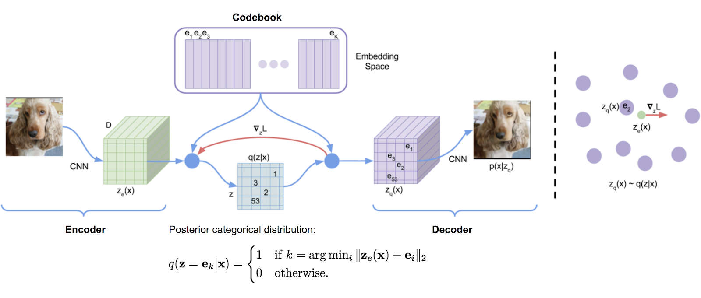
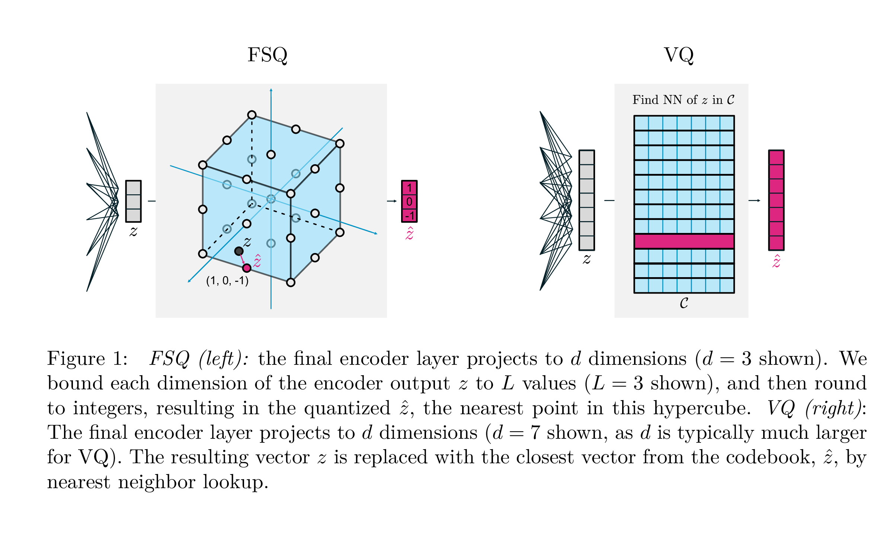
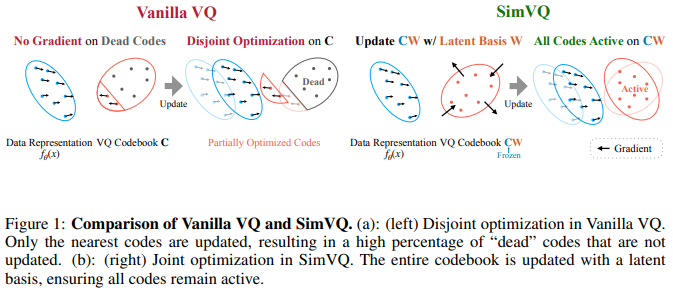
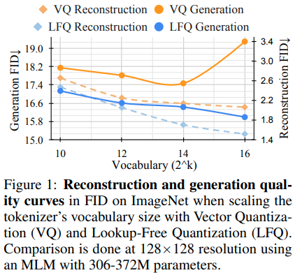

# Vector Quantization (VQ)

## 1. Tổng quan

Vector Quantization (VQ) là một kỹ thuật lượng tử hóa vector liên tục thành các mã rời rạc (discrete codes) thông qua một tập hữu hạn các vector đại diện gọi là **Codebook**.

Trong các mô hình hiện đại như:

- VQ-VAE
- VQ-GAN
- MaskGIT
- Image Tokenizer
- Neural Compression
- Latent Diffusion với Discrete Latent Space

Vector Quantization đóng vai trò chuyển đổi:

$$
z_e(x) \in \mathbb{R}^{D}
$$

thành

$$
z_q(x) \in \{e_1,e_2,...,e_K\}
$$

trong đó:

- $z_e(x)$: latent vector liên tục từ Encoder
- $e_i$: code vector trong codebook
- $K$: số lượng code (vocabulary size)

Ý tưởng cốt lõi:

> Thay vì lưu toàn bộ vector liên tục, ta chỉ lưu chỉ số của vector gần nhất trong codebook.

---

# 2. Motivation

Trong AutoEncoder thông thường:

$$
x \rightarrow Encoder \rightarrow z \rightarrow Decoder \rightarrow \hat{x}
$$

latent space là liên tục.

Điều này tạo ra các vấn đề:

- Khó sinh dữ liệu bằng mô hình ngôn ngữ
- Không tương thích với Transformer Token Modeling
- Không nén dữ liệu hiệu quả

Vector Quantization giải quyết bằng cách:

$$
z \rightarrow \hat{z}
$$

với:

$$
\hat{z} = e_k
$$

là vector gần nhất trong codebook.

Khi đó latent trở thành:

$$
[15,42,18,3,97,...]
$$

thay vì:

$$
[-0.18,0.23,1.75,...]
$$

Tương tự như:

- Token ID trong NLP
- Word Index
- Vocabulary Token

---

# 3. Kiến trúc VQ-VAE

Pipeline:

$$
x \rightarrow Encoder \rightarrow z_e(x) \rightarrow Quantizer \rightarrow z_q(x) \rightarrow Decoder \rightarrow \hat{x}
$$

---

## Thành phần 1: Encoder

Encoder ánh xạ dữ liệu đầu vào:

$$
x \in \mathbb{R}^{H\times W \times C}
$$

sang latent:

$$
z_e(x) \in \mathbb{R}^{h\times w \times D}
$$

Ví dụ:

$$
256\times256\times3 \rightarrow 32\times32\times256
$$

Mỗi vị trí latent là một vector:

$$
z_e(x) \in \mathbb{R}^{256}
$$

---

## Thành phần 2: Codebook

Codebook:

$$
E= \{e_1,e_2,...,e_K\}
$$

với:

$$
e_i \in \mathbb{R}^{D}
$$

Viết dưới dạng ma trận:

$$
E \in \mathbb{R}^{K\times D}
$$

Ví dụ:

$$
K=1024
$$

$$
D=256
$$

thì:

$$
E \in \mathbb{R}^{1024\times256}
$$

Mỗi hàng là một prototype vector.

---

# 4. Nearest Neighbor Quantization

Đây là bước quan trọng nhất của VQ.

Với latent vector:

$$
z_e(x)
$$

tìm code gần nhất:

$$
k = \arg\min_i \|z_e(x)-e_i\|_2
$$

sau đó:

$$
z_q(x)=e_k
$$

---

## Diễn giải hình học

Không gian latent được chia thành các vùng Voronoi.

Mỗi codebook vector:

$$
e_i
$$

là tâm của một vùng.

Mọi điểm rơi vào vùng đó sẽ được ánh xạ thành:

$$
e_i
$$

Tức là:

$$
z_e \rightarrow e_k
$$

---

# 5. Posterior Distribution

Sau lượng tử hóa:

$$
q(z=e_k|x) = \begin{cases} 1,& k=\arg\min_i ||z_e(x)-e_i||_2\\ 0,& otherwise \end{cases}
$$

Đây là phân phối rời rạc dạng one-hot.

Khác với VAE:

$$
q(z|x) = \mathcal N(\mu,\sigma)
$$

VQ sử dụng:

$$
q(z|x) = Categorical(K)
$$

---

# 6. Reconstruction

Decoder nhận:

$$
z_q(x)
$$

và tái tạo:

$$
\hat{x} = Decoder(z_q)
$$

Mục tiêu:

$$
\hat{x} \approx x
$$

Reconstruction Loss:

$$
L_{rec} = ||x-\hat{x}||^2
$$

hoặc

$$
L_{rec} = -\log p(x|z_q)
$$

---

# 7. Vấn đề Gradient

Hàm lượng tử hóa:

$$
z_q = Q(z_e)
$$

là hàm rời rạc.

Do đó:

$$
\frac{\partial z_q}{\partial z_e}=0
$$

Gradient không thể truyền qua bước quantization.

Đây là bài toán lớn nhất của VQ.

---

# 8. Straight-Through Estimator (STE)

VQ-VAE sử dụng:

$$
z_q = z_e + \text{sg}[e_k-z_e]
$$

Trong đó:

$$
sg[\cdot]
$$

là stop-gradient.

Forward:

$$
z_q=e_k
$$

Backward:

$$
\frac{\partial z_q}{\partial z_e}=1
$$

nên gradient truyền trực tiếp qua encoder.

Ý tưởng:

> Forward dùng vector đã lượng tử hóa nhưng Backward giả vờ như không có lượng tử hóa.

---

# 9. VQ Objective Function

Loss đầy đủ:

$$
L = L_{rec} + L_{codebook} + \beta L_{commit}
$$

---

## Reconstruction Loss

$$
L_{rec} = ||x-\hat{x}||^2
$$

Buộc decoder tái tạo chính xác.

---

## Codebook Loss

$$
L_{codebook} = || sg[z_e] - e ||^2
$$

Mục tiêu:

- cập nhật codebook
- kéo codebook về encoder output

---

## Commitment Loss

$$
L_{commit}=||z_e-sg[e]||^2
$$

Mục tiêu:

- ngăn encoder thay đổi vô hạn
- buộc encoder commit vào code đã chọn

---

# 10. Codebook Collapse

Một hiện tượng phổ biến:

Encoder chỉ sử dụng vài code.

Ví dụ:

$$
K=1024
$$

nhưng chỉ dùng:

$$
50
$$

codes.

Khi đó:

- giảm capacity
- giảm diversity
- chất lượng generation kém

Hiện tượng này gọi là:

## Dead Codes

Code tồn tại nhưng không bao giờ được chọn.

---

# 11. Dead Code Problem

Trong Vanilla VQ:

- chỉ code thắng nearest neighbor được cập nhật
- phần lớn code không nhận gradient

Kết quả:

$$
\text{Active Codes} \ll K
$$

gây:

- codebook collapse
- vocabulary utilization thấp

---

# 12. EMA Codebook Update

VQ-VAE v2 sử dụng:

Exponential Moving Average.

Thay vì SGD:

$$
N_i^{(t)}=\gamma N_i^{(t-1)} + (1-\gamma)n_i
$$

$$
m_i^{(t)}= \gamma m_i^{(t-1)}+ (1-\gamma) \sum z_e
$$

Codebook:

$$
e_i=\frac{m_i}{N_i}
$$

Ưu điểm:

- ổn định hơn
- giảm dead code

---

# 13. SimVQ

SimVQ nhận xét:

Vanilla VQ chỉ cập nhật code được chọn.

Do đó tối ưu hóa codebook bị phân mảnh.

SimVQ biểu diễn codebook:

$$
C=W B
$$

trong đó:

- $B$ là latent basis
- $W$ là ma trận ánh xạ

Toàn bộ codebook được cập nhật đồng thời.

Lợi ích:

- giảm dead code
- tăng code utilization
- huấn luyện ổn định hơn

---

# 14. FSQ (Finite Scalar Quantization)

FSQ loại bỏ hoàn toàn codebook.

Ý tưởng:

Lượng tử hóa từng chiều độc lập.

Ví dụ:

$$
z=(0.6,0.2,-0.9)
$$

Giới hạn:

$$
[-1,0,1]
$$

Kết quả:

$$
\hat z=(1,0,-1)
$$

Vocabulary size:

$$
K=L^D
$$

với:

- $L$: số mức mỗi chiều
- $D$: số chiều latent

Ví dụ:

$$
L=8
$$

$$
D=4
$$

$$
K=4096
$$

---

## Ưu điểm FSQ

- không codebook
- không nearest-neighbor search
- không dead code
- tốc độ cao

---

## Nhược điểm

- biểu diễn kém linh hoạt
- khả năng thích nghi thấp hơn VQ

---

# 15. LFQ (Lookup-Free Quantization)

LFQ mở rộng ý tưởng FSQ.

Thay vì:

$$
L>2
$$

LFQ sử dụng:

$$
\{-1,+1\}
$$

cho mỗi chiều.

Ví dụ:

$$
(1,-1,1,-1)
$$

Mỗi chiều tương ứng một bit.

Do đó:

$$
K=2^D
$$

Ví dụ:

$$
D=16
$$

$$
K=65536
$$

mà không cần lưu codebook.

---

## Tư tưởng

Codebook truyền thống:

$$
O(KD)
$$

bộ nhớ.

LFQ:

$$
O(D)
$$

bộ nhớ.

Không cần:

- nearest neighbor search
- codebook update
- EMA

---

# 16. So sánh VQ và LFQ

Theo các nghiên cứu gần đây:

- LFQ đạt reconstruction tương đương hoặc tốt hơn
- generation quality ổn định hơn khi vocabulary lớn
- không gặp dead-code

Lý do:

- toàn bộ không gian token được sử dụng
- không tồn tại codebook collapse

---

# 17. So sánh các phương pháp lượng tử hóa

| Method | Codebook | NN Search | Dead Code | Complexity |
|----------|----------|------------|------------|------------|
| VQ | Có | Có | Có | Cao |
| EMA-VQ | Có | Có | Giảm | Cao |
| SimVQ | Có | Có | Thấp | Trung bình |
| FSQ | Không | Không | Không | Thấp |
| LFQ | Không | Không | Không | Rất thấp |

---

# 18. Ý nghĩa trong Generative AI

Vector Quantization là cầu nối giữa:

### Continuous Representation

$$
z \in \mathbb{R}^D
$$

và

### Discrete Token Representation

$$
t \in \{1,...,K\}
$$

Nhờ đó hình ảnh, âm thanh và video có thể được biểu diễn như chuỗi token tương tự NLP.

Đây là nền tảng của:

- VQ-VAE
- VQ-GAN
- MaskGIT
- MAGVIT
- VideoPoet
- Image Tokenizer
- Neural Compression Systems

và hầu hết các mô hình sinh dữ liệu dựa trên discrete latent space hiện đại.