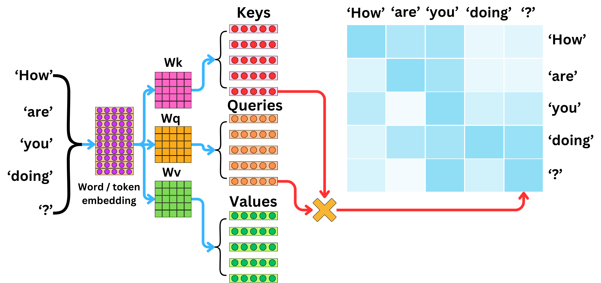

# Attention Mechanism

> Mathematical Foundations of Attention and Self-Attention for Transformers, Vision Transformers, and DeiT

---

# 1. Motivation

Các mô hình truyền thống như CNN và RNN gặp khó khăn khi xử lý quan hệ xa giữa các phần tử dữ liệu.

Ví dụ:

```text
The animal didn't cross the street because it was too tired.
```

Từ:

```text
it
```

phải liên kết với:

```text
animal
```

mặc dù cách xa nhiều token.

Ý tưởng của Attention:

> Cho phép mô hình học cách tập trung vào những phần quan trọng nhất của dữ liệu.

---

# 2. Human Attention

Con người không xử lý toàn bộ thông tin với mức độ quan trọng như nhau.

Ví dụ:

```text
A red car is parked in front of a building.
```

Khi được hỏi:

```text
What color is the car?
```

ta chỉ tập trung vào:

```text
red
car
```

Attention mô phỏng cơ chế này.

---

# 3. Query Key Value Paradigm

Attention được xây dựng dựa trên ba thành phần:

$$
Query
$$

$$
Key
$$

$$
Value
$$

---

## Query

Thông tin đang tìm kiếm.

$$
Q
$$

---

## Key

Thông tin mô tả nội dung.

$$
K
$$

---

## Value

Thông tin thực tế cần lấy.

$$
V
$$

---

# 4. Information Retrieval Interpretation

Attention giống như một hệ thống tìm kiếm.

Ví dụ:

```text
Query:
Where is the cat?
```

Mỗi từ trong câu:

```text
The cat sits on the sofa
```

đóng vai trò Key.

Attention xác định:

```text
cat
```

và

```text
sofa
```

có liên quan nhất.

---

# 5. Scaled Dot Product Attention

Đây là Attention được sử dụng trong Transformer.

Cho:

$$
Q \in \mathbb{R}^{n\times d}
$$

$$
K \in \mathbb{R}^{n\times d}
$$

$$
V \in \mathbb{R}^{n\times d}
$$

---

Similarity Score:

$$
S=QK^T
$$

---

Scale:

$$
S=\frac{QK^T}{\sqrt d}
$$

---

Attention Weights:

$$
A=
Softmax
\left(
\frac{QK^T}{\sqrt d}
\right)
$$

---

Output:

$$
Attention(Q,K,V) =

A V
$$

---

# 6. Why Divide by √d ?

Nếu:

$$
d
$$

lớn

thì:

$$
QK^T
$$

có giá trị rất lớn.

Softmax sẽ bão hòa:

$$
[0.999,0.001,0.000]
$$

Gradient gần như bằng 0.

Do đó Transformer sử dụng:

$$
\frac1{\sqrt d}
$$

để ổn định huấn luyện.

---

# 7. Self-Attention

Trong Self-Attention:

$$
Q=K=V=X
$$

cùng được sinh ra từ input.

---

Input:

$$
X
$$

---

Projection:

$$
Q=XW_Q
$$

$$
K=XW_K
$$

$$
V=XW_V
$$

---

Attention:

$$
A=
Softmax
\left(
\frac{QK^T}
{\sqrt d}
\right)
$$

---

Output:

$$
Z=AV
$$

---

# 8. Self-Attention Matrix



Attention Matrix:

$$
A
\in
\mathbb{R}^{n\times n}
$$

Mỗi phần tử:

$$
a_{ij}
$$

thể hiện mức độ token:

$$
i
$$

quan tâm tới token:

$$
j
$$

---

# 9. Multi-Head Attention

Một Attention Head không đủ học toàn bộ quan hệ.

Transformer sử dụng:

$$
h
$$

head khác nhau.

---

Head i:

$$
head_i =

Attention(Q_i,K_i,V_i)
$$

---

Concatenate:

$$
H=
Concat(head_1,\dots,head_h)
$$

---

Projection:

$$
Output =

HW_O
$$

---

# 10. Why Multi-Head Works

Các head học những quan hệ khác nhau.

Ví dụ:

Head 1:

```text
Grammar
```

Head 2:

```text
Object Relation
```

Head 3:

```text
Long Range Dependency
```

Head 4:

```text
Semantic Similarity
```

---

# 11. Self-Attention in Vision Transformer


Image:

$$
224\times224
$$

được chia thành patch.

---

Patch Embedding:

$$
z_1,z_2,\dots,z_N
$$

---

Input:

$$
[z_{cls},z_1,\dots,z_N]
$$

---

Attention cho phép:

mỗi patch tương tác với tất cả patch khác.

---

# 12. Global Receptive Field

CNN:

```text
Local Receptive Field
```

Transformer:

```text
Global Receptive Field
```

Patch ở góc trái trên có thể nhìn thấy:

```text
mọi patch khác
```

chỉ trong một layer Attention.

---

# 13. Attention Complexity

Attention Matrix:

$$
N\times N
$$

Chi phí:

$$
O(N^2)
$$

---

Memory:

$$
O(N^2)
$$

---

Đây là nút thắt lớn nhất của Transformer.

---

# 14. Attention in DeiT


DeiT bổ sung:

$$
z_{dist}
$$

---

Input:

$$
[z_{cls},z_1,\dots,z_N,z_{dist}]
$$

---

Distillation Token cũng tham gia Attention:

$$
A=
Softmax
\left(
\frac{QK^T}
{\sqrt d}
\right)
$$

---

Nó có thể tương tác với:

* CLS Token
* Patch Tokens

ở mọi tầng.

---

# 15. Distillation Through Attention

Điểm đặc biệt của DeiT:

Teacher không truyền tri thức trực tiếp tới output.

Thay vào đó:

```text
Teacher
    ↓
Distillation Token
    ↓
Attention
    ↓
Transformer Layers
```

Knowledge được lan truyền thông qua:

$$
Q
$$

$$
K
$$

$$
V
$$

---

# 16. Attention as Information Routing

Attention có thể được xem là:

```text
Dynamic Routing Network
```

Mỗi token quyết định:

```text
Tôi nên lấy thông tin từ đâu?
```

thay vì:

```text
Tôi phải lấy thông tin từ đâu?
```

như CNN.

---

# 17. Modern Variants

Các biến thể Attention hiện đại:

```text
Attention
│
├── Self Attention
├── Multi Head Attention
├── Cross Attention
├── Sparse Attention
├── Linear Attention
├── Flash Attention
├── Window Attention
├── Group Attention
└── Distillation Attention
```

---

# 18. Summary

Attention là nền tảng của Transformer.

Công thức cốt lõi:

$$
Attention(Q,K,V)
================

Softmax
\left(
\frac{QK^T}
{\sqrt d}
\right)
V
$$

Từ công thức này hình thành:

* Transformer
* BERT
* GPT
* Vision Transformer
* DeiT
* DINO
* MAE
* Modern Foundation Models

---

# Recommended Reading Order

```text
Attention
    ↓
Transformer
    ↓
Vision Transformer
    ↓
Knowledge Distillation
    ↓
DeiT
    ↓
DINO
    ↓
BEiT
    ↓
MAE
```
