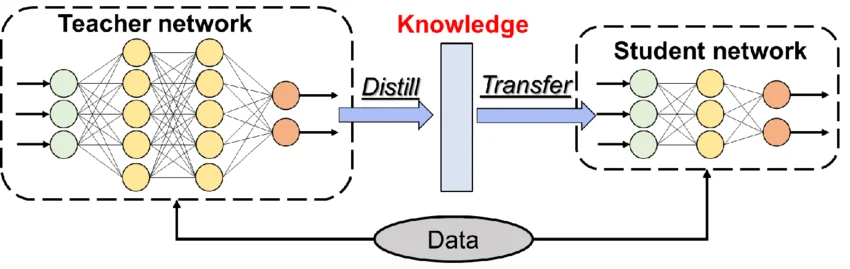
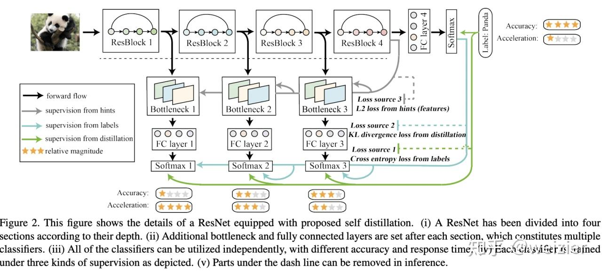
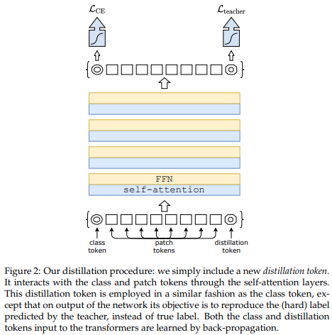

# Knowledge Distillation

> A Theoretical and Algorithmic Study of Knowledge Transfer in Deep Neural Networks

---

# 1. Introduction

Knowledge Distillation (KD) là kỹ thuật chuyển giao tri thức từ một mô hình lớn (Teacher) sang một mô hình nhỏ hơn (Student).

Ý tưởng cơ bản:

$$
Teacher
\rightarrow
Knowledge
\rightarrow
Student
$$

Trong đó:

* Teacher thường có số lượng tham số lớn.
* Student có kích thước nhỏ hơn.
* Student cố gắng mô phỏng hành vi của Teacher.

Mục tiêu:

$$
Accuracy_{Student}
\approx
Accuracy_{Teacher}
$$

với chi phí tính toán thấp hơn.

---

# 2. Motivation

Giả sử:

$$
f_T(x)
$$

là Teacher Network.

$$
f_S(x)
$$

là Student Network.

Thông thường:

$$
|f_T|

> >

|f_S|
$$

Teacher có khả năng học được:

* cấu trúc dữ liệu
* quan hệ giữa các lớp
* biểu diễn đặc trưng sâu

mà dữ liệu nhãn thông thường không thể biểu diễn đầy đủ.

Knowledge Distillation cho phép Student học trực tiếp từ những tri thức này.

---

# 3. Classical Supervised Learning

Trong học có giám sát:

$$
y \in {0,1}
$$

Loss:

$$
L
=

CE(y,\hat y)
$$

Student chỉ nhìn thấy:

* nhãn đúng
* nhãn sai

Ví dụ:

```text
Cat → 1
Dog → 0
Car → 0
Plane → 0
```

Thông tin này rất hạn chế.

---

# 4. Dark Knowledge

Khái niệm được giới thiệu bởi Hinton (2015).

Teacher không chỉ dự đoán:

```text
Cat = 1
```

mà còn:

```text
Cat   = 0.90
Dog   = 0.07
Tiger = 0.02
Fox   = 0.01
```

Những xác suất nhỏ này chứa thông tin quan trọng.

Được gọi là:

$$
Dark\ Knowledge
$$

---

# 5. Teacher-Student Framework



Teacher:

$$
f_T(x)
$$

Student:

$$
f_S(x)
$$

Teacher tạo ra:

$$
z_T
$$

Student tạo ra:

$$
z_S
$$

Mục tiêu:

$$
z_S
\approx
z_T
$$

---

# 6. Softmax Temperature

Softmax chuẩn:

$$
p_i
===

\frac
{e^{z_i}}
{\sum_j e^{z_j}}
$$

Knowledge Distillation sử dụng Temperature:

$$
T
$$

---

Temperature Softmax:

$$
p_i(T)
======

\frac
{e^{z_i/T}}
{\sum_j e^{z_j/T}}
$$

---

## Small Temperature

$$
T=1
$$

Output:

```text
Cat = 0.99
Dog = 0.01
```

---

## Large Temperature

$$
T=10
$$

Output:

```text
Cat = 0.40
Dog = 0.35
Tiger = 0.20
Fox = 0.05
```

Nhiều thông tin hơn được tiết lộ.

---

# 7. Distillation Loss

Teacher Distribution:

$$
p_T
$$

Student Distribution:

$$
p_S
$$

Loss:

$$
L_{KD}
======

KL(p_T||p_S)
$$

trong đó:

$$
KL(P||Q)
========

\sum_i
P(i)
\log
\frac
{P(i)}
{Q(i)}
$$

---

# 8. Combined Objective

Thông thường Student học đồng thời:

1. Ground Truth

2. Teacher Knowledge

---

Classification Loss:

$$
L_{CE} =

CE(y,\hat y)
$$

Distillation Loss:

$$
L_{KD} =

KL(p_T,p_S)
$$

Total Loss:

$$
L
=

\alpha L_{CE}
+
\beta L_{KD}
$$

---

# 9. Hard Distillation

Teacher đưa ra:

$$
y_T =

argmax(p_T)
$$

Student học:

$$
CE(y_T,\hat y)
$$

Ưu điểm:

* đơn giản
* ổn định

Nhược điểm:

* mất thông tin xác suất

---

# 10. Soft Distillation

Teacher cung cấp toàn bộ phân phối.

$$
p_T(y|x)
$$

Student học:

$$
KL(p_T||p_S)
$$

Ưu điểm:

* nhiều thông tin hơn
* biểu diễn tốt hơn

Nhược điểm:

* khó tối ưu hơn

---

# 11. Feature Distillation

Không distill output.

Distill hidden representation.

Teacher:

$$
h_T
$$

Student:

$$
h_S
$$

Loss:

$$
L_{feat} =

||h_T-h_S||^2
$$

---

# 12. Attention Distillation

Sử dụng trong:

* DeiT
* MiniLM
* Transformer Compression

Teacher Attention:

$$
A_T
$$

Student Attention:

$$
A_S
$$

Loss:

$$
L_{att} =

||A_T-A_S||^2
$$

---

# 13. Relation Distillation

Không học từng feature.

Học quan hệ giữa feature.

Teacher:

$$
R_T(i,j)
$$

Student:

$$
R_S(i,j)
$$

Loss:

$$
L
=

||R_T-R_S||
$$

---

# 14. Self Distillation

Teacher và Student là cùng một mạng.



Ví dụ:

* DINO
* BYOT
* Be Your Own Teacher

Ý tưởng:

$$
Model_{t-1}
\rightarrow
Model_t
$$

---

# 15. Online Distillation

Teacher được cập nhật liên tục.

Ví dụ:

* DINO
* BYOL
* Mean Teacher

Teacher:

$$
\theta_t^{teacher} =

m\theta_{t-1}^{teacher}
+
(1-m)
\theta_t^{student}
$$

---

# 16. Information Theory View

Teacher chứa:

$$
I(Y_T;X)
$$

Student chứa:

$$
I(Y_S;X)
$$

Distillation tối đa hóa:

$$
I(Y_S;Y_T)
$$

Mục tiêu:

$$
Y_S
\approx
Y_T
$$

trong khi vẫn giữ:

$$
Y_S
\approx
Y
$$

---

# 17. Representation Learning View

Teacher định nghĩa:

$$
\mathcal M_T
$$

Student học:

$$
\mathcal M_S
$$

Distillation tối ưu:

$$
d(\mathcal M_T,\mathcal M_S)
\rightarrow 0
$$

Thay vì chỉ học nhãn.

---

# 18. Distillation in Vision Transformers



DeiT giới thiệu:

$$
Distillation\ Token
$$

Teacher Knowledge:

$$
Teacher
\rightarrow
Distillation\ Token
\rightarrow
Attention
\rightarrow
Transformer
$$

Đây là bước chuyển từ:

```text
Output Distillation
```

sang:

```text
Representation Distillation
```

---

# 19. Modern Distillation Family

```text
Knowledge Distillation
│
├── Logit Distillation
│
├── Feature Distillation
│
├── Attention Distillation
│
├── Relation Distillation
│
├── Self Distillation
│
├── Online Distillation
│
└── Contrastive Distillation
```

---

# 20. Applications

Knowledge Distillation được sử dụng trong:

### Computer Vision

* DeiT
* DINO
* EfficientNet-Lite

### NLP

* DistilBERT
* TinyBERT
* MobileBERT

### Speech

* DeepSpeech Compression

### Large Language Models

* MiniGPT
* Distilled LLMs
* Tiny Language Models

---

# 21. Advantages

* Model Compression
* Faster Inference
* Better Generalization
* Reduced Memory Usage
* Transfer of Dark Knowledge

---

# 22. Limitations

* Teacher phải đủ mạnh
* Student capacity bị giới hạn
* Hyperparameter tuning khó
* Có thể truyền cả lỗi của Teacher

---

# 23. Summary

Knowledge Distillation là quá trình chuyển giao tri thức từ Teacher sang Student.

Từ góc nhìn hiện đại, KD không chỉ là:

$$
Output Matching
$$

mà là:

$$
Representation Transfer
$$

và đã trở thành nền tảng cho:

* DeiT
* DINO
* BYOL
* MAE
* Foundation Models
* Distilled LLMs
* Edge AI Systems

---

# References

```bibtex
@article{hinton2015distilling,
  title={Distilling the Knowledge in a Neural Network},
  author={Geoffrey Hinton and Oriol Vinyals and Jeff Dean},
  year={2015}
}
```
