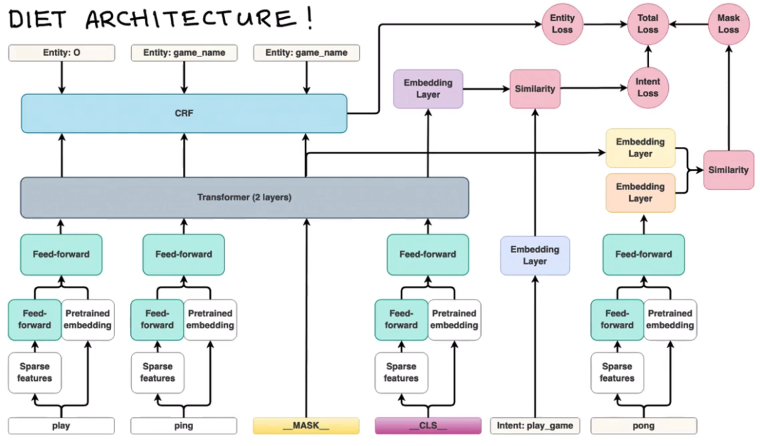
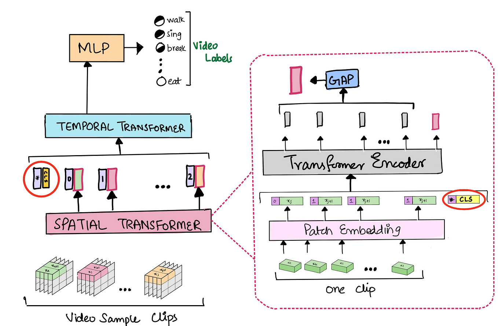
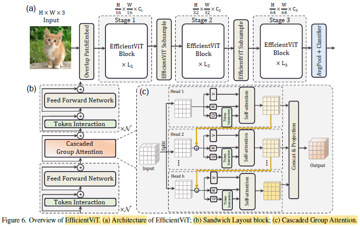
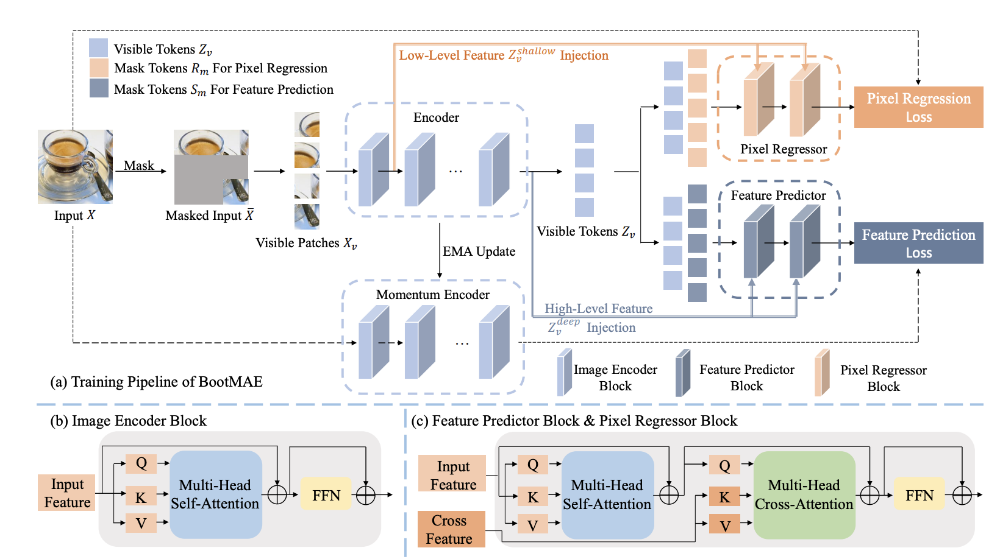

# DeiT: Data-efficient Image Transformers Through Attention Distillation

> ICML 2021 – Facebook AI Research (FAIR)

---

# 1. Motivation

Vision Transformer (ViT) đạt hiệu năng rất cao nhưng yêu cầu lượng dữ liệu khổng lồ để huấn luyện.

DeiT được thiết kế nhằm giải quyết bài toán:

$$
Vision\ Transformer + Small\ Dataset
$$

bằng cách đưa tri thức từ một mô hình Teacher vào quá trình huấn luyện Transformer.

<p align="center">

</p>

<div align="center">

**Figure 1. DeiT Architecture**

</div>

---

# 2. Core Idea

Khác với Knowledge Distillation truyền thống:

```text
Teacher
   ↓
 Logits
   ↓
Student
```

DeiT đưa tri thức teacher vào bên trong Transformer thông qua một token đặc biệt:

$$
Distillation\ Token
$$

Token này tham gia trực tiếp vào Self-Attention.

---

# 3. Distillation Through Attention

<p align="center">

</p>

<div align="center">

**Figure 2. Distillation Token proposed by DeiT**

</div>

Trong mỗi layer:

$$
Q = XW_Q
$$

$$
K = XW_K
$$

$$
V = XW_V
$$

Attention:

$$
A=
Softmax
\left(
\frac{QK^T}{\sqrt d}
\right)
$$

Distillation Token tương tác với:

* CLS Token
* Patch Tokens

ở mọi tầng Transformer.

---

# 4. Distillation Token as Learnable Query

DeiT có thể được nhìn như một hệ thống học truy vấn.

Distillation Token sinh ra:

$$
q_{dist}
$$

và tìm kiếm tri thức từ các patch token:

$$
h_{dist} =

Softmax
\left(
\frac
{q_{dist}K^T}
{\sqrt d}
\right)
V
$$

Do đó teacher knowledge được lan truyền xuyên suốt encoder thay vì chỉ xuất hiện ở output layer.

---

# 5. Information Flow Perspective

<p align="center">

</p>

<div align="center">

**Figure 3. Multi-objective learning architecture**

</div>

Có thể xem DeiT như một bài toán Multi-Task Learning.

Transformer Encoder đồng thời phục vụ:

### Classification Branch

$$
L_{cls} =

CE(y,\hat y)
$$

### Distillation Branch

$$
L_{dist} =

CE(y_t,\hat y_t)
$$

Tổng loss:

$$
L=L_{cls}+L_{dist}
$$

---

# 6. Gradient Flow Analysis

Không có Distillation:

$$
\nabla_\theta L_{cls}
$$

là nguồn gradient duy nhất.

Với DeiT:

$$
\nabla_\theta L =

\nabla_\theta L_{cls}
+
\nabla_\theta L_{dist}
$$

Teacher tạo ra một nguồn supervision thứ hai giúp:

* giảm variance
* tăng stability
* tăng sample efficiency

---

# 7. Connection to Video Transformers

<p align="center">

</p>

<div align="center">

**Figure 4. CLS Token in Video Transformer**

</div>

Ý tưởng CLS Token trong DeiT tiếp tục được sử dụng trong:

* TimeSformer
* ViViT
* Video Swin

Pipeline:

```text
Video Frames
      ↓
Patch Embedding
      ↓
Spatial Transformer
      ↓
Temporal Transformer
      ↓
CLS Token
      ↓
Prediction
```

CLS Token trở thành biểu diễn toàn cục của toàn bộ video clip.

---

# 8. Evolution Toward EfficientViT

<p align="center">

</p>

<div align="center">

**Figure 5. EfficientViT Architecture**

</div>

DeiT tập trung vào:

```text
Data Efficiency
Knowledge Transfer
```

EfficientViT tập trung vào:

```text
Memory Efficiency
Computation Efficiency
```

thông qua:

* Cascaded Group Attention
* Token Interaction
* Efficient Feed Forward Network

---

# 9. Representation Alignment View

Teacher định nghĩa một latent manifold:

$$
\mathcal M_t
$$

Student học một manifold mới:

$$
\mathcal M_s
$$

Thông qua Distillation Token:

$$
\mathcal M_t
\rightarrow
\mathcal M_s
$$

DeiT không chỉ học:

$$
p(y|x)
$$

mà còn học cấu trúc biểu diễn của teacher.

---

# 10. Theoretical Interpretation

Knowledge Distillation truyền thống:

$$
Teacher
\rightarrow
Output
$$

DeiT:

$$
Teacher
\rightarrow
Attention
\rightarrow
Representation
$$

Do đó teacher ảnh hưởng tới:

* Feature Extraction
* Attention Pattern
* Token Interaction
* Latent Space Geometry

Đây là lý do chính khiến DeiT đạt hiệu quả cao hơn ViT trên ImageNet-1K.

---

# 11. Historical Impact

DeiT là paper đầu tiên chứng minh rằng:

$$
Knowledge\ Distillation
$$

có thể được tích hợp trực tiếp vào:

$$
Transformer\ Attention
$$

thông qua một token học được.

Nó mở đường cho:

```text
ViT
 ↓
DeiT
 ↓
DINO
 ↓
BEiT
 ↓
iBOT
 ↓
MAE
 ↓
BootMAE
```

và toàn bộ thế hệ Vision Foundation Models sau này.

---

# References

```bibtex
@inproceedings{touvron2021deit,
  title={Training Data-Efficient Image Transformers and Distillation Through Attention},
  author={Touvron et al.},
  booktitle={ICML},
  year={2021}
}
```
