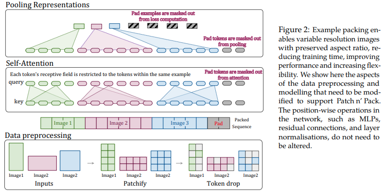

# Native Resolution Vision Transformer (NaViT)

</img>

Bài báo này đề xuất tận dụng linh hoạt cơ chế chú ý (__attention__) và kỹ thuật che (__masking__) đối với các chuỗi có độ dài biến thiên, nhằm huấn luyện các hình ảnh có nhiều độ phân giải khác nhau được đóng gói (__packed__) trong cùng một batch. Họ chứng minh rằng phương pháp này giúp tốc độ huấn luyện nhanh hơn đáng kể và cải thiện độ chính xác, với mức đánh đổi duy nhất là kiến trúc mô hình và quá trình tải dữ liệu (__dataloading__) sẽ phức tạp hơn. Các tác giả sử dụng mã hóa vị trí 2D phân rã (factorized 2d positional encodings), kỹ thuật loại bỏ token (token dropping), cũng như chuẩn hóa query-key (query-key normalization).

thay vì dùng __U-Net__ truyền thống trong diffusion models, tác giả thay thế bằng Vision Transformer (__ViT-style backbone__) để xây dựng Diffusion Transformer (__DiT__).

---

## 1. Tổng quan

NaViT (Native Resolution Vision Transformer) là một biến thể của Vision Transformer được thiết kế để xử lý:

- Ảnh có **độ phân giải khác nhau**
- Ảnh có **aspect ratio bất kỳ**
- Batch chứa **chuỗi token có độ dài biến thiên**

Thay vì resize ảnh về cùng kích thước, NaViT:

> Cho phép training trực tiếp trên ảnh gốc (native resolution), đồng thời tối ưu hóa việc đóng gói token (packing) trong cùng một batch.

---

## 2. Vấn đề của ViT truyền thống

ViT tiêu chuẩn yêu cầu:

- Resize ảnh về cùng resolution
- Cố định số patch tokens $N$
- Padding hoặc bỏ dữ liệu khi batch không đồng nhất

Điều này gây ra:

- Lãng phí compute
- Mất thông tin hình học
- Giảm hiệu quả huấn luyện

---

## 3. Ý tưởng chính của NaViT

NaViT giải quyết bằng 3 cơ chế:

### (1) Variable-length token sequences
Mỗi ảnh tạo số lượng patch khác nhau:

$$
x_i \rightarrow \{x_i^1, x_i^2, ..., x_i^{N_i}\}
$$

---

### (2) Packed batching
Nhiều ảnh được “pack” vào cùng batch:

$$
\mathcal{B} = \{S_1 \cup S_2 \cup ... \cup S_k\}
$$

với $S_i$ là sequence token của từng ảnh.

---

### (3) Attention masking
Self-attention được điều khiển bằng mask:

$$
M_{ij} =
\begin{cases}
0 & \text{if token i, j cùng image} \\
-\infty & \text{otherwise}
\end{cases}
$$

Attention:

$$
\text{Attention}(Q,K,V) =
\text{Softmax}\left(\frac{QK^T}{\sqrt{d}}\right)V
$$

---

## 4. Patch Embedding

Ảnh đầu vào:

$$
x \in \mathbb{R}^{H \times W \times C}
$$

Được chia thành patch:

$$
x \rightarrow \{x^1, x^2, ..., x^N\}
$$

Embedding tuyến tính:

$$
z_i = W_e x_i
$$

---

## 5. Positional Encoding 2D phân rã

NaViT sử dụng **factorized 2D positional encoding**:

$$
p(x,y) = p_x(x) + p_y(y)
$$

Thay vì embedding 1D theo sequence order.

---

## 6. Token Dropout

Một số token bị loại ngẫu nhiên:

$$
\tilde{z} = \text{Drop}(z, p)
$$

với xác suất dropout $p$

→ giúp regularization giống stochastic depth.

---

## 7. Query-Key Normalization

Trước khi attention:

$$
\hat{Q} = \frac{Q}{\|Q\|}, \quad \hat{K} = \frac{K}{\|K\|}
$$

Attention trở thành cosine similarity:

$$
\text{Attention} =
\text{Softmax}\left(\frac{\hat{Q}\hat{K}^T}{\sqrt{d}}\right)V
$$

---

## 8. Transformer Backbone

Mỗi block gồm:

### Self-Attention:

$$
Q = HW_Q,\quad K = HW_K,\quad V = HW_V
$$

### Residual:

$$
h^{l+1} = h^l + \text{Attention}(h^l)
$$

---

### MLP:

$$
\text{MLP}(x) = W_2 \sigma(W_1 x)
$$

---

## 9. Masked Attention cho Packed Sequence

Trong batch packed:

- Tokens của ảnh khác nhau không được attend lẫn nhau

$$
\text{Attention}(i \rightarrow j) = 0 \quad \text{if } image(i) \neq image(j)
$$

---

## 10. Pipeline tổng quát

---

### Step 1: Input images (multi-resolution)

$$
x_1, x_2, ..., x_n
$$

---

### Step 2: Patchify

$$
x_i \rightarrow \{x_i^j\}
$$

---

### Step 3: Pack sequences

$$
S = S_1 \cup S_2 \cup ... \cup S_n
$$

---

### Step 4: Apply attention mask

$$
M_{ij}
$$

---

### Step 5: Transformer encoding

$$
h^{(L)} = \text{Transformer}(S)
$$

---

### Step 6: Pooling / classification

$$
y = \text{Head}(h^{(L)})
$$

---

## 11. Loss Function

Cross entropy:

$$
\mathcal{L} = - \sum y \log p_\theta(y|x)
$$

---

## 12. Ưu điểm toán học của NaViT

### (1) Không gian token linh hoạt

$$
N_i \neq N_j
$$

→ không cần padding cố định

---

### (2) Tối ưu attention hiệu quả hơn

Giảm complexity padding:

$$
O(N^2) \rightarrow O\left(\sum_i N_i^2\right)
$$

---

### (3) Better generalization

Do training trên nhiều scale:

$$
p(x | scale_i)
$$

---

## 13. NaViT vs ViT

| Thành phần | ViT | NaViT |
|------------|-----|-------|
| Input size | Fixed | Variable |
| Batch | Padded | Packed |
| Attention | Full | Masked |
| Positional encoding | 1D | 2D factorized |
| Efficiency | thấp hơn | cao hơn |

---


**Tài liệu tham khảo**

```bibtex
@inproceedings{Dehghani2023PatchNP,
    title   = {Patch n' Pack: NaViT, a Vision Transformer for any Aspect Ratio and Resolution},
    author  = {Mostafa Dehghani and Basil Mustafa and Josip Djolonga and Jonathan Heek and Matthias Minderer and Mathilde Caron and Andreas Steiner and Joan Puigcerver and Robert Geirhos and Ibrahim M. Alabdulmohsin and Avital Oliver and Piotr Padlewski and Alexey A. Gritsenko and Mario Luvci'c and Neil Houlsby},
    year    = {2023}
    
    Link: [https://arxiv.org/pdf/2307.06304]
}
```

---

**Thư viện tham khảo**

```python
import torch
from vit_pytorch.na_vit import NaViT

v = NaViT(
    image_size = 256,
    patch_size = 32,
    num_classes = 1000,
    dim = 1024,
    depth = 6,
    heads = 16,
    mlp_dim = 2048,
    dropout = 0.1,
    emb_dropout = 0.1,
    token_dropout_prob = 0.1  # token dropout of 10% (keep 90% of tokens)
)

# 5 images of different resolutions - List[List[Tensor]]

# bạn cần sắp xếp các hình ảnh vào cùng một nhóm phần tử sao cho không vượt quá độ dài chuỗi tối đa cho phép đối với  self-attention w/ masking

images = [
    [torch.randn(3, 256, 256), torch.randn(3, 128, 128)],
    [torch.randn(3, 128, 256), torch.randn(3, 256, 128)],
    [torch.randn(3, 64, 256)]
]

preds = v(images) # (5, 1000) - 5, vì có 5 hình ảnh với độ phân giải khác nhau ở trên.
```

Hoặc nếu bạn thích framework tự nhóm ảnh thành các chuỗi có độ dài biến thiên, miễn là không quá độ dài tối đa cho phép.

```python
images = [
    torch.randn(3, 256, 256),
    torch.randn(3, 128, 128),
    torch.randn(3, 128, 256),
    torch.randn(3, 256, 128),
    torch.randn(3, 64, 256)
]

preds = v(
    images,
    group_images = True,
    group_max_seq_len = 64
) # (5, 1000)
```

Cuối cùng, nếu bạn muốn sử dụng một phiên bản biến thể (flavor) của NaViT có tích hợp nested tensors (giúp loại bỏ hoàn toàn phần lớn việc tạo mặt nạ - masking và chèn khoảng trống - padding), hãy đảm bảo rằng bạn đang dùng phiên bản 2.5 trở lên.

```python
import torch
from vit_pytorch.na_vit_nested_tensor import NaViT

v = NaViT(
    image_size = 256,
    patch_size = 32,
    num_classes = 1000,
    dim = 1024,
    depth = 6,
    heads = 16,
    mlp_dim = 2048,
    dropout = 0.,
    emb_dropout = 0.,
    token_dropout_prob = 0.1
)

# 5 images of different resolutions - List[Tensor]

images = [
    torch.randn(3, 256, 256), torch.randn(3, 128, 128),
    torch.randn(3, 128, 256), torch.randn(3, 256, 128),
    torch.randn(3, 64, 256)
]

preds = v(images)

assert preds.shape == (5, 1000)
```