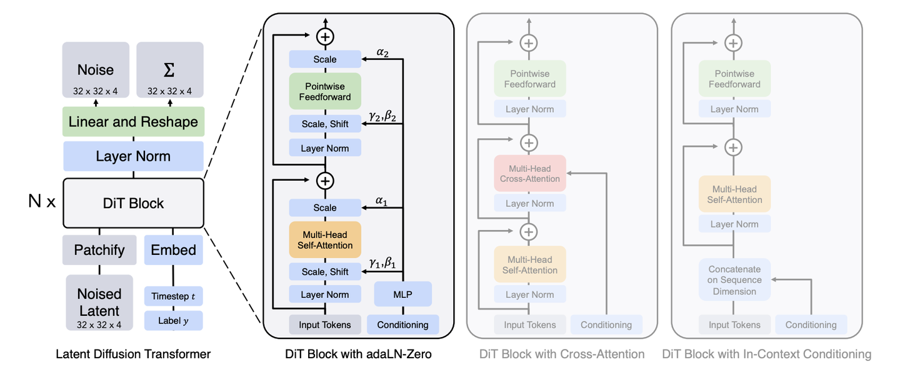
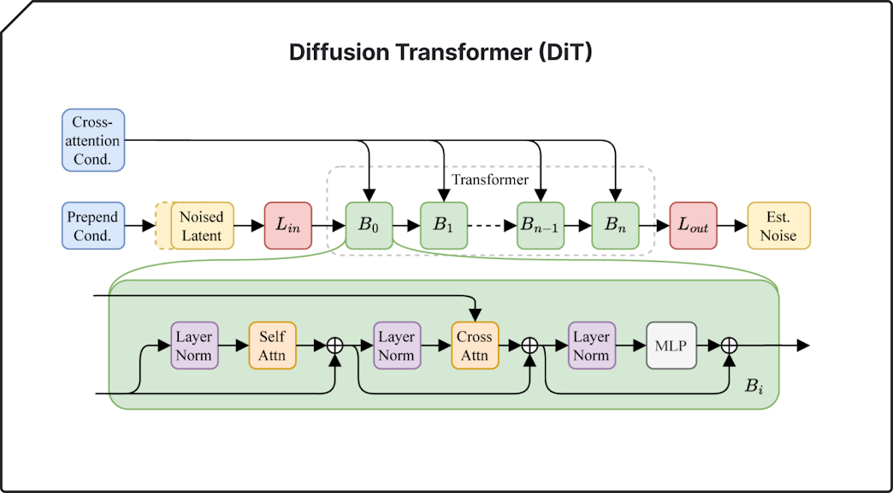
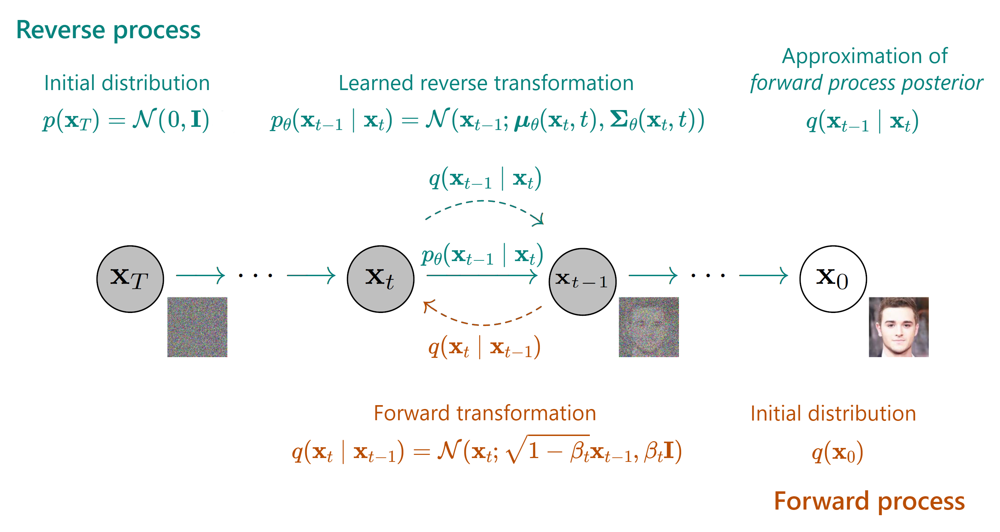
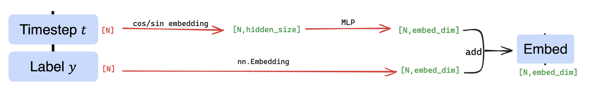
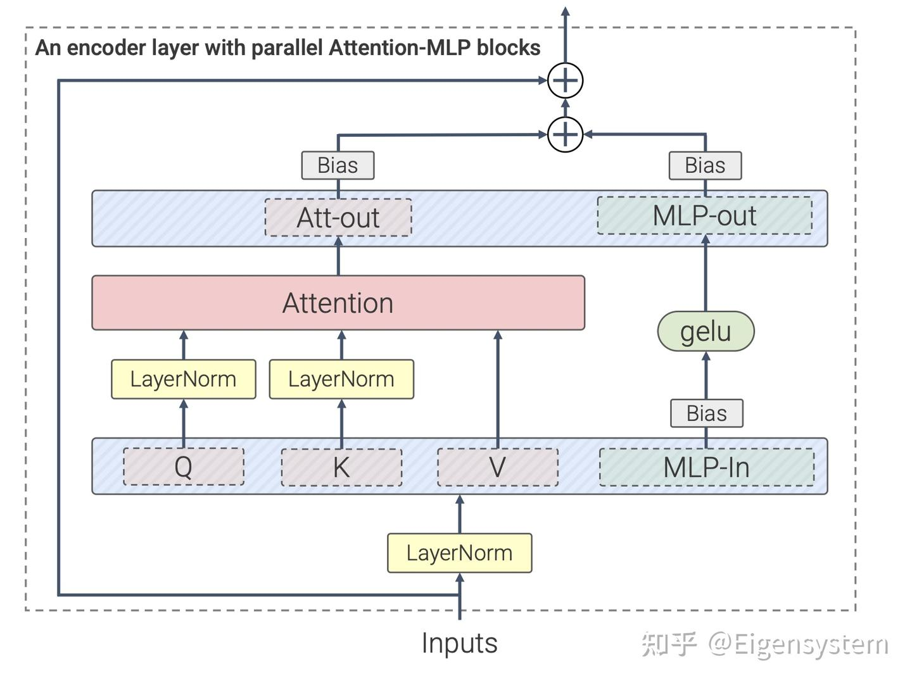

# Diffusion Transformer (DiT): Scalable Diffusion Model with Transformers

---

## 1. Tổng quan kiến trúc

DiT (Diffusion Transformer) thay thế U-Net trong diffusion model bằng Transformer thuần túy.

### Ý tưởng chính:

- Image generation = sequence modeling
- Patchify image → token sequence
- Transformer học noise prediction

---

## 2. Diffusion Process (Cơ sở toán học)

### Forward process (thêm nhiễu)

$$
q(x_t | x_{t-1}) = \mathcal{N}(\sqrt{1-\beta_t}x_{t-1}, \beta_t I)
$$

Dạng đóng:

$$
x_t = \sqrt{\bar{\alpha}_t}x_0 + \sqrt{1-\bar{\alpha}_t}\epsilon
$$

---

### Reverse process (khử nhiễu)

Mục tiêu:

$$
p_\theta(x_{t-1} | x_t)
$$

---

## 3. Kiến trúc DiT (Diffusion Transformer Architecture)

DiT gồm 4 thành phần chính:

---

### (1) Patch Embedding

Ảnh được chia thành patch:

$$
x_t \in \mathbb{R}^{H \times W \times C}
\Rightarrow \{x_1, x_2, ..., x_N\}
$$

Embedding:

$$
z_i = W_e x_i
$$

---

### (2) Time Embedding

Encoding timestep:

$$
e_t = f(t)
$$

---

### (3) Token Input

$$
h_i^{(0)} = z_i + p_i + e_t
$$

---

## 4. Transformer Block trong DiT

---

### Self-Attention

$$
\text{Attention}(Q,K,V) =
\text{Softmax}\left(\frac{QK^T}{\sqrt{d}}\right)V
$$

---

### MLP Block

$$
\text{MLP}(x) = W_2 \sigma(W_1 x)
$$

---

### Residual Flow

$$
h^{l+1} = h^l + \text{Attention}(h^l)
$$

$$
h^{l+2} = h^{l+1} + \text{MLP}(h^{l+1})
$$

---

## 5. Noise Prediction Head

Output:

$$
\hat{\epsilon} = \epsilon_\theta(x_t, t)
$$

---

## 6. Loss Function

$$
\mathcal{L} =
\mathbb{E}_{x_0, t, \epsilon}
\left[
\|\epsilon - \epsilon_\theta(x_t, t)\|^2
\right]
$$

---

## 7. Sampling (Reverse Diffusion)

Update rule:

$$
x_{t-1} =
\frac{1}{\sqrt{\alpha_t}}
\left(
x_t -
\frac{1-\alpha_t}{\sqrt{1-\bar{\alpha}_t}}
\hat{\epsilon}
\right)
$$

---

## 8. Classifier-Free Guidance (CFG)

$$
\epsilon =
(1+w)\epsilon_\theta(x_t|c)
-
w\epsilon_\theta(x_t|\varnothing)
$$

---

## 9. Full Pipeline (Training → Generation)

### Training:

1. Sample $x_0$
2. Sample timestep $t$
3. Add noise:
$$
x_t = \sqrt{\bar{\alpha}_t}x_0 + \sqrt{1-\bar{\alpha}_t}\epsilon
$$
4. Predict noise
5. Optimize MSE loss

---

### Sampling:

1. Sample noise $x_T \sim \mathcal{N}(0,I)$
2. Iteratively denoise
3. Output image $x_0$

---

## 10. Score Function Perspective

$$
s_\theta(x_t, t) \approx \nabla_x \log p_t(x)
$$

Diffusion = learning gradient field của dữ liệu.

---

## 11. SDE View (Advanced)

$$
dx = f(x,t)dt + g(t)dW
$$

Reverse:

$$
dx =
\left[
f(x,t) - g(t)^2 \nabla_x \log p_t(x)
\right]dt + g(t)d\bar{W}
$$

---

## 12. Kết luận

DiT chứng minh:

- Transformer có thể thay thế CNN trong generative modeling
- Diffusion = sequence modeling over noise space
- Scaling law áp dụng mạnh như LLM

---

## 13. Tóm tắt

$$
\boxed{
\text{Diffusion} + \text{Transformer} = \text{Scalable Image Generator}
}
$$