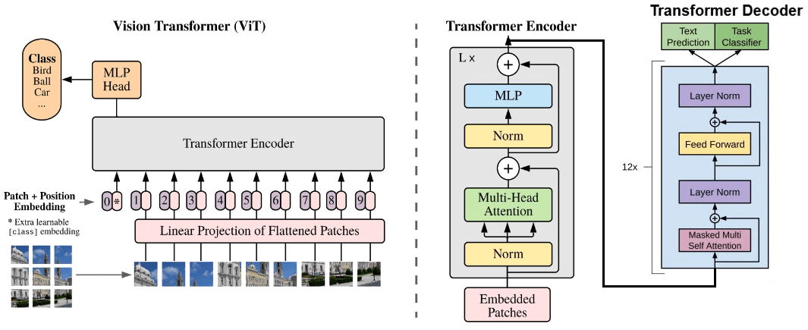
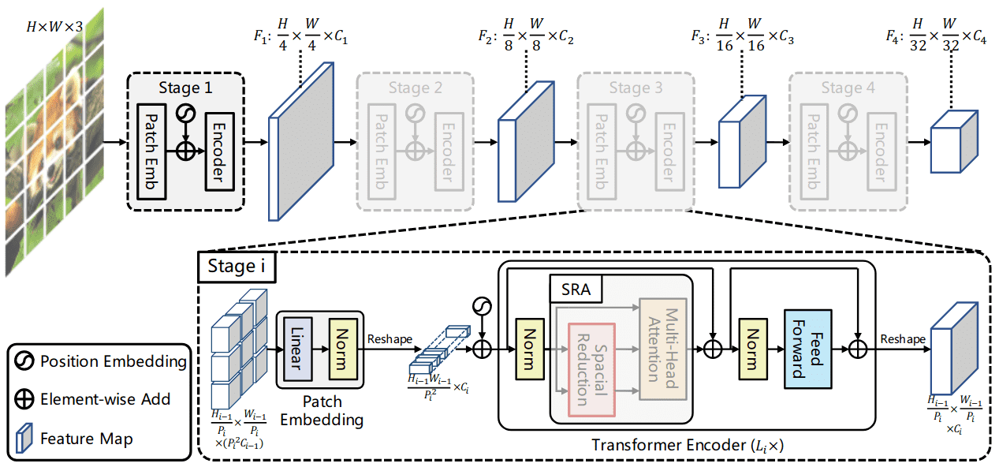

# Vision Transformer (ViT) – Kiến trúc và Thuật toán


---

## 1. Giới thiệu

__Vision Transformer (ViT)__ là mô hình đầu tiên áp dụng thành công Transformer thuần túy cho bài toán phân loại ảnh. Thay vì dùng các __tầng tích chập (CNN)__, ViT chia ảnh thành các mảnh (patches), xem mỗi mảnh như một token, và xử lý bằng bộ mã hóa Transformer (encoder). Khi được huấn luyện trên tập dữ liệu đủ lớn (như ImageNet-21k, JFT-300M), ViT đạt hoặc vượt hiệu suất của các mô hình CNN hàng đầu.

---

## 2. Tổng quan kiến trúc



Kiến trúc ViT cho phân loại ảnh gồm 4 bước chính:

1. **Chia ảnh thành các mảnh (patches)**
2. **Chiếu tuyến tính (linear projection)** để tạo patch embeddings
3. **Thêm position embedding** và token đặc biệt `[class]`
4. **Transformer encoder** (nhiều lớp Multi-Head Self-Attention + MLP)
5. **MLP head** phân loại từ token `[class]`

---

## 3. Patch Embedding

Đầu vào ảnh kích thước $(H \times W \times C)$ (chiều cao, rộng, số kênh).  
Chia thành $(N)$ mảnh không chồng lấn, mỗi mảnh kích thước $(P \times P)$:

$$
N = \frac{H \times W}{P^2}
$$

Mỗi mảnh được làm phẳng thành vector độ dài $(P^2 \cdot C)$ và chiếu tuyến tính qua ma trận học được $(\mathbf{E} \in \mathbb{R}^{D \times (P^2 C)})$:

$$
\mathbf{x}_p^{(i)} = \mathbf{E} \cdot \text{flatten}(\text{patch}_i), \quad i = 1,\dots,N
$$

với $(D)$ là chiều của không gian tiềm ẩn (ví dụ 768 cho ViT-Base).

---

## 4. Position Embedding và Class Token

### 4.1 Position Embedding
Transformer không có thứ tự, nên cần thêm thông tin vị trí cho từng mảnh. ViT dùng **position embedding học được** $(\mathbf{E}_{\text{pos}} \in \mathbb{R}^{N \times D})$, cộng trực tiếp vào patch embedding:

$$
\mathbf{z}_0^{(i)} = \mathbf{x}_p^{(i)} + \mathbf{E}_{\text{pos}}^{(i)}, \quad i=1,\dots,N
$$

### 4.2 Class Token
Thêm một vector học được $(\mathbf{x}_{\text{class}} \in \mathbb{R}^D)$ vào đầu dãy. Đầu ra tại vị trí này sau encoder được dùng làm biểu diễn toàn ảnh cho phân loại.

Dãy đầu vào encoder:

$$
\mathbf{z}_0 = \big[ \mathbf{x}_{\text{class}}; \mathbf{x}_p^{(1)}; \dots; \mathbf{x}_p^{(N)} \big] + \mathbf{E}_{\text{pos}}
$$

kích thước: $((N+1) \times D)$.

---

## 5. Transformer Encoder

Encoder gồm $(L)$ khối giống hệt nhau. Mỗi khối có hai tầng con, mỗi tầng được bọc bởi **kết nối tắt (residual)** và **Layer Normalization (LN)**.

### 5.1 Multi-Head Self-Attention (MSA)
Cho phép mỗi token tương tác với tất cả token khác. Được tính bằng công thức Scaled Dot-Product Attention:

$$
\text{Attention}(Q,K,V) = \text{softmax}\left( \frac{QK^T}{\sqrt{d_k}} \right) V
$$

Với multi-head (h đầu), ta có:

$$
\text{MSA}(X) = \text{Concat}(\text{head}_1, \dots, \text{head}_h) W^O
$$
$$
\text{head}_i = \text{Attention}(XW_i^Q, XW_i^K, XW_i^V)
$$

### 5.2 Feed-Forward Network (FFN)
MLP hai lớp với hàm kích hoạt GELU:

$$
\text{FFN}(x) = \sigma(x W_1 + b_1) W_2 + b_2
$$

Thường kích thước lớp ẩn gấp 4 lần $(D)$.

### 5.3 Công thức tổng quát một khối encoder

Gọi $(\mathbf{z}_{\ell-1})$ là đầu vào khối thứ $(\ell)$:

$$
\begin{aligned}
\mathbf{z}'_\ell &= \text{MSA}\big( \text{LN}(\mathbf{z}_{\ell-1}) \big) + \mathbf{z}_{\ell-1} \\
\mathbf{z}_\ell &= \text{FFN}\big( \text{LN}(\mathbf{z}'_\ell) \big) + \mathbf{z}'_\ell
\end{aligned}
$$

Sau $(L)$ khối, lấy trạng thái của token `[class]` tại vị trí đầu tiên: $(\mathbf{z}_L^{(0)})$.

---

## 6. MLP Head

Đưa $(\mathbf{z}_L^{(0)})$ qua một MLP (thường 1 tầng ẩn) và softmax để ra phân phối xác suất các lớp:

$$
\hat{y} = \text{softmax}\big( \text{MLP}(\mathbf{z}_L^{(0)}) \big)
$$

Hàm mất mát: **cross‑entropy**.

---

## 7. Minh họa toàn bộ pipeline



Hình trên mô tả luồng dữ liệu từ: __ảnh → patch → embedding → position + class token → nhiều khối encoder → MLP head → dự đoán__.

---

## 8. So sánh độ phức tạp với CNN

| Mô hình | Độ phức tạp trên ảnh \(H \times W\) | Ghi chú |
|---------|--------------------------------------|---------|
| CNN (ResNet) | $(O(k^2 \cdot C \cdot H \cdot W))$ | $(k)$ là kernel size, phụ thuộc cục bộ |
| ViT | $(O((H W / P^2)^2 \cdot D))$ | Bình phương số lượng patch, phụ thuộc toàn cục |

ViT hiệu quả hơn khi ảnh có kích thước vừa phải, nhưng chi phí $(O(n^2))$ với $(n = \frac{HW}{P^2})$ trở nên lớn khi ảnh độ phân giải cao. Điều này dẫn đến các cải tiến như **Swin Transformer** (cửa sổ chú ý cục bộ) hoặc **FlashAttention** (tối ưu bộ nhớ).

---

## 9. Kết luận

Vision Transformer chứng minh rằng cơ chế self‑attention hoàn toàn có thể thay thế tích chập trong thị giác máy, đạt kết quả cạnh tranh khi có đủ dữ liệu. Các thành phần chính gồm:

- Patch embedding
- Position embedding + class token
- Multi‑Head Self‑Attention
- Feed‑Forward Network
- Residual connections & LayerNorm
- MLP head

Kiến trúc này mở đường cho hàng loạt mô hình Transformer trong thị giác máy hiện đại như DeiT, Swin, DINO, ViT‑GAN.

---

**Tài liệu tham khảo**

- Dosovitskiy, A., et al. (2020). *An Image is Worth 16x16 Words: Transformers for Image Recognition at Scale*. ICLR.
- Vaswani, A., et al. (2017). *Attention Is All You Need*. NeurIPS.

---

**Thư viện tham khảo**

### Install
```
$ pip install vit-pytorch
```

### Usage
```python
import torch
from vit_pytorch import ViT

v = ViT(
    image_size = 256,
    patch_size = 32,
    num_classes = 1000,
    dim = 1024,
    depth = 6,
    heads = 16,
    mlp_dim = 2048,
    dropout = 0.1,
    emb_dropout = 0.1
)

img = torch.randn(1, 3, 256, 256)

preds = v(img) # (1, 1000)
```

#### Parameters
- `image_size`: int. Image size. If you have rectangular images, make sure your image size is the maximum of the width and height

- `patch_size`: int. Size of patches. `image_size` must be divisible by `patch_size`. The number of patches is:  `n = (image_size // patch_size) ** 2` and `n` must be greater than 16.
- `num_classes`: int. Number of classes to classify.

- `dim`: int. Last dimension of output tensor after linear transformation `nn.Linear(..., dim)`.

- `depth`: int. Number of Transformer blocks.

- `heads`: int. Number of heads in Multi-head Attention layer.

- `mlp_dim`: int. Dimension of the MLP (FeedForward) layer.

- `channels`: int, default `3`. Number of image's `channels`.

- `dropout`: float between `[0, 1]`, default `0`.. Dropout rate.

- `emb_dropout`: float between `[0, 1]`, default `0`. Embedding dropout rate.

-`pool`: string, either `cls` token pooling or `mean` pooling